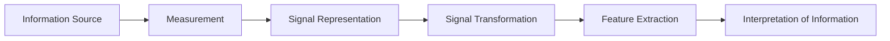
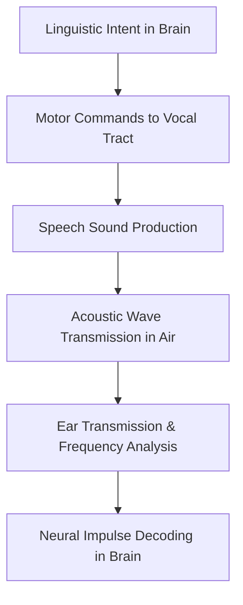
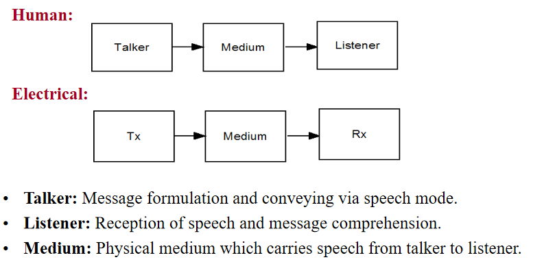
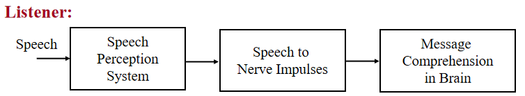
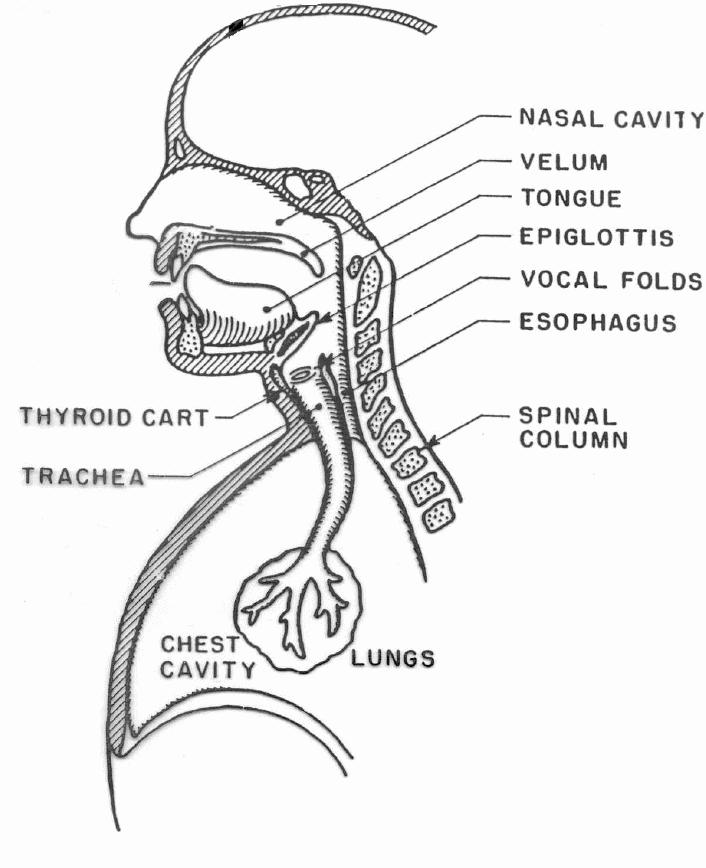
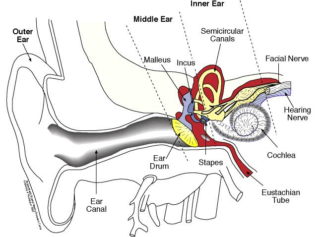
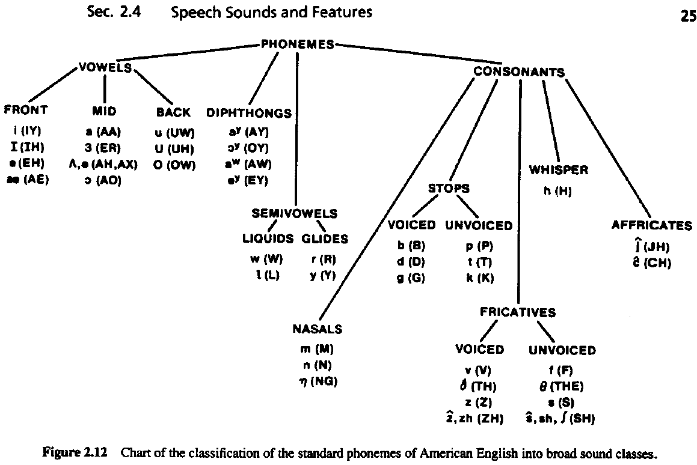
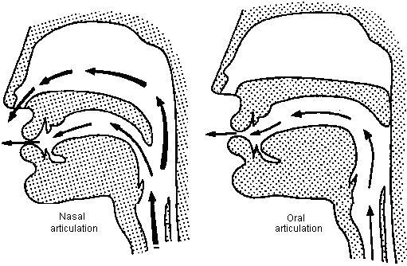
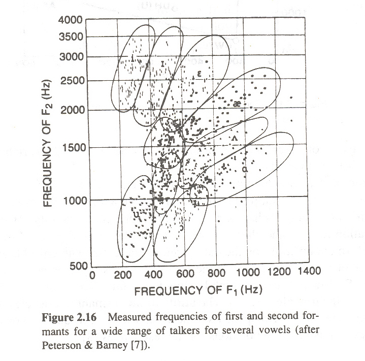

# Chapter 1: Introduction to Speech Processing

---

## Chapter Overview
Speech is the primary and natural mode of human communication, carrying speaker information, language details, and message content. This chapter covers the foundations of speech processing, distinguishing speech transmission from speech processing, establishing the speech processing model, detailing human speech production and perception anatomy, and classifying speech sounds via acoustic phonetics.

---

## Learning Outcomes
After completing this chapter, students will be able to:
- Define Speech Processing and identify its necessity.
- Distinguish between speech transmission and digital speech processing.
- Explain the speech processing model and its functional stages.
- List key application areas of speech processing.
- Identify the elements of speech communication and steps in the speech chain.
- Describe speech production and perception systems.
- Explain acoustic phonetic representation of speech sounds.
- Classify and explain different types of phonemes (Vowels, Formants, Diphthongs, Semivowels, Consonants).

---

## 1. Introduction to Speech Processing

### 1.1 Fundamental Definitions
- **Speech**: The natural mode of communication among human beings. Usually speech contains speaker information, language information, and message. It is the process of producing and transmitting spoken language through sound waves to communicate information, ideas, and emotions.
- **Processing**: The systematic analysis, transformation, or manipulation of data or signals to extract useful information or achieve a desired outcome.
- **Speech Processing**: The study of speech signals and the processing methods of these signals. It involves analysis, synthesis, recognition, and coding of speech for applications in communication and human–computer interaction (Rabiner & Juang, 1993; Rabiner & Schafer, 1978).

### 1.2 Need for Speech Processing
Speech processing is required to efficiently analyze, enhance, compress, recognize, and synthesize speech, enabling intelligent voice-based communication between humans and machines.

---

## 2. Speech Transmission vs. Digital Speech Processing

| Feature | Speech Transmission | Digital Speech Processing |
| :--- | :--- | :--- |
| **Example** | Talking over mobile phone | Voice assistant, automated transcription |
| **Operations** | Signal capture via microphone, analog/digital conversion, codec compression (AMR, Opus), network transport (GSM, VoLTE, VoIP). | Feature extraction (MFCC, LPC), phoneme and word recognition, pattern matching. |
| **Primary Goal** | Deliver voice clearly to the recipient without analyzing or interpreting content. | Understand, analyze, extract features, or act on speech content. |

---

## 3. Speech Processing Model

The digital speech processing model consists of six sequential stages:

1. **Information Source**: Source that produces speech using a linguistic medium.
2. **Measurement**: Capturing raw audio through microphones.
3. **Signal Representation**: Discretization (continuous to discrete signal), quantization, and digital encoding of speech signals.
4. **Signal Transformation**: Noise reduction, filtering, normalization, framing, windowing, and speech enhancement.
5. **Feature Extraction**: Converting waveforms into numerical feature representations (e.g., MFCC, LPC).
6. **Interpretation of Information**: Identifying phonemes, words, or speakers.

---

## 4. Applications of Digital Speech Processing

- **Smart Homes**: Voice assistants (Alexa, Siri, Google Assistant) controlling appliances, lighting, and entertainment systems.
- **Education**: Real-time captioning (transcription generation), pronunciation and fluency evaluation in language learning.
- **Healthcare**: Doctor-patient conversation recording, prescription assistance, speech aid devices.
- **Media**: Live captioning for broadcasting and streaming platforms.
- **Business/Commerce**: Automated customer service through speech-driven chatbots.
- **Automotive**: Voice commands for navigation, infotainment, and hands-free communication.
- **Security**: Voice biometric authentication.

### Real-Time Speech Processing Platforms
- **Deepgram**: Ultra-low latency speech-to-text with speaker diarization, sentiment analysis, and topic detection.
- **AssemblyAI**: Real-time transcription with speaker labeling and scalable APIs.
- **OpenAI Realtime**: Speech recognition combined with conversational AI for multilingual assistants.
- **Google Cloud Speech-to-Text**: Enterprise speech recognition supporting 125+ languages.

---

## 5. Elements of Speech Communication & The Speech Chain

*Figure 1.1: Elements of Speech Communication*

*Figure 1.2: Steps in the Speech Chain*

---

## 6. Speech Production System & Excitation Sources

*Figure 1.3: Anatomical Structure of Speech Production System*

*Figure 1.4: Schematic Representation of Speech Production Process*

### Anatomical Components:
- **Lungs (Air Source)**: Provide airflow pressure required for speech production. Muscle force from the diaphragm pushes air upward through the trachea.
- **Vocal Cords / Larynx (Sound Source)**: Air passes through vocal cords in the larynx. Vibrating vocal cords produce voiced sounds; open vocal cords produce unvoiced sounds (/s/, /f/).
- **Pharyngeal Cavity**: First resonating chamber that shapes sound.
- **Oral Cavity**: Tongue, lips, teeth, and jaw modify airflow and resonance to produce different speech sounds.
- **Velum (Soft Palate)**: Controls airflow path:
  - *Velum Raised*: Air exits through mouth $\rightarrow$ Oral sounds.
  - *Velum Lowered*: Air passes through nasal cavity $\rightarrow$ Nasal sounds (/m/, /n/, /ŋ/).
- **Nasal Cavity**: Additional resonator for nasal sounds.

### Excitation Sources:
- **Voiced Excitation**: Vibration of vocal folds $\rightarrow$ Voiced speech (e.g., vowels).
- **Unvoiced Excitation**: Total or partial constriction along vocal tract $\rightarrow$ Unvoiced speech (e.g., /s/, /f/).
- **Mixed Excitation**: Combination of voiced fold vibration and constriction turbulence $\rightarrow$ Mixed speech.

---

## 7. Speech Perception System

*Figure 1.5: Speech Perception System*

- **Outer Ear**: Collects speech sound waves and directs them toward the middle ear.
- **Middle Ear**: Amplifies and converts sound pressure variations into mechanical vibrations.
- **Inner Ear (Cochlea)**: Converts mechanical vibrations into electrical nerve impulses transmitted via auditory nerve to brain.
- **Brain**: Higher cognitive centers decode language and interpret message.
- **Audible Frequency Range**: Approximately $20\text{ Hz}$ to $20\text{ kHz}$.

---

## 8. Acoustic Phonetics: IPA vs. ARPAbet

- **Phoneme**: Smallest unit of sound that changes the meaning of a word (e.g., /b/ in *bat* vs. /p/ in *pat*). English phoneme count varies from 42 to 46 depending on linguistic analysis.
- **IPA (International Phonetic Alphabet)**: Standardized system of symbols created by the International Phonetic Association to represent sounds across all languages universally.
- **ARPAbet**: Phonetic transcription system developed by ARPA for computer-readable speech processing. Uses ASCII plain text characters instead of IPA symbols.

---

## 9. Classification of Phonemes

*Figure 1.6: Classification of Phonemes Tree*

*Figure 1.7: Production Conditions for Speech Sounds*

### 9.1 Vowels
Speech sounds produced with an open vocal tract, allowing air to flow freely. Typically voiced, longer in duration, and carry high recognition value in speech processing.

#### Formant Positions ($F_1, F_2$)
Formants are resonant frequency peaks of the vocal tract shaping vowel quality:
- **$F_1$**: Inversely proportional to tongue height. High tongue position (close vowels /i/, /u/) $\rightarrow$ Low $F_1$; Low tongue position (open vowels /a/, /æ/) $\rightarrow$ High $F_1$.
- **$F_2$**: Reflects tongue frontness/backness. Front vowels (/i/, /e/, /æ/) $\rightarrow$ High $F_2$; Back vowels (/u/, /o/, /ɔ/) $\rightarrow$ Low $F_2$.

*Figure 1.8: F1-F2 Cluster and Centroid Distribution for Vowels*

- **$F_1$-$F_2$ Cluster**: Distribution (grouping) of measured $F_1$ and $F_2$ formant frequencies of a vowel across multiple speakers, showing natural variation.
- **$F_1$-$F_2$ Centroid**: Average (central) $F_1$ and $F_2$ position of a vowel, representing its reference location in vowel space.

### 9.2 Diphthongs and Semivowels
- **Diphthong**: Gliding vowel sound where the tongue moves from one position to another within the same syllable (e.g., /aɪ/ in *bite*, /eɪ/ in *make*, /ɔɪ/ in *boy*, /aʊ/ in *house*, /oʊ/ in *boat*).
- **Semivowels (Glides)**: Sounds that behave like vowels acoustically but function like consonants in syllable structure (e.g., /j/ in *yes*, /w/ in *we*).

### 9.3 Consonants, Fricatives, and Stops
- **Nasal Consonants**: Air passes through nose while oral cavity is blocked (/m/, /n/, /ŋ/).
- **Fricatives**: Produced by forcing air through narrow constriction creating turbulence. Can be voiceless (/f/, /s/, /ʃ/) or voiced (/v/, /z/, /ʒ/).
- **Stops (Plosives)**: Complete closure of vocal tract followed by sudden release of air:
  - *Velar stops*: /ka/, /kha/, /ga/, /gha/
  - *Palatal stops*: /ch/, /cha/, /j/, /jha/
  - *Alveolar stops*: /T/, /Th/, /D/, /Dh/
  - *Dental stops*: /t/, /th/, /d/, /dh/
  - *Bilabial stops*: /p/, /ph/, /b/, /bh/
