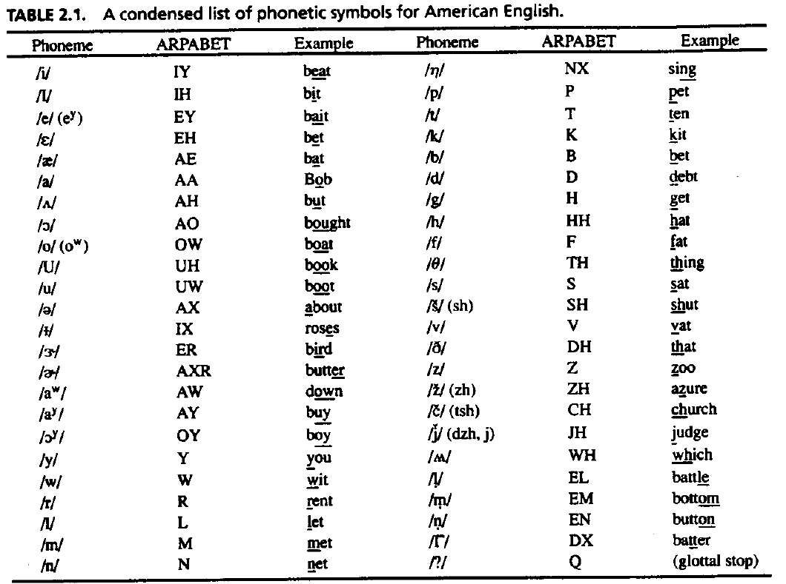
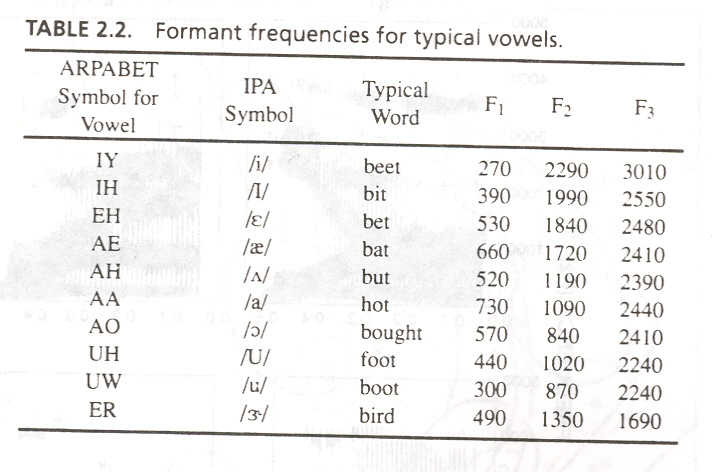

# Chapter 1: 5-Mark Important Practice Questions & Answers

---

### Question 1: Define Speech Processing? Discuss the need of Speech Processing? (5 Marks)

#### Answer:

**1. Definition of Speech Processing (2 Marks)**
- **Speech**: The natural mode of communication among human beings containing speaker information, language information, and message. It is the process of producing and transmitting spoken language through sound waves to communicate information, ideas, and emotions.
- **Processing**: The systematic analysis, transformation, or manipulation of signals to extract useful information or achieve a desired outcome.
- **Speech Processing**: The study of speech signals and the digital processing methods of these signals. It involves analysis, synthesis, recognition, and coding of speech signals for applications in communication and human-computer interaction (Rabiner & Juang, 1993; Rabiner & Schafer, 1978).

**2. Need for Speech Processing (3 Marks)**
- **Intelligent Human-Computer Communication**: Enables voice-based communication between humans and machines (e.g., voice assistants).
- **Efficient Signal Analysis**: Allows extraction of hidden parameters such as speaker identity, language, and phonemes from raw speech waveforms.
- **Data Compression & Transmission**: Reduces bit rates for bandwidth-efficient voice communication across telecommunication networks.
- **Speech Enhancement**: Removes noise and enhances signal quality for speech recognition and transmission systems.
- **Automation & Accessibility**: Powers automated transcription, speech-to-text generation, pronunciation checking, and speech aid devices.

---

### Question 2: Explain Speech Processing Model with the help of a suitable diagram? List out the application areas of Speech Processing? (5 Marks)

#### Answer:

**1. Speech Processing Model (3 Marks)**

*Figure 2.1: Elements of Speech Communication System*

- **Information Source**: Source that produces speech using a linguistic medium (brain and vocal tract).
- **Measurement**: Capturing raw audio acoustic waves using microphones to convert them into electrical signals.
- **Signal Representation**: Converting continuous signals into discrete digital representations via sampling, quantization, and encoding.
- **Signal Transformation**: Pre-processing operations such as noise reduction, filtering, normalization, framing, windowing, and enhancement.
- **Feature Extraction**: Converting processed waveforms into numerical feature representations (e.g., MFCC, LPC).
- **Interpretation of Information**: Decoding and identifying phonemes, words, or speakers using pattern matching or recognition models.

**2. Application Areas of Speech Processing (2 Marks)**
- **Smart Homes**: Voice assistants (Alexa, Siri, Google Assistant) for controlling appliances and lighting.
- **Education**: Real-time lecture transcription, pronunciation and fluency evaluation in language learning.
- **Healthcare**: Clinical prescription assistance, doctor-patient documentation, and speech aid devices.
- **Security & Automotive**: Voice biometric authentication and hands-free automotive voice controls.

---

### Question 3: Describe Speech Production System with a suitable diagram how the listeners perceive a speech sound? (5 Marks)

#### Answer:

**1. Speech Production System (3 Marks)**

*Figure 3.1: Speech Production System Anatomy*

*Figure 3.2: Schematic Representation of Speech Production Process*

- **Lungs (Air Source)**: Muscle force from the diaphragm pushes air upward through the trachea to provide necessary airflow pressure.
- **Vocal Cords / Larynx (Sound Source)**: Air passes through vocal cords. Vibrating vocal cords produce voiced sounds; open vocal cords produce unvoiced sounds.
- **Pharyngeal Cavity**: First resonating chamber that receives and shapes sound from the larynx.
- **Oral Cavity**: Main articulators (tongue, lips, teeth, jaw) modify airflow and resonance to produce specific speech sounds.
- **Velum (Soft Palate)**: Controls acoustic coupling. Raised velum produces oral sounds through the mouth; lowered velum directs air through the nasal cavity to produce nasal sounds (/m/, /n/, /ŋ/).

**2. Speech Perception System (2 Marks)**

*Figure 3.3: Speech Perception System*

- **Outer Ear**: Collects sound waves from the environment and channels them down the ear canal toward the middle ear.
- **Middle Ear**: Eardrum and ossicles amplify and convert sound pressure variations into mechanical vibrations.
- **Inner Ear (Cochlea)**: Converts mechanical vibrations into electrical nerve impulses along the basilar membrane.
- **Auditory Nerve & Brain**: Transmits nerve impulses to higher cognitive brain centers to decode language and interpret meaning (human audible range: $20\text{ Hz}$ to $20\text{ kHz}$).

---

### Question 4: Define phonemes along with its importance in speech processing? Discuss two standard ways of phonetic representation of Speech Sound? (5 Marks)

#### Answer:

**1. Definition & Importance of Phonemes (2.5 Marks)**
- **Definition**: A phoneme is the smallest unit of sound in a language that changes the meaning of a word (e.g., /b/ in *bat* vs. /p/ in *pat*). The exact count of phonemes in English ranges from 42 to 46 depending on linguistic analysis.
- **Importance in Speech Processing**:
  - Serves as the fundamental acoustic unit for speech recognition dictionary building.
  - Allows mapping of continuous acoustic signals into discrete linguistic symbols.
  - Enables computer systems to synthesize and decode speech without storing full word waveforms.

**2. Standard Phonetic Representation Systems (2.5 Marks)**

*Figure 4.1: Phonetic Representation List*

- **IPA (International Phonetic Alphabet)**:
  - Standardized system of symbols created by the International Phonetic Association.
  - Universal phonetic system for precise transcription across all human languages (uses unique non-ASCII symbols like /æ/, /θ/, /ʃ/).
- **ARPAbet**:
  - Phonetic transcription system developed by ARPA for computer-readable speech processing.
  - ASCII-based text representation using standard capital letters (e.g., `AA`, `TH`, `SH`) instead of IPA symbols, making it suitable for computer algorithms.

---

### Question 5A: How is a Vowel phoneme produced while making a speech sound? Discuss vowel characteristics and give examples. (5 Marks)

#### Answer:

*Figure 5A.1: Tongue Hump Positions and Waveform Plots for Vowels*

*Figure 5A.2: Formant Frequencies for Typical Vowels*

**1. Production Mechanism of Vowels (2 Marks)**
- Vowels are produced with an open vocal tract without major constrictions, allowing air to flow freely.
- They are always voiced sounds produced with glottal vocal fold vibration in the larynx.
- Articulation is determined by tongue position (height and backness), lip rounding, and tenseness.

**2. Key Acoustic Characteristics & Role in Speech Processing (2 Marks)**
- **Duration**: Vowels are generally long in duration compared to consonants.
- **Recognition Importance**: Easily and reliably recognized, playing a significant role in speech recognition by humans and machines.
- **Formants ($F_1, F_2$)**: Shaped by resonant frequency peaks of the vocal tract:
  - **$F_1$**: Inversely proportional to tongue height (High tongue $\rightarrow$ Low $F_1$; Low tongue $\rightarrow$ High $F_1$).
  - **$F_2$**: Reflects tongue frontness/backness (Front vowels $\rightarrow$ High $F_2$; Back vowels $\rightarrow$ Low $F_2$).

**3. Examples (1 Mark)**
- `/i/` (as in *see*): High front vowel (Low $F_1$, High $F_2$).
- `/u/` (as in *too*): High back vowel (Low $F_1$, Low $F_2$).
- `/æ/` (as in *cat*): Low front vowel (High $F_1$, High $F_2$).
- `/a/` (as in *father*): Low back vowel (High $F_1$, Low $F_2$).

---

### Question 5B: How is a Diphthong phoneme produced while making a speech sound? Give examples. (5 Marks)

#### Answer:

**1. Production Mechanism of Diphthongs (3 Marks)**
- A diphthong is a gliding vowel sound where the tongue moves smoothly from one vowel position to another within the same syllable.
- Unlike monophthong vowels (which maintain a static vocal tract shape), diphthongs start with one vowel configuration and transition continuously toward another vowel target.
- The vocal tract filter parameters ($F_1, F_2$ formants) dynamically change over time during production.

**2. Examples in English (2 Marks)**
- `/aɪ/` (as in *bite*): Glides from `/a/` to `/ɪ/`.
- `/eɪ/` (as in *make*): Glides from `/e/` to `/ɪ/`.
- `/ɔɪ/` (as in *boy*): Glides from `/ɔ/` to `/ɪ/`.
- `/aʊ/` (as in *house*): Glides from `/a/` to `/ʊ/`.
- `/oʊ/` (as in *boat*): Glides from `/o/` to `/ʊ/`.

---

### Question 5C: How is a Semi-Vowel (Glide) phoneme produced while making a speech sound? Give examples. (5 Marks)

#### Answer:

**1. Production Mechanism of Semi-Vowels (3 Marks)**
- Semi-vowels (also referred to as glides) are speech sounds that behave like vowels acoustically but function like consonants in syllable structures.
- Produced with an open vocal tract similar to vowels, but with rapid articulator motion transitioning into or out of an adjacent vowel.
- They cannot serve as the vocalic nucleus of a syllable, functioning instead at syllable boundaries.

**2. Examples in English (2 Marks)**
- `/j/` (as in *yes*): Acoustic properties similar to the high front vowel `/i/`.
- `/w/` (as in *we*): Acoustic properties similar to the high back rounded vowel `/u/`.

---

### Question 5D: How is a Consonant phoneme (Stops, Fricatives, Nasals) produced while making a speech sound? Give examples for each category. (5 Marks)

#### Answer:

*Figure 5D.1: Classification Tree of Phonemes*

*Figure 5D.2: Production Conditions for Consonants*

**1. Production Mechanisms of Consonant Classes (3 Marks)**

- **Nasal Consonants**: Produced by creating complete closure in the oral cavity while lowering the velum (soft palate), allowing air to resonate and pass through the nasal cavity.
- **Fricatives**: Produced by forcing air through a narrow constriction in the vocal tract, creating turbulent noise. Can be voiceless (no glottal vibration) or voiced.
- **Stops (Plosives)**: Produced by complete closure of the vocal tract, building up air pressure behind the constriction, followed by a sudden burst release of air.

**2. Examples by Classification Category (2 Marks)**

- **Nasal Consonants**:
  - `/m/` (*man*) – Bilabial nasal
  - `/n/` (*net*) – Alveolar nasal
  - `/ŋ/` (*sing*) – Velar nasal
- **Fricatives**:
  - Voiceless: `/f/` (*fun*), `/s/` (*sun*), `/ʃ/` (*shoe*)
  - Voiced: `/v/` (*van*), `/z/` (*zoo*), `/ʒ/` (*measure*)
- **Stops (Plosives) by Anatomical Place**:
  - *Velar Stops*: `/ka/`, `/kha/`, `/ga/`, `/gha/` (e.g., `/k/` in *cat*, `/g/` in *go*)
  - *Palatal Stops*: `/ch/`, `/cha/`, `/j/`, `/jha/`
  - *Alveolar Stops*: `/T/`, `/Th/`, `/D/`, `/Dh/` (e.g., `/t/` in *top*, `/d/` in *dog*)
  - *Dental Stops*: `/t/`, `/th/`, `/d/`, `/dh/`
  - *Bilabial Stops*: `/p/`, `/ph/`, `/b/`, `/bh/` (e.g., `/p/` in *pat*, `/b/` in *bat*)

---

### Question 6: Explain the significance of F1, F2 cluster and F1, F2 centroid in Speech Processing? (5 Marks)

#### Answer:

*Figure 6.1: F1-F2 Formant Frequency Distribution Cluster and Centroid for Vowels*

**1. Fundamentals of Formants $F_1$ and $F_2$ (1 Mark)**
- **Formants** are the resonant frequencies of the human vocal tract filter that shape vowel quality and distinguish speech sounds.
- **$F_1$ (First Formant)**: Inversely related to tongue height. A high tongue position (e.g., close vowels `/i/`, `/u/`) produces a **low $F_1$**, whereas a low tongue position (e.g., open vowels `/a/`, `/æ/`) produces a **high $F_1$**.
- **$F_2$ (Second Formant)**: Directly reflects tongue frontness/backness. Front vowels (e.g., `/i/`, `/e/`, `/æ/`) yield a **high $F_2$**, while back vowels (e.g., `/u/`, `/o/`, `/ɔ/`) yield a **low $F_2$**.

**2. Significance of $F_1$-$F_2$ Cluster in Speech Processing (2 Marks)**
- **Definition**: An $F_1$-$F_2$ cluster is the two-dimensional scatter plot distribution of measured first ($F_1$) and second ($F_2$) formant frequency pairs for a given vowel sampled across multiple speakers.
- **Significance & Applications**:
  - **Speaker Variability Modeling**: Captures natural acoustic variations in vowel pronunciation caused by differences in age, gender, accent, and vocal tract dimensions.
  - **Acoustic Decision Boundaries**: Demonstrates how pronunciations of the same vowel cluster into bounded regions in the 2D formant space ($F_1$ vs. $F_2$), helping speech recognizers establish decision boundaries for classification.

**3. Significance of $F_1$-$F_2$ Centroid in Speech Processing (2 Marks)**
- **Definition**: The $F_1$-$F_2$ centroid is the mathematical mean position (average coordinate pair) of an $F_1$-$F_2$ cluster, representing the canonical location of a vowel in the formant space.
- **Significance & Applications**:
  - **Canonical Reference Benchmark**: Serves as a standard reference point for acoustic modeling and vowel space comparison.
  - **Speaker Normalization**: Used to normalize acoustic feature vectors across different speakers to reduce inter-speaker variability.
  - **Speech Recognition & Synthesis**: Simplifies pattern matching in Automatic Speech Recognition (ASR) by evaluating distance metrics to centroid targets, and serves as the baseline target in Text-to-Speech (TTS) synthesis.
