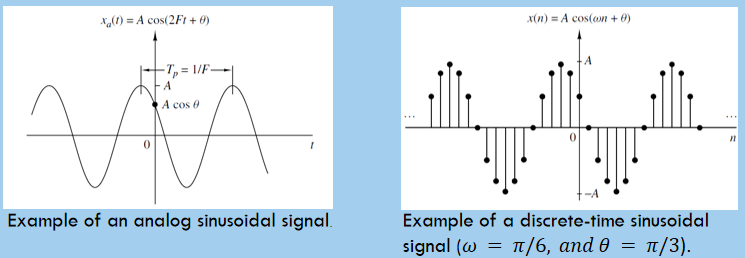
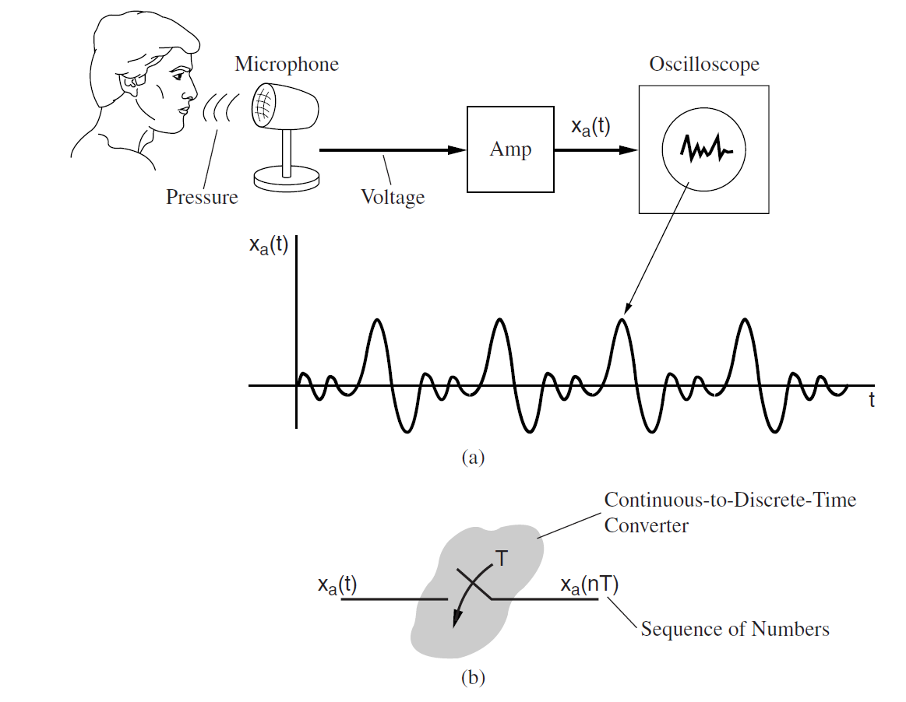
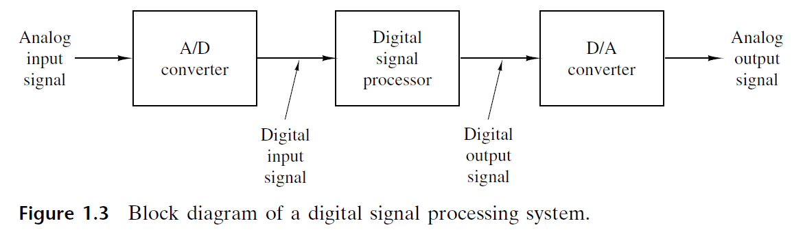
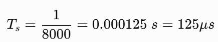
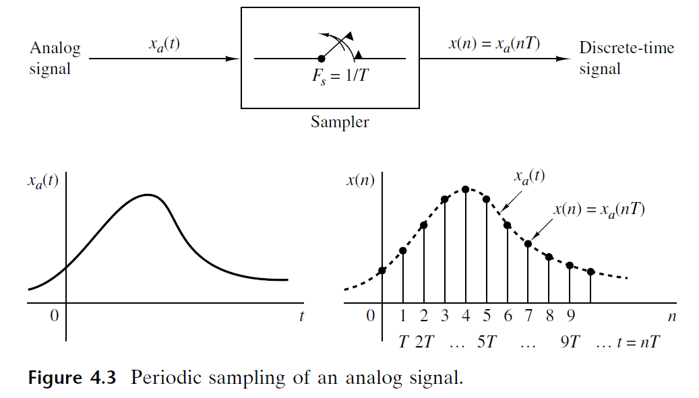

# Chapter 2: Digital Representation of Speech Signals

---

## Chapter Overview
Speech is naturally an analog signal with continuous sound pressure variations over time. Modern communication and computing systems process, store, and analyze speech in digital form. This chapter covers the process of converting analog speech signals into digital representations via sampling, quantization, and encoding, along with sampling theorems, aliasing distortion, quantization noise analysis, and file storage computations.

---

## Learning Outcomes
After completing this chapter, students will be able to:
- Explain the process of converting analog speech signals into digital form using sampling techniques.
- Describe the role of quantization and encoding in the digital representation of speech signals.
- Illustrate the complete process of digital speech representation using sampling, quantization, and encoding.

---

## 1. Introduction to Signals & Digitization
- **Signal**: Any physical quantity that varies with time, space, or any other independent variable.
- **Analog Speech**: Speech is an analog signal where sound waves vary continuously with time.
- **Digital Representation**: Converts continuous speech into a sequence of binary numbers, making speech easier to store, transmit, analyze, and process using digital systems.

---

## 2. Signal Classification

### 2.1 Continuous-Time vs. Discrete-Time Signals

| Property | Continuous-Time Signal $x(t)$ | Discrete-Time Signal $x[n]$ |
| :--- | :--- | :--- |
| **Time Variable** | Continuous variable $t$ | Integer sample index $n$ |
| **Definition** | Defined for every instant of time | Defined only at discrete sampling instants |
| **Sinusoidal Formula** | $x(t) = A \sin(\omega_c t + \phi)$, $-\infty < t < \infty$ where $\omega_c = 2\pi f$ (rad/s) | $x[n] = A \sin(\omega n + \phi)$, $n = 0, \pm 1, \pm 2, \dots$ where $\omega$ is digital frequency (rad/sample) |
| **Examples** | Human speech before recording, voltage across an electrical circuit | Recorded speech sampled at $16\text{ kHz}$ |

*Figure 2.1: Continuous-Time vs Discrete-Time Signals (Source: Slide 5, 9)*

### 2.2 Continuous-Valued vs. Discrete-Valued Signals
- **Continuous-Valued Signal**: Takes on all possible values on a finite or infinite range.
- **Discrete-Valued Signal**: Takes on values from a finite set of possible values.
- **Digital Signal**: A discrete-time signal having a discrete set of values.

*Figure 2.2: Continuous-Valued vs Discrete-Valued Signals (Source: Slide 10)*

---

## 3. Digitization of Speech

### 3.1 Characteristics of Acoustic Waves
Speech is an acoustic wave created when a source vibrates (e.g., vocal cords or speaker), causing surrounding particles to compress and expand.
- **Non-Stationary Signal**: Statistical properties change over time.
- **Quasi-Periodic Nature**: Voiced sounds show periodicity due to vocal cord vibrations; unvoiced sounds resemble noise.
- **Acoustic Characteristics**:
  - *Frequency ($f$)*: Determines pitch (Hz).
  - *Amplitude ($a$)*: Determines loudness.
  - *Wavelength ($\lambda$)*: Distance between successive compressions.

### 3.2 Speech Signal Structure
A continuous acoustic waveform carrying linguistic information:
- **Phoneme**: Smallest unit of speech sound (e.g., Word *"Speech"* $\rightarrow$ /s/ – /p/ – /iː/ – /tʃ/).
- **Syllable**: Single unit of pronunciation in a word (e.g., Word *"Computer"* $\rightarrow$ 3 syllables: com-pu-ter).
- **Word**: Unit of language made of one or multiple syllables.
- **Variability**: Arises from speaker differences (age, gender, accent), speaking rate, and background noise.

---

## 4. Analog-to-Digital Conversion (ADC) Process

*Figure 4.1: Speech Waveform Transduction (Source: Slide 14)*

*Figure 4.2: Transduction between Acoustic and Electrical Signals (Source: Slide 15)*

*Figure 4.3: Sampling, Quantization, and Coding Operations (Source: Slide 17)*

1. **Sampling**: Takes "samples" of continuous-time signal $x_a(t)$ at discrete time instants $t = nT_s$, producing discrete-time sequence $x[n] = x_a(n T_s)$.
2. **Quantization**: Converts continuous-valued samples into discrete-valued (digital) levels $x_q[n]$.
3. **Coding**: Represents each discrete quantized level $x_q[n]$ by a $b$-bit binary sequence.

---

## 5. Sampling & Nyquist Theorem

### 5.1 Sampling Terminologies

*Figure 5.1: Sampling Frequency and Interval (Source: Slide 19)*

*Figure 5.2: Speech Bandwidths (Source: Slide 20)*

- **Sampling Frequency ($F_s$)**: Number of samples taken every second (Hertz, Hz). Examples: $8000\text{ Hz}$, $16000\text{ Hz}$, $44100\text{ Hz}$.
- **Sampling Interval ($T_s$)**: Time between two consecutive samples ($T_s = 1 / F_s$).
- **Bandwidth**: Speech bandwidth determines minimum sampling rate:
  - *Telephone*: $300 - 3400\text{ Hz}$
  - *Wideband*: $50 - 7000\text{ Hz}$
  - *High quality audio*: $20 - 20000\text{ Hz}$

### 5.2 Nyquist-Shannon Sampling Theorem
> *"To perfectly reconstruct a continuous-time signal from its samples without distortion, the sampling rate must be at least twice the highest frequency present in the signal."*

$$F_s \ge 2 f_{max}$$

- **Nyquist Rate**: Minimum sampling rate ($2 f_{max}$).
- **Nyquist Frequency**: Half of the sampling frequency ($F_s / 2$).
- **CD Audio**: $F_s = 44.1\text{ kHz}$ (slightly above $2 \times 20\text{ kHz}$).
- **Telephony**: $F_s = 8\text{ kHz}$ (Nyquist frequency = $4\text{ kHz}$).

### 5.3 Aliasing & Prevention
- **Aliasing**: When sampling frequency is too low ($F_s < 2 f_{max}$), repeated spectra overlap during sampling. High frequencies fold into lower frequencies, causing irreversible distortion.
- **Example**: If speech contains frequencies up to $5000\text{ Hz}$:
  - $F_s = 12000\text{ Hz}$ (Nyquist rate $10000\text{ Hz}$) $\rightarrow$ No aliasing.
  - $F_s = 6000\text{ Hz}$ $\rightarrow$ Aliasing occurs.
- **Prevention**:
  1. Sample at or above the Nyquist rate ($F_s \ge 2 f_{max}$).
  2. Use an **Anti-Aliasing Filter** (low-pass filter) before sampling to remove frequencies above $F_s / 2$.

---

## 6. Quantization & Error Analysis

### 6.1 Quantization & Step Size ($\Delta$)
Quantization restricts continuous sample amplitudes to a finite set of discrete values for binary encoding. It introduces a small error called quantization noise.

#### Quantization Step Size ($\Delta$):

$$\Delta = \frac{V_{max} - V_{min}}{L}$$

where:
- $V_{max}$ = Maximum value of the signal
- $V_{min}$ = Minimum value of the signal
- $L = 2^N$ = Number of quantization levels ($N$ = bits per sample)

### 6.2 Bit Rate & File Size Formulations
- **Bit Rate (bps)** = $F_s \times N$
- **File Size (bits)** = $F_s \times N \times T$
- **File Size (bytes)** = $\frac{F_s \times N \times T}{8}$
  where $F_s$ = sampling frequency (Hz), $N$ = bits per sample, $T$ = duration (seconds).

### 6.3 Quantization Error ($e[n]$)
Difference between original sample value and quantized value:

$$e[n] = x[n] - x_q[n]$$

- **Maximum Quantization Error**: For uniform rounding quantizer, $-\frac{\Delta}{2} \le e[n] \le \frac{\Delta}{2} \rightarrow e_{max} = \frac{\Delta}{2}$.
- **Mean Squared Quantization Error ($\sigma_e^2$)**: For uniformly distributed error, noise power is:

$$\sigma_e^2 = \frac{\Delta^2}{12}$$

---

## Slide Reference Mapping

| Topic | Slide Numbers |
| :--- | :---: |
| Title & Outcomes | Slide 1 – 2 |
| Signal Definition & Continuous vs Discrete Time | Slide 3 – 9 |
| Continuous-Valued vs Discrete-Valued Signals | Slide 10 |
| Speech Digitization & Acoustic Wave Characteristics | Slide 11 |
| Speech Signal Units (Phonemes, Syllables, Words) & Variability | Slide 12 – 13 |
| Transduction & ADC Operations (Sampling, Quantization, Coding) | Slide 14 – 17 |
| Sampling Terminologies ($F_s$, $T_s$, Bandwidth) | Slide 18 – 20 |
| Nyquist-Shannon Sampling Theorem & Aliasing Prevention | Slide 21 – 23 |
| Quantization Definition & Step Size Formula ($\Delta$) | Slide 24 – 25 |
| Bit Rate & File Size Calculations | Slide 26 – 27 |
| Class Exercise (16-bit Quantization File Size) | Slide 28 |
| Quantization Error & Noise Power ($\sigma_e^2 = \Delta^2 / 12$) | Slide 29 |
| 8-Bit ADC Solved Exercise | Slide 30 |
| Practice Problems (10-bit / 12-bit ADC Numericals) | Slide 31 |
