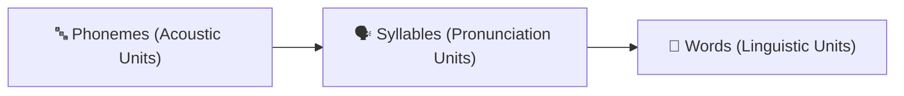
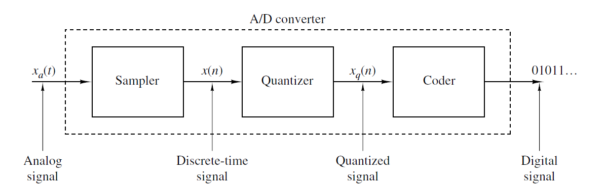

# Chapter 2: 5-Mark Important Practice Questions & Solved Numerical Problems

---

### Question 1: Define a Signal. Explain why speech is classified as an analog, non-stationary, and quasi-periodic signal. List key acoustic characteristics of speech sound waves. (5 Marks)

#### Answer:

**1. Definition of Signal & Analog Speech (1 Mark)**
- **Signal**: Any physical quantity that varies with time, space, or any other independent variable.
- **Analog Speech**: Speech is naturally an analog signal produced by vocal tract acoustic vibrations, where sound pressure varies continuously over continuous time.

**2. Physical Nature of Speech Signals (2 Marks)**
- **Non-Stationary Nature**: The statistical properties (mean, variance, spectral content) of a speech signal change dynamically over time as different phonemes and syllables are spoken.
- **Quasi-Periodic Nature**:
  - *Voiced Speech* (e.g., vowels): Demonstrates quasi-periodic behavior due to regular vocal cord vibrations in the larynx.
  - *Unvoiced Speech* (e.g., fricatives /s/, /f/): Resembles random noise without glottal periodicity.

**3. Key Acoustic Wave Characteristics (2 Marks)**
- **Frequency ($f$)**: Number of acoustic cycles per second, measured in Hertz ($\text{Hz}$). Determines the perceived **pitch**.
- **Amplitude ($a$)**: Peak physical displacement or pressure variation. Determines perceived **loudness**.
- **Wavelength ($\lambda$)**: Physical distance between consecutive pressure compressions ($\lambda = c / f$).

---

### Question 2: Differentiate between Continuous-Time $x(t)$ vs. Discrete-Time $x[n]$ signals, and Continuous-Valued vs. Discrete-Valued signals. Define a Digital Signal. (5 Marks)

#### Answer:

**1. Continuous-Time vs. Discrete-Time Signals (2.5 Marks)**

| Parameter | Continuous-Time Signal $x(t)$ | Discrete-Time Signal $x[n]$ |
| :--- | :--- | :--- |
| **Time Variable** | Continuous real variable $t \in (-\infty, +\infty)$ | Discrete integer sample index $n \in \mathbb{Z}$ |
| **Definition** | Defined for every continuous instant of time | Defined only at discrete uniform sampling instants $t = nT_s$ |
| **Sinusoidal Expression** | $x(t) = A \sin(\omega_c t + \phi)$, where $\omega_c = 2\pi f\text{ (rad/s)}$ | $x[n] = A \sin(\omega n + \phi)$, where $\omega\text{ (rad/sample)}$ |
| **Physical Example** | Continuous acoustic speech wave in air before recording | Sampled audio sequence recorded at $16\text{ kHz}$ |

*Figure 2.1: Continuous-Time vs. Discrete-Time Signal Graphs*

**2. Continuous-Valued vs. Discrete-Valued & Digital Signal (2.5 Marks)**
- **Continuous-Valued Signal**: Can take on any real value on a continuous finite or infinite amplitude range.
- **Discrete-Valued Signal**: Restricted to a finite set of allowed discrete amplitude levels (quantized values).
- **Digital Signal**: A signal that is **both discrete-time and discrete-valued**, represented by binary code sequences for computer processing.

---

### Question 3: Explain the linguistic structure of speech signals. Define Phonemes, Syllables, and Words with suitable examples. Discuss sources of speech variability. (5 Marks)

#### Answer:

**1. Hierarchical Linguistic Units (3 Marks)**

- **Phoneme**: The smallest structural unit of speech sound that distinguishes one word from another in a language.
  - *Example*: Word *"Speech"* $\rightarrow$ 4 phonemes: `/s/` – `/p/` – `/iː/` – `/tʃ/`.
- **Syllable**: A single uninterrupted unit of pronunciation containing a vowel nucleus, surrounded optionally by consonants.
  - *Example*: Word *"Speech"* $\rightarrow$ 1 syllable. Word *"Computer"* $\rightarrow$ 3 syllables (`com-pu-ter`).
- **Word**: A meaningful linguistic unit composed of one or more syllables.
  - *Example*: Word *"Computer"* $\rightarrow$ 8 phonemes: `/k/` – `/ə/` – `/m/` – `/p/` – `/j/` – `/uː/` – `/t/` – `/ər/`.

**2. Sources of Speech Variability (2 Marks)**
- **Inter-Speaker Differences**: Vocal tract length, anatomical structure, gender, age, and regional accents.
- **Intra-Speaker Differences**: Speaking rate, emotional state, health, and vocal fatigue.
- **Environmental Factors**: Background noise, room reverberation, microphone frequency response, and transmission distortion.

---

### Question 4: Explain the complete step-by-step Analog-to-Digital Conversion (ADC) process of a speech signal using a block diagram. (5 Marks)

#### Answer:

**1. ADC System Block Diagram (1.5 Marks)**

*Figure 4.1: Sampling, Quantization, and Coding Operations in ADC*

**2. Three Functional Stages of ADC (3.5 Marks)**
1. **Transduction & Pre-Filtering**: Acoustic air pressure waves are converted into continuous electrical voltage $x_a(t)$ by a microphone, passed through an anti-aliasing low-pass filter.
2. **Sampling (Continuous-to-Discrete Conversion)**: Measures continuous signal amplitudes at uniform time intervals $T_s = 1 / F_s$:
   $$x[n] = x_a(n T_s)$$
   Converts continuous-time continuous-amplitude $x_a(t)$ into discrete-time continuous-amplitude sequence $x[n]$.
3. **Quantization**: Converts continuous-valued sample amplitudes into discrete-valued levels $x_q[n]$ selected from $L = 2^N$ allowed levels, with step size $\Delta = (V_{max} - V_{min}) / 2^N$.
4. **Coding (Binary Encoding)**: Assigns a unique $N$-bit binary code word to each quantized level $x_q[n]$ for digital storage or transmission.

---

### Question 5: State the Nyquist-Shannon Sampling Theorem. Define Nyquist Rate, Nyquist Frequency, and explain why $F_s = 8\text{ kHz}$ is used in telephony and $F_s = 44.1\text{ kHz}$ in CD audio. (5 Marks)

#### Answer:

**1. Nyquist-Shannon Sampling Theorem (1.5 Marks)**
> *"To completely and accurately reconstruct a continuous-time signal from its discrete samples without distortion, the sampling frequency ($F_s$) must be at least twice the highest frequency component ($f_{max}$) present in the signal."*

$$F_s \ge 2 f_{max}$$

- **Nyquist Rate ($F_{Nyq\_rate}$)**: Minimum sampling rate required to avoid distortion ($2 f_{max}$).
- **Nyquist Frequency ($F_{Nyq\_freq}$)**: Highest frequency that can be represented unambiguously ($F_s / 2$).

**2. Practical Sampling Standards (3.5 Marks)**
- **Telephone Systems ($F_s = 8\text{ kHz}$)**:
  - Human speech intelligence bandwidth in telephony is restricted to $300 - 3400\text{ Hz}$ ($f_{max} \approx 3.4\text{ kHz} \approx 4\text{ kHz}$).
  - $F_s = 8\text{ kHz}$ satisfies $F_s \ge 2 \times 4\text{ kHz} = 8\text{ kHz}$, providing clear vocal intelligibility while conserving network bandwidth.
- **CD Audio Systems ($F_s = 44.1\text{ kHz}$)**:
  - Human audible frequency perception ranges up to $20\text{ kHz}$ ($f_{max} = 20\text{ kHz} \implies \text{Nyquist rate } = 40\text{ kHz}$).
  - $F_s = 44.1\text{ kHz}$ provides a guard band above $40\text{ kHz}$, allowing realizable analog anti-aliasing filters to transition smoothly without cutting audible high-frequency music harmonics.

---

### Question 6: Explain the phenomenon of Aliasing distortion in sampling. Discuss its mathematical cause, provide an example, and explain how an Anti-Aliasing Filter prevents it. (5 Marks)

#### Answer:

**1. Definition & Mathematical Cause of Aliasing (2 Marks)**
- **Aliasing**: A distortion phenomenon occurring when a signal is sampled below its Nyquist rate ($F_s < 2 f_{max}$).
- **Cause**: Sampling creates periodic repetitions of the signal spectrum at integer multiples of $F_s$. When $F_s < 2 f_{max}$, adjacent spectral repetitions overlap. High-frequency components fold over into the lower frequency range, becoming indistinguishable from genuine low frequencies.

**2. Illustrative Example (1.5 Marks)**
Suppose a speech signal contains high-frequency components up to $f_{max} = 5000\text{ Hz}$:
- *Case 1*: Sampling at $F_s = 12000\text{ Hz}$ (Nyquist rate $= 10000\text{ Hz}$). Since $F_s > 2 f_{max}$, **no aliasing occurs**.
- *Case 2*: Sampling at $F_s = 6000\text{ Hz}$ (below Nyquist rate $10000\text{ Hz}$). High frequencies fold over, creating severe **aliasing distortion**.

**3. Prevention of Aliasing (1.5 Marks)**
1. **Sufficient Sampling**: Always select $F_s \ge 2 f_{max}$.
2. **Anti-Aliasing Filter**: Place an analog low-pass filter before the sampler to attenuate all frequency components higher than $F_s / 2$, ensuring zero spectral overlap.

---

### Question 7: Define Quantization and Quantization Step Size ($\Delta$). Derive the formulas for Bit Rate ($\text{bps}$) and Digital Audio Storage File Size in bits and bytes. (5 Marks)

#### Answer:

**1. Definition of Quantization & Step Size ($\Delta$) (2 Marks)**
- **Quantization**: The process of mapping continuous-valued sample amplitudes to a finite set of $L = 2^N$ discrete levels, enabling binary encoding.
- **Quantization Step Size ($\Delta$)**: The amplitude difference between two successive discrete quantization levels:
  $$\Delta = \frac{V_{max} - V_{min}}{L} = \frac{V_{max} - V_{min}}{2^N}$$
  where $V_{max}$ and $V_{min}$ are maximum and minimum input signal voltage range limits, and $N$ is bit resolution per sample.

**2. Formulations for Bit Rate & File Size (3 Marks)**
- **Bit Rate ($\text{bps}$)**: Number of binary bits produced per second:
  $$\text{Bit Rate (bps)} = F_s \times N$$
- **File Size (in bits)**: Total binary bits for a recording duration of $T$ seconds:
  $$\text{File Size (bits)} = F_s \times N \times T$$
- **File Size (in bytes)**:
  $$\text{File Size (bytes)} = \frac{F_s \times N \times T}{8}$$
  where $F_s$ = sampling frequency ($\text{Hz}$), $N$ = bits per sample, $T$ = duration ($\text{seconds}$).

---

### Question 8: Define Quantization Error $e[n]$. Derive the Maximum Quantization Error ($e_{max}$) and Mean Squared Quantization Noise Power ($\sigma_e^2$). (5 Marks)

#### Answer:

**1. Definition of Quantization Error (1 Mark)**
Quantization error (or quantization noise) $e[n]$ is the difference between the unquantized sample amplitude $x[n]$ and its quantized rounded level $x_q[n]$:

$$e[n] = x[n] - x_q[n]$$

**2. Maximum Quantization Error ($e_{max}$) (2 Marks)**
For a uniform rounding quantizer, the error $e[n]$ is bounded within half of the quantization step size $\Delta$:

$$-\frac{\Delta}{2} \le e[n] \le \frac{\Delta}{2}$$

Therefore, the maximum magnitude error is:

$$e_{max} = \frac{\Delta}{2}$$

**3. Mean Squared Quantization Error / Noise Power ($\sigma_e^2$) (2 Marks)**
Assuming quantization error $e[n]$ is a continuous random variable uniformly distributed over $[-\Delta/2, +\Delta/2]$ with probability density function $p(e) = 1/\Delta$:

$$\sigma_e^2 = \mathbb{E}[e^2] = \int_{-\Delta/2}^{+\Delta/2} e^2 \, p(e) \, de = \frac{1}{\Delta} \left[ \frac{e^3}{3} \right]_{-\Delta/2}^{+\Delta/2} = \frac{1}{\Delta} \left( \frac{\Delta^3}{24} - \left(-\frac{\Delta^3}{24}\right) \right)$$

$$\sigma_e^2 = \frac{\Delta^2}{12}$$

---

### Question 9: A speech signal is uniformly quantized using 8 bits per sample over a range of $\pm 2\text{ V}$. Find the quantization step size ($\Delta$). If the sampling frequency is $10\text{ Hz}$, calculate the digital file size for a $10\text{ sec}$ recording. (5 Marks)

#### Solution:

**Given:**
- Resolution $N = 8\text{ bits/sample} \implies L = 2^8 = 256\text{ levels}$
- Voltage range: $-2\text{ V}$ to $+2\text{ V} \implies \text{Range } \Delta V = 2 - (-2) = 4\text{ V}$
- Sampling frequency $F_s = 10\text{ Hz}$
- Duration $T = 10\text{ seconds}$

**1. Quantization Step Size ($\Delta$) (2.5 Marks):**
$$\Delta = \frac{V_{max} - V_{min}}{L} = \frac{4\text{ V}}{256} = \mathbf{0.015625\text{ V} \quad (15.625\text{ mV})}$$

**2. Digital File Size Calculation (2.5 Marks):**
$$\text{File Size (bits)} = F_s \times N \times T = 10 \times 8 \times 10 = 800\text{ bits}$$

$$\text{File Size (bytes)} = \frac{800}{8} = \mathbf{100\text{ bytes}}$$

---

### Question 10: A speech signal is uniformly quantized using 16 bits per sample over a range of $\pm 5\text{ V}$. Find the quantization step size ($\Delta$). If the sampling frequency is $12\text{ Hz}$, calculate the file size for a $10\text{ sec}$ recording. (5 Marks)

#### Solution:

**Given:**
- Resolution $N = 16\text{ bits/sample} \implies L = 2^{16} = 65,536\text{ levels}$
- Voltage range: $-5\text{ V}$ to $+5\text{ V} \implies \text{Range } \Delta V = 10\text{ V}$
- Sampling frequency $F_s = 12\text{ Hz}$
- Duration $T = 10\text{ seconds}$

**1. Quantization Step Size ($\Delta$) (2.5 Marks):**
$$\Delta = \frac{V_{max} - V_{min}}{L} = \frac{10\text{ V}}{65,536} \approx \mathbf{0.000152588\text{ V} \quad (0.1526\text{ mV})}$$

**2. Digital File Size Calculation (2.5 Marks):**
$$\text{File Size (bits)} = F_s \times N \times T = 12 \times 16 \times 10 = 1,920\text{ bits}$$

$$\text{File Size (bytes)} = \frac{1,920}{8} = \mathbf{240\text{ bytes}}$$

---

### Question 11: Suppose an 8-bit ADC has an input range of $-1\text{ V}$ to $+1\text{ V}$. Compute: (1) Quantization Step Size ($\Delta$), (2) Maximum Quantization Error ($e_{max}$), and (3) Mean Squared Quantization Error ($\sigma_e^2$). (5 Marks)

#### Solution:

**Given:**
- $N = 8\text{ bits} \implies L = 2^8 = 256\text{ levels}$
- Voltage range: $-1\text{ V}$ to $+1\text{ V} \implies \text{Range } \Delta V = 2\text{ V}$

**1. Quantization Step Size ($\Delta$) (1.5 Marks):**
$$\Delta = \frac{\Delta V}{L} = \frac{2\text{ V}}{256} = \mathbf{0.0078125\text{ V} \quad (7.8125\text{ mV})}$$

**2. Maximum Quantization Error ($e_{max}$) (1.5 Marks):**
$$e_{max} = \frac{\Delta}{2} = \frac{0.0078125\text{ V}}{2} = \mathbf{0.00390625\text{ V} \quad (3.90625\text{ mV})}$$

**3. Mean Squared Quantization Noise Power ($\sigma_e^2$) (2 Marks):**
$$\sigma_e^2 = \frac{\Delta^2}{12} = \frac{(0.0078125)^2}{12} = \frac{6.1035156 \times 10^{-5}}{12} = \mathbf{5.08626 \times 10^{-6}\text{ V}^2}$$

---

### Question 12: (A) A 10-bit ADC converts analog signals in the range $-5\text{ V}$ to $+5\text{ V}$. Determine $\Delta$, $e_{max}$, and $\sigma_e^2$. (B) If resolution is modified to 12-bit, discuss how this change affects ADC operation, noise power, SQNR, and storage requirements. (5 Marks)

#### Solution:

**Part A: 10-Bit ADC Calculations (2.5 Marks)**
- $N = 10\text{ bits} \implies L = 2^{10} = 1024\text{ levels}$, Range $\Delta V = 10\text{ V}$.
1. **Step Size ($\Delta_{10}$)**:
   $$\Delta_{10} = \frac{10\text{ V}}{1024} = \mathbf{0.009765625\text{ V}}$$
2. **Maximum Error ($e_{max\_10}$)**:
   $$e_{max\_10} = \frac{\Delta_{10}}{2} = \mathbf{0.0048828125\text{ V}}$$
3. **Mean Squared Noise Power ($\sigma_{e\_10}^2$)**:
   $$\sigma_{e\_10}^2 = \frac{\Delta_{10}^2}{12} = \frac{(0.009765625)^2}{12} = \mathbf{7.94728 \times 10^{-6}\text{ V}^2}$$

**Part B: Comparison with 12-Bit ADC (2.5 Marks)**
- For $N = 12\text{ bits}$, $L = 2^{12} = 4096\text{ levels}$.
- New step size $\Delta_{12} = \frac{10\text{ V}}{4096} = 0.0024414\text{ V}$.
- **Operational & Performance Impact**:
  - *Step Size & Max Error*: Reduced by $75\%$ (factor of $4$).
  - *Quantization Noise Power*: Reduced by a factor of $16$ ($4^2$), leading to a $12\text{ dB}$ improvement in Signal-to-Quantization-Noise Ratio ($\text{SQNR} \approx 6.02 N + 1.76\text{ dB}$).
  - *Storage & Bit Rate*: Increases by $20\%$ ($12$ bits per sample vs. $10$ bits per sample).

---

### Question 13: A speech acquisition system samples a signal at $16\text{ kHz}$ using a 10-bit ADC over the input range $-1.5\text{ V}$ to $+1.5\text{ V}$. Calculate: (1) Quantization Step Size ($\Delta$), (2) Maximum Quantization Error ($e_{max}$), and (3) Mean Squared Quantization Noise Power ($\sigma_e^2$). (5 Marks)

#### Solution:

**Given:**
- $F_s = 16,000\text{ Hz}$
- $N = 10\text{ bits} \implies L = 2^{10} = 1024\text{ levels}$
- Voltage range: $-1.5\text{ V}$ to $+1.5\text{ V} \implies \Delta V = 3.0\text{ V}$

**1. Quantization Step Size ($\Delta$) (1.5 Marks):**
$$\Delta = \frac{3.0\text{ V}}{1024} = \mathbf{0.0029296875\text{ V} \quad (2.9297\text{ mV})}$$

**2. Maximum Quantization Error ($e_{max}$) (1.5 Marks):**
$$e_{max} = \frac{\Delta}{2} = \frac{0.0029296875}{2} = \mathbf{0.00146484375\text{ V} \quad (1.4648\text{ mV})}$$

**3. Mean Squared Quantization Noise Power ($\sigma_e^2$) (2 Marks):**
$$\sigma_e^2 = \frac{\Delta^2}{12} = \frac{(0.0029296875)^2}{12} = \frac{8.5830688 \times 10^{-6}}{12} = \mathbf{7.152557 \times 10^{-7}\text{ V}^2}$$
