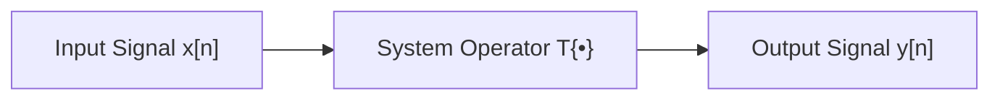
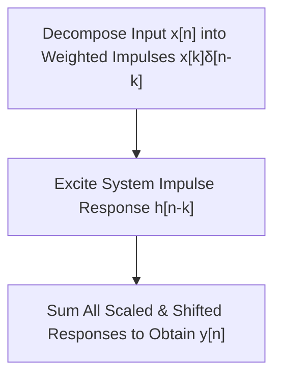

# Chapter 3: Time-Frequency Analysis & Speech System Modeling

---

## Chapter Overview
A continuous speech signal can be analyzed across multiple domains to reveal different physical and mathematical characteristics. While time-domain representation captures acoustic amplitude variations over time, frequency-domain analysis identifies constituent pitch, harmonics, and formant energies. Combining both approaches yields the **spectrogram**, a time-frequency representation essential for tracking formant trajectories and phoneme transitions. Furthermore, speech production systems and vocal tract filtering operations are mathematically modeled using **Discrete-Time Linear Time-Invariant (LTI) systems**, analyzed via **impulse decomposition**, **time-domain convolution**, and **pole-zero system modeling**.

---

## Learning Outcomes
After completing this chapter, students will be able to:
- Interpret speech signals across time-domain, frequency-domain, and spectrogram time-frequency representations.
- Explain spectral energy distribution across fundamental pitch frequencies, formants, and consonant fricatives.
- Formulate discrete-time LTI system properties (Linearity, Superposition, Time-Invariance).
- Compute time-domain convolution $y[n] = x[n] * h[n]$ using tabular/graphical flip-and-slide methods.
- Analyze the limitations of time-domain convolution and explain the necessity of Pole-Zero System Modeling.

---

## 1. Time-Domain Representation of Speech Signals

### 1.1 Definition & Graphical Structure
A time-domain representation is the simplest and most direct method of observing a speech signal. It plots instantaneous sound pressure (amplitude variations) against time.

- **X-axis (Time)**: Represents continuous or discrete time in seconds ($\text{s}$) or milliseconds ($\text{ms}$). Indicates speech event occurrences (word onset, vowel duration, pauses, silence, and speech offset).
- **Y-axis (Amplitude)**: Represents instantaneous signal strength. Measured as sound pressure ($\text{Pa}$), electrical voltage ($\text{V}$), or normalized digital amplitude ($[-1, +1]$ or digital integer range).

*Figure 1.1: Time-Domain Waveform of Spoken Utterance "Sunday"*

### 1.2 Waveform Analysis & Interpretation
In a typical time-domain speech recording (e.g., the spoken word *"Sunday"* over $3.5\text{ s}$):
1. **Silence Regions ($0 - 1.1\text{ s}$ & $2.9 - 3.5\text{ s}$)**: Near-zero flat baseline showing background noise without vocal tract excitation.
2. **Main Speech Burst ($1.1 - 1.7\text{ s}$)**: High-amplitude quasi-periodic oscillations corresponding to voiced vowel sound production.
3. **Inter-Syllabic Pause ($1.7 - 2.6\text{ s}$)**: Amplitude returns close to zero between spoken components.
4. **Secondary Speech Segment ($2.6 - 2.9\text{ s}$)**: Lower amplitude waveform representing softer consonant/syllable articulation.

---

## 2. Frequency-Domain Representation of Speech Signals

### 2.1 Spectral Energy Distribution
While time-domain signals show *when* sound events happen, frequency-domain representation reveals *which frequencies are present and how much energy they carry*. By applying the Discrete Fourier Transform (DFT) or Fast Fourier Transform (FFT), the time waveform is decomposed into sinusoidal components:

- **X-axis (Frequency)**: Measured in Hertz ($\text{Hz}$), ranging from $0\text{ Hz}$ up to the Nyquist frequency $F_s/2$.
- **Y-axis (Magnitude)**: Measured in linear amplitude, power, or logarithmic decibels ($\text{dB}$).

*Figure 2.1: Frequency-Domain Magnitude Spectrum (0 to 8000 Hz)*

### 2.2 Frequency Band Breakdown in Speech
For a speech signal sampled at $F_s = 16\text{ kHz}$ (Nyquist limit $F_{Nyq} = 8\text{ kHz}$):

| Frequency Range | Acoustic Component | Speech Significance |
| :--- | :--- | :--- |
| **$0 - 1000\text{ Hz}$** | Fundamental Frequency ($F_0$) & Low Harmonics | Determines speaker pitch and glottal excitation rate. |
| **$1000 - 4000\text{ Hz}$** | Vocal Tract Formants ($F_1, F_2, F_3$) | Primary acoustic cues for identifying vowels and resonant phonemes. |
| **$4000 - 8000\text{ Hz}$** | Fricative Noise & High Consonants | Provides clarity and distinction for sibilants (/s/, /z/, /ʃ/). |

---

## 3. Comparative Summary: Time-Domain vs. Frequency-Domain

| Feature | Time-Domain Representation | Frequency-Domain Representation |
| :--- | :--- | :--- |
| **Primary Plot** | Amplitude vs. Time | Magnitude/Power (dB) vs. Frequency (Hz) |
| **Information** | Signal onset, duration, pauses, pitch periods | Pitch ($F_0$), harmonic structures, formant peaks |
| **Mathematical Basis** | Direct raw waveform $x[n]$ | Discrete Fourier Transform $X(e^{j\omega}) = \text{DFT}\{x[n]\}$ |
| **Key Advantage** | Simple signal capture and segmentation | Reveals vocal tract filter resonances and spectral energy |
| **Primary Applications** | Endpoint detection, silence removal, energy thresholding | Speech/Speaker recognition, pitch estimation, noise filtering |

---

## 4. Spectrogram: Time-Frequency Representation

### 4.1 Concept & Computation via STFT
A **spectrogram** combines time and frequency analysis into a single two-dimensional plot. It displays how the spectral content of a signal evolves over time.

$$\text{STFT}\{x[n]\}(m, \omega) = \sum_{n=-\infty}^{\infty} x[n] w[n-m] e^{-j\omega n}$$

- **X-axis**: Time ($\text{seconds}$).
- **Y-axis**: Frequency ($\text{Hz}$ or $\text{kHz}$).
- **Color Intensity / Dark Scale**: Logarithmic magnitude (dB). Darker/warmer regions indicate high energy concentrations.

*Figure 4.1: Time-Frequency Spectrogram of Spoken Utterance "Sunday"*

### 4.2 Diagnostic Value of Spectrograms
- **Formant Tracking**: Prominent horizontal dark bands mark formant trajectories ($F_1, F_2, F_3$) moving as articulators change shape.
- **Voiced vs. Unvoiced Distinction**: Voiced speech exhibits clear vertical striations (glottal pulses) and horizontal formant bands; unvoiced speech displays a diffuse high-frequency noise pattern.
- **Phonetic Segmentation**: Visualizes precise boundary transitions between phonemes and syllables.

---

## 5. Discrete-Time & Linear Time-Invariant (LTI) Systems

### 5.1 System Representation
In speech processing, the human vocal tract filter, acoustic microphones, and transmission channels are modeled as **Discrete-Time Systems**:

$$y[n] = T\{x[n]\}$$

### 5.2 LTI System Properties

#### 1. Linearity (Principle of Superposition)
A system is linear if it satisfies both **Scalability (Homogeneity)** and **Additivity**:
- **Scalability**: $T\{a \cdot x[n]\} = a \cdot T\{x[n]\} = a \cdot y[n]$
- **Additivity**: $T\{x_1[n] + x_2[n]\} = T\{x_1[n]\} + T\{x_2[n]\} = y_1[n] + y_2[n]$
- **Superposition Equation**:
  $$T\{a \cdot x_1[n] + b \cdot x_2[n]\} = a \cdot y_1[n] + b \cdot y_2[n]$$

#### 2. Time Invariance
A system is time-invariant if a time shift in the input causes an identical time shift in the output:
$$\text{If } x[n] \xrightarrow{T} y[n], \quad \text{then } x[n - k] \xrightarrow{T} y[n - k]$$

---

## 6. Impulse Decomposition & Time-Domain Convolution

### 6.1 Impulse Decomposition
Any discrete-time speech signal $x[n]$ can be uniquely represented as a linear combination of weighted, time-shifted unit impulses $\delta[n-k]$:

$$x[n] = \sum_{k=-\infty}^{\infty} x[k] \, \delta[n - k]$$

where the unit impulse function $\delta[n]$ is defined as:

$$\delta[n] = \begin{cases} 1, & n = 0 \\ 0, & n \neq 0 \end{cases}$$

### 6.2 The Convolution Sum Equation
If an LTI system has an **impulse response** $h[n] = T\{\delta[n]\}$, then the output $y[n]$ for any arbitrary input $x[n]$ is given by the **Time-Domain Convolution Sum**:

$$y[n] = x[n] * h[n] = \sum_{k=-\infty}^{\infty} x[k] \, h[n - k]$$

### 6.3 Mathematical Properties of Convolution
1. **Commutative**: $x[n] * h[n] = h[n] * x[n]$
2. **Associative**: $(x[n] * h_1[n]) * h_2[n] = x[n] * (h_1[n] * h_2[n])$
3. **Distributive**: $x[n] * (h_1[n] + h_2[n]) = (x[n] * h_1[n]) + (x[n] * h_2[n])$
4. **Impulse Property**: $x[n] * \delta[n] = x[n]$
5. **Shift Property**: $x[n - k_1] * h[n - k_2] = y[n - k_1 - k_2]$
6. **Output Length Property**: If sequence $x[n]$ has length $L_x$ and $h[n]$ has length $L_h$, the convolved output sequence $y[n]$ has length:
   $$L_y = L_x + L_h - 1$$

---

## 7. Step-by-Step Tabular Convolution Method

To compute $y[n] = x[n] * h[n]$ manually:
1. **Index Alignment**: Identify non-zero indices for $x[k]$ and $h[k]$.
2. **Time Reversal (Flip)**: Reflect impulse response $h[k]$ about origin to form $h[-k]$.
3. **Shift and Multiply**: For each output index $n$, shift $h[n-k]$ by $n$ steps, multiply overlapping samples with $x[k]$, and sum the products.

### Solved Example:
Let input $x[n] = \{1, 2, 1\}$ for $n = 0, 1, 2$ ($L_x = 3$) and impulse response $h[n] = \{1, -1\}$ for $n = 0, 1$ ($L_h = 2$).  
Output length $L_y = 3 + 2 - 1 = 4$ (indices $n = 0, 1, 2, 3$).

- **$n = 0$**: $y[0] = x[0]h[0] = 1 \times 1 = 1$
- **$n = 1$**: $y[1] = x[0]h[1] + x[1]h[0] = (1 \times -1) + (2 \times 1) = 1$
- **$n = 2$**: $y[2] = x[1]h[1] + x[2]h[0] = (2 \times -1) + (1 \times 1) = -1$
- **$n = 3$**: $y[3] = x[2]h[1] = 1 \times -1 = -1$

**Final Output**: $y[n] = \{1, 1, -1, -1\}$ for $n = 0, 1, 2, 3$.

---

## 8. Limitations of Time-Domain Convolution & Transition to Pole-Zero Modeling

While time-domain convolution fully describes LTI system outputs, it presents significant practical limitations in speech system analysis:

1. **High Computational Complexity**: Direct convolution of long speech signals requires $O(N \cdot M)$ multiplications and additions.
2. **Hidden Spectral Structure**: Time-domain coefficients do not explicitly disclose resonant frequencies (formants), bandwidths, or attenuation.
3. **Obscured System Stability & Resonances**: System poles (vocal tract resonances) and zeros (nasal tract antiresonances) cannot be directly identified from time-domain sample sequences.

To overcome these limitations, speech systems transition from time-domain convolution to **Pole-Zero System Modeling ($Z$-Transform domain)**, representing the vocal tract transfer function as:

$$H(z) = \frac{B(z)}{A(z)} = G \frac{\prod_{k=1}^{M} (1 - z_k z^{-1})}{\prod_{k=1}^{N} (1 - p_k z^{-1})}$$

where $p_k$ represent system **poles** (vocal tract formants) and $z_k$ represent system **zeros** (anti-resonances).
