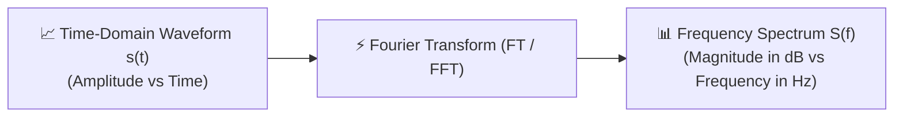
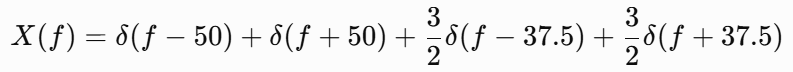
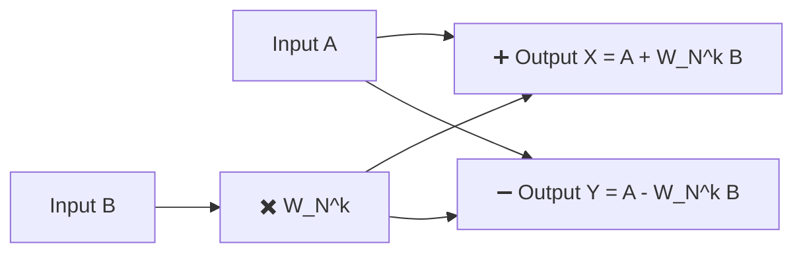
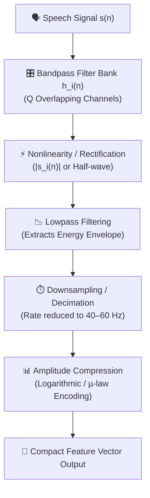
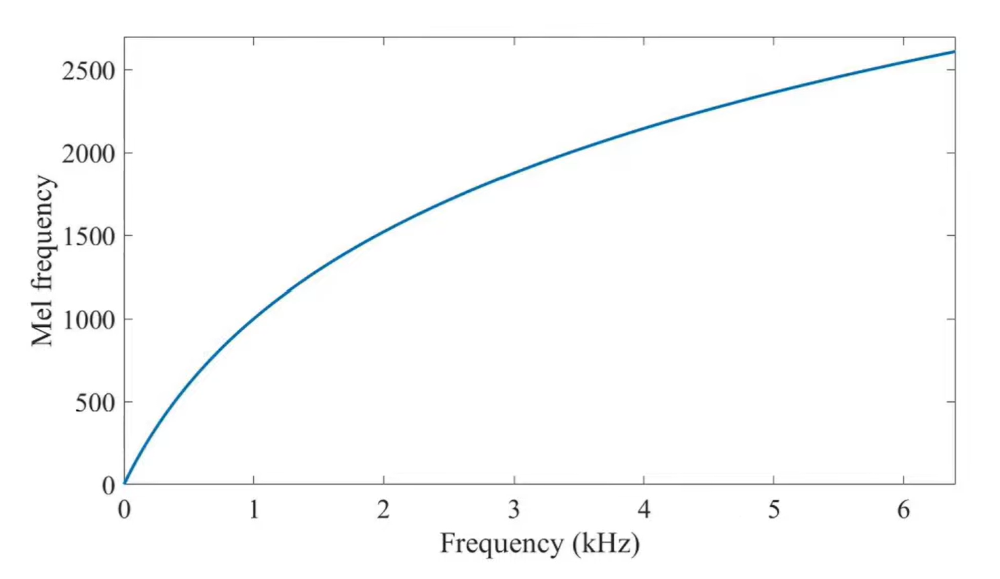
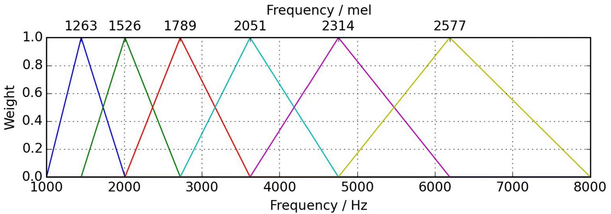
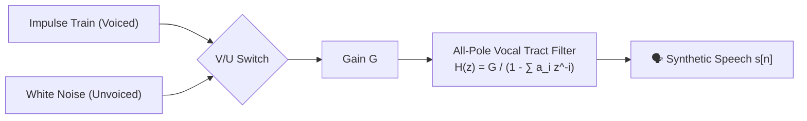

# Chapter 4: Frequency Analysis of Speech Signals — DFT, FFT, Filter Banks & LPC

---

## Chapter Overview
Time-domain speech waveforms display amplitude variations over time but hide fundamental pitch, harmonic structures, and vocal tract formants. Frequency-domain analysis resolves these limitations by decomposing non-stationary speech into constituent sinusoidal and complex exponential frequencies. This chapter presents the mathematical foundations of the **Discrete Fourier Transform (DFT)**, the computationally efficient **Fast Fourier Transform (FFT)** (Cooley-Tukey algorithm, twiddle factors, butterfly networks), and two primary spectral estimation paradigms in modern speech processing: the **Bank-of-Filters (BOF) Model** (including Mel-scale non-uniform filter banks) and the **Linear Predictive Coding (LPC) Model** (all-pole vocal tract transfer functions, autocorrelation method, Yule-Walker equations, and ASR feature vector extraction).

---

## Learning Outcomes
After completing this chapter, students will be able to:
- Formulate the Discrete Fourier Transform (DFT) and compute frequency spectra for discrete speech sequences.
- Demonstrate the orthogonality of DFT basis functions and explain spectral leakage.
- Explain the Cooley-Tukey FFT algorithm, even-odd decomposition, twiddle factor properties, and butterfly networks.
- Analyze the complete pipeline of the Bank-of-Filters (BOF) front-end (bandpass filtering, rectification, lowpass filtering, decimation, and amplitude compression).
- Calculate raw bit rates, compressed bit rates, and compression ratios for multi-channel filter bank systems.
- Convert frequencies between Hertz and the Mel scale using $m = 2595 \log_{10}(1 + f/700)$.
- Formulate the Linear Predictive Coding (LPC) model, derive Yule-Walker equations via the autocorrelation method, and describe the LPC front-end feature extraction pipeline for Automatic Speech Recognition (ASR).

---

## 1. Fourier Transform & Exponential Signal Representation

### 1.1 Why Frequency-Domain Analysis?
Speech signals are **non-stationary** continuous acoustic waves. While time-domain plots show *when* a signal changes, frequency-domain representations reveal *what frequencies make up the signal and how much energy each component carries*.

### 1.2 Euler's Formula & Complex Exponential Signals
By Euler's formula:

$$e^{j\theta} = \cos\theta + j\sin\theta$$

Any real sinusoidal speech component $A \cos(\omega_0 n + \phi)$ can be expressed as a linear combination of two complex exponentials rotating in opposite directions in the complex plane:

$$\cos(\omega_0 n) = \frac{1}{2} \left( e^{j\omega_0 n} + e^{-j\omega_0 n} \right)$$

- **Positive Frequency ($+f_0$)**: Represents a counter-clockwise rotating phasor $e^{+j 2\pi f_0 t}$.
- **Negative Frequency ($-f_0$)**: Represents a clockwise rotating phasor $e^{-j 2\pi f_0 t}$.
- *Physical Meaning*: A real continuous cosine signal contains equal energy at $+f_0$ and $-f_0$, resulting in a symmetric frequency spectrum about $0\text{ Hz}$.

### 1.3 Continuous Fourier Transform (FT)
For a continuous-time speech signal $x(t)$, the Fourier Transform $X(f)$ is:

$$X(f) = \int_{-\infty}^{\infty} x(t) \, e^{-j 2\pi f t} \, dt$$

The inverse Fourier Transform reconstructs the continuous time-domain signal:

$$x(t) = \int_{-\infty}^{\infty} X(f) \, e^{j 2\pi f t} \, df$$

#### Solved Example (Slide 10-12):
Consider a composite speech signal $x(t) = 2\cos(2\pi \cdot 50 t) + 3\cos(2\pi \cdot 37.5 t)$.
- Applying Euler's formula:
  $$x(t) = \left(e^{j 2\pi 50 t} + e^{-j 2\pi 50 t}\right) + 1.5 \left(e^{j 2\pi 37.5 t} + e^{-j 2\pi 37.5 t}\right)$$
- Taking the Fourier Transform yields four Dirac delta impulse spikes:
  $$X(f) = \delta(f - 50) + \delta(f + 50) + 1.5\delta(f - 37.5) + 1.5\delta(f + 37.5)$$
  Magnitudes are $1.0$ at $\pm 50\text{ Hz}$ and $1.5$ at $\pm 37.5\text{ Hz}$.

*Figure 1.1: Symmetric Frequency Spectrum of Composite Cosine Wave*

### 1.4 Key Properties of Fourier Transform
1. **Linearity**: $\mathcal{F}\{a x_1(t) + b x_2(t)\} = a X_1(f) + b X_2(f)$
2. **Time Shift**: $\mathcal{F}\{x(t - t_0)\} = X(f) e^{-j 2\pi f t_0}$ *(Magnitude spectrum remains unchanged; only phase changes)*.
3. **Frequency Shift**: $\mathcal{F}\{x(t) e^{j 2\pi f_0 t}\} = X(f - f_0)$
4. **Convolution Property**:
   $$\mathcal{F}\{x(t) * h(t)\} = X(f) \cdot H(f)$$
   *(Time-domain convolution becomes simple pointwise multiplication in the frequency domain).*

---

## 2. Discrete Fourier Transform (DFT) & Basis Function Orthogonality

### 2.1 Discrete-Time Fourier Transform (DTFT) vs. DFT
- **DTFT**: Transforms a discrete sequence $x[n]$ into a continuous, $2\pi$-periodic frequency spectrum $X(e^{j\omega}) = \sum_{n=-\infty}^{\infty} x[n] e^{-j\omega n}$ over $\omega \in [-\pi, \pi]$.
- **DFT**: Samples the continuous DTFT at $N$ discrete frequency bins $k = 0, 1, \dots, N-1$ for finite-length sequences:

$$X[k] = \sum_{n=0}^{N-1} x[n] \, e^{-j \frac{2\pi}{N} k n}, \quad k = 0, 1, \dots, N-1$$

The **Inverse Discrete Fourier Transform (IDFT)** is:

$$x[n] = \frac{1}{N} \sum_{k=0}^{N-1} X[k] \, e^{j \frac{2\pi}{N} k n}, \quad n = 0, 1, \dots, N-1$$

### 2.2 Basis Functions & Orthogonality Property
The terms $e^{-j \frac{2\pi}{N} k n}$ are called the **DFT basis functions**. They satisfy the **Orthogonality Property**:

$$\sum_{n=0}^{N-1} e^{j \frac{2\pi}{N} k n} e^{-j \frac{2\pi}{N} m n} = \begin{cases} N, & k = m \\ 0, & k \neq m \end{cases}$$

- *Physical Meaning*: When a signal frequency matches bin $k$, constructive summation produces a strong output peak of magnitude $\frac{N}{2} A$. At all other non-matching bins, orthogonal positive and negative components completely cancel to zero.

### 2.3 Spectral Leakage
If a signal frequency $f_0$ does not align exactly with one of the discrete DFT frequency bins ($k \cdot \frac{F_s}{N}$), energy spills over into adjacent bins. This phenomenon is called **Spectral Leakage**.

### 2.4 Computational Complexity of Direct DFT
Direct computation of an $N$-point DFT requires $N$ complex multiplications and $N-1$ complex additions per bin for $N$ bins, yielding an overall computational complexity of:

$$\text{Complexity of Direct DFT} = O(N^2)$$

For $N = 1024$ samples, direct DFT requires over $1,048,576$ operations per frame.

---

## 3. Fast Fourier Transform (FFT) & Butterfly Computation

### 3.1 The Cooley-Tukey Algorithm
Introduced by James W. Cooley and John W. Tukey in 1965, the **Fast Fourier Transform (FFT)** is an efficient algorithm that computes the exact DFT by exploiting the **symmetry and periodicity** of complex exponential twiddle factors using a **Divide-and-Conquer** approach.

$$\text{Complexity of FFT} = O(N \log_2 N)$$

For $N = 1024$, FFT reduces operations from $1,048,576$ down to $10,240$ (a **$100\times$ speedup**).

### 3.2 Even-Odd Decomposition
An $N$-point DFT is split into two $\frac{N}{2}$-point DFTs—one for even-indexed samples ($n = 2m$) and one for odd-indexed samples ($n = 2m + 1$):

$$X[k] = \sum_{m=0}^{\frac{N}{2}-1} x[2m] \, e^{-j \frac{2\pi}{N} k (2m)} + \sum_{m=0}^{\frac{N}{2}-1} x[2m+1] \, e^{-j \frac{2\pi}{N} k (2m+1)}$$

Using the **Twiddle Factor** definition $W_N^k = e^{-j \frac{2\pi}{N} k}$:

$$X[k] = E[k] + W_N^k \, O[k], \quad k = 0, 1, \dots, \frac{N}{2}-1$$
$$X\left[k + \frac{N}{2}\right] = E[k] - W_N^k \, O[k], \quad k = 0, 1, \dots, \frac{N}{2}-1$$

where $E[k]$ is the $\frac{N}{2}$-point DFT of even samples and $O[k]$ is the $\frac{N}{2}$-point DFT of odd samples.

### 3.3 Twiddle Factor Properties
1. **Symmetry**: $W_N^{k + N/2} = -W_N^k$
2. **Periodicity**: $W_N^{k + N} = W_N^k$

### 3.4 Butterfly Computation Unit
The basic calculation module of an FFT is called a **Butterfly Unit**. It takes two inputs $A$ and $B$, applies twiddle factor $W_N^k$, and computes one addition and one subtraction:

---

## 4. Bank-of-Filters (BOF) Model & Spectral Envelope

### 4.1 Concept of Spectral Envelope
The **spectral envelope** is the smooth curve outlining the peaks (formants) and valleys of a short-time speech spectrum. It carries essential linguistic phoneme identity and speaker voice characteristics.

### 4.2 Complete BOF Front-End Analyzer Pipeline

1. **Bandpass Filtering**: Speech $s[n]$ passes through $Q$ parallel bandpass filters $h_i[n]$, covering the frequency range of interest.
2. **Nonlinearity (Rectification)**: Passes filtered signals $s_i[n]$ through a full-wave rectifier ($|s_i[n]|$) or half-wave rectifier, shifting energy to low frequencies around DC.
3. **Lowpass Filtering**: Smooths high-frequency harmonics, retaining the DC component representing energy in that frequency band.
4. **Sampling Rate Reduction (Decimation)**: Lowpass energy varies slowly ($20 - 30\text{ Hz}$); sampling rate is decimated down to $40 - 60\text{ Hz}$.
5. **Amplitude Compression**: Applies logarithmic compression to compress dynamic range, matching human loudness perception.

### 4.3 Data Reduction & Solved Compression Example (Slide 58-59)
Consider a narrowband speech signal sampled at $F_s = 8\text{ kHz}$ with $8\text{ bits/sample}$:
1. **Raw Bit Rate**:
   $$\text{Raw Bit Rate} = 8000 \times 8 = \mathbf{64,000\text{ bps} \quad (64\text{ kbps})}$$
2. **Compressed Filter Bank Output**: Passed through a $10$-channel filter bank, where each channel is downsampled to $100\text{ Hz}$ and quantized at $6\text{ bits/sample}$:
   $$\text{Compressed Bit Rate} = 10 \text{ channels} \times 100\text{ Hz} \times 6\text{ bits} = \mathbf{6,000\text{ bps} \quad (6\text{ kbps})}$$
3. **Compression Ratio**:
   $$\text{Compression Ratio} = \frac{64,000\text{ bps}}{6,000\text{ bps}} = \mathbf{10.67 : 1}$$

---

## 5. Non-Uniform Mel Filter Banks & Mel Spectrogram

### 5.1 The Mel Scale & Human Auditory Perception
Human pitch perception is linear at low frequencies ($< 1000\text{ Hz}$) and logarithmic at high frequencies ($> 1000\text{ Hz}$). The **Mel Scale** converts physical frequency in Hertz ($f$) into perceptual pitch units ($m$):

$$m = 2595 \log_{10}\left(1 + \frac{f}{700}\right)$$

The inverse conversion from Mels back to Hertz is:

$$f = 700 \left( 10^{\frac{m}{2595}} - 1 \right)$$

*Figure 5.1: Non-linear Mel Scale Curve (Hertz vs. Mels)*

### 5.2 Step-by-Step Construction of Mel Filter Bank
1. Define lower frequency $f_{low}$ and upper frequency $f_{high}$ (e.g., $300\text{ Hz}$ and $8000\text{ Hz}$).
2. Convert $f_{low}$ and $f_{high}$ to Mels: $m_{low}$ and $m_{high}$.
3. Generate $M + 2$ equally spaced points in the Mel domain.
4. Convert all Mel points back to Hertz using the inverse formula.
5. Round Hertz points to nearest DFT frequency bin indices.
6. Construct $M$ overlapping **triangular bandpass filters** $H_m[k]$.

*Figure 5.2: Overlapping Triangular Mel Filter Bank Structure*

---

## 6. Linear Predictive Coding (LPC) Model

### 6.1 Linear Prediction Principle
Linear Predictive Coding (LPC) models speech by predicting the current sample $s[n]$ as a linear weighted sum of $p$ previous samples:

$$\hat{s}[n] = \sum_{i=1}^{p} a_i s[n-i]$$

where $p$ is the **prediction order** (typically $p = 10 - 16$ for $8 - 16\text{ kHz}$ speech) and $\{a_i\}$ are the **LPC predictor coefficients**.

The **prediction error** (residual signal) is:

$$e[n] = s[n] - \hat{s}[n] = s[n] - \sum_{i=1}^{p} a_i s[n-i]$$

### 6.2 Source-Filter Model & All-Pole Transfer Function
LPC separates speech into source excitation $E(z)$ and vocal tract filter $H(z)$:

$$S(z) = E(z) \cdot H(z) = E(z) \cdot \frac{G}{1 - \sum_{i=1}^{p} a_i z^{-i}}$$

- **Voiced Excitation**: Modeled as a quasi-periodic glottal pulse train with pitch period $T_0$.
- **Unvoiced Excitation**: Modeled as a zero-mean white noise random sequence.
- **All-Pole Filter $H(z)$**: Models vocal tract resonances (formants) via transfer function poles.

### 6.3 Autocorrelation Method & Yule-Walker Normal Equations
To find predictor coefficients $\{a_i\}$ that minimize total prediction error energy $E = \sum_{n} e^2[n]$, we set partial derivatives $\frac{\partial E}{\partial a_i} = 0$. This yields the **Yule-Walker Equations**:

$$\sum_{i=1}^{p} a_i \, R[|k - i|] = R[k], \quad k = 1, 2, \dots, p$$

In matrix form:

$$\begin{bmatrix}
R[0] & R[1] & R[2] & \dots & R[p-1] \\
R[1] & R[0] & R[1] & \dots & R[p-2] \\
R[2] & R[1] & R[0] & \dots & R[p-3] \\
\vdots & \vdots & \vdots & \ddots & \vdots \\
R[p-1] & R[p-2] & R[p-3] & \dots & R[0]
\end{bmatrix}
\begin{bmatrix} a_1 \\ a_2 \\ a_3 \\ \vdots \\ a_p \end{bmatrix} =
\begin{bmatrix} R[1] \\ R[2] \\ R[3] \\ \vdots \\ R[p] \end{bmatrix}$$

where $R[k] = \sum_{n} s[n] s[n-k]$ is the autocorrelation sequence. Because the matrix is a symmetric **Toeplitz matrix**, it is solved efficiently in $O(p^2)$ using the **Levinson-Durbin Recursion Algorithm**.

### 6.4 Autocorrelation vs. Covariance Method

| Feature | Autocorrelation Method | Covariance Method |
| :--- | :--- | :--- |
| **Windowing** | Requires framing window (Hamming/Hanning) to taper ends | No window required; uses unwindowed samples in interval |
| **Matrix Structure** | Symmetric Toeplitz matrix | Symmetric Non-Toeplitz matrix |
| **Filter Stability** | **Guaranteed Stable** (all poles inside unit circle) | Stability not guaranteed (poles may drift outside) |
| **Computational Algorithm** | Levinson-Durbin recursion ($O(p^2)$) | Cholesky decomposition ($O(p^3)$) |

### 6.5 Spectral Whitening
Filtering speech $s[n]$ through an inverse LPC filter $A(z) = 1 - \sum_{i=1}^{p} a_i z^{-i}$ removes the vocal tract spectral envelope, producing an error residual $e[n]$ with a flat, white spectrum. This process is called **Spectral Whitening**.

### 6.6 Complete LPC Feature Extraction Pipeline for ASR
For Automatic Speech Recognition (ASR), an LPC front-end extracts compact feature vectors:

```mermaid
flowchart LR
    A["s(t)"] --> Pre["1. Pre-emphasis\n(1 - α z^-1)"]
    Pre --> Frame["2. Frame Blocking\n(20–30 ms)"]
    Frame --> Window["3. Windowing\n(Hamming)"]
    Window --> Auto["4. Autocorrelation\n(R[0]...R[p])"]
    Auto --> LPC["5. LPC Analysis\n(Levinson-Durbin)"]
    LPC --> Cepstral["6. Cepstral Conversion\n(c_n)"]
    Cepstral --> Delta["7. Delta Features\n(Δc_n, ΔΔc_n)"]
    Delta --> Out["💾 Feature Vector Sequence"]
```

