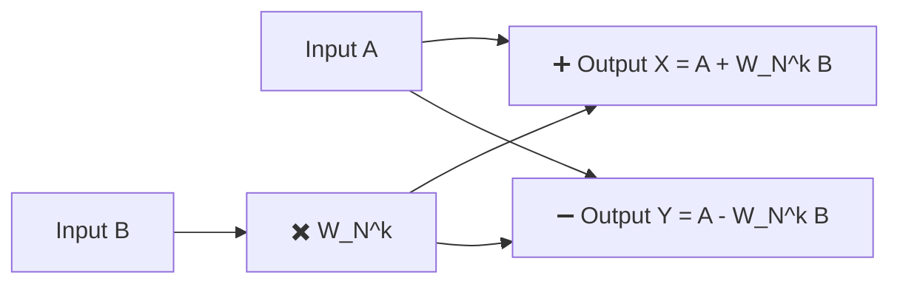
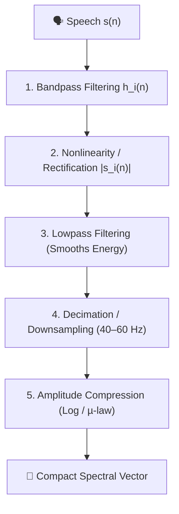

# Chapter 4: 5-Mark Important Practice Questions & Solved Numerical Problems

---

### Question 1: Why is frequency-domain representation required for speech processing? Explain complex exponential signal representation using Euler's formula and the concept of negative frequencies. (5 Marks)

#### Answer:

**1. Need for Frequency-Domain Analysis (1.5 Marks)**
Speech signals are non-stationary acoustic waves. While time-domain waveforms display signal amplitude variations over time, they hide vital acoustic parameters such as fundamental pitch ($F_0$), glottal harmonics, and vocal tract formants ($F_1, F_2$). Frequency-domain analysis resolves these limitations by revealing which frequencies make up the signal and how much energy each component carries.

**2. Complex Exponential Representation via Euler's Formula (2 Marks)**
By Euler's formula:
$$e^{j\theta} = \cos\theta + j\sin\theta$$

Any real sinusoidal component $A \cos(\omega_0 n)$ is represented in terms of two complex exponentials:
$$\cos(\omega_0 n) = \frac{1}{2} \left( e^{j\omega_0 n} + e^{-j\omega_0 n} \right)$$

**3. Concept of Positive and Negative Frequencies (1.5 Marks)**
A negative frequency does not imply time moving backward. Rather, in complex phasor notation:
- $e^{+j 2\pi f_0 t}$ represents a counter-clockwise rotating complex phasor.
- $e^{-j 2\pi f_0 t}$ represents a clockwise rotating complex phasor.  
To form a purely real cosine wave, both phasors must be present simultaneously. Thus, real signal frequency spectra are symmetric about $0\text{ Hz}$, showing identical magnitude spikes at $+f_0$ and $-f_0$.

---

### Question 2: State the continuous Fourier Transform (FT) equations. For signal $x(t) = 4\cos(2\pi \cdot 20 t) + 2\cos(2\pi \cdot 60 t)$, derive its complex exponential representation and Fourier Transform impulse spectrum. (5 Marks)

#### Solution:

**1. Continuous Fourier Transform Equations (1 Mark)**
- Forward FT: $X(f) = \int_{-\infty}^{\infty} x(t) \, e^{-j 2\pi f t} \, dt$
- Inverse FT: $x(t) = \int_{-\infty}^{\infty} X(f) \, e^{j 2\pi f t} \, df$

**2. Complex Exponential Expansion (2 Marks)**
Given $x(t) = 4\cos(2\pi \cdot 20 t) + 2\cos(2\pi \cdot 60 t)$:
Applying Euler's cosine identity $\cos(\theta) = \frac{1}{2}(e^{j\theta} + e^{-j\theta})$:
- First term: $4\cos(2\pi \cdot 20 t) = 2 \, e^{j 2\pi \cdot 20 t} + 2 \, e^{-j 2\pi \cdot 20 t}$
- Second term: $2\cos(2\pi \cdot 60 t) = 1 \, e^{j 2\pi \cdot 60 t} + 1 \, e^{-j 2\pi \cdot 60 t}$

Full complex exponential expression:
$$x(t) = 2 e^{j 2\pi (20) t} + 2 e^{-j 2\pi (20) t} + 1 e^{j 2\pi (60) t} + 1 e^{-j 2\pi (60) t}$$

**3. Fourier Transform Impulse Spectrum (2 Marks)**
Since the Fourier transform of $e^{j 2\pi f_0 t}$ is $\delta(f - f_0)$:
$$X(f) = 2\delta(f - 20) + 2\delta(f + 20) + \delta(f - 60) + \delta(f + 60)$$

- **Frequency Spikes**: Located at $f = \pm 20\text{ Hz}$ and $f = \pm 60\text{ Hz}$.
- **Magnitudes**: $2.0$ at $\pm 20\text{ Hz}$, and $1.0$ at $\pm 60\text{ Hz}$.

---

### Question 3: For composite signal $x(t) = 3\cos(2\pi \cdot 15 t) + 5\cos(2\pi \cdot 50 t)$, determine its constituent frequencies, complex exponential form, and Fourier Transform Dirac delta spectrum. (5 Marks)

#### Solution:

**1. Constituent Frequencies (1 Mark)**
Matching with standard form $\cos(2\pi f t)$:
- Term 1: $f_1 = 15\text{ Hz}$, Amplitude $A_1 = 3$.
- Term 2: $f_2 = 50\text{ Hz}$, Amplitude $A_2 = 5$.

**2. Complex Exponential Expansion (2 Marks)**
Applying Euler's formula:
- $3\cos(2\pi \cdot 15 t) = 1.5 e^{j 2\pi (15) t} + 1.5 e^{-j 2\pi (15) t}$
- $5\cos(2\pi \cdot 50 t) = 2.5 e^{j 2\pi (50) t} + 2.5 e^{-j 2\pi (50) t}$

$$x(t) = 1.5 e^{j 2\pi (15) t} + 1.5 e^{-j 2\pi (15) t} + 2.5 e^{j 2\pi (50) t} + 2.5 e^{-j 2\pi (50) t}$$

**3. Fourier Transform Dirac Delta Spectrum (2 Marks)**
$$X(f) = 1.5\delta(f - 15) + 1.5\delta(f + 15) + 2.5\delta(f - 50) + 2.5\delta(f + 50)$$

- Four Dirac delta impulse lines occur at frequencies $-50\text{ Hz}, -15\text{ Hz}, +15\text{ Hz}, +50\text{ Hz}$.
- Magnitudes are $1.5$ for $\pm 15\text{ Hz}$ and $2.5$ for $\pm 50\text{ Hz}$.

---

### Question 4: Define Discrete Fourier Transform (DFT) and Inverse DFT. State the DFT basis functions and mathematically prove the Orthogonality Property. (5 Marks)

#### Answer:

**1. Definitions of DFT and IDFT (1.5 Marks)**
For an $N$-point finite discrete sequence $x[n]$ ($n = 0, 1, \dots, N-1$):
- **N-Point DFT**:
  $$X[k] = \sum_{n=0}^{N-1} x[n] \, e^{-j \frac{2\pi}{N} k n}, \quad k = 0, 1, \dots, N-1$$
- **N-Point IDFT**:
  $$x[n] = \frac{1}{N} \sum_{k=0}^{N-1} X[k] \, e^{j \frac{2\pi}{N} k n}, \quad n = 0, 1, \dots, N-1$$

**2. DFT Basis Functions (1 Mark)**
The set of complex exponential terms $\phi_k[n] = e^{j \frac{2\pi}{N} k n}$ for $k = 0, 1, \dots, N-1$ are the **DFT basis functions**.

**3. Proof of Orthogonality Property (2.5 Marks)**
Evaluate the inner product sum of two basis functions $\phi_k[n]$ and $\phi_m[n]$ over $N$ samples:

$$S = \sum_{n=0}^{N-1} e^{j \frac{2\pi}{N} k n} e^{-j \frac{2\pi}{N} m n} = \sum_{n=0}^{N-1} e^{j \frac{2\pi}{N} (k - m) n}$$

- **Case 1: $k = m$**:
  $$S = \sum_{n=0}^{N-1} e^{j 0} = \sum_{n=0}^{N-1} 1 = \mathbf{N}$$
- **Case 2: $k \neq m$**: Using geometric series sum formula $\sum_{n=0}^{N-1} r^n = \frac{1 - r^N}{1 - r}$ with $r = e^{j \frac{2\pi}{N} (k - m)}$:
  $$S = \frac{1 - e^{j \frac{2\pi}{N} (k - m) N}}{1 - e^{j \frac{2\pi}{N} (k - m)}} = \frac{1 - e^{j 2\pi (k - m)}}{1 - e^{j \frac{2\pi}{N} (k - m)}}$$
  Since $k - m$ is a non-zero integer, $e^{j 2\pi (k - m)} = \cos(2\pi(k-m)) + j\sin(2\pi(k-m)) = 1 + j0 = 1$.  
  $$S = \frac{1 - 1}{1 - e^{j \frac{2\pi}{N} (k - m)}} = \mathbf{0}$$

$$\therefore \sum_{n=0}^{N-1} e^{j \frac{2\pi}{N} k n} e^{-j \frac{2\pi}{N} m n} = \begin{cases} N, & k = m \\ 0, & k \neq m \end{cases} \quad \text{(Proved)}$$

---

### Question 5: Compute the 8-point DFT of a $1\text{ Hz}$ sine wave $x(t) = \sin(2\pi \cdot 1 \cdot t)$ sampled at $F_s = 8\text{ Hz}$. Show that energy is concentrated at bins $k=1$ and $k=7$ with magnitude $N/2 = 4$. (5 Marks)

#### Solution:

**1. Sampling & Sequence Samples (1.5 Marks)**
- $F_s = 8\text{ Hz} \implies T_s = 1/8\text{ s}$. Sampling instants $t_n = n / 8$ for $n = 0, 1, \dots, 7$.
- $x[n] = \sin\left(2\pi \cdot 1 \cdot \frac{n}{8}\right) = \sin\left(\frac{\pi n}{4}\right)$.
- Sample sequence $x[n]$ for $n = 0..7$:
  $$x[0] = \sin(0) = 0$$
  $$x[1] = \sin(\pi/4) = 1/\sqrt{2} \approx 0.7071$$
  $$x[2] = \sin(\pi/2) = 1$$
  $$x[3] = \sin(3\pi/4) = 0.7071$$
  $$x[4] = \sin(\pi) = 0$$
  $$x[5] = \sin(5\pi/4) = -0.7071$$
  $$x[6] = \sin(3\pi/2) = -1$$
  $$x[7] = \sin(7\pi/4) = -0.7071$$

**2. DFT Bin Frequency Spacing (1 Mark)**
Bin spacing $\Delta f = \frac{F_s}{N} = \frac{8\text{ Hz}}{8} = 1\text{ Hz}$.
- Bin $k=1$ corresponds to $+1\text{ Hz}$.
- Bin $k=7$ corresponds to $8 - 1 = 7\text{ Hz} \equiv -1\text{ Hz}$.

**3. Computing $X[1]$ and $X[7]$ (2.5 Marks)**
Expressing $x[n] = \frac{1}{2j} \left(e^{j \frac{2\pi}{8} n} - e^{-j \frac{2\pi}{8} n}\right) = -\frac{j}{2} e^{j \frac{2\pi}{8} n} + \frac{j}{2} e^{-j \frac{2\pi}{8} n}$:

By orthogonality of DFT basis functions:
- **For $k = 1$**:
  $$X[1] = \sum_{n=0}^{7} x[n] e^{-j \frac{2\pi}{8} n} = -\frac{j}{2} \sum_{n=0}^{7} e^{j \frac{2\pi}{8} n} e^{-j \frac{2\pi}{8} n} + 0 = -\frac{j}{2} (8) = \mathbf{-j 4}$$
  - Magnitude $|X[1]| = \sqrt{0^2 + (-4)^2} = \mathbf{4}$ ($N/2 = 8/2 = 4$).
  - Phase $\angle X[1] = -\frac{\pi}{2}\text{ rad} = -90^\circ$.

- **For $k = 7$**:
  $$X[7] = \sum_{n=0}^{7} x[n] e^{-j \frac{2\pi}{8} 7 n} = 0 + \frac{j}{2} \sum_{n=0}^{7} e^{-j \frac{2\pi}{8} n} e^{j \frac{2\pi}{8} n} = \frac{j}{2} (8) = \mathbf{+j 4}$$
  - Magnitude $|X[7]| = \mathbf{4}$.
  - Phase $\angle X[7] = +\frac{\pi}{2}\text{ rad} = +90^\circ$.

- **All Other Bins ($k = 0, 2, 3, 4, 5, 6$)**: $X[k] = \mathbf{0}$ due to orthogonality.

---

### Question 6: Explain the phenomenon of Spectral Leakage in DFT. Calculate the computational complexity of an $N$-point direct DFT and explain why direct DFT is inefficient for speech processing. (5 Marks)

#### Answer:

**1. Spectral Leakage (2 Marks)**
- **Definition**: Spectral leakage occurs when a continuous signal contains frequency components that do not align exactly with discrete DFT bin frequencies ($k \cdot \frac{F_s}{N}$).
- **Mechanism**: Non-integer cycles within the finite observation window cause discontinuities at window boundaries. Energy that should be concentrated at a single frequency leaks into multiple neighboring frequency bins, producing non-zero sidelobes.
- **Mitigation**: Windowing functions (e.g., Hamming, Hanning, Blackman) taper frame edges to zero, suppressing sidelobes.

**2. Computational Complexity of Direct DFT (3 Marks)**
An $N$-point DFT is: $X[k] = \sum_{n=0}^{N-1} x[n] e^{-j \frac{2\pi}{N} k n}$
- For each bin $k$: Requires $N$ complex multiplications and $N-1$ complex additions.
- For $N$ bins: Total complex multiplications = $N^2$; Total complex additions = $N(N-1)$.
- **Asymptotic Complexity**: $O(N^2)$.
- *Practical Implication*: For $N = 1024$ samples (standard $25\text{ ms}$ speech frame at $44.1\text{ kHz}$), direct DFT requires $1024^2 \approx 1.05 \times 10^6$ operations per frame. Computing this for $100$ frames per second creates prohibitive computational overhead for real-time speech systems.

---

### Question 7: Compute an 8-point DFT for a $1\text{ Hz}$ sine wave sampled at $F_s = 16\text{ Hz}$ and an 8-point DFT for a $2\text{ Hz}$ sine wave sampled at $F_s = 16\text{ Hz}$. Compare bin energy distributions. (5 Marks)

#### Solution:

**Part A: $1\text{ Hz}$ Sine Wave at $F_s = 16\text{ Hz}$ ($N = 8$) (2.5 Marks)**
- Bin frequency resolution $\Delta f = \frac{F_s}{N} = \frac{16}{8} = 2\text{ Hz/bin}$.
- Bins correspond to frequencies: $0\text{ Hz} (k=0)$, $2\text{ Hz} (k=1)$, $4\text{ Hz} (k=2)$, $6\text{ Hz} (k=3)$, $8\text{ Hz} (k=4)$.
- Signal frequency $f_0 = 1\text{ Hz}$ lies exactly midway between bin $0$ ($0\text{ Hz}$) and bin $1$ ($2\text{ Hz}$).
- **Result**: Because $1\text{ Hz}$ does not match any DFT bin, severe **Spectral Leakage** occurs. Energy is spread across all frequency bins ($X[k] \neq 0$ for multiple $k$).

**Part B: $2\text{ Hz}$ Sine Wave at $F_s = 16\text{ Hz}$ ($N = 8$) (2.5 Marks)**
- Bin resolution $\Delta f = 2\text{ Hz/bin}$. Bin $k=1$ corresponds exactly to $f_0 = 2\text{ Hz}$.
- Bin $k=7$ corresponds to $-2\text{ Hz} \equiv 14\text{ Hz}$.
- **Result**: Perfect alignment with bin $1$. By orthogonality:
  $$X[1] = -j 4 \implies |X[1]| = 4$$
  $$X[7] = +j 4 \implies |X[7]| = 4$$
  $$X[k] = 0 \quad \text{for } k \in \{0, 2, 3, 4, 5, 6\}$$
- **Comparison Summary**: Integer bin multiples yield clean isolated spikes; fractional bin frequencies cause spectral leakage.

---

### Question 8: Explain the Cooley-Tukey FFT Algorithm. Derive the Even-Odd Decomposition equations and state twiddle factor properties. (5 Marks)

#### Solution:

**1. The Cooley-Tukey Algorithm Concept (1 Mark)**
The Fast Fourier Transform (FFT) uses a **Divide-and-Conquer** strategy to decompose an $N$-point DFT into smaller $\frac{N}{2}$-point DFTs, reducing computational complexity from $O(N^2)$ to $O(N \log_2 N)$.

**2. Even-Odd Decomposition Derivation (2.5 Marks)**
The $N$-point DFT formula is: $X[k] = \sum_{n=0}^{N-1} x[n] W_N^{kn}$, where twiddle factor $W_N = e^{-j \frac{2\pi}{N}}$.
Split $n$ into even indices ($n = 2m$) and odd indices ($n = 2m + 1$) for $m = 0, 1, \dots, \frac{N}{2}-1$:

$$X[k] = \sum_{m=0}^{\frac{N}{2}-1} x[2m] \, W_N^{k(2m)} + \sum_{m=0}^{\frac{N}{2}-1} x[2m+1] \, W_N^{k(2m+1)}$$

Note that $W_N^{2km} = e^{-j \frac{2\pi}{N} (2km)} = e^{-j \frac{2\pi}{N/2} km} = W_{N/2}^{km}$.  
Factoring out $W_N^k$ from the odd summation:

$$X[k] = \underbrace{\sum_{m=0}^{\frac{N}{2}-1} x[2m] W_{N/2}^{km}}_{E[k] \, (\text{Even Part})} + W_N^k \underbrace{\sum_{m=0}^{\frac{N}{2}-1} x[2m+1] W_{N/2}^{km}}_{O[k] \, (\text{Odd Part})}$$

$$\mathbf{X[k] = E[k] + W_N^k O[k]}$$

**3. Twiddle Factor Properties (1.5 Marks)**
1. **Symmetry Property**: $W_N^{k + N/2} = -W_N^k$
   - Derivation: $W_N^{N/2} = e^{-j \frac{2\pi}{N} \frac{N}{2}} = e^{-j\pi} = -1 \implies W_N^{k + N/2} = W_N^k W_N^{N/2} = -W_N^k$.
   - Combining with decomposition yields the second half output:
     $$\mathbf{X\left[k + \frac{N}{2}\right] = E[k] - W_N^k O[k]}$$
2. **Periodicity Property**: $W_N^{k + N} = W_N^k$

---

### Question 9: Explain the Butterfly Computation Unit in FFT with a block diagram. Show how FFT achieves computational efficiency over direct DFT. (5 Marks)

#### Answer:

**1. Butterfly Unit Structure & Operation (2.5 Marks)**
A **Butterfly Unit** is the basic operational building block of a radix-2 Decimation-In-Time (DIT) FFT algorithm. It takes two inputs ($A$ and $B$) from an earlier stage, multiplies input $B$ by twiddle factor $W_N^k$, and performs one addition and one subtraction:

- **Output 1**: $X = A + W_N^k B$
- **Output 2**: $Y = A - W_N^k B$
- Each butterfly performs **1 complex multiplication** and **2 complex additions**.

**2. Quantitative Comparison of Complexity (2.5 Marks)**

| Parameter | Direct DFT | Fast Fourier Transform (FFT) |
| :--- | :--- | :--- |
| **Algorithmic Strategy** | Direct Summation | Divide-and-Conquer (Radix-2) |
| **Complex Multiplications** | $N^2$ | $\frac{N}{2} \log_2 N$ |
| **Complex Additions** | $N(N - 1)$ | $N \log_2 N$ |
| **$N = 1024$ Multiplications** | $1,048,576$ | $5,120$ |
| **Speedup Factor** | $1\times$ (Baseline) | **$\approx 200\times$ Faster** |

---

### Question 10: Explain the Bank-of-Filters (BOF) spectral analysis model. Describe the complete 5-stage front-end processor pipeline with a flowchart. (5 Marks)

#### Answer:

**1. Concept of BOF Spectral Analysis Model (1.5 Marks)**
The **Bank-of-Filters (BOF) model** performs short-time spectral analysis by passing the input speech signal through a set of $Q$ parallel bandpass filters that span the speech frequency range of interest, extracting energy envelopes across different sub-bands.

**2. Five-Stage BOF Front-End Pipeline (3.5 Marks)**

1. **Bandpass Filtering**: Speech $s[n]$ is filtered by $Q$ overlapping bandpass filters $h_i[n]$, producing bandpass outputs $s_i[n]$.
2. **Nonlinearity (Rectification)**: Passes $s_i[n]$ through a full-wave rectifier ($|s_i[n]|$) or half-wave rectifier, shifting energy to low frequencies around DC.
3. **Lowpass Filtering**: Eliminates high-frequency harmonic artifacts ($2f, 4f$), retaining a smooth DC component reflecting channel energy.
4. **Decimation / Downsampling**: Because lowpass energy varies slowly ($20 - 30\text{ Hz}$), sampling rate is downsampled to $40 - 60\text{ Hz}$.
5. **Amplitude Compression**: Logarithmic compression compresses dynamic range, matching human auditory loudness perception.

---

### Question 11: A narrowband speech signal is sampled at $8\text{ kHz}$ with 8-bit precision. It is processed through a 10-channel filter bank, where each channel output is sampled at $100\text{ Hz}$ and quantized with 6-bit precision. Calculate: (1) Raw bit rate, (2) Compressed bit rate, and (3) Compression ratio achieved. (5 Marks)

#### Solution:

**1. Raw Bit Rate Calculation (1.5 Marks)**
- Sampling frequency $F_s = 8000\text{ Hz}$ (samples/sec).
- Quantization resolution $N_{raw} = 8\text{ bits/sample}$.
$$\text{Raw Bit Rate} = F_s \times N_{raw} = 8000 \times 8 = \mathbf{64,000\text{ bps} \quad (64\text{ kbps})}$$

**2. Compressed Bit Rate Calculation (2 Marks)**
- Number of channels $Q = 10$.
- Channel sampling frequency $F_{ch} = 100\text{ Hz}$.
- Quantization resolution per channel sample $N_{ch} = 6\text{ bits}$.

$$\text{Bit Rate per Channel} = 100 \times 6 = 600\text{ bps}$$
$$\text{Total Compressed Bit Rate} = Q \times \text{Bit Rate per Channel} = 10 \times 600 = \mathbf{6,000\text{ bps} \quad (6\text{ kbps})}$$

**3. Compression Ratio Calculation (1.5 Marks)**
$$\text{Compression Ratio} = \frac{\text{Raw Bit Rate}}{\text{Compressed Bit Rate}} = \frac{64,000\text{ bps}}{6,000\text{ bps}} = \frac{64}{6} \approx \mathbf{10.67 : 1}$$

*Conclusion*: The filter bank reduces transmission storage by a factor of $10.67$, preserving essential speech energy features.

---

### Question 12: Calculate raw bit rate, compressed bit rate, and compression ratio for: (A) $16\text{ kHz}$ speech at 10-bit raw $\implies 8$-channel filter bank, $200\text{ Hz}$ channel sampling, 6-bit precision. (B) $12\text{ kHz}$ speech at 8-bit raw $\implies 12$-channel filter bank, $100\text{ Hz}$ channel sampling, 5-bit precision. (5 Marks)

#### Solution:

**Part A: $16\text{ kHz}$ Speech System (2.5 Marks)**
- **Raw Bit Rate**:
  $$\text{Raw Bit Rate} = 16,000\text{ Hz} \times 10\text{ bits} = \mathbf{160,000\text{ bps} \quad (160\text{ kbps})}$$
- **Compressed Bit Rate**:
  $$\text{Compressed Bit Rate} = 8\text{ channels} \times 200\text{ Hz} \times 6\text{ bits} = \mathbf{9,600\text{ bps} \quad (9.6\text{ kbps})}$$
- **Compression Ratio**:
  $$\text{Compression Ratio} = \frac{160,000\text{ bps}}{9,600\text{ bps}} = \frac{160}{9.6} = \mathbf{16.67 : 1}$$

**Part B: $12\text{ kHz}$ Speech System (2.5 Marks)**
- **Raw Bit Rate**:
  $$\text{Raw Bit Rate} = 12,000\text{ Hz} \times 8\text{ bits} = \mathbf{96,000\text{ bps} \quad (96\text{ kbps})}$$
- **Compressed Bit Rate**:
  $$\text{Compressed Bit Rate} = 12\text{ channels} \times 100\text{ Hz} \times 5\text{ bits} = \mathbf{6,000\text{ bps} \quad (6\text{ kbps})}$$
- **Compression Ratio**:
  $$\text{Compression Ratio} = \frac{96,000\text{ bps}}{6,000\text{ bps}} = \mathbf{16 : 1}$$

---

### Question 13: Explain the Mel Scale and non-uniform Mel filter banks. State the Mel conversion formulas and outline the step-by-step procedure to construct a Mel filter bank. (5 Marks)

#### Answer:

**1. The Mel Scale & Human Auditory Perception (1.5 Marks)**
Human perception of pitch is non-linear—linear at low frequencies ($< 1000\text{ Hz}$) and logarithmic at higher frequencies. The **Mel Scale** maps linear Hertz frequency ($f$) into perceptual pitch ($m$):

$$m = 2595 \log_{10}\left(1 + \frac{f}{700}\right)$$

Inverse formula (Mels to Hertz):

$$f = 700 \left( 10^{\frac{m}{2595}} - 1 \right)$$

**2. Four-Step Mel Filter Bank Construction Procedure (3.5 Marks)**
1. **Define Frequency Boundaries**: Choose lower cutoff $f_{low}$ and upper cutoff $f_{high}$ (e.g., $300\text{ Hz}$ to $8000\text{ Hz}$).
2. **Convert to Mel Domain**: Calculate $m_{low} = 2595 \log_{10}(1 + f_{low}/700)$ and $m_{high} = 2595 \log_{10}(1 + f_{high}/700)$.
3. **Generate Uniform Mel Points**: Create $M + 2$ equally spaced points in the Mel scale:
   $$\Delta m = \frac{m_{high} - m_{low}}{M + 1}$$
4. **Convert Back to Hertz & Map to DFT Bins**: Convert each Mel point back to Hertz using $f = 700(10^{m/2595} - 1)$ and map to nearest DFT frequency bin indices $k_m$. Construct overlapping **triangular bandpass filters**.

---

### Question 14: Formulate the Linear Predictive Coding (LPC) speech production model. Define prediction order $p$, predicted sample $\hat{s}[n]$, prediction error $e[n]$, and derive the All-Pole Vocal Tract Transfer Function $H(z)$. (5 Marks)

#### Solution:

**1. Linear Prediction Principle & Prediction Error (2 Marks)**
LPC estimates the current speech sample $s[n]$ as a linear combination of $p$ previous speech samples:

$$\hat{s}[n] = \sum_{i=1}^{p} a_i s[n-i]$$

where $p$ is the prediction order and $\{a_i\}$ are LPC predictor coefficients.  
The prediction error (residual) $e[n]$ is:

$$e[n] = s[n] - \hat{s}[n] = s[n] - \sum_{i=1}^{p} a_i s[n-i]$$

**2. Derivation of All-Pole Transfer Function $H(z)$ (3 Marks)**
Taking the Z-transform of the prediction error equation:

$$E(z) = S(z) - \sum_{i=1}^{p} a_i S(z) z^{-i} = S(z) \left( 1 - \sum_{i=1}^{p} a_i z^{-i} \right)$$

Rearranging for speech output $S(z)$:

$$S(z) = \frac{E(z)}{1 - \sum_{i=1}^{p} a_i z^{-i}}$$

Scaling the excitation $E(z)$ by gain $G$ ($E(z) \to G U(z)$), the vocal tract filter transfer function $H(z) = \frac{S(z)}{U(z)}$ becomes:

$$\mathbf{H(z) = \frac{G}{1 - \sum_{i=1}^{p} a_i z^{-i}}}$$

*Conclusion*: $H(z)$ is an **All-Pole Filter** (has poles when denominator $1 - \sum a_i z^{-i} = 0$, but no non-zero zeros), modeling vocal tract formant resonances.

---

### Question 15: Derive the Yule-Walker normal equations for LPC coefficient estimation using the Autocorrelation Method. Compare the Autocorrelation and Covariance methods. (5 Marks)

#### Solution:

**1. Derivation of Yule-Walker Equations (2.5 Marks)**
The total prediction error energy $E$ over a frame is:

$$E = \sum_{n} e^2[n] = \sum_{n} \left( s[n] - \sum_{i=1}^{p} a_i s[n-i] \right)^2$$

To minimize $E$, set partial derivatives with respect to each coefficient $a_k$ to zero ($\frac{\partial E}{\partial a_k} = 0$ for $k = 1, 2, \dots, p$):

$$\frac{\partial E}{\partial a_k} = -2 \sum_{n} \left( s[n] - \sum_{i=1}^{p} a_i s[n-i] \right) s[n-k] = 0$$

$$\sum_{n} s[n] s[n-k] = \sum_{i=1}^{p} a_i \left( \sum_{n} s[n-i] s[n-k] \right)$$

Substituting the autocorrelation definition $R[|k - i|] = \sum_{n} s[n-i] s[n-k]$ yields the **Yule-Walker Equations**:

$$\mathbf{\sum_{i=1}^{p} a_i R[|k - i|] = R[k], \quad k = 1, 2, \dots, p}$$

**2. Comparison of Autocorrelation vs. Covariance Method (2.5 Marks)**

| Feature | Autocorrelation Method | Covariance Method |
| :--- | :--- | :--- |
| **Windowing** | Requires framing window (Hamming/Hanning) | No window required (uses unwindowed samples) |
| **Matrix Structure** | Symmetric **Toeplitz** Matrix | Symmetric **Non-Toeplitz** Matrix |
| **Filter Stability** | **Guaranteed BIBO Stable** ($|p_i| < 1$) | Stability NOT guaranteed |
| **Solver Algorithm** | Levinson-Durbin Recursion ($O(p^2)$) | Cholesky Decomposition ($O(p^3)$) |
