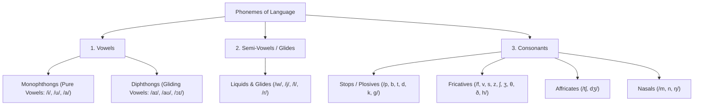
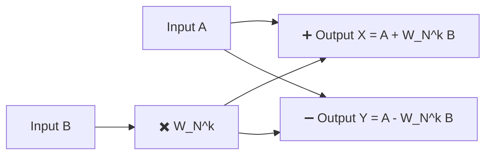
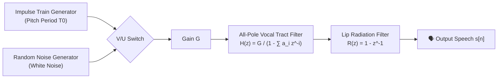
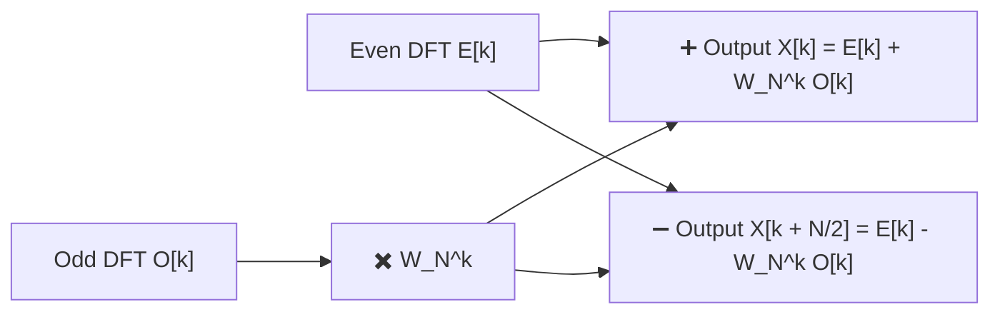
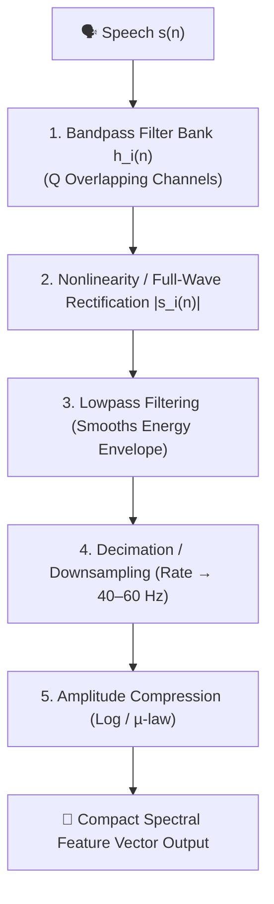
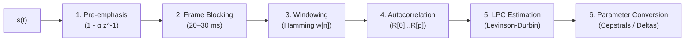

# Module 1: Speech Processing Concepts — Official Master Question Bank Solutions
> **Course**: Speech and Video Processing (CS30033)  
> **Source Material**: Official Module-1 Question Bank by Dr. Kunal Anand (SCE, KIIT DU)  
> **Grading Format**: Standard University 5-Mark Examination Solutions with Explicit Marks Breakdown, Diagrams, and Step-by-Step Numericals.

---

# Table of Contents
1. [Part I: Short Answer Questions (SAQ 1 – SAQ 80) — 5 Marks Each](#part-i-short-answer-questions-saq-1--saq-80)
2. [Part II: Long Answer Questions & Solved Problems (LAQ 1 – LAQ 45) — 5 Marks Each](#part-ii-long-answer-questions--solved-problems-laq-1--laq-45)

---

# Part I: Short Answer Questions (SAQ 1 – SAQ 80)

### SAQ 1: Define speech processing. Write the necessity of speech processing in modern world applications. (5 Marks)

#### Answer:
**1. Definition of Speech Processing (2 Marks)**
Speech processing is a specialized branch of digital signal processing (DSP) and computational linguistics focused on the digital acquisition, analysis, synthesis, transformation, enhancement, and recognition of human speech acoustic signals. It models the human speech production mechanism and auditory perception systems to enable computers to interact with humans using voice.

**2. Necessity in Modern World Applications (3 Marks)**
- **Voice-Driven Human-Computer Interfaces (HCI)**: Voice is the fastest, most natural hands-free communication modality for operating smart devices, virtual assistants (Siri, Alexa, Google Assistant), and in-vehicle infotainment systems.
- **Data Compression in Telecommunications**: Bandwidth-efficient speech codecs (e.g., AMR, CELP, EVS in 4G/5G VoLTE) compress voice from $64\text{ kbps}$ down to $2.4–12.2\text{ kbps}$ without sacrificing intelligibility.
- **Assistive Technologies & Healthcare**: Powers real-time screen readers for the visually impaired, advanced digital hearing aids, artificial electronic larynxes, and diagnostic tools for speech/vocal pathology.
- **Biometric Security & Forensic Verification**: Voiceprints provide non-invasive authentication for banking and secure access systems.

---

### SAQ 2: Distinguish between speech transmission and speech processing. (5 Marks)

#### Answer:

| Comparison Parameter | Speech Transmission | Speech Processing | Marks |
| :--- | :--- | :--- | :---: |
| **Primary Objective** | Transporting speech waveforms across a physical medium (copper, fiber, RF) from sender to receiver with minimal channel distortion. | Extracting information, modifying, analyzing, synthesizing, or classifying speech sounds. | **1.5 Marks** |
| **Information Extraction** | None (treats the audio signal purely as a raw analog/digital data stream). | High (extracts acoustic parameters like pitch, formants, phonemes, and speaker identity). | **1 Mark** |
| **Core Operations** | Modulation/demodulation, channel equalization, multiplexing, packetization, and channel error control. | Linear prediction (LPC), spectral estimation, Mel-filter bank analysis (MFCCs), acoustic pattern matching. | **1.5 Marks** |
| **End User / Output** | A human listener receiving the acoustic signal at the destination terminal. | An intelligent computer system (for ASR/biometrics) or modified synthetic speech. | **1 Mark** |

---

### SAQ 3: List out some application areas of digital speech processing. (5 Marks)

#### Answer:
**1. Five Major Application Domains (5 Marks, 1 Mark each):**
1. **Automatic Speech Recognition (ASR)**: Converts spoken acoustic utterances into text (e.g., dictation, automated transcription, voice search, interactive voice response (IVR) call routing).
2. **Speech Synthesis / Text-to-Speech (TTS)**: Converts written text into natural-sounding speech (e.g., GPS navigation, assistive screen readers for the blind, virtual avatars).
3. **Speaker Identification & Biometric Verification**: Determines or verifies a speaker\'s identity from voice characteristics for high-security banking and forensics.
4. **Speech Enhancement & Noise Reduction**: Eliminates background environmental noise, room reverberation, and acoustic echoes in mobile telephony, conference rooms, and hearing aids.
5. **Low-Bitrate Speech Coding & Compression**: Encodes speech at ultra-low bitrates ($2.4–13\text{ kbps}$) for cellular networks (GSM/VoLTE/5G), military radio communication, and satellite telephony.

---

### SAQ 4: Identify the elements of speech communication. (5 Marks)

#### Answer:
**1. Three Primary Levels of Speech Communication (3 Marks)**
Speech communication is modeled as a continuous chain connecting a speaker to a listener across three distinct physical domains:
1. **Linguistic / Articulatory Level (Speaker\'s Brain & Vocal Tract)**: Message formulation into linguistic words $\to$ motor nerve impulses driving physical articulatory movements.
2. **Acoustic Level (Transmission Medium)**: Pressure waves traveling through the air as continuous longitudinal compression and rarefaction waves.
3. **Auditory / Perceptual Level (Listener\'s Ear & Brain)**: Outer ear captures sound $\to$ eardrum and cochlea perform spectral frequency decomposition $	o$ auditory nerve transmits neural impulses to the brain for message comprehension.

**2. Acoustic Significance (2 Marks)**
At each interface, speech undergoes physical conversion: neural electrical energy $\to$ mechanical muscle energy $\to$ acoustic wave energy $\to$ mechanical middle-ear vibrations $\to$ cochlear fluid waves $\to$ electrical neural spikes.

---

### SAQ 5: Write the importance of velum in speech production system. (5 Marks)

#### Answer:
**1. Anatomical Role & Valve Function (2 Marks)**  
The **velum (soft palate)** is a muscular, flexible flap located at the back of the roof of the mouth that acts as an acoustic valve controlling the acoustic coupling between the pharynx, oral cavity, and nasal cavity.

**2. Acoustic Control Mechanisms (2 Marks)**
- **Oral Sounds (Vowels, Stops, Fricatives)**: The velum is **raised** firmly against the posterior pharyngeal wall (**velopharyngeal closure**), sealing off the nasal cavity. Acoustic energy and airflow escape exclusively through the oral cavity.
- **Nasal Sounds (/m/, /n/, /ŋ/)**: The velum is **lowered**, creating an open port that allows acoustic airflow to enter the nasal cavity while an oral closure is formed (at lips for /m/, alveolar ridge for /n/, velum for /ŋ/).

**3. Spectral Impact on Speech Signals (1 Mark)**
Lowering the velum introduces a large side-branch acoustic resonator (nasal tract), which adds **spectral anti-resonances (zeros)** that cancel certain frequencies, along with broader formant bandwidths due to high mucosal tissue damping.

---

### SAQ 6: Identify different types of excitation source. (5 Marks)

#### Answer:
**1. Three Fundamental Excitation Types (3 Marks)**
The human vocal tract is excited by three distinct acoustic sources:
1. **Voiced Excitation (Quasi-Periodic)**: Generated by periodic vibration of the vocal folds in the larynx under subglottal lung pressure (e.g., in vowels `/a/`, `/i/`, `/u/`, nasals `/m/`, `/n/`).
2. **Unvoiced / Fricative Excitation (Continuous Turbulent Noise)**: Generated by forcing air at high velocity through a narrow vocal tract constriction without vocal fold vibration (e.g., fricatives `/s/`, `/f/`, `/ʃ/`, `/θ/`).
3. **Transient / Plosive Excitation (Impulsive Burst)**: Generated by abruptly releasing built-up pressure behind a complete vocal tract closure (e.g., stop releases in `/p/`, `/t/`, `/k/`).

**2. Mathematical & Spectral Characterization (2 Marks)**
- *Voiced Source*: Modeled as a periodic impulse train with fundamental period $T_0$, possessing discrete harmonic lines with a $-12\text{ dB/octave}$ glottal spectral decay.
- *Unvoiced Source*: Modeled as a continuous, flat-spectrum zero-mean Gaussian white noise random process.

---

### SAQ 7: Define phoneme. Identify different types of phonemes. (5 Marks)

#### Answer:
**1. Definition of Phoneme (2 Marks)**
A **phoneme** is the smallest abstract linguistic sound unit in a language that can distinguish one word from another (e.g., replacing `/p/` with `/b/` changes *"pat"* to *"bat"*). Phonemes are language-specific abstract categories manifested as acoustic phones.

**2. Detailed Phoneme Classification Hierarchy (3 Marks)**

---

### SAQ 8: Define vowels. Write down different types of vowels. (5 Marks)

#### Answer:
**1. Definition of Vowels (1.5 Marks)**
Vowels are sustained voiced speech sounds produced with an open, unrestricted vocal tract where airflow escapes freely from the glottis through the lips without creating audible turbulent friction.

**2. Classification by Tongue Position & Examples (3.5 Marks)**

| Vowel Category | Tongue Position Profile | Formant Characteristics | Standard Examples |
| :--- | :--- | :--- | :--- |
| **Front Vowels** | Tongue body pushed forward in the oral cavity | Low $F_1$ ($250–500\text{ Hz}$), High $F_2$ ($1800–2500\text{ Hz}$) | `/i/` (beet), `/ɪ/` (bit), `/e/` (bait), `/ɛ/` (bet), `/æ/` (bat) |
| **Central Vowels** | Tongue placed in neutral resting posture | Intermediate $F_1$ ($500–700\text{ Hz}$), Moderate $F_2$ ($1200–1600\text{ Hz}$) | `/ə/` (about - schwa), `/ʌ/` (but), `/ɜ/` (bird) |
| **Back Vowels** | Tongue body retracted toward the pharyngeal wall | High/Moderate $F_1$, Low $F_2$ ($800–1200\text{ Hz}$) | `/u/` (boot), `/ʊ/` (book), `/o/` (boat), `/ɔ/` (bought), `/ɑ/` (father) |

---

### SAQ 9: Write the significance of F1 and F2 formant positions for vowels. (5 Marks)

#### Answer:
**1. Acoustic Formant Definitions (1.5 Marks)**
Formants ($F_1, F_2, F_3$) are the resonant acoustic frequencies of the vocal tract filter that produce high-energy peaks in the speech spectrum.

**2. Formant-to-Articulatory Mapping Rules (2.5 Marks)**
- **$F_1$ (First Formant) $\leftrightarrow$ Tongue Height / Jaw Openness**:
  - Inversely related to vertical tongue height:
    - High/Closed Vowels (`/i/`, `/u/`): Low $F_1$ ($250–350\text{ Hz}$).
    - Low/Open Vowels (`/a/`, `/æ/`): High $F_1$ ($700–900\text{ Hz}$).
- **$F_2$ (Second Formant) $\leftrightarrow$ Tongue Frontness / Advancement**:
  - Directly related to forward horizontal position of the tongue hump:
    - Front Vowels (`/i/`, `/e/`): High $F_2$ ($2000–2500\text{ Hz}$).
    - Back Vowels (`/u/`, `/o/`): Low $F_2$ ($800–1200\text{ Hz}$).

**3. Vowel Quadrilateral Significance (1 Mark)**
Plotting $F_1$ vs. $F_2$ creates the universal acoustic vowel space chart that uniquely and unambiguously identifies all human vowel sounds.

---

### SAQ 10: Define F1-F2 Centroid. What purpose it serves in the acoustic representation of speech sounds. (5 Marks)

#### Answer:
**1. Mathematical Definition of $F_1$-$F_2$ Centroid (2 Marks)**
The $F_1$-$F_2$ Centroid is the statistical center of gravity (mean coordinate pair $(\bar{F}_1, \bar{F}_2)$) computed across $N$ measured formant tokens of a specific vowel produced by a speaker or population:

$$\bar{F}_1 = \frac{1}{N} \sum_{i=1}^{N} F_{1,i}, \quad \bar{F}_2 = \frac{1}{N} \sum_{i=1}^{N} F_{2,i}$$

**2. Purpose & Practical Significance (3 Marks)**
- **Speaker Normalization**: Mitigates intra-speaker variability and anatomical vocal tract length differences (e.g., male vs. female vs. child formant scaling).
- **Vowel Space Area (VSA) Metric**: Connecting the centroids of corner vowels (`/i/`, `/u/`, `/ɑ/`, `/æ/`) quantifies a speaker\'s articulatory working space for clinical speech pathology diagnosis.
- **Reference Acoustic Prototype**: Serves as a cluster anchor in pattern recognition algorithms (k-means, GMMs) for automatic vowel recognition.

---

### SAQ 11: Define F1-F2 Cluster. What purpose it serves in the acoustic representation of speech sound. (5 Marks)

#### Answer:
**1. Definition of $F_1$-$F_2$ Cluster (2 Marks)**
An $F_1$-$F_2$ Cluster is the two-dimensional spatial dispersion / scatter distribution of $(F_1, F_2)$ formant frequency pairs measured across repeated utterances of a given vowel category under varying phonetic contexts, speaking rates, and pitch values.

**2. Purpose & Practical Significance (3 Marks)**
- **Quantifying Coarticulation & Phonetic Context**: Reveals how preceding and following consonants shift vowel formant values away from their ideal targets.
- **Measuring Category Separation & Overlap**: Visualizes the acoustic boundaries and overlap zones between neighboring vowels (e.g., `/ɪ/` vs. `/e/`), providing statistical variance metrics (covariance matrix $\mathbf{\Sigma}$).
- **Classifier Boundary Training**: Used by machine learning classifiers (SVMs, GMM-HMMs) to establish decision boundaries for phoneme classification.

---

### SAQ 12: Define diphthongs. How semivowels are different from diphthongs. (5 Marks)

#### Answer:
**1. Definition of Diphthongs (2 Marks)**
A diphthong is a complex vocalic sound produced by initiating the vocal tract in the articulatory configuration of one vowel and smoothly gliding toward a second vowel target within a single continuous syllable (e.g., `/aɪ/` in *"buy"*, `/aʊ/` in *"cow"*, `/ɔɪ/` in *"boy"*).

**2. Diphthongs vs. Semi-Vowels Detailed Comparison (3 Marks)**

| Parameter | Diphthongs | Semi-Vowels (Glides: /w/, /j/, /l/, /r/) |
| :--- | :--- | :--- |
| **Syllabic Function** | Functions as the **syllabic nucleus** (core vowel of the syllable). | Functions as **consonantal margins** (onset or coda), cannot form a nucleus. |
| **Transition Duration** | Slow transition rate ($150–250\text{ ms}$), steady-state vowel regions present. | Fast, dynamic transition rate ($40–100\text{ ms}$), no steady-state target. |
| **Acoustic Power** | High acoustic intensity comparable to pure vowels. | Lower acoustic energy due to partial articulatory constriction. |
| **Articulatory Nature** | Dual-target vowel gesture ($V_1 \to V_2$). | Constriction released immediately into the following vowel. |

---

### SAQ 13: Define consonants. List out different types of consonants. (5 Marks)

#### Answer:
**1. Definition of Consonants (1.5 Marks)**
Consonants are speech sounds produced by completely obstructing, constricting, or diverting the airflow through the vocal tract, resulting in turbulent friction, transient pressure bursts, or altered cavity resonances.

**2. Five Major Consonant Classes with Examples (3.5 Marks)**
1. **Stops / Plosives (1 Mark)**: Complete vocal tract closure $\to$ pressure accumulation $\to$ sudden explosive burst:
   - Voiceless: `/p/` (pat), `/t/` (top), `/k/` (cat)
   - Voiced: `/b/` (bat), `/d/` (dog), `/g/` (go)
2. **Fricatives (1 Mark)**: Continuous turbulent friction noise forced through a narrow constriction:
   - Voiceless: `/f/`, `/θ/`, `/s/`, `/ʃ/`, `/h/`
   - Voiced: `/v/`, `/ð/`, `/z/`, `/ʒ/`
3. **Affricates (0.5 Mark)**: A stop closure released immediately into a fricative constriction:
   - `/tʃ/` (church), `/dʒ/` (judge)
4. **Nasals (0.5 Mark)**: Oral closure with velum lowered, routing sound through the nasal cavity:
   - `/m/` (mom), `/n/` (no), `/ŋ/` (sing)
5. **Approximants / Liquids / Glides (0.5 Mark)**: Wide constriction without turbulent friction:
   - `/w/` (wet), `/j/` (yes), `/l/` (light), `/r/` (red)

---

### SAQ 14: How is the syllable different from phoneme? (5 Marks)

#### Answer:

| Comparison Attribute | Phoneme | Syllable | Marks |
| :--- | :--- | :--- | :---: |
| **Linguistic Level** | Minimal abstract acoustic sound unit. | Higher-level unit of spoken rhythmic organization. | **1.5 Marks** |
| **Internal Structure** | Atomic (indivisible unit: `/s/`, `/p/`, `/i/`). | Composite: Consists of **Onset** (initial consonants) + **Rhyme** (**Nucleus** vowel + **Coda** final consonants). | **1.5 Marks** |
| **Pronunciation Unit** | Cannot be pronounced in isolation without forming a syllable. | Corresponds to a single respiratory chest pulse of air. | **1 Mark** |
| **Example Illustration** | Word *"Computer"* contains **8 phonemes**: `/k/`, `/ə/`, `/m/`, `/p/`, `/j/`, `/uː/`, `/t/`, `/ər/`. | Word *"Computer"* contains **3 syllables**: `com-pu-ter`. | **1 Mark** |

---

### SAQ 15: Identify the number of syllables in the word “spectrum”. (5 Marks)

#### Answer:
**1. Syllable Count (2 Marks)**  
The word **"spectrum"** contains exactly **2 syllables**.

**2. Phonetic & Structural Breakdown (3 Marks)**
- International Phonetic Alphabet (IPA) Transcription: `/ˈspɛk.trəm/`
- **Syllable 1: `spec` (`/spɛk/`)**:
  - *Onset*: `/sp/` (consonant cluster)
  - *Nucleus*: `/ɛ/` (short front vowel)
  - *Coda*: `/k/` (voiceless velar stop)
- **Syllable 2: `trum` (`/trəm/`)**:
  - *Onset*: `/tr/` (consonant cluster)
  - *Nucleus*: `/ə/` (central vowel - schwa)
  - *Coda*: `/m/` (bilabial nasal)

---

### SAQ 16: Define amplitude, frequency, and phase for a sinusoidal signal. (5 Marks)

#### Answer:
**1. Sinusoidal Mathematical Equation (1 Mark)**
$$x(t) = A \sin(2\pi f t + \phi) = A \sin(\omega t + \phi)$$

**2. Parameter Definitions & Speech Roles (4 Marks)**
- **Amplitude ($A$) (1.5 Marks)**: The peak maximum displacement or excursion of the acoustic pressure wave from its baseline. In speech, amplitude dictates signal power and perceived **loudness**.
- **Frequency ($f$) (1.5 Marks)**: The number of complete repeating sinusoidal cycles executed per second, measured in Hertz ($\text{Hz}$) where $\omega = 2\pi f\text{ rad/s}$. In speech, fundamental frequency $F_0$ determines perceived **pitch**.
- **Phase ($\phi$) (1 Mark)**: The initial fractional angle offset of the waveform relative to time origin $t=0$, measured in radians or degrees. It determines waveform time alignment and constructive/destructive interference.

---

### SAQ 17: Differentiate between continuous time and discrete time signal. (5 Marks)

#### Answer:

| Comparison Attribute | Continuous-Time Signal $x(t)$ | Discrete-Time Signal $x[n]$ | Marks |
| :--- | :--- | :--- | :---: |
| **Time Variable** | Continuous real variable $t \in (-\infty, +\infty)$. | Integer sample index $n \in \mathbb{Z} = \{... -2, -1, 0, 1, 2 ...\}$. | **1.5 Marks** |
| **Domain Definition** | Defined for every continuous instant of time. | Defined exclusively at uniform discrete sampling points $t = nT_s$. | **1.5 Marks** |
| **Sinusoidal Formula** | $x(t) = A \cos(\Omega t + \phi)$, $\Omega = 2\pi f\text{ (rad/s)}$. | $x[n] = A \cos(\omega n + \phi)$, $\omega = \Omega T_s\text{ (rad/sample)}$. | **1 Mark** |
| **Speech Example** | Analog continuous air pressure wave in room. | Sampled audio stored in memory at $16\text{ kHz}$. | **1 Mark** |

---

### SAQ 18: Differentiate between continuous-valued and discrete-valued signal. (5 Marks)

#### Answer:

| Comparison Attribute | Continuous-Valued Signal | Discrete-Valued Signal | Marks |
| :--- | :--- | :--- | :---: |
| **Amplitude Dynamic Range** | Can take on any real value on an unbroken continuous scale (infinite possible amplitudes). | Restricted to a finite set of $L = 2^N$ allowed quantization levels. | **2 Marks** |
| **Quantization Status** | Unquantized (analog amplitude precision). | Quantized (rounded to nearest discrete voltage level). | **1.5 Marks** |
| **Digital Representation** | Cannot be stored directly in digital computer memory. | Encoded as finite $N$-bit binary numbers. | **1.5 Marks** |

---

### SAQ 19: “A speech signal considered as non-stationary and quasi-periodic in nature.” Write the significance of the above statement. (5 Marks)

#### Answer:
**1. Significance of Non-Stationary Nature (2.5 Marks)**
- **Physical Cause**: The human vocal tract dynamically modifies its physical shape as articulators move to produce different phonemes.
- **Signal Consequence**: Statistical properties (mean, variance, auto-covariance, spectral energy distribution) vary with time.
- **DSP Implication**: Global Fourier transforms cannot be applied; speech must be processed in **short-time quasi-stationary frames ($20–30\text{ ms}$)** where vocal tract geometry remains approximately constant.

**2. Significance of Quasi-Periodic Nature (2.5 Marks)**
- **Physical Cause**: Voiced speech is produced by periodic vocal fold vibrations in the larynx.
- **Signal Consequence**: Successive pitch periods ($T_0$) are nearly identical but exhibit slight natural cycle-to-cycle variations in period (*jitter*) and amplitude (*shimmer*).
- **DSP Implication**: Enables fundamental frequency ($F_0$ / pitch) tracking and comb-filter harmonic separation.

---

### SAQ 20: Define digitization. Write the purpose of analog-to-digital converter in digitization. (5 Marks)

#### Answer:
**1. Definition of Digitization (2 Marks)**
Digitization is the complete end-to-end transformation of a continuous-time, continuous-amplitude analog physical signal (acoustic speech) into a discrete-time, discrete-amplitude binary data stream suitable for digital computation.

**2. Three Core Stages Executed by ADC (3 Marks)**

- **Sampling**: Converts continuous time $t \to n T_s$, generating sequence $x[n] = x_a(n T_s)$.
- **Quantization**: Maps continuous sample amplitudes to nearest allowed level $x_q[n]$.
- **Encoding**: Converts quantized levels into $N$-bit binary digital words for computer storage.

---

### SAQ 21: Define sampling frequency. How is it related to sampling interval. (5 Marks)

#### Answer:
**1. Definitions (2.5 Marks)**
- **Sampling Frequency ($F_s$)**: The rate at which discrete sample measurements are captured from a continuous-time signal per second, expressed in Hertz ($\text{Hz}$) or samples/second.
- **Sampling Interval ($T_s$)**: The uniform time elapsed between two consecutive discrete sample acquisitions, expressed in seconds ($\text{s}$) or milliseconds ($\text{ms}$).

**2. Mathematical Relationship & Example (2.5 Marks)**
$$T_s = \frac{1}{F_s} \iff F_s = \frac{1}{T_s}$$
- *Standard Speech Example*:
  - Telephony Standard ($F_s = 8000\text{ Hz}$): $T_s = \frac{1}{8000} = 125\,\mu\text{s} = 0.125\text{ ms}$.
  - Wideband Speech ($F_s = 16000\text{ Hz}$): $T_s = \frac{1}{16000} = 62.5\,\mu\text{s} = 0.0625\text{ ms}$.

---

### SAQ 22: For a given signal, if sampling frequency is 16KHz then determine the sampling interval. (5 Marks)

#### Solution:

**1. Given Data (1.5 Marks):**
- Sampling frequency ($F_s$) = $16\text{ kHz} = 16 \times 10^3\text{ Hz} = 16,000\text{ Hz}$

**2. Formula (1.5 Marks):**
$$T_s = \frac{1}{F_s}$$

**3. Step-by-Step Calculation & Units (2 Marks):**
$$T_s = \frac{1}{16,000\text{ s}^{-1}} = 0.0000625\text{ seconds}$$
- Converting to milliseconds:
  $$T_s = 0.0000625 \times 10^3 = \mathbf{0.0625\text{ ms}}$$
- Converting to microseconds:
  $$T_s = 0.0000625 \times 10^6 = \mathbf{62.5\,\mu\text{s}}$$

$$\mathbf{T_s = 62.5\,\mu\text{s} \quad (0.0625\text{ ms})}$$

---

### SAQ 23: Write Nyquist shannon Sampling theorem. (5 Marks)

#### Answer:
**1. Formal Theorem Statement (2.5 Marks)**
> *"A continuous-time, band-limited signal $x_a(t)$ containing frequency components no higher than $f_{max}$ can be uniquely and perfectly reconstructed from its discrete samples $x[n] = x_a(n T_s)$ without distortion if and only if the sampling frequency $F_s$ is at least twice the maximum frequency present in the signal."*

**2. Mathematical Expression & Key Definitions (2.5 Marks)**
$$F_s \ge 2 f_{max}$$

- **Nyquist Rate ($F_{Nyq\_rate} = 2 f_{max}$)**: The exact minimum theoretical sampling rate required to avoid aliasing.
- **Nyquist Frequency ($F_{Nyq\_freq} = F_s / 2$)**: The maximum frequency component that a system with sampling rate $F_s$ can capture without distortion.

---

### SAQ 24: Why sampling rate must not be below twice the highest frequency present in the signal. (5 Marks)

#### Answer:
**1. Frequency-Domain Sampling Mechanism (2.5 Marks)**
Sampling an analog signal $x_a(t)$ in time multiplies it by a periodic impulse train, which corresponds to convolving its continuous spectrum $X_a(f)$ with an impulse train in frequency. This creates infinite spectral replicas centered at integer multiples of $F_s$:

$$X_s(f) = \frac{1}{T_s} \sum_{k=-\infty}^{\infty} X_a(f - k F_s)$$

**2. Consequences of Under-Sampling ($F_s < 2 f_{max}$) (2.5 Marks)**
- Adjacent spectral copies overlap in the frequency band $[F_s - f_{max}, f_{max}]$.
- High frequencies fold over into lower frequencies (**Aliasing**).
- Overlapping spectra cannot be separated by an ideal low-pass reconstruction filter, causing permanent distortion and loss of original acoustic waveform intelligibility.

---

### SAQ 25: How nyquist rate is related to nyquist frequency? (5 Marks)

#### Answer:
**1. Definitions (2.5 Marks)**
- **Nyquist Rate**: A property of the *continuous input signal*. It is the minimum required sampling frequency:
  $$F_{Nyq\_rate} = 2 f_{max}$$
- **Nyquist Frequency**: A property of the *discrete sampling system*. It is the maximum frequency the system can resolve:
  $$F_{Nyq\_freq} = \frac{F_s}{2}$$

**2. Mathematical Relationship & Direct Comparison (2.5 Marks)**
$$F_{Nyq\_rate} = 2 \times F_{Nyq\_freq}$$

| Parameter | Nyquist Rate ($2 f_{max}$) | Nyquist Frequency ($F_s / 2$) |
| :--- | :--- | :--- |
| **Origin** | Derived from signal bandwidth. | Derived from ADC hardware clock rate. |
| **Condition for Perfect Recovery** | System sampling rate must satisfy: $F_s \ge F_{Nyq\_rate}$. | Signal bandwidth must satisfy: $f_{max} \le F_{Nyq\_freq}$. |

---

### SAQ 26: Define aliasing. Write the effect of aliasing in signal processing. (5 Marks)

#### Answer:
**1. Definition of Aliasing (2 Marks)**
Aliasing is an irreversible signal distortion phenomenon occurring when an analog continuous signal is sampled below its Nyquist rate ($F_s < 2 f_{max}$), causing high-frequency components to masquerade as lower baseband frequencies.

**2. Harmful Effects in Speech Signal Processing (3 Marks)**
- **False Ghost Frequencies**: Frequencies above $F_s/2$ (e.g., $f_0 = 5\text{ kHz}$ sampled at $F_s = 8\text{ kHz}$) fold back to $F_s - f_0 = 8 - 5 = 3\text{ kHz}$, corrupting true vocal formants.
- **Harsh Acoustic Distortion**: Introduces metallic, raspy buzzing artifacts in synthesized and reconstructed speech.
- **ASR Feature Degradation**: Corrupts energy in filter bank channels (MFCCs), severely reducing Automatic Speech Recognition accuracy.

---

### SAQ 27: List out the ways to avoid aliasing in signal processing. (5 Marks)

#### Answer:
**1. Two Essential Countermeasures (4 Marks)**
1. **Ensuring Sufficient Sampling Rate ($F_s \ge 2 f_{max}$)**:
   - Select an ADC sampling clock frequency greater than or equal to twice the highest anticipated signal frequency (e.g., sample $20\text{ kHz}$ audible audio at $F_s = 44.1\text{ kHz}$).
2. **Employing an Analog Anti-Aliasing Low-Pass Filter**:
   - Place a high-order analog low-pass filter (e.g., Butterworth, Chebyshev, or Elliptic) in the signal path *before* the sampler.
   - Set the filter cutoff frequency $f_c \le \frac{F_s}{2}$ to heavily attenuate all frequencies above the Nyquist limit before sampling occurs.

**2. System Block Diagram (1 Mark)**

---

### SAQ 28: Define quantization. Why is it a significant step in signal processing. (5 Marks)

#### Answer:
**1. Definition of Quantization (2 Marks)**
Quantization is the non-linear process of mapping a continuous-amplitude discrete-time sample value $x[n]$ into a discrete amplitude level $x_q[n]$ selected from a finite codebook of $L = 2^N$ allowed reconstruction levels.

**2. Significance in Digital Signal Processing (3 Marks)**
- **Enables Binary Storage & Processing**: Converts infinite-precision real numbers into finite $N$-bit binary words, allowing speech to be stored in computer memory and processed by microprocessors.
- **Controls Transmission Bitrate**: Dictates digital communication bandwidth (Bitrate $= F_s \times N\text{ bps}$).
- **Balances Fidelity vs. Resource Usage**: Choosing appropriate bit resolution ($N$) allows trading off audio quality against storage/transmission cost.

---

### SAQ 29: Define quantization step size. (5 Marks)

#### Answer:
**1. Formal Definition (2 Marks)**
Quantization step size (denoted as $\Delta$) is the constant voltage or amplitude interval between two successive discrete quantization levels in a uniform quantizer.

**2. Mathematical Formulation (2 Marks)**
$$\Delta = \frac{V_{max} - V_{min}}{L} = \frac{V_{max} - V_{min}}{2^N}$$

where:
- $V_{max} - V_{min} = \text{Full-scale dynamic voltage range of the input signal}$.
- $L = 2^N = \text{Total number of discrete quantization levels}$.
- $N = \text{Number of bits allocated per sample (ADC resolution)}$.

**3. Practical Impact (1 Mark)**
A smaller $\Delta$ provides finer amplitude resolution, reducing quantization error and improving the Signal-to-Quantization-Noise Ratio (SQNR).

---

### SAQ 30: A speech signal is uniformly quantized using 6 bits per sample over a range of ±3 V. Find the quantization step size (Δ). (5 Marks)

#### Solution:

**1. Given Data (1.5 Marks):**
- Number of bits per sample ($N$) = $6\text{ bits}$
- Total quantization levels ($L$) = $2^N = 2^6 = 64\text{ levels}$
- Minimum voltage ($V_{min}$) = $-3\text{ V}$
- Maximum voltage ($V_{max}$) = $+3\text{ V}$
- Full-scale voltage range ($\Delta V$) = $V_{max} - V_{min} = 3 - (-3) = 6\text{ V}$

**2. Formula (1.5 Marks):**
$$\Delta = \frac{V_{max} - V_{min}}{2^N} = \frac{\Delta V}{L}$$

**3. Step-by-Step Calculation (2 Marks):**
$$\Delta = \frac{6\text{ V}}{64} = \frac{3}{32}\text{ V} = 0.09375\text{ V}$$
- Expressing in millivolts:
  $$\Delta = 0.09375 \times 1000 = \mathbf{93.75\text{ mV}}$$

$$\mathbf{\Delta = 0.09375\text{ V} \quad (93.75\text{ mV})}$$

---

### SAQ 31: Define quantization error. How quantization step size affects mean squared quantization error. (5 Marks)

#### Answer:
**1. Definition of Quantization Error (1.5 Marks)**
Quantization error $e[n]$ (or quantization noise) is the difference between the unquantized continuous sample amplitude $x[n]$ and its quantized discrete representation $x_q[n]$:

$$e[n] = x[n] - x_q[n]$$

For a uniform rounding quantizer, the error is bounded by: $-\frac{\Delta}{2} \le e[n] \le +\frac{\Delta}{2}$.

**2. Mean Squared Error (Noise Power) Derivation (2.5 Marks)**
Assuming $e[n]$ is uniformly distributed over $[-\Delta/2, +\Delta/2]$ with probability density function $p(e) = 1/\Delta$:

$$\sigma_e^2 = \mathbb{E}[e^2] = \int_{-\Delta/2}^{+\Delta/2} e^2 \cdot \frac{1}{\Delta} \, de = \frac{1}{\Delta} \left[ \frac{e^3}{3} \right]_{-\Delta/2}^{+\Delta/2} = \frac{1}{\Delta} \left( \frac{\Delta^3}{24} - \left(-\frac{\Delta^3}{24}\right) \right) = \mathbf{\frac{\Delta^2}{12}}$$

**3. Step Size Impact (1 Mark)**
Quantization noise power $\sigma_e^2$ is **directly proportional to the square of step size $\Delta^2$**. Halving $\Delta$ (by adding 1 bit) drops noise power by $75\%$ (factor of 4), boosting SQNR by $6.02\text{ dB}$.

---

### SAQ 32: Discuss the time-domain representation of a speech signal. (5 Marks)

#### Answer:
**1. Conceptual Definition & Plot Axes (2.5 Marks)**
A time-domain representation plots instantaneous acoustic speech amplitude on the vertical Y-axis against continuous or discrete time on the horizontal X-axis.
- **X-axis (Time)**: Measured in seconds ($\text{s}$) or milliseconds ($\text{ms}$); indicates event duration and temporal sequencing.
- **Y-axis (Amplitude)**: Measured in sound pressure ($\text{Pa}$), analog voltage ($\text{V}$), or normalized digital range ($[-1, +1]$); reflects instantaneous acoustic strength.

*Figure SAQ 32.1: Time-Domain Waveform of Spoken Utterance "Sunday"*

**2. Waveform Structure & Characteristics (2.5 Marks)**
- **Silence**: Near-zero flat baseline showing ambient background noise.
- **Voiced Speech**: High-energy, quasi-periodic sinusoidal waveforms produced by vocal cord vibrations.
- **Unvoiced Speech**: Low-energy, aperiodic, noise-like random oscillations produced by turbulent airflow.

---

### SAQ 33: What information can be gathered from the time-domain representation of a speech signal? (5 Marks)

#### Answer:
**1. Five Key Acoustic Parameters Gathered (5 Marks, 1 Mark each):**
1. **Speech Event Timing & Duration**: Directly measures total utterance length, syllable durations, and word onsets/offsets.
2. **Silence & Voice Activity Detection (VAD)**: Clearly separates high-energy active speech regions from low-energy background pauses and silence intervals.
3. **Fundamental Pitch Period ($T_0$)**: Measures the time elapsed between repeating peak cycles in voiced vowel segments, allowing fundamental frequency calculation ($F_0 = 1/T_0$).
4. **Short-Time Energy & Loudness Variations**: Traces the temporal signal envelope, reflecting dynamic syllable stress and speech intensity.
5. **Voiced vs. Unvoiced Phonetic Discrimination**: Distinguishes smooth periodic oscillations (voiced vowels) from erratic high-frequency noise bursts (unvoiced fricatives).

---

### SAQ 34: Discuss the frequency-domain representation of a speech signal. (5 Marks)

#### Answer:
**1. Definition & Mathematical Basis (2.5 Marks)**
The frequency-domain representation describes how speech energy is distributed across constituent sinusoidal frequencies. Computed via the Fourier Transform (DFT/FFT), it decomposes complex time waveforms into sinusoidal components:

$$X(f) = \int_{-\infty}^{\infty} x(t) e^{-j 2\pi f t} dt$$

- **X-axis (Frequency in Hz)**: Spans from $0\text{ Hz}$ to Nyquist limit $F_s/2$.
- **Y-axis (Magnitude in dB)**: Represents spectral energy strength on a logarithmic scale.

*Figure SAQ 34.1: Frequency-Domain Magnitude Spectrum (0 to 8000 Hz)*

**2. Frequency Band Distribution (2.5 Marks)**
- **$0–1000\text{ Hz}$ (Low Band)**: High energy concentration; contains pitch ($F_0$) and low harmonics.
- **$1000–4000\text{ Hz}$ (Mid Band)**: Contains vocal tract resonant formants ($F_1, F_2, F_3$) for vowel recognition.
- **$4000–8000\text{ Hz}$ (High Band)**: Contains unvoiced fricative and consonant noise energy.

---

### SAQ 35: What information can be gathered from the frequency-domain representation of a speech signal? (5 Marks)

#### Answer:
**1. Five Crucial Acoustic Information Types (5 Marks, 1 Mark each):**
1. **Fundamental Frequency ($F_0$ / Pitch)**: Identified from the frequency of the first spectral harmonic or the uniform harmonic peak spacing ($\Delta f = F_0$).
2. **Vocal Tract Formant Frequencies ($F_1, F_2, F_3$)**: Prominent broad peaks in the spectral envelope reveal vocal tract resonant frequencies essential for vowel identification.
3. **Harmonic Structure & Glottal Source Characteristics**: Displays the individual integer harmonic multiples ($2F_0, 3F_0, 4F_0...$) reflecting vocal fold vibration purity.
4. **Spectral Tilt**: The rate of high-frequency energy rolloff (typically $-12\text{ dB/octave}$ for glottal source), indicating vocal effort.
5. **System Bandwidth & Noise Floor**: Directly shows signal frequency cutoff limits and high-frequency fricative noise concentration.

---

### SAQ 36: Write the significance of spectrogram in speech processing. (5 Marks)

#### Answer:
**1. Definition & 3D Representation Concept (2 Marks)**
A **spectrogram** is a 2D time-frequency representation that displays signal energy across both time (horizontal axis) and frequency (vertical axis), with energy magnitude encoded as color intensity / dark shading.

*Figure SAQ 36.1: Spectrogram of Speech Utterance "Sunday"*

**2. Core Significance Points in Speech Processing (3 Marks)**
- **Simultaneous Time-Frequency Tracking**: Overcomes the time-only vs. frequency-only limitation, showing *which* frequencies occur at *what* specific time instants.
- **Formant Trajectory Visualization**: Displays dark horizontal resonance bands ($F_1, F_2, F_3$) shifting over time as articulators move.
- **Phonetic Segmentation**: Provides clear visual markers for coarticulation transitions, stop bursts, formant glides, and nasalization.
- **Voiced / Unvoiced Separation**: Visually contrasts vertical striations (glottal pulses) against broad high-frequency noise patches.

---

### SAQ 37: List out the application areas where spectrogram can be useful. (5 Marks)

#### Answer:
**1. Five Major Application Domains (5 Marks, 1 Mark each):**
1. **Automatic Speech Recognition (ASR)**: Serves as the visual input representation for modern Deep Learning acoustic models (Spectrogram-to-Text CNNs and Conformer networks).
2. **Phonetic Segmentation & Speech Corpus Labeling**: Used by linguists to accurately mark phoneme, syllable, and word boundary timestamps.
3. **Speaker Identification & Forensic Acoustics**: Analyzes distinctive vocal tract formant patterns and idiosyncratic habits for voice biometrics.
4. **Clinical Speech Pathology & Voice Therapy**: Diagnoses vocal fold disorders (e.g., nodules, breathiness, hoarseness) by inspecting harmonic clarity and noise bands.
5. **Audio De-noising & Audio Restoration**: Visualizes localized acoustic noise, background hums, and clicks for spectral subtraction and filtering.

---

### SAQ 38: Define linear time invariant system along with its mathematical representation. (5 Marks)

#### Answer:
**1. Definition of Discrete-Time LTI System (2 Marks)**
A Linear Time-Invariant (LTI) system is a mathematical transformation $y[n] = T\{x[n]\}$ mapping input sequence $x[n]$ to output sequence $y[n]$ that simultaneously satisfies **Linearity** (Principle of Superposition) and **Time-Invariance**.

**2. Mathematical Representations (3 Marks)**
- **System Operator Form**:
  $$y[n] = T\{x[n]\}$$
- **Convolution Sum Form**:
  An LTI system is completely characterized by its unit impulse response $h[n] = T\{\delta[n]\}$. For any arbitrary input $x[n]$:
  $$y[n] = x[n] * h[n] = \sum_{k=-\infty}^{\infty} x[k] \, h[n - k]$$
- **Transfer Function Form ($Z$-Domain)**:
  $$Y(z) = X(z) \cdot H(z) \implies H(z) = \frac{Y(z)}{X(z)}$$

---

### SAQ 39: Explain the major properties that are necessary for a discrete-time system to be LTI system. (5 Marks)

#### Answer:
**1. Two Mandatory Properties (4 Marks, 2 Marks each):**
1. **Linearity (Superposition Principle)**:
   - Must satisfy both **Additivity** and **Homogeneity (Scalability)**:
     - Additivity: $T\{x_1[n] + x_2[n]\} = T\{x_1[n]\} + T\{x_2[n]\}$
     - Scalability: $T\{a \cdot x[n]\} = a \cdot T\{x[n]\}$
   - Combined Superposition Condition:
     $$T\{a x_1[n] + b x_2[n]\} = a T\{x_1[n]\} + b T\{x_2[n]\} = a y_1[n] + b y_2[n]$$
2. **Time-Invariance**:
   - The system characteristics do not change over time. Delaying the input sequence by $k$ samples causes an identical delay of $k$ samples in the output:
     $$\text{If } x[n] \xrightarrow{T} y[n], \quad \text{then } x[n - k] \xrightarrow{T} y[n - k]$$

**2. Significance in Speech Processing (1 Mark)**
Approximating the human vocal tract as a short-time LTI filter allows representing speech production through digital filtering and convolution.

---

### SAQ 40: Write the principle of superposition with reference to an LTI system. (5 Marks)

#### Answer:
**1. Statement of Principle of Superposition (1.5 Marks)**
The **Principle of Superposition** states that for an LTI system, the response to an arbitrary weighted linear combination of multiple input signals is identically equal to the same weighted linear combination of the individual system responses.

**2. Mathematical Formulation & Two Core Conditions (2 Marks)**
Let $x_1[n] \xrightarrow{T} y_1[n]$ and $x_2[n] \xrightarrow{T} y_2[n]$ be input-output pairs. For arbitrary scalar constants $a$ and $b$:
1. **Homogeneity / Scalability**: $T\{a \cdot x_1[n]\} = a \cdot y_1[n]$
2. **Additivity**: $T\{x_1[n] + x_2[n]\} = y_1[n] + y_2[n]$
- **Superposition Equation**:
  $$\mathbf{T\{a \cdot x_1[n] + b \cdot x_2[n]\} = a \cdot y_1[n] + b \cdot y_2[n]}$$

**3. Verification Illustration (1 Mark)**
For example, if input $x_1[n]$ produces output $y_1[n] = \{1, 2\}$ and $x_2[n]$ produces $y_2[n] = \{3, 1\}$, then combined input $3x_1[n] + 2x_2[n]$ produces:
$$y_{combined}[n] = 3\{1, 2\} + 2\{3, 1\} = \{3, 6\} + \{6, 2\} = \{9, 8\}$$

**4. Significance in Speech Processing (0.5 Mark)**
Superposition guarantees that complex speech can be decomposed into unit impulses, enabling convolution-based vocal tract modeling.

---

### SAQ 41: Define convolution. What role does impulse response play in convolution? (5 Marks)

#### Answer:
**1. Definition of Discrete-Time Convolution (2 Marks)**
Convolution is a fundamental mathematical operation that combines an input signal sequence $x[n]$ with an LTI system\'s impulse response $h[n]$ to determine the system\'s output sequence $y[n]$:

$$y[n] = x[n] * h[n] = \sum_{k=-\infty}^{\infty} x[k] \, h[n - k]$$

**2. Role of the Impulse Response $h[n]$ (3 Marks)**
- **Complete System Characterization**: The impulse response $h[n] = T\{\delta[n]\}$ encapsulates all dynamic filtering, resonance, and delay properties of the LTI system.
- **Universal Output Prediction**: Knowing $h[n]$ allows computing the system response $y[n]$ to *any arbitrary input signal* $x[n]$ without needing internal circuit knowledge.
- **Physical Vocal Tract Modeling**: In speech synthesis, $h[n]$ represents the acoustic impulse response of the vocal tract cavity; convolving glottal pulses with $h[n]$ generates synthetic speech.

---

### SAQ 42: List out atleast three properties of convolution. (5 Marks)

#### Answer:
**1. Six Essential Mathematical Properties of Convolution (5 Marks):**
1. **Commutative Property (1 Mark)**:
   $$x[n] * h[n] = h[n] * x[n]$$
   *(The roles of input signal and system impulse response are interchangeable).*
2. **Associative Property (1 Mark)**:
   $$(x[n] * h_1[n]) * h_2[n] = x[n] * (h_1[n] * h_2[n])$$
   *(Cascaded LTI systems can be combined into a single equivalent impulse response $h[n] = h_1[n] * h_2[n]$).*
3. **Distributive Property (1 Mark)**:
   $$x[n] * (h_1[n] + h_2[n]) = (x[n] * h_1[n]) + (x[n] * h_2[n])$$
   *(Parallel LTI systems sum their individual convolution outputs).*
4. **Identity / Impulse Property (1 Mark)**:
   $$x[n] * \delta[n] = x[n]$$
5. **Shift Property (0.5 Mark)**:
   $$x[n - k_1] * h[n - k_2] = y[n - k_1 - k_2]$$
6. **Finite Duration Output Length (0.5 Mark)**:
   $$L_y = L_x + L_h - 1$$

---

### SAQ 43: Briefly describe the finite duration property of convolution. (5 Marks)

#### Answer:
**1. Property Statement & Formula (2 Marks)**
The **Finite Duration Property** states that when a finite-length discrete input sequence $x[n]$ of duration $L_x$ samples is convolved with a finite-duration impulse response $h[n]$ of length $L_h$ samples, the resulting output sequence $y[n]$ is strictly finite with length $L_y$:

$$L_y = L_x + L_h - 1$$

**2. Index Range Boundaries (1.5 Marks)**
If input $x[n]$ starts at index $n_{x,\min}$ and ends at $n_{x,\max}$ (length $L_x = n_{x,\max} - n_{x,\min} + 1$), and $h[n]$ spans $[n_{h,\min}, n_{h,\max}]$, then output $y[n]$ spans:
- Start Index: $n_{y,\min} = n_{x,\min} + n_{h,\min}$
- End Index: $n_{y,\max} = n_{x,\max} + n_{h,\max}$

**3. Concrete Illustrative Example (1.5 Marks)**
Let $x[n] = \{1, 2, 3\}$ ($L_x = 3$, $n=0, 1, 2$) and $h[n] = \{1, -1\}$ ($L_h = 2$, $n=0, 1$):
- Output length $L_y = 3 + 2 - 1 = \mathbf{4\text{ samples}}$ (spans $n = 0, 1, 2, 3$).
- Convolved output: $y[n] = \{1, 1, 1, -3\}$, verifying exact duration of 4 samples.

---

### SAQ 44: Write the shortcomings of time-domain convolution. (5 Marks)

#### Answer:
**1. Four Major Shortcomings in Speech Processing (5 Marks, 1.25 Marks each):**
1. **High Computational Complexity**: Direct convolution requires $O(L_x \cdot L_h)$ operations. For a $1024$-sample speech frame and $512$-sample impulse response, over $500,000$ operations are needed per frame.
2. **Hidden Spectral & Resonance Information**: Time-domain samples $y[n]$ do not directly reveal resonant formant frequencies ($F_1, F_2$), bandwidths, or spectral energy attenuation.
3. **Obscured Filter Stability & Pole-Zero Analysis**: Internal system poles (formants) and zeros (anti-resonances) cannot be directly identified from time-domain convolution sequences.
4. **Poor Intuition for Filter Design**: Shaping specific frequency bands or designing sharp notch filters is difficult in the time domain compared to frequency-domain $H(z)$ transfer function placement.

---

### SAQ 45: Define pole-zero modeling. (5 Marks)

#### Answer:
**1. Definition & System Transfer Function (2.5 Marks)**
Pole-zero modeling is a mathematical parametric technique in digital signal processing that models a linear speech system (vocal tract) as a rational transfer function $H(z)$ in the complex $Z$-domain:

$$H(z) = \frac{Y(z)}{X(z)} = \frac{B(z)}{A(z)} = G \frac{1 + \sum_{k=1}^{M} b_k z^{-k}}{1 - \sum_{k=1}^{N} a_k z^{-k}} = G \frac{z^{N-M} \prod_{k=1}^{M} (z - z_k)}{\prod_{k=1}^{N} (z - p_k)}$$

**2. Core Elements (2.5 Marks)**
- **Poles ($p_k$)**: Roots of denominator $A(z) = 0$; represent resonant frequencies that amplify sound (**vocal tract formants**).
- **Zeros ($z_k$)**: Roots of numerator $B(z) = 0$; represent frequencies where response is suppressed (**anti-resonances**).
- **Gain ($G$)**: Energy scaling factor.

---

### SAQ 46: Why pole-zero modeling is considered as one of the important process in speech processing. (5 Marks)

#### Answer:
**1. Four Key Reasons for Importance (5 Marks, 1.25 Marks each):**
1. **Direct Physical Vocal Tract Mapping**: Formants (vowel resonances) map directly to poles $p_k$, and nasal cavity acoustic antiresonances map directly to zeros $z_k$.
2. **Massive Data Compression**: Instead of transmitting thousands of time-domain samples, a speech frame can be compactly parametrized by just $10–16$ LPC filter coefficients and gain ($2.4\text{ kbps}$ telephony).
3. **Exact System Stability Analysis**: System stability is trivially checked by ensuring all poles lie strictly inside the unit circle ($|p_k| < 1$).
4. **Foundational Framework for LPC & Speech Synthesis**: Forms the underlying mathematical engine for Linear Predictive Coding, vocoders, and formant synthesizers.

---

### SAQ 47: Describe vocal tract in terms of a transfer function in pole zero modeling. (5 Marks)

#### Answer:
**1. Source-Filter Transfer Function Formulation (2.5 Marks)**
In digital speech processing, the vocal tract acoustic cavity is modeled as a linear filter transfer function $H(z)$:

$$H(z) = \frac{S(z)}{U(z)} = G \frac{B(z)}{A(z)} = G \frac{1 + \sum_{k=1}^{M} b_k z^{-k}}{1 - \sum_{k=1}^{N} a_k z^{-k}}$$

where $U(z)$ is the glottal volume velocity excitation and $S(z)$ is the resulting output speech signal.

**2. Physical Acoustic Representation (2.5 Marks)**
- **Denominator $A(z)$ (Poles)**: Models the acoustic standing wave resonances of the oral pharyngeal tube (formants $F_1, F_2, F_3, F_4$).
- **Numerator $B(z)$ (Zeros)**: Models acoustic anti-resonances introduced by side-branch cavities (nasal cavity coupling in `/m/`, `/n/`).
- **All-Pole Simplification**: For non-nasal vowels, $B(z) = 1$, yielding the standard all-pole LPC model $H(z) = \frac{G}{1 - \sum a_k z^{-k}}$.

---

### SAQ 48: What poles and zeros represent in the pole-zero modeling? (5 Marks)

#### Answer:
**1. Physical & Spectral Meaning of Poles (2.5 Marks)**
- **Mathematical Condition**: Values of $z = p_k$ where denominator $A(z) = 0 \implies |H(z)| \to \infty$.
- **Acoustic Representation**: Complex conjugate pole pairs $p_k = r_k e^{\pm j\theta_k}$ model **vocal tract formant resonances ($F_1, F_2, F_3$)**:
  - Angle $\theta_k = 2\pi F_k / F_s$ dictates the resonant formant frequency.
  - Radius $r_k \to 1$ dictates resonance sharpness and bandwidth.

**2. Physical & Spectral Meaning of Zeros (2.5 Marks)**
- **Mathematical Condition**: Values of $z = z_k$ where numerator $B(z) = 0 \implies |H(z)| = 0$.
- **Acoustic Representation**: Models **acoustic anti-resonances (spectral dips/notches)** caused by:
  - Nasal tract acoustic branching (nasal consonants `/m/`, `/n/`, `/ŋ/`).
  - Constrictions in the oral cavity during fricative production.

---

### SAQ 49: What will be the impact on a linear system if the poles are set to zero? (5 Marks)

#### Answer:
**1. Mathematical Result (2 Marks)**
If all non-origin poles are set to zero ($a_k = 0$ for all $k \ge 1$), the denominator becomes $A(z) = 1$. The transfer function reduces to:

$$H(z) = G \left( 1 + \sum_{k=1}^{M} b_k z^{-k} \right) = G \cdot B(z)$$

**2. Physical & System Impacts (3 Marks)**
1. **Conversion to All-Zero (FIR) Filter**: The system becomes a Finite Impulse Response (FIR) filter with a strictly finite impulse response $h[n]$ of length $M+1$.
2. **Loss of Sharp Formant Resonances**: The transfer function cannot generate sharp, high-gain resonant peaks (formants), making it incapable of efficiently modeling vocal tract vowel acoustics.
3. **Unconditional Stability**: With all poles at the origin ($z=0$), the system is unconditionally BIBO stable regardless of coefficient values.

---

### SAQ 50: What will be the impact on a linear system if the zeros are set to zero? (5 Marks)

#### Answer:
**1. Mathematical Result (2 Marks)**
If all non-origin zeros are set to zero ($b_k = 0$ for all $k \ge 1$), the numerator reduces to a constant $B(z) = 1$. The transfer function becomes:

$$H(z) = \frac{G}{1 - \sum_{k=1}^{N} a_k z^{-k}} = \frac{G}{A(z)}$$

**2. Physical & System Impacts (3 Marks)**
1. **Conversion to All-Pole (IIR) Filter**: The system becomes an Infinite Impulse Response (IIR) all-pole filter.
2. **Efficient Formant Resonance Modeling**: Can generate extremely sharp, high-gain resonant formant peaks ($F_1, F_2, F_3$) with very few parameters ($N \approx 10–16$).
3. **Foundational Basis of LPC**: This all-pole model forms the exact foundation of Linear Predictive Coding (LPC) used across telecommunications and speech recognition.
4. **Conditional Stability**: System stability requires all poles to lie strictly inside the unit circle ($|p_k| < 1$).

---

### SAQ 51: What role does Fourier transform play in speech processing? (5 Marks)

#### Answer:
**1. Core Mathematical Role (2 Marks)**
The Fourier Transform acts as a mathematical prism that decomposes complex, non-stationary time-domain speech waveforms into constituent sinusoidal frequency components, converting $s(t) \to S(f)$ or $s[n] \to X[k]$.

**2. Three Primary Speech Processing Roles (3 Marks)**
1. **Spectral Parameter Estimation**: Extracts fundamental pitch ($F_0$), harmonic spacing, and vocal tract formants ($F_1, F_2, F_3$) for speech recognition.
2. **Filter Bank & MFCC Computation**: Powers Short-Time Fourier Transforms (STFT) to generate Mel-scale filter banks and spectrograms.
3. **Frequency-Domain Filtering**: Simplifies expensive time-domain convolution $x[n] * h[n]$ into fast pointwise multiplication $X[k] \cdot H[k]$ via FFT.

---

### SAQ 52: How can a sinusoidal signal be represented in complex exponential? (5 Marks)

#### Answer:
**1. Euler\'s Formula Foundations (2 Marks)**
By Euler\'s identity:
$$e^{j\theta} = \cos\theta + j\sin\theta, \quad e^{-j\theta} = \cos\theta - j\sin\theta$$

**2. Derivation of Cosine and Sine Expansions (2 Marks)**
Adding and subtracting the two Euler equations:
$$\cos(\theta) = \frac{e^{j\theta} + e^{-j\theta}}{2}$$
$$\sin(\theta) = \frac{e^{j\theta} - e^{-j\theta}}{2j} = -\frac{j}{2} \left( e^{j\theta} - e^{-j\theta} \right)$$

**3. General Sinusoidal Representation (1 Mark)**
For a general sinusoidal speech component $x(t) = A \cos(2\pi f_0 t + \phi)$:
$$\mathbf{x(t) = \frac{A}{2} e^{j\phi} e^{j 2\pi f_0 t} + \frac{A}{2} e^{-j\phi} e^{-j 2\pi f_0 t}}$$
representing two counter-rotating complex phasors of magnitude $A/2$ at frequencies $+f_0$ and $-f_0$.

---

### SAQ 53: Write about the importance of dirac delta function in Fourier transform. (5 Marks)

#### Answer:
**1. Definition & Sifting Property of Dirac Delta (2 Marks)**
The Dirac delta function $\delta(t)$ is an idealized unit impulse defined by $\delta(t) = 0$ for $t \neq 0$, $\int_{-\infty}^{\infty} \delta(t) dt = 1$, satisfying the fundamental **sifting property**:

$$\int_{-\infty}^{\infty} x(t) \, \delta(t - t_0) \, dt = x(t_0)$$

**2. Importance in Fourier Transform (3 Marks)**
- **Representing Pure Sinusoids in Continuous Spectra**: The continuous Fourier transform of a complex exponential $e^{j 2\pi f_0 t}$ is an exact delta impulse:
  $$\mathcal{F}\{e^{j 2\pi f_0 t}\} = \delta(f - f_0)$$
- **Enables Representation of Periodic Signals**: Allows periodic speech vowels (which have infinite energy) to have well-defined Fourier transforms consisting of discrete line spectra:
  $$\mathcal{F}\{\cos(2\pi f_0 t)\} = \frac{1}{2} \delta(f - f_0) + \frac{1}{2} \delta(f + f_0)$$
- **Sampling Representation**: Models continuous-to-discrete sampling as multiplication by an ideal Dirac impulse train.

---

### SAQ 54: List out the properties of fourier transform. (5 Marks)

#### Answer:
**1. Five Major Fourier Transform Properties (5 Marks, 1 Mark each):**
1. **Linearity**:
   $$\mathcal{F}\{a x_1(t) + b x_2(t)\} = a X_1(f) + b X_2(f)$$
2. **Time Shifting Property**:
   $$\mathcal{F}\{x(t - t_0)\} = X(f) \, e^{-j 2\pi f t_0}$$
   *(Time delay alters phase linearly without changing magnitude spectrum).*
3. **Frequency Shifting (Modulation) Property**:
   $$\mathcal{F}\{x(t) \, e^{j 2\pi f_0 t}\} = X(f - f_0)$$
4. **Time Scaling Property**:
   $$\mathcal{F}\{x(a t)\} = \frac{1}{|a|} X\left(\frac{f}{a}\right)$$
   *(Time compression causes frequency expansion).*
5. **Convolution Property**:
   $$\mathcal{F}\{x(t) * h(t)\} = X(f) \cdot H(f)$$
   *(Time convolution corresponds to frequency multiplication).*

---

### SAQ 55: Define inverse fourier transform. (5 Marks)

#### Answer:
**1. Mathematical Definition (2.5 Marks)**
The **Inverse Fourier Transform (IFT)** is the mathematical operation that synthesizes and perfectly reconstructs a continuous-time signal $x(t)$ from its continuous frequency-domain spectrum $X(f)$:

$$x(t) = \mathcal{F}^{-1}\{X(f)\} = \int_{-\infty}^{\infty} X(f) \, e^{j 2\pi f t} \, df$$

In terms of angular frequency $\Omega = 2\pi f$:

$$x(t) = \frac{1}{2\pi} \int_{-\infty}^{\infty} X(j\Omega) \, e^{j\Omega t} \, d\Omega$$

**2. Physical Interpretation & Role (2.5 Marks)**
- **Superposition of Sinusoids**: Expresses the complex time-domain waveform as an infinite continuum of weighted complex exponential rotating phasors $e^{j 2\pi f t}$.
- **Reconstruction in Speech Synthesizers**: Used in speech enhancement and vocoding to convert modified magnitude/phase spectra back into audible speech waveforms.

---

### SAQ 56: Explain discrete time fourier transform with its mathematical representation. (5 Marks)

#### Answer:
**1. Definition & Mathematical Formulation (2.5 Marks)**
The **Discrete-Time Fourier Transform (DTFT)** transforms a discrete-time sequence $x[n]$ into a continuous, $2\pi$-periodic complex frequency spectrum $X(e^{j\omega})$:

$$X(e^{j\omega}) = \sum_{n=-\infty}^{\infty} x[n] \, e^{-j\omega n}$$

where $\omega$ is continuous digital angular frequency in radians per sample ($\-\pi \le \omega \le +\pi$).

**2. Key Characteristics (2.5 Marks)**
- **Periodicity**: $X(e^{j(\omega + 2\pi)}) = X(e^{j\omega})$ (repeats infinitely with period $2\pi$).
- **Continuous Frequency Output**: Evaluates frequency at every infinite continuum point, making direct digital computer storage impossible (which is why DFT is used instead).

---

### SAQ 57: Define inverse DTFT. (5 Marks)

#### Answer:
**1. Mathematical Formulation (2.5 Marks)**
The **Inverse Discrete-Time Fourier Transform (IDTFT)** reconstructs the discrete-time sample sequence $x[n]$ from its continuous periodic frequency spectrum $X(e^{j\omega})$:

$$x[n] = \frac{1}{2\pi} \int_{-\pi}^{\pi} X(e^{j\omega}) \, e^{j\omega n} \, d\omega$$

**2. Why Integration over $[-\pi, \pi]$? (2.5 Marks)**
- Because $X(e^{j\omega})$ is periodic with period $2\pi$, any single interval of length $2\pi$ contains the complete, non-redundant spectral information.
- The symmetric interval $[-\pi, \pi]$ corresponds to physical frequencies from $-F_s/2$ to $+F_s/2$ (Nyquist band).

---

### SAQ 58: Define discrete fourier transform along with its mathematical representation. (5 Marks)

#### Answer:
**1. Definition of DFT (2.5 Marks)**
The **Discrete Fourier Transform (DFT)** transforms a finite-length discrete-time sequence $x[n]$ of $N$ samples into $N$ discrete frequency bin samples $X[k]$:

$$X[k] = \sum_{n=0}^{N-1} x[n] \, e^{-j \frac{2\pi}{N} k n}, \quad k = 0, 1, \dots, N-1$$

**2. Inverse DFT (IDFT) & Physical Meaning (2.5 Marks)**
The **IDFT** perfectly reconstructs the original $N$ time samples:

$$x[n] = \frac{1}{N} \sum_{k=0}^{N-1} X[k] \, e^{j \frac{2\pi}{N} k n}, \quad n = 0, 1, \dots, N-1$$

- Each bin index $k$ represents physical frequency: $f_k = k \cdot \frac{F_s}{N}\text{ Hz}$.

---

### SAQ 59: What is basis function in DFT? (5 Marks)

#### Answer:
**1. Definition of DFT Basis Functions (2.5 Marks)**
The set of $N$ complex exponential sequences:

$$\phi_k[n] = e^{j \frac{2\pi}{N} k n}, \quad k = 0, 1, \dots, N-1$$

are the **orthogonal basis functions** of the $N$-point DFT.

**2. Physical Role in Spectral Decomposition (2.5 Marks)**
- **Frequency Probes**: Each basis function $\phi_k[n]$ corresponds to a pure discrete complex sinusoid rotating at angular frequency $\omega_k = \frac{2\pi k}{N}$.
- **Analysis via Projection**: The DFT projects input signal $x[n]$ onto each basis function to measure the exact amplitude and phase correlation at that specific frequency bin.

---

### SAQ 60: Write the orthogonality principle of DFT basis function. (5 Marks)

#### Answer:
**1. Mathematical Orthogonality Condition (2.5 Marks)**
The inner product of two DFT basis functions over an $N$-sample period satisfies:

$$\sum_{n=0}^{N-1} e^{j \frac{2\pi}{N} k n} \, e^{-j \frac{2\pi}{N} m n} = \sum_{n=0}^{N-1} e^{j \frac{2\pi}{N} (k - m) n} = \begin{cases} N, & k = m \\ 0, & k \neq m \end{cases}$$

**2. Mathematical Proof & Significance (2.5 Marks)**
- *When $k = m$*: $\sum_{n=0}^{N-1} e^0 = \sum_{n=0}^{N-1} 1 = N$.
- *When $k \neq m$*: Using geometric series sum $\frac{1 - e^{j 2\pi(k-m)}}{1 - e^{j 2\pi(k-m)/N}} = \frac{1 - 1}{1 - r} = 0$.
- *Significance*: Orthogonality ensures frequency bins do not interfere with each other, allowing perfect independent frequency separation.

---

### SAQ 61: Explain spectral leakage. (5 Marks)

#### Answer:
**1. Definition & Mechanism of Spectral Leakage (2.5 Marks)**
Spectral leakage occurs when a continuous signal contains frequency components that do not align with integer DFT bin frequencies ($f \neq k \frac{F_s}{N}$). Truncating the signal with a finite rectangular window forces non-integer cycles into the frame, creating sharp artificial discontinuities at the frame edges.

**2. Spectral Consequences & Countermeasures (2.5 Marks)**
- **Consequences**: Signal energy that belongs to a single frequency spreads ("leaks") into multiple adjacent and distant DFT bins, creating high sidelobes that obscure weak formants.
- **Mitigation via Windowing**: Tapering frame edges smoothly to zero using **Hamming, Hanning, or Blackman windows** suppresses edge discontinuities and eliminates sidelobe leakage.

---

### SAQ 62: Discuss the significance of even odd decomposition in fast fourier transform. (5 Marks)

#### Answer:
**1. The Even-Odd Decomposition Strategy (2.5 Marks)**
The Cooley-Tukey FFT splits an $N$-point DFT summation into two smaller $\frac{N}{2}$-point DFTs—one for even-indexed samples ($n = 2m$) and one for odd-indexed samples ($n = 2m + 1$):

$$X[k] = \sum_{m=0}^{\frac{N}{2}-1} x[2m] W_{N/2}^{km} + W_N^k \sum_{m=0}^{\frac{N}{2}-1} x[2m+1] W_{N/2}^{km} = E[k] + W_N^k O[k]$$

**2. Computational Significance (2.5 Marks)**
- **Reduces Arithmetic Complexity**: Direct DFT requires $N^2$ operations. Decomposing into two $N/2$ sub-problems drops operations to $2(N/2)^2 + N = \frac{N^2}{2} + N$.
- **Enables $O(N \log_2 N)$ Recursion**: Repeating this decomposition across $\log_2 N$ stages reduces total operations to $N \log_2 N$, providing a **$100\times–200\times$ speedup** for real-time speech processing.

---

### SAQ 63: Define twiddle factor in FFT. (5 Marks)

#### Answer:
**1. Mathematical Definition (2 Marks)**
The **Twiddle Factor** (denoted as $W_N^k$) is the complex exponential phase rotation coefficient defined as:

$$W_N^k = e^{-j \frac{2\pi}{N} k}$$

**2. Fundamental Mathematical Properties (3 Marks)**
1. **Symmetry Property**:
   $$W_N^{k + N/2} = -W_N^k$$
   *(Enables computing the upper and lower halves of the FFT with a single multiplication).*
2. **Periodicity Property**:
   $$W_N^{k + N} = W_N^k$$
3. **Reduction Property**:
   $$W_N^{2k} = W_{N/2}^k$$

---

### SAQ 64: Explain butterfly network in FFT. (5 Marks)

#### Answer:
**1. Definition & Structure of Butterfly Unit (2.5 Marks)**
A **Butterfly Unit** is the elementary 2-point calculation cell in a Decimation-in-Time (DIT) FFT algorithm. It takes two complex numbers ($A$ and $B$) from an earlier stage, applies twiddle factor $W_N^k$, and computes one addition and one subtraction:

**2. Butterfly Equations & Efficiency (2.5 Marks)**
- Output 1: $X = A + W_N^k B$
- Output 2: $Y = A - W_N^k B$
- In an $N$-point FFT, there are $\log_2 N$ stages, each containing $N/2$ butterflies, performing only $\frac{N}{2} \log_2 N$ total complex multiplications.

---

### SAQ 65: What information does spectral envelope carry? (5 Marks)

#### Answer:
**1. Definition of Spectral Envelope (2 Marks)**
The **spectral envelope** is the smooth, slowly varying curve outlining the macro peaks and valleys of a speech spectrum, obtained by separating the fine pitch harmonic structure from the overall spectral shape.

**2. Crucial Speech Information Carried (3 Marks)**
- **Linguistic Phoneme Identity**: Prominent envelope peaks correspond to vocal tract resonant **formants ($F_1, F_2, F_3$)**, which uniquely identify vowels and consonants.
- **Vocal Tract Geometry**: Directly reflects the physical shape, length, and cross-sectional area function of the speaker\'s vocal tract.
- **Speaker Characteristics**: Encodes physiological vocal tract size differences used for speaker identification.

---

### SAQ 66: List out different types of filters in signal processing. (5 Marks)

#### Answer:
**1. Five Standard Digital Filter Types (5 Marks, 1 Mark each):**
1. **Low-Pass Filter (LPF)**: Passes frequencies below cutoff frequency $f_c$ and attenuates frequencies above $f_c$ (used in anti-aliasing and energy envelope smoothing).
2. **High-Pass Filter (HPF)**: Passes frequencies above $f_c$ and blocks frequencies below $f_c$ (used in pre-emphasis to remove low-frequency rumble).
3. **Band-Pass Filter (BPF)**: Passes frequencies within a specified range $[f_{low}, f_{high}]$ (building block of speech filter banks).
4. **Band-Stop / Notch Filter**: Rejects a specific narrow frequency band while passing all others (used to remove $50/60\text{ Hz}$ power line hum).
5. **All-Pass Filter**: Passes all frequencies with equal unity magnitude gain ($|H(f)| = 1$) while altering only signal phase.

---

### SAQ 67: Distinguish between uniform and non-uniform digital filters. (5 Marks)

#### Answer:

| Comparison Attribute | Uniform Digital Filter Banks | Non-Uniform Digital Filter Banks | Marks |
| :--- | :--- | :--- | :---: |
| **Channel Spacing** | Linearly and equally spaced across the entire frequency range. | Non-linearly spaced (narrower spacing at low frequencies, wider at high frequencies). | **1.5 Marks** |
| **Filter Bandwidths** | All filter channels possess identical constant bandwidths ($\Delta f = \text{constant}$). | Bandwidths increase logarithmically with frequency (constant-$Q$ or Mel/Bark scale). | **1.5 Marks** |
| **Auditory Perception Match** | Poor (does not match non-linear human hearing). | **Excellent** (directly mimics human cochlear frequency resolution). | **1 Mark** |
| **Speech Application** | Sub-band audio coding, standard uniform STFT. | Feature extraction for Speech Recognition (**MFCCs**). | **1 Mark** |

---

### SAQ 68: How full wave rectifier is different from half wave rectifier? (5 Marks)

#### Answer:

| Feature | Full-Wave Rectifier | Half-Wave Rectifier | Marks |
| :--- | :--- | :--- | :---: |
| **Mathematical Operation** | Takes the absolute value: $y[n] = |x[n]|$. | Clips negative values to zero: $y[n] = \max(0, x[n])$. | **1.5 Marks** |
| **Signal Energy Retention** | Preserves **$100\%$** of signal energy (both positive and negative cycles converted to positive). | Discards **$50\%$** of signal waveform during negative half-cycles. | **1.5 Marks** |
| **DC & Harmonic Output** | Produces strong DC component and even harmonics ($2f, 4f...$). | Produces DC component, fundamental frequency $f$, and even harmonics. | **1 Mark** |
| **Filter Bank Front-End Role** | Preferred in speech envelope detectors for maximum energy tracking. | Less common due to lower energy efficiency. | **1 Mark** |

---

### SAQ 69: Write the significance of Mel-Scale in speech processing. (5 Marks)

#### Answer:
**1. Psychoacoustic Basis of the Mel Scale (2 Marks)**
Human pitch perception is non-linear: our ears have fine frequency resolution below $1000\text{ Hz}$ and logarithmic (coarser) resolution above $1000\text{ Hz}$. The **Mel Scale** maps linear Hertz ($f$) to perceptual pitch ($m$):

$$m = 2595 \log_{10}\left(1 + \frac{f}{700}\right)$$

**2. Significance in Speech Processing & Recognition (3 Marks)**
- **Powers MFCC Feature Extraction**: Forms the foundation of Mel-Frequency Cepstral Coefficients (MFCCs), the standard acoustic front-end for speech recognizers.
- **Biomimetic Auditory Modeling**: Emulates critical band filtering in the human cochlea, emphasizing vowel formant differences over high-frequency noise.
- **Noise Robustness**: Compressing high frequencies reduces sensitivity to background white noise.

---

### SAQ 70: List out some application areas of filter bank model. (5 Marks)

#### Answer:
**1. Five Major Application Domains (5 Marks, 1 Mark each):**
1. **Acoustic Feature Extraction for ASR**: Generates Mel Filter Bank Energies (FBEs) and MFCC feature vectors for deep neural network acoustic models.
2. **Sub-Band Audio Coding (MP3, AAC)**: Decomposes audio into sub-bands to apply psychoacoustic masking thresholds, achieving massive file compression.
3. **Digital Hearing Aids**: Applies frequency-dependent amplification across filter channels to compensate for individual patient audiogram hearing loss.
4. **Speaker Verification & Voice Biometrics**: Captures distinctive spectral energy patterns across sub-bands for speaker identification.
5. **Speech Synthesis Front-Ends**: Generates Mel-spectrogram representations used as input to neural vocoders (Tacotron, WaveNet).

---

### SAQ 71: What are the shortcomings of filter bank model. (5 Marks)

#### Answer:
**1. Four Key Shortcomings in Speech Processing (5 Marks, 1.25 Marks each):**
1. **Limited Frequency Resolution**: Energy is integrated across broad filter channels, losing fine spectral harmonic details within each band.
2. **Fixed Static Bandwidths**: Predefined filter boundaries do not dynamically adapt to varying speaker pitch ($F_0$) or speaking rates.
3. **No Direct Physical Speech Production Model**: Unlike LPC, filter banks measure spectral energy without modeling underlying vocal tract pole-zero acoustics.
4. **Higher Parameter Dimensionality**: Requires many filter channels ($20–40$ filters) to adequately resolve formant peaks compared to compact $10–12$ LPC coefficients.

---

### SAQ 72: Define linear prediction along with its mathematical representation. (5 Marks)

#### Answer:
**1. Conceptual Definition (2 Marks)**
Linear prediction models speech by estimating the current speech sample $s[n]$ as a linear weighted combination of $p$ immediately preceding speech samples, exploiting high inter-sample correlation.

**2. Mathematical Formulation (3 Marks)**
- **Predicted Sample Equation**:
  $$\hat{s}[n] = \sum_{i=1}^{p} a_i s[n - i] = a_1 s[n-1] + a_2 s[n-2] + \dots + a_p s[n-p]$$
- **Prediction Error (Residual)**:
  $$e[n] = s[n] - \hat{s}[n] = s[n] - \sum_{i=1}^{p} a_i s[n - i]$$
  where $p$ is the prediction order and $\{a_i\}$ are the LPC predictor coefficients.

---

### SAQ 73: What is prediction error in linear prediction? (5 Marks)

#### Answer:
**1. Definition & Mathematical Formula (2 Marks)**
Prediction error $e[n]$ (also called the **LPC residual**) is the difference between the true speech sample $s[n]$ and its linearly predicted estimate $\hat{s}[n]$:

$$e[n] = s[n] - \hat{s}[n] = s[n] - \sum_{i=1}^{p} a_i s[n - i]$$

**2. Physical & Spectral Significance (3 Marks)**
- **Excitation Source Extraction**: When speech is filtered through the inverse LPC filter $A(z) = 1 - \sum a_i z^{-i}$, the vocal tract formant envelope is removed (**Spectral Whitening**).
- **Residual Characteristics**:
  - *Voiced Speech*: $e[n]$ displays sharp periodic spikes at glottal closure instants (used for exact pitch $T_0$ estimation).
  - *Unvoiced Speech*: $e[n]$ resembles white Gaussian noise.

---

### SAQ 74: How does the prediction order impact an LPC model? (5 Marks)

#### Answer:
**1. Impact of Prediction Order $p$ (3 Marks)**
- **When $p$ is Chosen Too Low ($p < 8$)**:
  - The model provides too few pole pairs to capture all physical vocal tract formant resonances ($F_1, F_2, F_3$).
  - Spectral envelope becomes overly smoothed, merging distinct formants and degrading speech intelligibility.
- **When $p$ is Chosen Too High ($p > 24$)**:
  - The model overfits individual glottal pitch harmonics and background noise instead of the smooth vocal tract envelope.
  - Increases computational complexity and risk of filter instability.

**2. Practical Selection Rule of Thumb (2 Marks)**
$$p \approx \frac{F_s (\text{in kHz})}{1\text{ kHz}} \times 2 + (2 \text{ to } 4)$$
- For $F_s = 8\text{ kHz}$: $p = 10 \text{ to } 12$
- For $F_s = 16\text{ kHz}$: $p = 14 \text{ to } 18$

---

### SAQ 75: What role does an all-pole filter play in LPC model? (5 Marks)

#### Answer:
**1. Definition of All-Pole Filter Transfer Function (2 Marks)**
In the LPC speech synthesis model, the vocal tract acoustic filter is represented as an all-pole transfer function $H(z)$:

$$H(z) = \frac{S(z)}{U(z)} = \frac{G}{1 - \sum_{i=1}^{p} a_i z^{-i}} = \frac{G}{A(z)}$$

**2. Physical & Acoustic Roles (3 Marks)**
- **Formant Resonance Generation**: The complex roots of denominator $A(z) = 0$ create sharp resonant peaks (poles) matching vocal tract formants ($F_1, F_2, F_3$).
- **Computational Tractability**: Having no numerator zeros simplifies mathematical optimization, allowing predictor coefficients $\{a_i\}$ to be solved via linear Yule-Walker equations.
- **Source-Filter Synthesis**: Filtering pitch pulses or white noise through $H(z)$ reconstructs natural synthetic speech.

---

### SAQ 76: Define the term excitation gain in LPC. (5 Marks)

#### Answer:
**1. Formal Definition (2 Marks)**
In the Linear Predictive Coding model, **excitation gain ($G$)** is an energy scaling factor that scales the unit-variance glottal pulse train or white noise excitation source $u[n]$ to match the exact energy of the original speech signal.

**2. Mathematical Formulation & Computation (3 Marks)**
From total prediction error energy $E = \sum_{n} e^2[n]$ over an analysis frame:

$$G = \sqrt{E} = \sqrt{R[0] - \sum_{i=1}^{p} a_i R[i]}$$

where $R[0]$ is the zeroth autocorrelation lag (frame energy) and $\{a_i\}$ are the optimal LPC coefficients. Gain $G$ ensures that synthesized speech possesses the identical loudness and power level as the input speech.

---

### SAQ 77: List out typical model parameters in LPC. (5 Marks)

#### Answer:
**1. Four Fundamental LPC Model Parameters (5 Marks, 1.25 Marks each):**
1. **Voiced / Unvoiced Decision Flag (V/U)**: A 1-bit boolean flag indicating whether the frame is periodic voiced speech or random unvoiced noise.
2. **Pitch Period ($T_0$) or Fundamental Frequency ($F_0$)**: The time duration between consecutive glottal pulses for voiced frames (set to 0 for unvoiced).
3. **Excitation Gain ($G$)**: The scaling factor representing total frame energy.
4. **LPC Predictor Coefficients ($a_1, a_2, \dots, a_p$)**: The $p$ all-pole filter coefficients parametrizing vocal tract formant resonances.

---

### SAQ 78: Explain autocorrelation along with its mathematical representation. (5 Marks)

#### Answer:
**1. Definition of Autocorrelation (2 Marks)**
Autocorrelation is a statistical DSP operation that measures the similarity between a signal sequence $s[n]$ and a time-lagged replica of itself $s[n-k]$ as a function of lag $k$.

**2. Mathematical Formulations (3 Marks)**
- **Deterministic Sequence Formula**:
  $$R[k] = \sum_{n=-\infty}^{\infty} s[n] \, s[n - k]$$
- **Properties**:
  1. *Maximum at Zero Lag*: $R[0] = \sum s^2[n]$ represents the **total signal energy** ($R[0] \ge |R[k]|$).
  2. *Even Symmetry*: $R[k] = R[-k]$.
  3. *Periodic Peaks*: For voiced speech, $R[k]$ displays prominent secondary peaks at lag $k = T_0$ (pitch period).

---

### SAQ 79: How does the covariance method differ from autocorrelation method? (5 Marks)

#### Answer:

| Comparison Attribute | Autocorrelation Method | Covariance Method | Marks |
| :--- | :--- | :--- | :---: |
| **Windowing Requirement** | **Mandatory**: Requires framing window (Hamming) to taper signal to zero outside frame. | **Not Required**: Evaluates prediction error strictly over unwindowed internal samples. | **1.25 Marks** |
| **Analysis Interval** | Assumes signal is zero outside interval $[0, N-1]$. | Extends summation limits to include $p$ preceding samples without tapering. | **1.25 Marks** |
| **Matrix Structure** | Symmetric **Toeplitz Matrix** ($R[i, j] = R[|i - j|]$). | Symmetric **Non-Toeplitz Matrix** ($\phi[i, j] \neq \phi[|i - j|]$). | **1.25 Marks** |
| **Filter Stability** | **Guaranteed BIBO Stable** (all poles strictly inside unit circle). | **Stability NOT Guaranteed** (poles may drift outside unit circle). | **1.25 Marks** |

---

### SAQ 80: Write the whitening behavior of LPC model. (5 Marks)

#### Answer:
**1. Definition of Spectral Whitening (2 Marks)**
Spectral whitening is the process where an input speech signal $s[n]$ is passed through the inverse LPC prediction-error filter $A(z) = 1 - \sum_{i=1}^{p} a_i z^{-i}$, which flattens the resonant spectral envelope to produce an error residual $e[n]$ with a white noise-like flat spectrum.

**2. Physical & Mathematical Mechanism (3 Marks)**
- The speech spectrum is $S(z) = E(z) \cdot H(z) = E(z) \cdot \frac{G}{A(z)}$.
- Applying the inverse filter cancels the vocal tract poles:
  $$E(z) = S(z) \cdot A(z) = \left( E(z) \frac{G}{A(z)} \right) A(z) = G \cdot E(z)$$
- All resonant formant peaks ($F_1, F_2, F_3$) are completely removed, leaving only the flat-spectrum glottal excitation residual.

---

# Part II: Long Answer Questions & Solved Problems (LAQ 1 – LAQ 45)

### LAQ 1: Explain the speech processing model with a suitable diagram. (5 Marks)

#### Answer:
**1. System Architecture Block Diagram (2 Marks)**

**2. Functional Descriptions of Components (3 Marks)**
- **Glottal Excitation Generator (1 Mark)**: Produces periodic impulse train for voiced speech or flat Gaussian white noise for unvoiced speech.
- **Excitation Gain ($G$) (0.5 Mark)**: Scales source amplitude to match the target frame energy.
- **Vocal Tract Filter $H(z)$ (1 Mark)**: A digital all-pole filter modeling oral-pharyngeal cavity resonances (formants).
- **Lip Radiation Filter $R(z)$ (0.5 Mark)**: First-order differentiator $R(z) = 1 - z^{-1}$ providing $+6\text{ dB/octave}$ high-frequency boosting.

---

### LAQ 2: Describe the speech production system with a schematic diagram. (5 Marks)

#### Answer:
**1. Anatomical Schematic (2 Marks)**

*Figure LAQ 2.1: Anatomical Schematic of Human Speech Production Organs*

**2. Three Primary Subsystems (3 Marks)**
1. **Lungs & Trachea (Subglottal System)**: Acts as an aerodynamic air compressor providing airflow.
2. **Larynx & Vocal Folds**: Generates voiced periodic pitch vibrations ($F_0$) or unvoiced turbulence.
3. **Vocal Tract Cavities (Pharyngeal, Oral, Nasal)**: Shape acoustic sound waves through moving articulators (tongue, velum, lips).

---

### LAQ 3: Define vowels. Explain different types of vowels with suitable examples for each of them. (5 Marks)

#### Answer:
**1. Definition & Formation (1.5 Marks)**
Vowels are voiced acoustic sounds produced without vocal tract constriction, allowing air to escape freely without friction noise.

**2. Vowel Classification Tree & Formant Mappings (3.5 Marks)**

*Figure LAQ 3.1: Tongue Position Profiles for American English Vowels*

---

### LAQ 4: How are diphthongs and semi-vowels different from each other? List out atleast two examples for each. (5 Marks)

#### Answer:

| Comparison Attribute | Diphthongs | Semi-Vowels (Glides) | Marks |
| :--- | :--- | :--- | :---: |
| **Syllabic Function** | Functions as **syllabic nucleus** (core vowel of syllable). | Functions as **consonantal margin** (onset/coda). | **1.5 Marks** |
| **Transition Rate** | Slower transition rate ($150–250\text{ ms}$), high acoustic power. | Rapid transition rate ($40–100\text{ ms}$), lower power. | **1.5 Marks** |
| **Formant Dynamics** | Sustained trajectory between two distinct vowel targets. | Gliding trajectory moving immediately into next vowel. | **1 Mark** |
| **Standard Examples** | 1. `/aɪ/` as in *"buy"*, *"eye"* 2. `/aʊ/` as in *"cow"*, *"now"* | 1. `/w/` as in *"wet"*, *"win"* 2. `/j/` as in *"yes"*, *"you"* | **1 Mark** |

---

### LAQ 5: Explain consonants. Discuss different types of consonants with suitable examples. (5 Marks)

#### Answer:
**1. Definition of Consonants (1 Mark)**
Consonants are speech sounds produced by completely closing, severely constricting, or diverting airflow in the vocal tract.

**2. Five Main Consonant Categories with Examples (4 Marks)**
1. **Stops / Plosives (1 Mark)**: Complete closure $\to$ pressure buildup $\to$ sudden burst release (`/p/`, `/b/`, `/t/`, `/d/`, `/k/`, `/g/`).
2. **Fricatives (1 Mark)**: Turbulent noise forced through a narrow constriction (`/f/`, `/v/`, `/s/`, `/z/`, `/ʃ/`, `/ʒ/`, `/θ/`, `/ð/`, `/h/`).
3. **Affricates (0.5 Mark)**: A stop occlusion released into a fricative (`/tʃ/` in *"church"*, `/dʒ/` in *"judge"*).
4. **Nasals (1 Mark)**: Oral closure with open velum, routing air through nasal cavity (`/m/`, `/n/`, `/ŋ/`).
5. **Approximants / Liquids / Glides (0.5 Mark)**: Smooth constriction-free gliding (`/w/`, `/j/`, `/l/`, `/r/`).

---

### LAQ 6: Compare and contrast continuous-time and discrete-time signals. How is a continuous-valued signal different from a discrete-valued signal? (5 Marks)

#### Answer:
**1. Continuous-Time vs. Discrete-Time Signals (2.5 Marks)**

| Parameter | Continuous-Time Signal $x(t)$ | Discrete-Time Signal $x[n]$ |
| :--- | :--- | :--- |
| **Time Variable** | Continuous real variable $t \in (-\infty, +\infty)$ | Integer sample index $n \in \mathbb{Z}$ |
| **Domain Definition** | Defined at every continuous time instant | Defined exclusively at uniform sampling instants $t = nT_s$ |
| **Sinusoidal Formula** | $x(t) = A \sin(\Omega t + \phi)$, $\Omega = 2\pi f\text{ (rad/s)}$ | $x[n] = A \sin(\omega n + \phi)$, $\omega = 2\pi f / F_s\text{ (rad/sample)}$ |

*Figure LAQ 6.1: Comparison of Continuous-Time and Discrete-Time Signals*

**2. Continuous-Valued vs. Discrete-Valued Signals (2.5 Marks)**
- **Continuous-Valued**: Amplitude can assume any infinite-precision real number.
- **Discrete-Valued**: Amplitude is restricted to a finite set of $L = 2^N$ allowed levels.
- **Digital Signal Definition**: A signal that is **both discrete-time and discrete-valued**, encoded as binary words.

---

### LAQ 7: Discuss the architecture of a digital signal processing system with a neat diagram. (5 Marks)

#### Answer:
**1. Complete System Architecture Block Diagram (2 Marks)**

**2. Detailed Descriptions of Stages (3 Marks)**
1. **Transducer & Pre-Amp (0.5 Mark)**: Converts acoustic pressure into continuous analog voltage $x_a(t)$.
2. **Anti-Aliasing Filter (0.5 Mark)**: Low-pass filter removing all analog frequencies above $F_s/2$.
3. **Sampler (C/D) (0.5 Mark)**: Discretizes time at uniform intervals $T_s = 1/F_s$, generating $x[n] = x_a(n T_s)$.
4. **Quantizer & ADC (0.5 Mark)**: Converts continuous sample amplitudes into $N$-bit binary digital words.
5. **DSP Processor (0.5 Mark)**: Executes filtering, FFT, LPC, or pattern recognition algorithms.
6. **DAC & Reconstruction Filter (0.5 Mark)**: Converts processed digital samples back into continuous analog sound.

---

### LAQ 8: Define sampling. How do sampling interval and sampling frequency relate to each other? Write the significance of bandwidth in sampling. (5 Marks)

#### Answer:
**1. Definition of Sampling (1.5 Marks)**
Sampling is the process of measuring the amplitude of a continuous-time analog signal $x_a(t)$ at uniform discrete time instants $t = n T_s$ to obtain a discrete sequence $x[n] = x_a(n T_s)$.

**2. Mathematical Relation (1.5 Marks)**
$$T_s = \frac{1}{F_s} \iff F_s = \frac{1}{T_s}$$

**3. Significance of Bandwidth in Sampling (2 Marks)**
- **Nyquist Rate Requirement**: Bandwidth $B = f_{max}$ determines the minimum sampling rate ($F_{s,\min} = 2B = 2f_{max}$).
- **Telephony Standard**: Telephone speech bandwidth is restricted to $300–3400\text{ Hz}$ ($f_{max} \approx 4\text{ kHz}$), requiring $F_s = 8\text{ kHz}$.
- **High-Fidelity Audio**: Human hearing spans up to $20\text{ kHz}$, requiring $F_s = 44.1\text{ kHz}$ (CD audio) to capture all audible harmonics.

---

### LAQ 9: Explain Nyquist-Shannon sampling theorem. Discuss the issue of aliasing with respect to sampling. How can aliasing be overcome? (5 Marks)

#### Answer:
**1. Nyquist-Shannon Theorem Statement (1.5 Marks)**
> *"A continuous band-limited signal containing frequencies no higher than $f_{max}$ can be uniquely and completely reconstructed from its samples if the sampling rate $F_s$ satisfies:"*
$$F_s \ge 2 f_{max}$$

**2. The Aliasing Problem (2 Marks)**
When $F_s < 2 f_{max}$ (under-sampling), periodic repetitions of the spectrum centered at multiples of $F_s$ overlap in frequency. High frequencies fold back into the lower baseband, permanently corrupting the signal.

**3. Countermeasures to Overcome Aliasing (1.5 Marks)**
1. **Maintain Proper Sampling Rate**: Ensure $F_s \ge 2 f_{max}$.
2. **Anti-Aliasing Low-Pass Filter**: Pre-filter the analog signal with an analog low-pass filter ($f_c \le F_s / 2$) prior to sampling.

---

### LAQ 10: Define quantization step size along with its mathematical representation. How does the bits per sample affect the quantization step size? (5 Marks)

#### Answer:
**1. Definition & Mathematical Formula (2 Marks)**
Quantization step size ($\Delta$) is the uniform amplitude interval between adjacent discrete quantization levels:

$$\Delta = \frac{V_{max} - V_{min}}{L} = \frac{V_{max} - V_{min}}{2^N}$$

where $V_{max} - V_{min}$ is full-scale voltage range and $N$ is bits/sample.

**2. Effect of Bits Per Sample ($N$) (3 Marks)**
- **Exponential Reduction**: Each additional bit doubles $L$ and **halves step size $\Delta$** ($\Delta_{N+1} = \Delta_N / 2$).
- **Noise Power Reduction**: Mean squared quantization noise power $\sigma_e^2 = \frac{\Delta^2}{12}$ drops by a factor of 4 ($75\%$).
- **6 dB Rule**: Signal-to-Quantization-Noise Ratio increases by approximately $6.02\text{ dB}$ per bit added:
  $$\text{SQNR} \approx 6.02 N + 1.76\text{ dB}$$

---

### LAQ 11 (Solved Problem): A speech signal is uniformly quantized using 8 bits per sample over a range of ±2 V. If the sampling frequency is 16 kHz, determine the quantization step size (Δ). Also, find out the size of the file for a 5-second recording. (5 Marks)

#### Solution:

**1. Given Data (1 Mark):**
- $N = 8\text{ bits/sample} \implies L = 2^8 = 256\text{ levels}$
- Voltage range: $V_{min} = -2\text{ V}$, $V_{max} = +2\text{ V} \implies \Delta V = 2 - (-2) = 4\text{ V}$
- Sampling frequency: $F_s = 16\text{ kHz} = 16,000\text{ Hz}$
- Duration: $T = 5\text{ seconds}$

**2. Quantization Step Size ($\Delta$) Calculation (2 Marks):**
$$\Delta = \frac{V_{max} - V_{min}}{L} = \frac{4\text{ V}}{256} = \mathbf{0.015625\text{ V} \quad (15.625\text{ mV})}$$

**3. Digital File Size Calculation (2 Marks):**
- Total samples = $F_s \times T = 16,000 \times 5 = 80,000\text{ samples}$
- Total bits = $80,000 \times 8 = 640,000\text{ bits}$
- Total bytes = $\frac{640,000}{8} = 80,000\text{ bytes}$

$$\text{File Size (Decimal KB)} = \frac{80,000}{1000} = \mathbf{80\text{ KB}}$$
$$\text{File Size (Binary KiB)} = \frac{80,000}{1024} = \mathbf{78.125\text{ KiB}}$$

---

### LAQ 12 (Solved Problem): A speech signal has an amplitude range of −1.5 V to +1.5 V and is quantized using 10 bits per sample. The sampling frequency is 16 kHz. For a recording duration of 20 seconds, determine: (1) Quantization step size, (2) Total number of samples, (3) Total number of bits required, (4) Approximate file size in KB. (5 Marks)

#### Solution:

**1. Quantization Step Size ($\Delta$) (1.5 Marks):**
- Voltage range $\Delta V = +1.5 - (-1.5) = 3.0\text{ V}$
- $N = 10\text{ bits} \implies L = 2^{10} = 1024\text{ levels}$
$$\Delta = \frac{3.0\text{ V}}{1024} = \mathbf{0.0029296875\text{ V} \quad (2.93\text{ mV})}$$

**2. Total Number of Samples (1 Mark):**
$$N_{samples} = F_s \times T = 16,000\text{ Hz} \times 20\text{ s} = \mathbf{320,000\text{ samples}}$$

**3. Total Number of Bits Required (1 Mark):**
$$N_{bits} = N_{samples} \times N = 320,000 \times 10 = \mathbf{3,200,000\text{ bits}}$$

**4. File Size in KB (1.5 Marks):**
$$\text{Total Bytes} = \frac{3,200,000\text{ bits}}{8} = 400,000\text{ bytes}$$
$$\text{File Size (Decimal KB)} = \frac{400,000}{1000} = \mathbf{400\text{ KB}}$$
$$\text{File Size (Binary KiB)} = \frac{400,000}{1024} = \mathbf{390.625\text{ KiB}}$$

---

### LAQ 13 (Solved Problem): A 10-bit ADC converts analog signals in the range −5 V to +5 V. Determine Quantization step size, maximum quantization error, and mean squared quantization error. (5 Marks)

#### Solution:

**1. Given Data (1 Mark):**
- Range $\Delta V = +5 - (-5) = 10\text{ V}$, $N = 10\text{ bits} \implies L = 2^{10} = 1024\text{ levels}$.

**2. Quantization Step Size ($\Delta$) (1.5 Marks):**
$$\Delta = \frac{10\text{ V}}{1024} = \mathbf{0.009765625\text{ V} \quad (9.7656\text{ mV})}$$

**3. Maximum Quantization Error ($e_{max}$) (1 Mark):**
$$e_{max} = \frac{\Delta}{2} = \frac{0.009765625\text{ V}}{2} = \mathbf{0.0048828125\text{ V} \quad (4.8828\text{ mV})}$$

**4. Mean Squared Quantization Error ($\sigma_e^2$) (1.5 Marks):**
$$\sigma_e^2 = \frac{\Delta^2}{12} = \frac{(0.009765625)^2}{12} = \frac{9.536743 \times 10^{-5}}{12} = \mathbf{7.94728 \times 10^{-6}\text{ V}^2}$$

---

### LAQ 14: Suppose the ADC is modified to operate with a 12-bit resolution instead of 10-bit resolution. Discuss how this change affects the ADC's operation. (5 Marks)

#### Answer:
**1. Quantitative Comparison (2.5 Marks)**
For $10\text{ V}$ full-scale range:
- **10-bit ADC**: $L_{10} = 1024 \implies \Delta_{10} = 0.009766\text{ V}$, $\sigma_{e,10}^2 = 7.947 \times 10^{-6}\text{ V}^2$.
- **12-bit ADC**: $L_{12} = 4096 \implies \Delta_{12} = 0.002441\text{ V}$, $\sigma_{e,12}^2 = 4.967 \times 10^{-7}\text{ V}^2$.

**2. Operational & Performance Impacts (2.5 Marks)**
1. **Resolution & Error**: Step size $\Delta$ and maximum error $e_{max}$ decrease by **$75\%$ (factor of 4)**.
2. **Noise Power**: Quantization noise drops by a factor of $16$ ($4^2$), boosting **SQNR by $+12.04\text{ dB}$**.
3. **Data Bitrate & Storage**: Data storage increases by **$20\%$** ($12\text{ bits}$ vs. $10\text{ bits}$).

---

### LAQ 15 (Solved Problem): A speech acquisition system samples a signal at 16 kHz using a 10-bit ADC over the input range −1.5 V to +1.5 V. Calculate: (1) Quantization step size, (2) Maximum quantization error, (3) Mean squared quantization error. (5 Marks)

#### Solution:

**Given:**
- $F_s = 16,000\text{ Hz}$, $N = 10\text{ bits} \implies L = 1024$, Range $\Delta V = 3.0\text{ V}$.

1. **Quantization Step Size ($\Delta$) (1.5 Marks):**
   $$\Delta = \frac{3.0\text{ V}}{1024} = \mathbf{0.0029296875\text{ V} \quad (2.93\text{ mV})}$$

2. **Maximum Quantization Error ($e_{max}$) (1.5 Marks):**
   $$e_{max} = \frac{\Delta}{2} = \frac{0.0029296875}{2} = \mathbf{0.00146484375\text{ V} \quad (1.46\text{ mV})}$$

3. **Mean Squared Quantization Error ($\sigma_e^2$) (2 Marks):**
   $$\sigma_e^2 = \frac{\Delta^2}{12} = \frac{(0.0029296875)^2}{12} = \frac{8.583069 \times 10^{-6}}{12} = \mathbf{7.152557 \times 10^{-7}\text{ V}^2}$$

---

### LAQ 16 & 17: Discuss the time-domain and frequency-domain representations of a speech signal. Write the significance of axes and provide a comparative table. (5 Marks)

#### Answer:
**1. Visual Representations & Axes Significance (2 Marks)**
- **Time-Domain (X: Time in s, Y: Amplitude in V/Pa)**: Shows physical pressure oscillations over time. Captures speech onset, pauses, and pitch periods.
- **Frequency-Domain (X: Frequency in Hz, Y: Magnitude in dB)**: Shows spectral energy distribution across frequencies ($0\text{ Hz}$ to $F_s/2$). Captures formants ($F_1, F_2$) and harmonics.

*Figure LAQ 16.1: Time-Domain Waveform (Top) vs. Frequency Spectrum (Bottom)*

**2. Comparative Table (3 Marks)**

| Parameter | Time-Domain Representation | Frequency-Domain Representation |
| :--- | :--- | :--- |
| **Plot Axes** | X: Time ($\text{s}$), Y: Amplitude | X: Frequency ($\text{Hz}$), Y: Magnitude ($\text{dB}$) |
| **Information** | Onset, pauses, duration, loudness | Pitch ($F_0$), formants ($F_1, F_2$), spectral tilt |
| **Transformation** | Direct microphone ADC sampling | Discrete Fourier Transform (DFT / FFT) |
| **Applications** | Silence removal, framing, energy thresholding | Speech recognition, pitch estimation, noise filtering |

---

### LAQ 18: Define spectrogram. How can a spectrogram be created for a given speech signal? Why is it needed in speech processing? (5 Marks)

#### Answer:
**1. Definition of Spectrogram (1 Mark)**  
A spectrogram is a 2D time-frequency representation displaying how spectral energy evolves over time.

*Figure LAQ 18.1: Time-Frequency Spectrogram of Spoken Utterance "Sunday"*

**2. Generation via Short-Time Fourier Transform (STFT) (2 Marks)**
1. Speech $s[n]$ is segmented into short overlapping frames ($20–30\text{ ms}$).
2. Each frame is windowed with a Hamming window $w[n]$ to prevent spectral leakage.
3. The DFT/FFT is computed per frame:
   $$\text{STFT}\{s[n]\}(m, \omega) = \sum_{n=-\infty}^{\infty} s[n] w[n - m] e^{-j\omega n}$$
4. Log power $|\text{STFT}|^2$ is plotted as color/dark intensity vs. time and frequency.

**3. Need in Speech Processing (2 Marks)**
- Visualizes dynamic formant trajectories ($F_1, F_2, F_3$) as articulators move.
- Distinguishes voiced vertical glottal striations from unvoiced diffuse noise.
- Provides visual phonetic segmentation for Automatic Speech Recognition (ASR).

---

### LAQ 19: Define Linear Time Invariant (LTI) system. Discuss the necessary properties for a discrete system to be an LTI system. (5 Marks)

#### Answer:
**1. Definition of LTI System (1 Mark)**  
A discrete-time system $y[n] = T\{x[n]\}$ is an LTI system if it satisfies both **Linearity** and **Time-Invariance**.

**2. Necessary Properties & Mathematical Conditions (4 Marks)**
1. **Linearity (Superposition Principle) (2 Marks)**:
   - *Scalability (Homogeneity)*: $T\{a \cdot x[n]\} = a \cdot T\{x[n]\}$
   - *Additivity*: $T\{x_1[n] + x_2[n]\} = T\{x_1[n]\} + T\{x_2[n]\}$
   - *Superposition Equation*:
     $$T\{a x_1[n] + b x_2[n]\} = a T\{x_1[n]\} + b T\{x_2[n]\} = a y_1[n] + b y_2[n]$$
2. **Time-Invariance (2 Marks)**:
   - Delaying the input sequence by $k$ samples causes an identical delay of $k$ samples in the output:
     $$\text{If } x[n] \xrightarrow{T} y[n], \quad \text{then } x[n - k] \xrightarrow{T} y[n - k]$$

---

### LAQ 20 (Solved Problem): Consider the transformation: $y[n] = x[n] + 2x[n-2]$. For the input sequence $x[n] = \{2, 4, 6\}$, check whether the given system is time-invariant or time-varying. (5 Marks)

#### Solution:

**1. Response to Original Input $x[n] = \{2, 4, 6\}$ at $n = 0, 1, 2$ (2 Marks):**
Given rule: $y[n] = x[n] + 2x[n-2]$
- $y[0] = x[0] + 2x[-2] = 2 + 2(0) = \mathbf{2}$
- $y[1] = x[1] + 2x[-1] = 4 + 2(0) = \mathbf{4}$
- $y[2] = x[2] + 2x[0] = 6 + 2(2) = 6 + 4 = \mathbf{10}$
- $y[3] = x[3] + 2x[1] = 0 + 2(4) = \mathbf{8}$
- $y[4] = x[4] + 2x[2] = 0 + 2(6) = \mathbf{12}$
- Output sequence: $y[n] = \{\mathbf{2}, \mathbf{4}, \mathbf{10}, \mathbf{8}, \mathbf{12}\}$ for $n = 0, 1, 2, 3, 4$.

**2. Response to Delayed Input $x_1[n] = x[n - k]$ (2 Marks):**
Let input be delayed by $k$ steps: $x_1[n] = x[n-k]$.  
The system response to this delayed input is:
$$y_1[n] = T\{x_1[n]\} = x_1[n] + 2x_1[n-2] = x[n-k] + 2x[n-k-2]$$

**3. Delayed Original Output Comparison (1 Mark):**
Shifting the original output $y[n]$ by $k$ steps gives:
$$y[n - k] = x[n - k] + 2x[(n - k) - 2] = x[n - k] + 2x[n - k - 2]$$

Since $y_1[n] = y[n - k]$ for all $k$ and $n$, the system is **Time-Invariant**.

---

### LAQ 21 (Solved Problem): A discrete-time LTI system has input signal $x[n] = \{2, 1, 2, 4, 3\}$ ($n=0..4$) and impulse response $h[n] = \{1, -1, 2\}$ ($n=0..2$). Using convolution, determine the output sequence $y[n]$. (5 Marks)

#### Solution:

**1. Output Length Calculation (1 Mark):**
- $L_x = 5$, $L_h = 3 \implies L_y = L_x + L_h - 1 = 5 + 3 - 1 = \mathbf{7\text{ samples}}$ ($n = 0, 1, 2, 3, 4, 5, 6$).

**2. Step-by-Step Convolution Sum $y[n] = \sum_k x[k] h[n-k]$ (3 Marks):**
- **$y[0]$**: $x[0]h[0] = 2 \times 1 = \mathbf{2}$
- **$y[1]$**: $x[0]h[1] + x[1]h[0] = (2 \times -1) + (1 \times 1) = -2 + 1 = \mathbf{-1}$
- **$y[2]$**: $x[0]h[2] + x[1]h[1] + x[2]h[0] = (2 \times 2) + (1 \times -1) + (2 \times 1) = 4 - 1 + 2 = \mathbf{5}$
- **$y[3]$**: $x[1]h[2] + x[2]h[1] + x[3]h[0] = (1 \times 2) + (2 \times -1) + (4 \times 1) = 2 - 2 + 4 = \mathbf{4}$
- **$y[4]$**: $x[2]h[2] + x[3]h[1] + x[4]h[0] = (2 \times 2) + (4 \times -1) + (3 \times 1) = 4 - 4 + 3 = \mathbf{3}$
- **$y[5]$**: $x[3]h[2] + x[4]h[1] = (4 \times 2) + (3 \times -1) = 8 - 3 = \mathbf{5}$
- **$y[6]$**: $x[4]h[2] = 3 \times 2 = \mathbf{6}$

**3. Final Output Sequence (1 Mark):**
$$\mathbf{y[n] = \{2, -1, 5, 4, 3, 5, 6\} \quad \text{for } n = 0, 1, 2, 3, 4, 5, 6}$$

---

### LAQ 22 (Solved Problem): A discrete-time LTI system has input signal $x[n] = \{1, 3, 2, 1\}$ ($n=0..3$) and impulse response $h[n] = \{2, -1\}$ ($n=0, 1$). Using convolution, determine the output sequence $y[n]$. (5 Marks)

#### Solution:

**1. Output Length (1 Mark):**
- $L_y = L_x + L_h - 1 = 4 + 2 - 1 = \mathbf{5\text{ samples}}$ ($n = 0, 1, 2, 3, 4$).

**2. Convolution Computations (3 Marks):**
- $y[0] = x[0]h[0] = 1 \times 2 = \mathbf{2}$
- $y[1] = x[0]h[1] + x[1]h[0] = (1 \times -1) + (3 \times 2) = -1 + 6 = \mathbf{5}$
- $y[2] = x[1]h[1] + x[2]h[0] = (3 \times -1) + (2 \times 2) = -3 + 4 = \mathbf{1}$
- $y[3] = x[2]h[1] + x[3]h[0] = (2 \times -1) + (1 \times 2) = -2 + 2 = \mathbf{0}$
- $y[4] = x[3]h[1] = 1 \times -1 = \mathbf{-1}$

**3. Final Sequence (1 Mark):**
$$\mathbf{y[n] = \{2, 5, 1, 0, -1\} \quad \text{for } n = 0, 1, 2, 3, 4}$$

---

### LAQ 23 (Solved Problem): Express $x[n] = \{3, 4, 5\}$ as a sum of impulses and use convolution with $h[n] = \{1, 2\}$ to find $y[n]$. (5 Marks)

#### Solution:

**1. Impulse Decomposition of $x[n]$ (1.5 Marks):**
For $x[n] = \{3, 4, 5\}$ at $n = 0, 1, 2$:
$$x[n] = 3\delta[n] + 4\delta[n-1] + 5\delta[n-2]$$

**2. Convolution via Linearity & Shift Properties (2.5 Marks):**
$$y[n] = x[n] * h[n] = [3\delta[n] + 4\delta[n-1] + 5\delta[n-2]] * h[n] = 3h[n] + 4h[n-1] + 5h[n-2]$$

Given $h[n] = \{1, 2\}$ at $n=0, 1$:
- $3h[n] = \{\mathbf{3}, \mathbf{6}, 0, 0\}$ at $n = 0, 1, 2, 3$
- $4h[n-1] = \{0, \mathbf{4}, \mathbf{8}, 0\}$ at $n = 0, 1, 2, 3$
- $5h[n-2] = \{0, 0, \mathbf{5}, \mathbf{10}\}$ at $n = 0, 1, 2, 3$

**3. Sample-by-Sample Summation (1 Mark):**
- $n = 0$: $3 + 0 + 0 = \mathbf{3}$
- $n = 1$: $6 + 4 + 0 = \mathbf{10}$
- $n = 2$: $0 + 8 + 5 = \mathbf{13}$
- $n = 3$: $0 + 0 + 10 = \mathbf{10}$

$$\mathbf{y[n] = \{3, 10, 13, 10\} \quad \text{for } n = 0, 1, 2, 3}$$

---

### LAQ 24 (Solved Problem): For $x[n] = \{2, -1, 3\}$ and $h[n] = \{1, -2, 1\}$, compute $y[n]$ and verify the commutative property of convolution. (5 Marks)

#### Solution:

**1. Direct Convolution $y_1[n] = x[n] * h[n]$ (2.5 Marks):**
- $y_1[0] = 2 \times 1 = \mathbf{2}$
- $y_1[1] = (2 \times -2) + (-1 \times 1) = -4 - 1 = \mathbf{-5}$
- $y_1[2] = (2 \times 1) + (-1 \times -2) + (3 \times 1) = 2 + 2 + 3 = \mathbf{7}$
- $y_1[3] = (-1 \times 1) + (3 \times -2) = -1 - 6 = \mathbf{-7}$
- $y_1[4] = 3 \times 1 = \mathbf{3}$
$$y_1[n] = \{2, -5, 7, -7, 3\}$$

**2. Commutative Convolution $y_2[n] = h[n] * x[n]$ (2 Marks):**
- $y_2[0] = 1 \times 2 = \mathbf{2}$
- $y_2[1] = (1 \times -1) + (-2 \times 2) = -1 - 4 = \mathbf{-5}$
- $y_2[2] = (1 \times 3) + (-2 \times -1) + (1 \times 2) = 3 + 2 + 2 = \mathbf{7}$
- $y_2[3] = (-2 \times 3) + (1 \times -1) = -6 - 1 = \mathbf{-7}$
- $y_2[4] = 1 \times 3 = \mathbf{3}$
$$y_2[n] = \{2, -5, 7, -7, 3\}$$

**3. Verification Statement (0.5 Mark):**
Since $y_1[n] = y_2[n] = \{2, -5, 7, -7, 3\}$, the **Commutative Property ($x*h = h*x$) is verified**.

---

### LAQ 25 (Solved Problem): For $x[n] = \{1, 2, 1, 3\}$ and $h[n] = \{1, 0, -1\}$, determine the output length and compute all $y[n]$. (5 Marks)

#### Solution:

**1. Output Length (1 Mark):**
- $L_x = 4$, $L_h = 3 \implies L_y = 4 + 3 - 1 = \mathbf{6\text{ samples}}$ ($n = 0, 1, 2, 3, 4, 5$).

**2. Step-by-Step Convolution (3 Marks):**
- $y[0] = x[0]h[0] = 1 \times 1 = \mathbf{1}$
- $y[1] = x[0]h[1] + x[1]h[0] = (1 \times 0) + (2 \times 1) = \mathbf{2}$
- $y[2] = x[0]h[2] + x[1]h[1] + x[2]h[0] = (1 \times -1) + (2 \times 0) + (1 \times 1) = -1 + 0 + 1 = \mathbf{0}$
- $y[3] = x[1]h[2] + x[2]h[1] + x[3]h[0] = (2 \times -1) + (1 \times 0) + (3 \times 1) = -2 + 0 + 3 = \mathbf{1}$
- $y[4] = x[2]h[2] + x[3]h[1] = (1 \times -1) + (3 \times 0) = \mathbf{-1}$
- $y[5] = x[3]h[2] = 3 \times -1 = \mathbf{-3}$

**3. Output Sequence (1 Mark):**
$$\mathbf{y[n] = \{1, 2, 0, 1, -1, -3\} \quad \text{for } n = 0, 1, 2, 3, 4, 5}$$

---

### LAQ 26 & 27: Explain the concept of pole-zero modeling in speech processing. What is the significance of poles and zeros in representing vocal tract characteristics? (5 Marks)

#### Answer:
**1. Concept of Pole-Zero System Transfer Function (2 Marks)**  
The vocal tract is modeled as a discrete-time linear filter $H(z) = B(z)/A(z)$:

$$H(z) = G \frac{1 + \sum_{k=1}^{M} b_k z^{-k}}{1 - \sum_{k=1}^{N} a_k z^{-k}}$$

**2. Acoustic Significance of Poles and Zeros (3 Marks)**
- **Poles ($A(z) = 0$)**: Complex conjugate pole pairs $p_k = r_k e^{\pm j\theta_k}$ amplify frequencies, modeling **vocal tract formants ($F_1, F_2, F_3$)**. The angular position $\theta_k = 2\pi F_k / F_s$ determines formant frequency, and radius $r_k \to 1$ determines resonance sharpness.
- **Zeros ($B(z) = 0$)**: Roots $z_k$ suppress frequencies, modeling **anti-resonances** from nasal cavity side-branches in nasals (`/m/`, `/n/`) and vocal tract constrictions.

---

### LAQ 28 (Solved Problem): Find the frequency of each cosine, exponential representation, and Fourier Transform for: (1) $x_1(t) = 6\cos(120\pi t) + 4\cos(40\pi t)$, (2) $x_2(t) = 4\cos(2\pi 20t) + 2\cos(2\pi 60t)$. (5 Marks)

#### Solution:

**Part 1: $x_1(t) = 6\cos(120\pi t) + 4\cos(40\pi t)$ (2.5 Marks)**
1. **Frequencies**: $\omega_1 = 120\pi \implies f_1 = \mathbf{60\text{ Hz}}$; $\omega_2 = 40\pi \implies f_2 = \mathbf{20\text{ Hz}}$.
2. **Complex Exponential Form**:
   $$x_1(t) = 3 e^{j 2\pi 60 t} + 3 e^{-j 2\pi 60 t} + 2 e^{j 2\pi 20 t} + 2 e^{-j 2\pi 20 t}$$
3. **Fourier Transform**:
   $$X_1(f) = 3\delta(f - 60) + 3\delta(f + 60) + 2\delta(f - 20) + 2\delta(f + 20)$$

**Part 2: $x_2(t) = 4\cos(2\pi 20t) + 2\cos(2\pi 60t)$ (2.5 Marks)**
1. **Frequencies**: $f_1 = \mathbf{20\text{ Hz}}$ ($A_1 = 4$), $f_2 = \mathbf{60\text{ Hz}}$ ($A_2 = 2$).
2. **Complex Exponential Form**:
   $$x_2(t) = 2 e^{j 2\pi 20 t} + 2 e^{-j 2\pi 20 t} + 1 e^{j 2\pi 60 t} + 1 e^{-j 2\pi 60 t}$$
3. **Fourier Transform**:
   $$X_2(f) = 2\delta(f - 20) + 2\delta(f + 20) + 1\delta(f - 60) + 1\delta(f + 60)$$

---

### LAQ 29 (Solved Problem): Apply an 8-point DFT to $x(t) = 2\sin(2\pi f t)$ with $f = 1	ext{ Hz}$ and sampling frequency $F_s = 8	ext{ Hz}$. (5 Marks)

#### Solution:

**1. Sampling & Sequences (1.5 Marks):**
- $F_s = 8\text{ Hz} \implies T_s = 1/8\text{ s}$. For $n = 0..7$, $x[n] = 2\sin(2\pi \cdot 1 \cdot \frac{n}{8}) = 2\sin(\frac{\pi n}{4})$.
- Using Euler\'s formula: $x[n] = 2 \left( \frac{e^{j \frac{2\pi}{8} n} - e^{-j \frac{2\pi}{8} n}}{2j} \right) = -j e^{j \frac{2\pi}{8} n} + j e^{-j \frac{2\pi}{8} n}$.

**2. DFT Bin Frequencies & Orthogonality Evaluation (2.5 Marks):**
- Bin spacing $\Delta f = \frac{8}{8} = 1\text{ Hz/bin}$. Signal matches bin $k=1$ ($+1\text{ Hz}$) and bin $k=7$ ($-1\text{ Hz} \equiv 7\text{ Hz}$).
- **For $k = 1$**:
  $$X[1] = \sum_{n=0}^{7} x[n] e^{-j \frac{2\pi}{8} n} = -j (8) = \mathbf{-j 8} \implies |X[1]| = \mathbf{8}, \quad \angle X[1] = \mathbf{-90^\circ}$$
- **For $k = 7$**:
  $$X[7] = \sum_{n=0}^{7} x[n] e^{-j \frac{2\pi}{8} 7 n} = +j (8) = \mathbf{+j 8} \implies |X[7]| = \mathbf{8}, \quad \angle X[7] = \mathbf{+90^\circ}$$
- **For all other bins ($k = 0, 2, 3, 4, 5, 6$)**: $X[k] = \mathbf{0}$.

**3. Summary (1 Mark):**
The 8-point DFT produces non-zero impulses strictly at bin 1 and bin 7 of magnitude 8 ($N \cdot A/2 = 8 \cdot 2/2 = 8$).

---

### LAQ 30 (Solved Problem): Apply an 8-point DFT to $x(t) = 3\sin(2\pi f t)$ with $f = 1	ext{ Hz}$ and sampling frequency $F_s = 16	ext{ Hz}$. (5 Marks)

#### Solution:

**1. Signal Analysis & DFT Resolution (2 Marks):**
- $N = 8$, $F_s = 16\text{ Hz} \implies \text{Bin Spacing } \Delta f = \frac{16}{8} = 2\text{ Hz/bin}$.
- DFT bin center frequencies: $0\text{ Hz} (k=0)$, $2\text{ Hz} (k=1)$, $4\text{ Hz} (k=2)$, $6\text{ Hz} (k=3)$, $8\text{ Hz} (k=4)$.

**2. Spectral Leakage Analysis (3 Marks):**
- The input frequency $f_0 = 1\text{ Hz}$ lies exactly midway between bin 0 ($0\text{ Hz}$) and bin 1 ($2\text{ Hz}$).
- Because $f_0$ is a non-integer multiple of bin spacing $\Delta f$, the finite 8-sample observation contains only half a cycle ($0.5$ cycles).
- **Result**: Severe **Spectral Leakage** occurs. Energy is not concentrated in one bin but leaks across all 8 DFT bins ($X[k] \neq 0$ for all $k$).

---

### LAQ 31 (Solved Problem): A sine wave has frequency $f_0 = 2	ext{ Hz}$, amplitude $A = 1$, and sampling frequency $F_s = 16	ext{ Hz}$. Apply an 8-point DFT to the sampled signal. (5 Marks)

#### Solution:

**1. Parameter Alignment (1.5 Marks):**
- $N = 8$, $F_s = 16\text{ Hz} \implies \Delta f = 2\text{ Hz/bin}$.
- Signal frequency $f_0 = 2\text{ Hz}$ matches **bin $k=1$** ($2\text{ Hz}$) and negative symmetric **bin $k=7$** ($14\text{ Hz} \equiv -2\text{ Hz}$).

**2. DFT Computations via Orthogonality (2.5 Marks):**
$$x[n] = 1\sin\left(2\pi \cdot 2 \cdot \frac{n}{16}\right) = \sin\left(\frac{2\pi}{8} n\right) = -\frac{j}{2} e^{j \frac{2\pi}{8} n} + \frac{j}{2} e^{-j \frac{2\pi}{8} n}$$
- $X[1] = -\frac{j}{2} \times 8 = \mathbf{-j 4} \implies |X[1]| = \mathbf{4}$
- $X[7] = +\frac{j}{2} \times 8 = \mathbf{+j 4} \implies |X[7]| = \mathbf{4}$
- $X[k] = \mathbf{0} \quad \forall k \notin \{1, 7\}$

**3. Conclusion (1 Mark):**
Clear isolated spikes of magnitude 4 ($N \cdot A / 2 = 8 \cdot 1 / 2 = 4$) at bins 1 and 7 with zero spectral leakage.

---

### LAQ 32: Explain the Fast Fourier Transform (FFT) algorithm. Describe the principle of divide-and-conquer and explain how computational complexity is reduced compared to direct DFT. (5 Marks)

#### Answer:
**1. Divide-and-Conquer Principle in Cooley-Tukey FFT (2 Marks)**  
The Radix-2 Decimation-in-Time FFT splits an $N$-point DFT into two $\frac{N}{2}$-point DFTs (even-indexed samples $x[2m]$ and odd-indexed samples $x[2m+1]$):

$$X[k] = \sum_{m=0}^{\frac{N}{2}-1} x[2m] W_{N/2}^{km} + W_N^k \sum_{m=0}^{\frac{N}{2}-1} x[2m+1] W_{N/2}^{km} = E[k] + W_N^k O[k]$$

Using twiddle symmetry $W_N^{k + N/2} = -W_N^k$:

$$X\left[k + \frac{N}{2}\right] = E[k] - W_N^k O[k]$$

**2. Butterfly Unit & Arithmetic Complexity Reduction (3 Marks)**

| Parameter | Direct DFT | Fast Fourier Transform (FFT) |
| :--- | :--- | :--- |
| **Complex Multiplications** | $N^2$ | $\frac{N}{2} \log_2 N$ |
| **Complex Additions** | $N(N-1)$ | $N \log_2 N$ |
| **Operations for $N = 1024$** | $1,048,576$ multiplications | $5,120$ multiplications (**$200\times$ faster**) |

---

### LAQ 33 & 35: Explain the complete filter bank model structure for spectral estimation of speech signals with a block diagram, and discuss its limitations. (5 Marks)

#### Answer:
**1. Five-Stage Bank-of-Filters (BOF) Front-End Diagram (2.5 Marks)**

*Figure LAQ 33.1: Canonical Front-End Filter Bank Analyzer Structure*

**2. Functional Operations (1.5 Marks)**
- **BPF Bank**: Divides spectrum into $Q$ sub-bands.
- **Rectifier**: Shifts spectral energy to low frequencies around DC.
- **LPF & Decimation**: Smooths high harmonics and downsamples to $40–60\text{ Hz}$.
- **Log Compression**: Matches human non-linear loudness perception.

**3. Limitations of BOF Model (1 Mark)**
- Fixed bandwidth filters lack adaptability to pitch changes.
- Cannot separate vocal tract poles from glottal excitation (no physical speech production model).

---

### LAQ 34 (Solved Problem): A speech processing system uses a Mel-scale filter bank with 20 filters from 300 Hz to 8000 Hz. Calculate the Mel-scale spacing between adjacent filters and determine the filter frequencies. (5 Marks)

#### Solution:

**1. Mel Scale Conversion Formula (1 Mark):**
$$m = 2595 \log_{10}\left(1 + \frac{f}{700}\right)$$

**2. Boundary Mel Frequency Calculation (1.5 Marks):**
- Low Cutoff: $m_{low} = 2595 \log_{10}\left(1 + \frac{300}{700}\right) = 2595 \log_{10}(1.42857) = \mathbf{401.25\text{ Mel}}$
- High Cutoff: $m_{high} = 2595 \log_{10}\left(1 + \frac{8000}{700}\right) = 2595 \log_{10}(12.42857) = \mathbf{2834.99\text{ Mel}}$

**3. Mel Spacing Calculation (1.5 Marks):**
- Total Mel Range $= 2834.99 - 401.25 = 2433.74\text{ Mel}$
- For $M = 20$ filters, number of intervals $= M + 1 = 21$:
  $$\Delta m = \frac{2433.74\text{ Mel}}{21} = \mathbf{115.89\text{ Mel/filter}}$$

**4. Center Frequencies Determination (1 Mark):**
- Center Mel frequencies: $m_c(i) = 401.25 + i \times 115.89$ for $i = 1, 2, \dots, 20$.
- Center Hertz frequencies: $f_c(i) = 700 \left( 10^{\frac{m_c(i)}{2595}} - 1 \right)\text{ Hz}$.

---

### LAQ 36: Explain the principle of Linear Predictive Coding (LPC) in speech processing. Describe how the current speech sample is predicted from previous samples. (5 Marks)

#### Answer:
**1. Linear Prediction Formulation (2 Marks)**  
LPC exploits high inter-sample correlation in speech, modeling current sample $s[n]$ as:

$$\hat{s}[n] = \sum_{i=1}^{p} a_i s[n-i]$$

Prediction error residual is $e[n] = s[n] - \hat{s}[n] = s[n] - \sum_{i=1}^{p} a_i s[n-i]$.

**2. All-Pole Vocal Tract Transfer Function Derivation (2 Marks)**
Taking the Z-transform:
$$E(z) = S(z) \left( 1 - \sum_{i=1}^{p} a_i z^{-i} \right) \implies S(z) = E(z) \cdot \frac{1}{1 - \sum_{i=1}^{p} a_i z^{-i}}$$
Scaling excitation by gain $G$ yields the **All-Pole Filter**:
$$H(z) = \frac{S(z)}{U(z)} = \frac{G}{1 - \sum_{i=1}^{p} a_i z^{-i}}$$

**3. Parameter Significance (1 Mark)**
- Prediction order $p$: Number of past samples used ($p \approx 10–16$).
- LPC coefficients $\{a_i\}$: Parametrize the vocal tract formant envelope.

---

### LAQ 37: Explain the major steps involved in LPC analysis of a speech signal. Describe the role of pre-emphasis, framing, windowing, autocorrelation, and parameter conversion. (5 Marks)

#### Answer:

**1. Pre-emphasis (1 Mark)**: Boosts high frequencies ($+6\text{ dB/octave}$) via filter $H_{pre}(z) = 1 - \alpha z^{-1}$ ($\alpha \approx 0.95–0.98$) to flatten the natural $-6\text{ dB/octave}$ glottal spectral tilt.  
**2. Frame Blocking & Windowing (1 Mark)**: Segments speech into $20–30\text{ ms}$ quasi-stationary frames; applies Hamming window $w[n]$ to eliminate edge discontinuities.  
**3. Autocorrelation Analysis (1 Mark)**: Computes $R[k] = \sum_{n=0}^{N-1-k} x[n] x[n+k]$ for lags $k = 0, 1, \dots, p$.  
**4. LPC Estimation (1 Mark)**: Solves Yule-Walker equations via Levinson-Durbin recursion ($O(p^2)$).  
**5. Parameter Conversion (1 Mark)**: Converts LPC $\{a_i\}$ into robust LPCC (LPC Cepstral) and dynamic Delta ($\Delta, \Delta\Delta$) features for ASR.

---

### LAQ 38: Explain the autocorrelation method for estimating LPC coefficients. How is the autocorrelation sequence used to formulate the LPC normal equations? (5 Marks)

#### Answer:
**1. Error Energy Minimization (2 Marks)**  
Total frame prediction error energy $E$ is:

$$E = \sum_{n=-\infty}^{\infty} e^2[n] = \sum_{n=-\infty}^{\infty} \left( s[n] - \sum_{i=1}^{p} a_i s[n-i] \right)^2$$

To minimize $E$, set partial derivatives $\frac{\partial E}{\partial a_k} = 0$ for $k = 1, 2, \dots, p$:

$$\frac{\partial E}{\partial a_k} = -2 \sum_{n} \left( s[n] - \sum_{i=1}^{p} a_i s[n-i] \right) s[n-k] = 0$$

$$\sum_{n} s[n] s[n-k] = \sum_{i=1}^{p} a_i \left( \sum_{n} s[n-i] s[n-k] \right)$$

**2. Yule-Walker Normal Matrix Equation (2 Marks)**  
Substituting autocorrelation $R[|k-i|] = \sum s[n-i]s[n-k]$:

$$\begin{bmatrix}
R[0] & R[1] & R[2] & \dots & R[p-1] \\
R[1] & R[0] & R[1] & \dots & R[p-2] \\
\vdots & \vdots & \vdots & \ddots & \vdots \\
R[p-1] & R[p-2] & R[p-3] & \dots & R[0]
\end{bmatrix}
\begin{bmatrix} a_1 \\ a_2 \\ \vdots \\ a_p \end{bmatrix} =
\begin{bmatrix} R[1] \\ R[2] \\ \vdots \\ R[p] \end{bmatrix}$$

**3. Primary Advantage (1 Mark)**  
The autocorrelation matrix is a symmetric **Toeplitz matrix**, which guarantees **unconditional all-pole filter stability** and can be solved in $O(p^2)$ operations via **Levinson-Durbin recursion**.

---

### LAQ 39: Differentiate between the autocorrelation method and covariance method of LPC analysis. (5 Marks)

#### Answer:

| Comparison Feature | Autocorrelation Method | Covariance Method | Marks |
| :--- | :--- | :--- | :---: |
| **Windowing Requirement** | **Mandatory**: Requires framing window (Hamming) to taper signal to zero outside frame. | **Not Required**: Evaluates prediction error strictly over unwindowed internal samples. | **1.25 Marks** |
| **Analysis Interval** | Assumes signal is zero outside interval $[0, N-1]$. | Extends summation limits to include $p$ preceding samples without tapering. | **1.25 Marks** |
| **Matrix Structure** | Symmetric **Toeplitz Matrix** ($R[i, j] = R[|i - j|]$). | Symmetric **Non-Toeplitz Matrix** ($\phi[i, j] \neq \phi[|i - j|]$). | **1.25 Marks** |
| **Filter Stability** | **Guaranteed BIBO Stable** (all poles strictly inside unit circle). | **Stability NOT Guaranteed** (poles may drift outside unit circle). | **1.25 Marks** |

---

### LAQ 40: The prediction order $p$ is an important parameter in LPC analysis. Explain what may happen if $p$ is chosen too low or too high. How would you select a suitable prediction order? (5 Marks)

#### Answer:
**1. Effect of Prediction Order $p$ (2.5 Marks)**
- **If $p$ is chosen Too Low ($p < 8$)**:
  - The model cannot provide enough complex conjugate pole pairs to represent all physical vocal tract formant resonances ($F_1, F_2, F_3, F_4$).
  - Spectral envelope becomes overly smoothed, merging adjacent formants and losing phonetic discriminability.
- **If $p$ is chosen Too High ($p > 24$)**:
  - The model starts fitting fine glottal pitch harmonics, glottal excitation pulses, and background noise instead of vocal tract envelope.
  - Substantially increases computational complexity and risk of numerical instability.

**2. Selection Rule of Thumb (2.5 Marks)**
- Rule of thumb for vocal tract modeling: $1\text{ pole pair per kHz of bandwidth} + 2\text{ to }4\text{ poles for glottal source and lip radiation}$:
  $$p \approx \frac{F_s (\text{in kHz})}{1\text{ kHz}} \times 2 + (2 \text{ to } 4)$$
- **Standard Industry Choices**:
  - For $F_s = 8\text{ kHz}$ (Narrowband Telephony): $p = 8 + (2\text{ to }4) = \mathbf{10\text{ to }12}$.
  - For $F_s = 16\text{ kHz}$ (Wideband Speech): $p = 16 + (2\text{ to }4) = \mathbf{14\text{ to }18}$.

---

### LAQ 41: What is prediction error in Linear Predictive Coding? Explain how minimizing prediction error helps in estimating LPC coefficients and how the error signal relates to speech excitation. (5 Marks)

#### Answer:
**1. Prediction Error Definition & Minimization (2 Marks)**  
Prediction error $e[n] = s[n] - \sum_{i=1}^{p} a_i s[n-i]$ represents the unmodeled residual signal. Minimizing the mean squared error $E = \sum e^2[n]$ aligns the all-pole filter poles with the natural spectral peaks (formants) of speech, ensuring the model captures the maximum amount of vocal tract energy.

**2. Relationship to Speech Excitation Source (2 Marks)**
- When speech $s[n]$ is passed through the inverse filter $A(z) = 1 - \sum a_i z^{-i}$, the vocal tract formant resonances are removed (**Spectral Whitening**).
- The resulting residual error $e[n]$ is an accurate estimate of the **raw acoustic excitation source**:
  - *Voiced Speech*: $e[n]$ displays sharp periodic spikes corresponding to glottal closure instants (used for exact pitch $T_0$ estimation).
  - *Unvoiced Speech*: $e[n]$ resembles white Gaussian noise.

**3. Role in Speech Synthesis (1 Mark)**  
In LPC vocoders, transmitting only pitch $T_0$, gain $G$, voiced/unvoiced decision, and LPC coefficients $\{a_i\}$ enables re-synthesizing high-intelligibility speech at extreme data compression ($2.4\text{ kbps}$).

---

### LAQ 42 (Solved Problem): Determine the poles, zeros, and BIBO stability for transfer functions: (A) $H_1(z) = rac{z - 0.5}{z^2 - 0.6z + 0.25}$, (B) $H_2(z) = rac{z^2 - 1}{z^2 - 0.9z + 0.81}$. (5 Marks)

#### Solution:

**Part A: $H_1(z) = rac{z - 0.5}{z^2 - 0.6z + 0.25}$ (2.5 Marks)**
1. **Zeros**: Numerator $z - 0.5 = 0 \implies \mathbf{z = 0.5}$.
2. **Poles**: Denominator $z^2 - 0.6z + 0.25 = 0$:
   $$z = \frac{0.6 \pm \sqrt{(-0.6)^2 - 4(1)(0.25)}}{2} = \frac{0.6 \pm \sqrt{0.36 - 1.0}}{2} = \frac{0.6 \pm j0.8}{2} = \mathbf{0.3 \pm j0.4}$$
3. **Stability**: Magnitude $|p| = \sqrt{0.3^2 + 0.4^2} = \sqrt{0.09 + 0.16} = \sqrt{0.25} = 0.5$.  
   Since $|p| = 0.5 < 1$, the system is **BIBO Stable**.

**Part B: $H_2(z) = rac{z^2 - 1}{z^2 - 0.9z + 0.81}$ (2.5 Marks)**
1. **Zeros**: Numerator $z^2 - 1 = 0 \implies \mathbf{z = \pm 1}$ (on the unit circle).
2. **Poles**: Denominator $z^2 - 0.9z + 0.81 = 0$:
   $$z = \frac{0.9 \pm \sqrt{(-0.9)^2 - 4(1)(0.81)}}{2} = \frac{0.9 \pm \sqrt{0.81 - 3.24}}{2} = \frac{0.9 \pm j1.5588}{2} = \mathbf{0.45 \pm j0.7794}$$
3. **Stability**: Magnitude $|p| = \sqrt{0.45^2 + 0.7794^2} = \sqrt{0.2025 + 0.6075} = \sqrt{0.81} = 0.9$.  
   Since $|p| = 0.9 < 1$, the system is **BIBO Stable**.

---

### LAQ 43 (Solved Problem): Determine poles, zeros, and BIBO stability for: $H(z) = rac{1 - 0.5 z^{-1}}{1 - 0.8 z^{-1} + 0.64 z^{-2}}$. (5 Marks)

#### Solution:

**1. Conversion to Positive Powers of $z$ (1 Mark):**
$$H(z) = \frac{z^2 (1 - 0.5 z^{-1})}{z^2 (1 - 0.8 z^{-1} + 0.64 z^{-2})} = \frac{z(z - 0.5)}{z^2 - 0.8z + 0.64}$$

**2. Zeros Calculation (1.5 Marks):**
Set numerator $z(z - 0.5) = 0 \implies \mathbf{z_1 = 0}$ (origin zero) and $\mathbf{z_2 = 0.5}$.

**3. Poles Calculation (1.5 Marks):**
Set denominator $z^2 - 0.8z + 0.64 = 0$:
$$z = \frac{0.8 \pm \sqrt{(-0.8)^2 - 4(1)(0.64)}}{2} = \frac{0.8 \pm \sqrt{0.64 - 2.56}}{2} = \frac{0.8 \pm j1.38564}{2} = \mathbf{0.4 \pm j0.69282}$$

**4. Stability Verification (1 Mark):**
Magnitude $|p| = \sqrt{0.4^2 + 0.69282^2} = \sqrt{0.16 + 0.48} = \sqrt{0.64} = \mathbf{0.8}$.  
Since $|p| = 0.8 < 1$, both poles lie strictly inside the unit circle $\implies$ **BIBO Stable**.

---

### LAQ 44 (Solved Problem): Determine the poles, zeros, and plot locations for the discrete-time speech filter: $H(z) = rac{z(z - 0.7)}{(z - 0.8 e^{j\pi/4})(z - 0.8 e^{-j\pi/4})}$. (5 Marks)

#### Solution:

**1. Zeros Calculation (1.5 Marks):**
Numerator $z(z - 0.7) = 0 \implies \mathbf{z_1 = 0}$ and $\mathbf{z_2 = 0.7}$.

**2. Poles Calculation in Rectangular Form (2 Marks):**
- $p_1 = 0.8 e^{j\pi/4} = 0.8\left(\cos\frac{\pi}{4} + j\sin\frac{\pi}{4}\right) = 0.8\left(\frac{\sqrt{2}}{2} + j\frac{\sqrt{2}}{2}\right) = \mathbf{0.5657 + j0.5657}$
- $p_2 = 0.8 e^{-j\pi/4} = 0.8\left(\cos\frac{\pi}{4} - j\sin\frac{\pi}{4}\right) = 0.8\left(\frac{\sqrt{2}}{2} - j\frac{\sqrt{2}}{2}\right) = \mathbf{0.5657 - j0.5657}$

**3. Stability & Formant Angle Analysis (1.5 Marks):**
- **Stability**: Magnitude $|p_{1,2}| = 0.8 < 1 \implies \mathbf{BIBO\ Stable}$.
- **Formant Frequency**: Angle $\theta = \frac{\pi}{4}\text{ rad} = 45^\circ$. For $F_s = 16\text{ kHz}$:
  $$f_0 = \frac{\theta}{2\pi} \times F_s = \frac{\pi/4}{2\pi} \times 16,000 = \frac{1}{8} \times 16,000 = \mathbf{2000\text{ Hz}}$$

---

### LAQ 45 (Solved Problem): A speech signal is sampled at 16 kHz with 10-bit precision (raw bit rate 160 kbps). It is processed through an 8-channel filter bank, where each channel output is sampled at 200 Hz and quantized with 6-bit precision. Calculate: (1) Raw bit rate, (2) Compressed bit rate, (3) Compression ratio achieved. (5 Marks)

#### Solution:

**1. Raw Bit Rate Calculation (1.5 Marks):**
$$\text{Raw Bit Rate} = F_s \times N_{raw} = 16,000\text{ Hz} \times 10\text{ bits} = \mathbf{160,000\text{ bps} \quad (160\text{ kbps})}$$

**2. Compressed Bit Rate Calculation (2 Marks):**
- Number of filter channels ($Q$) = $8$
- Channel sampling frequency ($F_{ch}$) = $200\text{ Hz}$
- Quantization precision per channel ($N_{ch}$) = $6\text{ bits}$

$$\text{Bit Rate per Channel} = 200 \times 6 = 1,200\text{ bps}$$
$$\text{Total Compressed Bit Rate} = Q \times \text{Bit Rate per Channel} = 8 \times 1,200 = \mathbf{9,600\text{ bps} \quad (9.6\text{ kbps})}$$

**3. Compression Ratio Calculation (1.5 Marks):**
$$\text{Compression Ratio} = \frac{\text{Raw Bit Rate}}{\text{Compressed Bit Rate}} = \frac{160,000\text{ bps}}{9,600\text{ bps}} = \frac{160}{9.6} \approx \mathbf{16.67 : 1}$$

*Conclusion*: Filter bank front-end processing achieves a **$16.67:1$ compression ratio** while retaining all essential spectral formant envelope cues.
