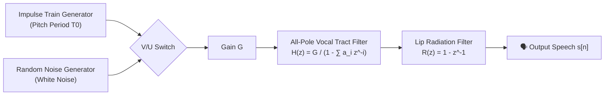
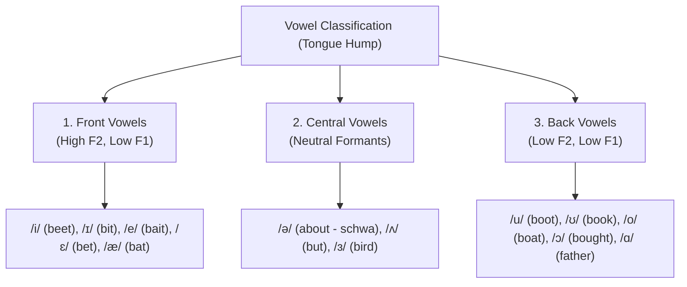
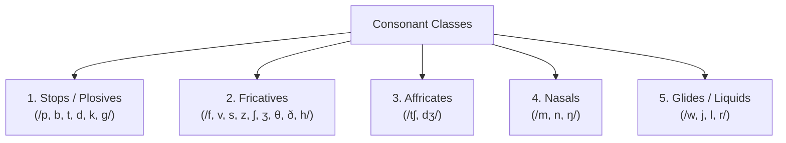
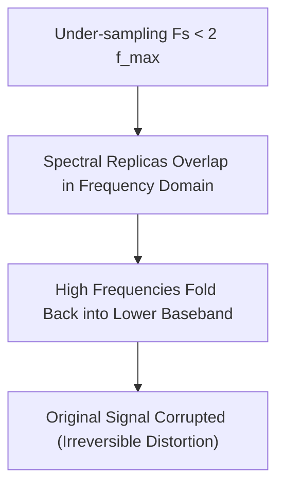
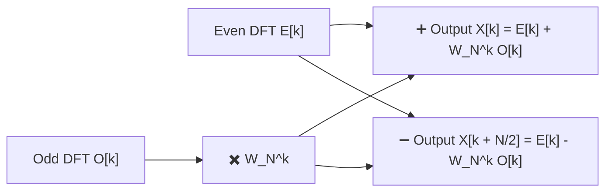
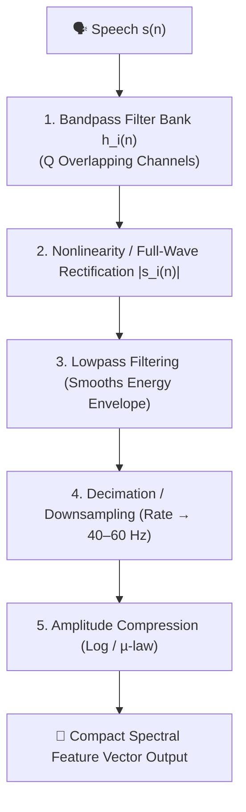
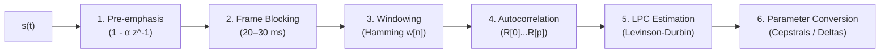

# Module 1: Speech Processing Concepts — Official Master Question Bank Solutions

> **Academic Course**: Speech and Video Processing (CS30033)  
> **Target Audience**: Universal Standard for Undergraduate & Postgraduate Engineering Students  
> **Source Material**: Official Module-1 Question Bank by Dr. Kunal Anand (SCE, KIIT DU)  
> **Structure**: All 80 Short Answer Questions (SAQs) & All 45 Long Answer Questions (LAQs) with 5-Mark Point Allocations, Embedded Diagrams, and Step-by-Step Numericals.

---

# Part I: Short Answer Questions (SAQ 1 – SAQ 80)

### SAQ 1: Define speech processing. Write the necessity of speech processing in modern world applications. (2 Marks)
**Answer:**
- **Definition (1 Mark)**: Speech processing is an interdisciplinary branch of Digital Signal Processing (DSP) and computational linguistics that studies speech acoustic signals and develops digital algorithms for their acquisition, analysis, synthesis, compression, enhancement, and recognition.
- **Necessity (1 Mark)**:
  - Human-Computer Interaction (HCI) is predominantly voice-driven (e.g., smart assistants like Siri, Alexa, Google Assistant).
  - Enables massive bandwidth reduction in digital cellular communication (VoLTE, 5G) via speech coding.
  - Essential for assistive technologies (screen readers for the blind, hearing aids, voice prosthetics).

---

### SAQ 2: Distinguish between speech transmission and speech processing. (2 Marks)
**Answer:**

| Parameter | Speech Transmission | Speech Processing |
| :--- | :--- | :--- |
| **Primary Objective** | Conveying audio signals from point A to B over physical channels without distortion. | Extracting information, modifying, analyzing, or synthesizing speech sounds. |
| **Information Extraction**| None (treats speech merely as a waveform to be transported). | High (extracts pitch, formants, phonemes, speaker identity, or linguistic text). |
| **Core Operations** | Modulation, channel equalization, error correction coding. | Linear prediction (LPC), feature extraction (MFCCs), spectral estimation, pattern recognition. |

---

### SAQ 3: List out some application areas of digital speech processing. (2 Marks)
**Answer:**
1. **Automatic Speech Recognition (ASR)**: Speech-to-text transcription, automated IVR customer care.
2. **Speaker Identification & Verification**: Voice biometrics for secure financial authentication.
3. **Speech Synthesis (Text-to-Speech - TTS)**: Automated announcement systems, navigational GPS guidance.
4. **Speech Enhancement & Noise Reduction**: Acoustic echo cancellation, hearing aids, active noise control.
5. **Speech Coding & Compression**: Low-bitrate telephony (AMR, CELP codecs).

---

### SAQ 4: Identify the elements of speech communication. (2 Marks)
**Answer:**
The speech communication chain encompasses three essential domains:
1. **Linguistic / Articulatory Stage (Transmitter)**: Message generation in the brain $\to$ neural excitation of vocal organs (lungs, vocal folds, tongue, lips).
2. **Acoustic Stage (Transmission Medium)**: Pressure disturbance traveling through air as longitudinal sound waves.
3. **Auditory / Perceptual Stage (Receiver)**: Sound pressure detection by outer ear $\to$ cochlear frequency transduction $\to$ neural decoding in the listener's brain.

---

### SAQ 5: Write the importance of velum in speech production system. (2 Marks)
**Answer:**
The **velum (soft palate)** functions as a biological acoustic switch/valve:
- **Nasal Sounds (`/m/`, `/n/`, `/ŋ/`)**: The velum lowers, coupling the nasal cavity to the vocal tract and introducing acoustic anti-resonances (zeros).
- **Oral Sounds (Vowels, Stops, Fricatives)**: The velum raises and presses against the posterior pharyngeal wall, completely sealing off the nasal tract so air escapes exclusively through the oral cavity.

---

### SAQ 6: Identify different types of excitation source. (2 Marks)
**Answer:**
1. **Voiced Excitation**: Quasi-periodic air pulses produced by vocal cord vibrations in the larynx (e.g., vowels `/a/`, `/i/`, `/u/`, voiced stops `/b/`, `/d/`).
2. **Unvoiced Excitation**: Continuous turbulent noise generated by forcing airflow through a narrow vocal tract constriction without vocal cord vibration (e.g., fricatives `/s/`, `/f/`, `/ʃ/`).
3. **Transient / Plosive Excitation**: Rapid release of built-up pressure behind a complete vocal tract closure (e.g., stop bursts in `/p/`, `/t/`, `/k/`).

---

### SAQ 7: Define phoneme. Identify different types of phonemes. (2 Marks)
**Answer:**
- **Definition (1 Mark)**: A phoneme is the smallest distinctive structural sound unit in a language that can distinguish one word from another (e.g., `/p/` vs. `/b/` in *"pat"* vs. *"bat"*).
- **Types of Phonemes (1 Mark)**:
  1. **Vowels** (Monophthongs, Diphthongs)
  2. **Semi-vowels / Glides** (`/w/`, `/j/`, `/l/`, `/r/`)
  3. **Consonants** (Stops, Fricatives, Affricates, Nasals, Whispered sounds)

---

### SAQ 8: Define vowels. Write down different types of vowels. (2 Marks)
**Answer:**
- **Definition (1 Mark)**: Vowels are voiced speech sounds produced with an open, unobstructed vocal tract without creating turbulent friction.
- **Classification by Tongue Position (1 Mark)**:
  1. **Front Vowels**: Tongue hump forward (e.g., `/i/` in "beet", `/e/` in "bait", `/æ/` in "bat").
  2. **Central Vowels**: Tongue in neutral position (e.g., `/ə/` in "about", `/ʌ/` in "but").
  3. **Back Vowels**: Tongue hump retracted (e.g., `/u/` in "boot", `/o/` in "boat", `/ɑ/` in "father").

---

### SAQ 9: Write the significance of F1 and F2 formant positions for vowels. (2 Marks)
**Answer:**
- **Formant $F_1$ (First Formant)**: Inversely proportional to **tongue height** (jaw openness). High vowels (`/i/`, `/u/`) have a low $F_1$ ($200–350\text{ Hz}$); open low vowels (`/a/`) have a high $F_1$ ($700–900\text{ Hz}$).
- **Formant $F_2$ (Second Formant)**: Directly proportional to **tongue advancement** (frontness/backness). Front vowels (`/i/`) have a high $F_2$ ($2000–2500\text{ Hz}$); back vowels (`/u/`) have a low $F_2$ ($800–1200\text{ Hz}$).
- *Significance*: The $(F_1, F_2)$ plane forms the acoustic vowel quadrilateral that uniquely distinguishes vowel categories.

---

### SAQ 10: Define F1-F2 Centroid. What purpose it serves in the acoustic representation of speech sounds. (2 Marks)
**Answer:**
- **Definition (1 Mark)**: The $F_1$-$F_2$ Centroid is the statistical mean center coordinate $(\bar{F}_1, \bar{F}_2)$ calculated across multiple vowel tokens uttered by a speaker:
  $$\bar{F}_1 = \frac{1}{N}\sum_{i=1}^{N} F_{1,i}, \quad \bar{F}_2 = \frac{1}{N}\sum_{i=1}^{N} F_{2,i}$$
- **Purpose (1 Mark)**: Serves as an invariant reference anchor representing the speaker's physiological vowel space center, widely used for speaker normalization and acoustic vowel mapping.

---

### SAQ 11: Define F1-F2 Cluster. What purpose it serves in the acoustic representation of speech sound. (2 Marks)
**Answer:**
- **Definition (1 Mark)**: An $F_1$-$F_2$ Cluster is the two-dimensional scatter distribution of $(F_1, F_2)$ formant frequency pairs measured across multiple utterances of a vowel.
- **Purpose (1 Mark)**: Characterizes natural phonetic variability, coarticulation boundaries, and acoustic overlap between phoneme classes, providing statistical training boundaries for speech recognizers.

---

### SAQ 12: Define diphthongs. How semivowels are different from diphthongs. (2 Marks)
**Answer:**
- **Diphthongs**: Complex voiced sounds produced by smoothly gliding from an initial vowel tongue posture to a second vowel target within a single syllable nucleus (e.g., `/aɪ/` in "buy", `/aʊ/` in "cow").
- **Difference from Semi-vowels**: Diphthongs have long durations, high acoustic energy, and serve as full **syllabic vowel nuclei**. Semi-vowels (`/w/`, `/j/`) exhibit faster formant transitions, lower relative energy, and function as **consonant margins** surrounding a vowel.

---

### SAQ 13: Define consonants. List out different types of consonants. (2 Marks)
**Answer:**
- **Definition (1 Mark)**: Consonants are speech sounds produced with complete, partial, or constricted obstruction of airflow in the vocal tract.
- **Types of Consonants (1 Mark)**:
  1. Stops / Plosives (`/p/`, `/b/`, `/t/`, `/d/`, `/k/`, `/g/`)
  2. Fricatives (`/f/`, `/v/`, `/s/`, `/z/`, `/ʃ/`, `/ʒ/`, `/θ/`, `/ð/`, `/h/`)
  3. Affricates (`/tʃ/`, `/dʒ/`)
  4. Nasals (`/m/`, `/n/`, `/ŋ/`)
  5. Glides / Liquids (`/w/`, `/j/`, `/l/`, `/r/`)

---

### SAQ 14: How is the syllable different from phoneme? (2 Marks)
**Answer:**
- **Phoneme**: The minimal abstract acoustic sound unit that distinguishes words but has no grammatical or syllabic structure alone (e.g., `/s/`, `/p/`, `/iː/`, `/tʃ/`).
- **Syllable**: A higher-level unit of spoken pronunciation consisting of a vowel nucleus (with optional consonant onset and coda) uttered in a single expiratory pulse (e.g., *"speech"* is **1 syllable** composed of **4 phonemes**).

---

### SAQ 15: Identify the number of syllables in the word “spectrum”. (2 Marks)
**Answer:**
The word **"spectrum"** contains **2 syllables**:
- Breakdown: `spec-trum` (`/ˈspɛk.trəm/`)
  1. Syllable 1: `spec` (Nucleus: `/ɛ/`)
  2. Syllable 2: `trum` (Nucleus: `/ə/`)

---

### SAQ 16: Define amplitude, frequency, and phase for a sinusoidal signal. (2 Marks)
**Answer:**
For a sinusoidal signal $x(t) = A \sin(2\pi f t + \phi)$:
- **Amplitude ($A$)**: Maximum peak excursion from zero baseline; determines perceived physical loudness.
- **Frequency ($f$)**: Number of complete cycles executed per second ($\text{Hz}$); determines perceived pitch.
- **Phase ($\phi$)**: Time/angle displacement offset of the waveform relative to origin $t=0$ (in radians/degrees).

---

### SAQ 17: Differentiate between continuous time and discrete time signal. (2 Marks)
**Answer:**
- **Continuous-Time Signal $x(t)$**: Defined for every continuous real time instant $t \in (-\infty, +\infty)$ (e.g., analog acoustic pressure in air).
- **Discrete-Time Signal $x[n]$**: Defined only at discrete uniform time intervals $t = n T_s$, indexed by integer $n \in \mathbb{Z}$ (e.g., digital speech samples).

---

### SAQ 18: Differentiate between continuous-valued and discrete-valued signal. (2 Marks)
**Answer:**
- **Continuous-Valued Signal**: Can assume any infinite-precision real amplitude value within a given dynamic range (e.g., analog voltage from a microphone).
- **Discrete-Valued Signal**: Amplitude is strictly constrained to a finite set of $L = 2^N$ predefined quantization levels (e.g., 8-bit quantized values $0–255$).

---

### SAQ 19: “A speech signal considered as non-stationary and quasi-periodic in nature.” Write the significance of the above statement. (2 Marks)
**Answer:**
- **Non-Stationary**: Spectral properties change continuously over time as articulators move. Hence, speech must be analyzed in **short-time quasi-stationary frames ($20–30\text{ ms}$)**.
- **Quasi-Periodic**: Voiced sounds display repeating glottal cycles that are nearly periodic but vary slightly in pitch period ($T_0$) and amplitude from cycle to cycle.

---

### SAQ 20: Define digitization. Write the purpose of analog-to-digital converter in digitization. (2 Marks)
**Answer:**
- **Digitization (1 Mark)**: The conversion of a continuous analog physical wave into a discrete-time, discrete-amplitude binary code sequence.
- **Purpose of ADC (1 Mark)**: Performs sampling, quantization, and binary encoding so speech can be processed, filtered, stored, and analyzed by digital computers.

---

### SAQ 21: Define sampling frequency. How is it related to sampling interval. (2 Marks)
**Answer:**
- **Sampling Frequency ($F_s$)**: The number of sample measurements taken per second from a continuous signal ($\text{Hz}$).
- **Sampling Interval ($T_s$)**: The uniform time elapsed between consecutive samples.
- **Mathematical Relation**:
  $$T_s = \frac{1}{F_s} \iff F_s = \frac{1}{T_s}$$

---

### SAQ 22: For a given signal, if sampling frequency is 16KHz then determine the sampling interval. (2 Marks)
**Answer:**
Given $F_s = 16\text{ kHz} = 16,000\text{ Hz}$:

$$T_s = \frac{1}{F_s} = \frac{1}{16,000} = 0.0000625\text{ s} = \mathbf{62.5\,\mu\text{s} \quad (0.0625\text{ ms})}$$

---

### SAQ 23: Write Nyquist shannon Sampling theorem. (2 Marks)
**Answer:**
> *"To completely and accurately reconstruct a continuous band-limited signal from its discrete samples without distortion, the sampling frequency ($F_s$) must be at least twice the highest frequency component ($f_{max}$) present in the signal."*

$$F_s \ge 2 f_{max}$$

---

### SAQ 24: Why sampling rate must not be below twice the highest frequency present in the signal. (2 Marks)
**Answer:**
If $F_s < 2 f_{max}$, the periodic spectral replicas generated by sampling overlap in the frequency domain. This spectral overlap causes high frequencies to fold into lower frequency bands (**aliasing**), permanently corrupting the signal and making original reconstruction impossible.

---

### SAQ 25: How nyquist rate is related to nyquist frequency? (2 Marks)
**Answer:**
- **Nyquist Rate ($F_{Nyq\_rate} = 2 f_{max}$)**: The *minimum sampling frequency* required to avoid aliasing.
- **Nyquist Frequency ($F_{Nyq\_freq} = F_s / 2$)**: The *maximum signal frequency* that can be unambiguously represented for a given sampling rate $F_s$.
- **Relation**: $F_{Nyq\_rate} = 2 \times F_{Nyq\_freq}$.

---

### SAQ 26: Define aliasing. Write the effect of aliasing in signal processing. (2 Marks)
**Answer:**
- **Definition (1 Mark)**: A distortion phenomenon occurring when a signal is sampled below its Nyquist rate ($F_s < 2f_{max}$).
- **Effect (1 Mark)**: High-frequency components fold over into the low-frequency baseband spectrum, creating false audible tones, harsh distortion, and loss of original speech intelligibility.

---

### SAQ 27: List out the ways to avoid aliasing in signal processing. (2 Marks)
**Answer:**
1. **Sampling at or above the Nyquist Rate**: Choose $F_s \ge 2 f_{max}$.
2. **Anti-Aliasing Low-Pass Filtering**: Pass the continuous analog signal through an analog low-pass filter prior to sampling to attenuate all frequencies exceeding $F_s / 2$.

---

### SAQ 28: Define quantization. Why is it a significant step in signal processing. (2 Marks)
**Answer:**
- **Definition (1 Mark)**: The process of mapping continuous-amplitude sample values into a finite set of $L = 2^N$ discrete levels.
- **Significance (1 Mark)**: Reduces infinite amplitude precision into finite $N$-bit binary numbers, enabling digital memory storage, computer processing, and transmission.

---

### SAQ 29: Define quantization step size. (2 Marks)
**Answer:**
Quantization step size ($\Delta$) is the constant voltage/amplitude difference between two consecutive quantization levels:

$$\Delta = \frac{V_{max} - V_{min}}{L} = \frac{V_{max} - V_{min}}{2^N}$$

where $V_{max} - V_{min}$ is the full-scale input voltage range and $N$ is the number of bits per sample.

---

### SAQ 30: A speech signal is uniformly quantized using 6 bits per sample over a range of ±3 V. Find the quantization step size (Δ). (2 Marks)
**Answer:**
- $N = 6\text{ bits} \implies L = 2^6 = 64\text{ levels}$.
- Range $= +3\text{ V} - (-3\text{ V}) = 6\text{ V}$.

$$\Delta = \frac{6\text{ V}}{64} = \mathbf{0.09375\text{ V} \quad (93.75\text{ mV})}$$

---

### SAQ 31: Define quantization error. How quantization step size affects mean squared quantization error. (2 Marks)
**Answer:**
- **Quantization Error ($e[n]$)**: $e[n] = x[n] - x_q[n]$ (difference between unquantized and quantized values).
- **Effect of Step Size**: Mean squared error (noise power $\sigma_e^2$) is quadratically proportional to $\Delta$:
  $$\sigma_e^2 = \frac{\Delta^2}{12}$$
  Halving step size $\Delta$ reduces quantization noise power by a factor of 4 ($+6\text{ dB}$ SQNR improvement).

---

### SAQ 32: Discuss the time-domain representation of a speech signal. (2 Marks)
**Answer:**
A time-domain plot displays instantaneous speech signal amplitude (air pressure or voltage) on the Y-axis against time (seconds/milliseconds) on the X-axis, showing raw acoustic waveform fluctuations directly as recorded.

---

### SAQ 33: What information can be gathered from the time-domain representation of a speech signal? (2 Marks)
**Answer:**
1. Exact timing of word onsets, vowel durations, pauses, and silence boundaries.
2. Signal energy envelope and dynamic loudness variations.
3. Fundamental pitch periods ($T_0$) during periodic voiced segments.
4. Discrimination between silence baseline and active speech.

---

### SAQ 34: Discuss the frequency-domain representation of a speech signal. (2 Marks)
**Answer:**
A frequency-domain spectrum plots magnitude/power (in dB) on the Y-axis against frequency (in Hz) on the X-axis. Obtained via Fourier Transform (DFT/FFT), it shows how signal energy is distributed across constituent sinusoidal frequencies.

---

### SAQ 35: What information can be gathered from the frequency-domain representation of a speech signal? (2 Marks)
**Answer:**
1. Fundamental frequency ($F_0$ / pitch) and harmonic spacing.
2. Resonant formant peak frequencies ($F_1, F_2, F_3$) for vowel identification.
3. Spectral tilt and high-frequency fricative noise distribution.
4. Overall frequency bandwidth ($0\text{ Hz}$ to $F_s/2$).

---

### SAQ 36: Write the significance of spectrogram in speech processing. (2 Marks)
**Answer:**
A spectrogram combines time, frequency, and log energy (color intensity) into a 2D time-frequency representation. It enables simultaneous tracking of dynamic formant transitions ($F_1, F_2, F_3$), pitch striations, and phonetic boundaries over time.

---

### SAQ 37: List out the application areas where spectrogram can be useful. (2 Marks)
**Answer:**
1. Automatic Speech Recognition (ASR) feature extraction.
2. Phonetic segmentation and acoustic-phonetic research.
3. Speaker identification and forensic audio authentication.
4. Speech pathology assessment and clinical voice therapy.
5. Audio restoration and acoustic noise suppression.

---

### SAQ 38: Define linear time invariant system along with its mathematical representation. (2 Marks)
**Answer:**
- **Definition**: An LTI system is a discrete-time operator $y[n] = T\{x[n]\}$ that obeys both **Linearity** (Superposition) and **Time-Invariance**.
- **Mathematical Form**:
  $$y[n] = x[n] * h[n] = \sum_{k=-\infty}^{\infty} x[k] \, h[n - k]$$
  where $h[n]$ is the system unit impulse response.

---

### SAQ 39: Explain the major properties that are necessary for a discrete-time system to be LTI system. (2 Marks)
**Answer:**
1. **Linearity (Superposition)**: $T\{a x_1[n] + b x_2[n]\} = a T\{x_1[n]\} + b T\{x_2[n]\}$.
2. **Time-Invariance**: If $x[n] \to y[n]$, then $x[n-k] \to y[n-k]$ for any integer delay $k$.

---

### SAQ 40: Write the principle of superposition with reference to an LTI system. (2 Marks)
**Answer:**
The principle of superposition states that the response of an LTI system to an arbitrary linear combination of inputs equals the identical linear combination of the individual system responses:

$$T\left\{ \sum_{i} a_i x_i[n] \right\} = \sum_{i} a_i T\{x_i[n]\} = \sum_{i} a_i y_i[n]$$

---

### SAQ 41: Define convolution. What role does impulse response play in convolution? (2 Marks)
**Answer:**
- **Convolution**: A mathematical operation combining input sequence $x[n]$ and impulse response $h[n]$: $y[n] = \sum x[k] h[n-k]$.
- **Role of Impulse Response $h[n]$**: Characterizes the LTI system completely. Once $h[n]$ is known, output $y[n]$ can be determined for *any* arbitrary input signal $x[n]$.

---

### SAQ 42: List out atleast three properties of convolution. (2 Marks)
**Answer:**
1. **Commutative**: $x[n] * h[n] = h[n] * x[n]$
2. **Associative**: $(x[n] * h_1[n]) * h_2[n] = x[n] * (h_1[n] * h_2[n])$
3. **Distributive**: $x[n] * (h_1[n] + h_2[n]) = (x[n] * h_1[n]) + (x[n] * h_2[n])$

---

### SAQ 43: Briefly describe the finite duration property of convolution. (2 Marks)
**Answer:**
If input sequence $x[n]$ has length $L_x$ and impulse response $h[n]$ has length $L_h$, the convolved output sequence $y[n] = x[n] * h[n]$ has a finite duration length $L_y$ given by:

$$L_y = L_x + L_h - 1$$

---

### SAQ 44: Write the shortcomings of time-domain convolution. (2 Marks)
**Answer:**
1. **High Computational Complexity**: Requires $O(N \cdot M)$ multiplications and additions per frame.
2. **No Direct Frequency Insight**: Does not explicitly display resonance peaks, formant bandwidths, or spectral attenuation.
3. **Obscured System Modeling**: Internal vocal tract resonances (poles) and anti-resonances (zeros) cannot be directly identified.

---

### SAQ 45: Define pole-zero modeling. (2 Marks)
**Answer:**
Pole-zero modeling is a mathematical technique that represents a discrete-time speech system (vocal tract) as a rational transfer function in the $Z$-domain: $H(z) = B(z)/A(z)$, characterized by its poles and zeros.

---

### SAQ 46: Why pole-zero modeling is considered as one of the important process in speech processing. (2 Marks)
**Answer:**
Because it directly captures the acoustic physics of speech production: **poles** model vocal tract formant resonances (vowels), while **zeros** model nasal cavity anti-resonances (nasals/fricatives). It enables efficient Linear Predictive Coding (LPC) data compression.

---

### SAQ 47: Describe vocal tract in terms of a transfer function in pole zero modeling. (2 Marks)
**Answer:**
$$H(z) = \frac{Y(z)}{X(z)} = G \frac{1 + \sum_{k=1}^{M} b_k z^{-k}}{1 - \sum_{k=1}^{N} a_k z^{-k}} = G \frac{z^{N-M} \prod_{k=1}^{M} (z - z_k)}{\prod_{k=1}^{N} (z - p_k)}$$

where $X(z)$ is glottal excitation, $Y(z)$ is output speech, $p_k$ are poles, and $z_k$ are zeros.

---

### SAQ 48: What poles and zeros represent in the pole-zero modeling? (2 Marks)
**Answer:**
- **Poles ($A(z) = 0$)**: Complex frequencies where $|H(z)| \to \infty$; represent **vocal tract formants** (resonant peaks).
- **Zeros ($B(z) = 0$)**: Complex frequencies where $|H(z)| = 0$; represent **acoustic anti-resonances** (spectral dips/notches).

---

### SAQ 49: What will be the impact on a linear system if the poles are set to zero? (2 Marks)
**Answer:**
If all poles are set to zero ($A(z) = 1$), the system becomes an **All-Zero / Finite Impulse Response (FIR) Filter**. The system loses all resonant formant peaks and becomes unconditionally BIBO stable.

---

### SAQ 50: What will be the impact on a linear system if the zeros are set to zero? (2 Marks)
**Answer:**
If all non-origin zeros are set to zero ($B(z) = G$), the system becomes an **All-Pole / Infinite Impulse Response (IIR) Filter**. This forms the basis of Linear Predictive Coding (LPC), accurately modeling vocal tract formant peaks.

---

### SAQ 51: What role does Fourier transform play in the speech processing? (2 Marks)
**Answer:**
The Fourier Transform converts time-domain waveforms into frequency spectra, enabling short-time spectral estimation, formant tracking, pitch extraction, filter bank design, and acoustic feature extraction for ASR.

---

### SAQ 52: How can a sinusoidal signal be represented in complex exponential? (2 Marks)
**Answer:**
Using Euler's identity $\cos(\theta) = \frac{1}{2}(e^{j\theta} + e^{-j\theta})$:

$$A \cos(2\pi f_0 t + \phi) = \frac{A}{2} e^{j\phi} e^{j 2\pi f_0 t} + \frac{A}{2} e^{-j\phi} e^{-j 2\pi f_0 t}$$

---

### SAQ 53: Write about the importance of dirac delta function in Fourier transform. (2 Marks)
**Answer:**
The Dirac delta function $\delta(f - f_0)$ represents an infinitely concentrated spectral line at frequency $f_0$. It allows pure continuous sinusoids and periodic signals to be represented in the continuous Fourier domain as sharp spectral impulse spikes.

---

### SAQ 54: List out the properties of fourier transform. (2 Marks)
**Answer:**
1. **Linearity**: $\mathcal{F}\{a x_1 + b x_2\} = a X_1(f) + b X_2(f)$
2. **Time Shift**: $\mathcal{F}\{x(t - t_0)\} = X(f) e^{-j 2\pi f t_0}$
3. **Frequency Shift**: $\mathcal{F}\{x(t) e^{j 2\pi f_0 t}\} = X(f - f_0)$
4. **Convolution**: $\mathcal{F}\{x(t) * h(t)\} = X(f) \cdot H(f)$

---

### SAQ 55: Define inverse fourier transform. (2 Marks)
**Answer:**
The Inverse Fourier Transform reconstructs a continuous time-domain signal $x(t)$ from its continuous frequency spectrum $X(f)$:

$$x(t) = \int_{-\infty}^{\infty} X(f) \, e^{j 2\pi f t} \, df$$

---

### SAQ 56: Explain discrete time fourier transform with its mathematical representation. (2 Marks)
**Answer:**
The DTFT transforms an infinite discrete sequence $x[n]$ into a continuous, $2\pi$-periodic frequency spectrum $X(e^{j\omega})$:

$$X(e^{j\omega}) = \sum_{n=-\infty}^{\infty} x[n] \, e^{-j\omega n}, \quad \omega \in [-\pi, \pi]$$

---

### SAQ 57: Define inverse DTFT. (2 Marks)
**Answer:**
The Inverse DTFT reconstructs discrete sequence $x[n]$ from continuous periodic spectrum $X(e^{j\omega})$:

$$x[n] = \frac{1}{2\pi} \int_{-\pi}^{\pi} X(e^{j\omega}) \, e^{j\omega n} \, d\omega$$

---

### SAQ 58: Define discrete fourier transform along with its mathematical representation. (2 Marks)
**Answer:**
The DFT converts an $N$-point finite discrete sequence $x[n]$ into $N$ discrete frequency bin samples $X[k]$:

$$X[k] = \sum_{n=0}^{N-1} x[n] \, e^{-j \frac{2\pi}{N} k n}, \quad k = 0, 1, \dots, N-1$$

---

### SAQ 59: What is basis function in DFT? (2 Marks)
**Answer:**
The complex exponential terms $\phi_k[n] = e^{-j \frac{2\pi}{N} k n}$ for $k = 0, 1, \dots, N-1$ are the **DFT basis functions**. They act as a set of orthogonal frequency detectors probing the signal at harmonically spaced frequencies.

---

### SAQ 60: Write the orthogonality principle of DFT basis function. (2 Marks)
**Answer:**
$$\sum_{n=0}^{N-1} e^{j \frac{2\pi}{N} k n} e^{-j \frac{2\pi}{N} m n} = \begin{cases} N, & k = m \\ 0, & k \neq m \end{cases}$$

---

### SAQ 61: Explain the spectral leakage. (2 Marks)
**Answer:**
Spectral leakage occurs when a signal contains frequency components that do not align with integer DFT bin frequencies ($k \frac{F_s}{N}$). Non-integer cycle windowing creates edge discontinuities, causing energy to leak into neighboring bins.

---

### SAQ 62: Discuss the significance of even odd decomposition in fast fourier transform. (2 Marks)
**Answer:**
Even-odd decomposition splits an $N$-point DFT into two $\frac{N}{2}$-point DFTs ($x[2m]$ and $x[2m+1]$). By recursively applying this divide-and-conquer strategy, FFT reduces arithmetic operations from $O(N^2)$ to $O(N \log_2 N)$.

---

### SAQ 63: Define twiddle factor in FFT. (2 Marks)
**Answer:**
The **Twiddle Factor** $W_N^k$ is a complex exponential phase coefficient:

$$W_N^k = e^{-j \frac{2\pi}{N} k}$$

Satisfies symmetry $W_N^{k+N/2} = -W_N^k$ and periodicity $W_N^{k+N} = W_N^k$.

---

### SAQ 64: Explain butterfly network in FFT. (2 Marks)
**Answer:**
A **Butterfly Unit** is the elementary 2-point calculation cell in an FFT: takes inputs $A$ and $B$, applies twiddle factor $W_N^k$, and computes $X = A + W_N^k B$ and $Y = A - W_N^k B$.

---

### SAQ 65: What information does spectral envelope carry? (2 Marks)
**Answer:**
The **spectral envelope** is the smooth curve outlining formant peaks. It carries **linguistic phoneme information** (vocal tract filter characteristics) and **speaker identity**, independent of fine pitch harmonic structure.

---

### SAQ 66: List out the different types of filters in signal processing. (2 Marks)
**Answer:**
1. Low-Pass Filter (LPF)
2. High-Pass Filter (HPF)
3. Band-Pass Filter (BPF)
4. Band-Stop / Notch Filter
5. All-Pass Filter

---

### SAQ 67: Distinguish between uniform and non-uniform digital filters. (2 Marks)
**Answer:**
- **Uniform Filter Banks**: Filters are spaced at equal linear frequency intervals with identical bandwidths.
- **Non-Uniform Filter Banks**: Filters have unequal bandwidths (narrower at low frequencies, wider at high frequencies) modeled after human auditory perception (e.g., Mel/Bark scale).

---

### SAQ 68: How full wave rectifier is different from half wave rectifier? (2 Marks)
**Answer:**
- **Full-Wave Rectifier**: Inverts negative signal values ($y[n] = |x[n]|$), retaining $100\%$ of signal energy.
- **Half-Wave Rectifier**: Sets negative values to zero ($y[n] = \max(0, x[n])$), discarding half the signal waveform.

---

### SAQ 69: Write the significance of Mel-Scale in speech processing. (2 Marks)
**Answer:**
The Mel scale mimics human pitch perception (linear below $1000\text{ Hz}$, logarithmic above $1000\text{ Hz}$). Using Mel filter banks produces acoustic features (MFCCs) optimized for human-like speech recognition.

---

### SAQ 70: List out some application areas of filter bank model. (2 Marks)
**Answer:**
1. Mel-Frequency Cepstral Coefficients (MFCC) extraction for ASR.
2. Sub-band audio coding (MP3, AAC).
3. Digital hearing aids.
4. Voice activity detection and speech enhancement.

---

### SAQ 71: What are the shortcomings of filter bank model. (2 Marks)
**Answer:**
1. Limited frequency resolution within individual filter channels.
2. Fixed filter bandwidths do not adapt to dynamic pitch variations.
3. Does not directly model underlying vocal tract physical transfer functions.

---

### SAQ 72: Define linear prediction along with its mathematical representation. (2 Marks)
**Answer:**
Linear prediction models speech by estimating the current sample $\hat{s}[n]$ as a linear weighted sum of $p$ previous samples:

$$\hat{s}[n] = \sum_{i=1}^{p} a_i s[n-i]$$

where $p$ is prediction order and $\{a_i\}$ are predictor coefficients.

---

### SAQ 73: What is prediction error in linear prediction? (2 Marks)
**Answer:**
Prediction error $e[n]$ is the residual difference between the actual speech sample $s[n]$ and its linearly predicted estimate $\hat{s}[n]$:

$$e[n] = s[n] - \hat{s}[n] = s[n] - \sum_{i=1}^{p} a_i s[n-i]$$

---

### SAQ 74: How does the prediction order impact a LPC model? (2 Marks)
**Answer:**
- **Too Low ($p < 8$)**: Fails to capture all vocal tract formant resonances ($F_1, F_2, F_3$).
- **Optimal ($p \approx 10–16$)**: Accurately models $4–5$ formants plus spectral tilt.
- **Too High ($p > 24$)**: Overfits pitch harmonics and glottal noise, increasing computational load.

---

### SAQ 75: What role does a all-pole filter play in LPC model? (2 Marks)
**Answer:**
The all-pole filter $H(z) = \frac{G}{1 - \sum_{i=1}^{p} a_i z^{-i}}$ models the **vocal tract transfer function**. Its poles correspond to resonant formant frequencies.

---

### SAQ 76: Define the term excitation gain in LPC. (2 Marks)
**Answer:**
Excitation gain ($G$) is an energy scaling factor that adjusts the amplitude of the glottal pulse train or white noise source to match the total energy of the original speech frame.

---

### SAQ 77: List out the typical model parameters in LPC. (2 Marks)
**Answer:**
1. Voiced / Unvoiced classification flag.
2. Pitch period ($T_0$) for voiced speech.
3. Excitation gain ($G$).
4. LPC predictor coefficients ($a_1, a_2, \dots, a_p$).

---

### SAQ 78: Explain autocorrelation along with its mathematical representation. (2 Marks)
**Answer:**
Autocorrelation measures the self-similarity of a signal $s[n]$ with its delayed replica $s[n-k]$:

$$R[k] = \sum_{n} s[n] \, s[n-k]$$

---

### SAQ 79: How does the covariance method differ from autocorrelation method? (2 Marks)
**Answer:**
- **Autocorrelation Method**: Requires frame windowing (Hamming), yields a symmetric **Toeplitz matrix**, and **guarantees stable poles**.
- **Covariance Method**: Uses unwindowed samples, yields a symmetric **non-Toeplitz matrix**, and stability is not guaranteed.

---

### SAQ 80: Write the whitening behavior of LPC model. (2 Marks)
**Answer:**
Filtering speech $s[n]$ through the inverse LPC filter $A(z) = 1 - \sum a_i z^{-i}$ removes vocal tract formant resonances, producing an error residual $e[n]$ with a flat, white noise-like spectrum (**Spectral Whitening**).

---

# Part II: Long Answer Questions & Solved Problems (LAQ 1 – LAQ 45)

### LAQ 1: Explain the speech processing model with a suitable diagram. (5 Marks)

#### Answer:
**1. Source-Filter Model Concept (1.5 Marks)**  
The digital speech processing model separates speech production into two uncoupled stages: an **Acoustic Excitation Source** and an **All-Pole Vocal Tract Linear System**.

**2. System Block Diagram (1.5 Marks)**

**3. Detailed Functional Blocks (2 Marks)**
- **Voiced Excitation**: Glottal pulse train generated at fundamental frequency $F_0 = 1/T_0$.
- **Unvoiced Excitation**: Flat-spectrum zero-mean pseudo-random Gaussian noise.
- **Gain ($G$)**: Scales excitation power to match frame acoustic energy.
- **Vocal Tract Filter $H(z)$**: $p$-th order all-pole filter modeling formant resonances ($F_1, F_2, F_3$).
- **Lip Radiation $R(z)$**: First-order differencer ($1 - z^{-1}$) modeling high-frequency sound radiation at the lips ($+6\text{ dB/octave}$).

---

### LAQ 2: Describe the speech production system with a schematic diagram. (5 Marks)

#### Answer:
**1. Speech Production Anatomy Schematic (2 Marks)**

*Figure LAQ 2.1: Anatomical Schematic of Human Speech Production Organs*

**2. Three Anatomical Sub-Systems (3 Marks)**
1. **Subglottal System (Lungs & Trachea)**: Provides compressed air stream acting as the primary aerodynamic power supply.
2. **Larynx & Vocal Folds (Glottal Source)**: Vocal cords vibrate periodically under the Bernoulli effect to generate voiced pitch pulses ($F_0$), or remain open for unvoiced turbulence.
3. **Supraglottal Cavities (Vocal Tract Filter)**: Composed of the pharynx, oral cavity (tongue, teeth, lips), and nasal cavity (velum). Moving articulators alter cavity volumes, creating acoustic resonances (formants).

---

### LAQ 3: Define vowels. Explain different types of vowels with suitable examples for each of them. (5 Marks)

#### Answer:
**1. Definition of Vowels (1 Mark)**  
Vowels are sustained voiced speech sounds produced with an open, unrestricted vocal tract where airflow escapes freely without generating turbulent friction noise.

**2. Classification by Tongue Position & Examples (3 Marks)**

*Figure LAQ 3.1: Tongue Position Profiles for American English Vowels*

**3. Acoustic Formant Rules (1 Mark)**
- **Tongue Height $\propto 1/F_1$**: High vowels have low $F_1$ ($250–350\text{ Hz}$); low vowels have high $F_1$ ($700–900\text{ Hz}$).
- **Tongue Frontness $\propto F_2$**: Front vowels have high $F_2$ ($2000–2500\text{ Hz}$); back vowels have low $F_2$ ($800–1200\text{ Hz}$).

---

### LAQ 4: How are the diphthongs and semi vowels different from each other? List out atleast two examples for diphthongs and semi vowels. (5 Marks)

#### Answer:

| Comparison Criterion | Diphthongs | Semi-Vowels (Glides) | Marks |
| :--- | :--- | :--- | :---: |
| **Acoustic Definition** | Vowels that glide smoothly from an initial vowel posture to a second target within one syllable. | Consonantal sounds produced with rapid vocal tract motion toward an open vowel posture. | **1 Mark** |
| **Syllabic Role** | Serve as the **syllabic vowel nucleus** (can form a syllable alone). | Serve as **consonant margins** (onset/coda), cannot form a syllable alone. | **1 Mark** |
| **Transition Duration** | Slower transition rate ($150–250\text{ ms}$), high acoustic power. | Rapid transition rate ($50–100\text{ ms}$), lower relative power. | **1 Mark** |
| **Formant Trajectory** | Prominent, sustained continuous shift across two vowel targets. | Dynamic transient formant movement heading immediately into next vowel. | **1 Mark** |
| **Standard Examples** | 1. `/aɪ/` as in *"buy"*, *"eye"* 2. `/aʊ/` as in *"cow"*, *"now"* 3. `/ɔɪ/` as in *"boy"*, *"toy"* | 1. `/w/` as in *"wet"*, *"win"* 2. `/j/` as in *"yes"*, *"you"* 3. `/l/`, `/r/` as in *"let"*, *"run"* | **1 Mark** |

---

### LAQ 5: Explain consonants. Discuss different types of consonants with suitable examples. (5 Marks)

#### Answer:
**1. Definition of Consonants (1 Mark)**  
Consonants are speech sounds produced by completely closing, severely constricting, or diverting airflow through the vocal tract, characterized by rapid transient onsets and lower energy compared to vowels.

**2. Five Major Consonant Classes with Examples (4 Marks)**

1. **Stops / Plosives (1 Mark)**: Complete vocal tract occlusion $\to$ pressure buildup $\to$ sudden burst release (e.g., `/p/` in *"pat"*, `/t/` in *"top"*, `/k/` in *"cat"*).
2. **Fricatives (1 Mark)**: Air forced through a narrow constriction generating turbulent high-frequency noise (e.g., `/s/` in *"sip"*, `/f/` in *"fit"*, `/ʃ/` in *"ship"*).
3. **Affricates (0.5 Mark)**: A stop occlusion immediately released into a fricative constriction (e.g., `/tʃ/` in *"church"*, `/dʒ/` in *"judge"*).
4. **Nasals (1 Mark)**: Complete oral closure with velum lowered, routing airflow exclusively through the nasal cavity (e.g., `/m/` in *"man"*, `/n/` in *"net"*, `/ŋ/` in *"sing"*).
5. **Glides & Liquids (0.5 Mark)**: Obstruction-free gliding movement (e.g., `/w/` in *"we"*, `/l/` in *"light"*).

---

### LAQ 6: Compare and contrast continuous-time and discrete-time signals. How is a continuous-valued signal different from a discrete-valued signal? (5 Marks)

#### Answer:
**1. Continuous-Time vs. Discrete-Time Signals (2.5 Marks)**

| Parameter | Continuous-Time Signal $x(t)$ | Discrete-Time Signal $x[n]$ |
| :--- | :--- | :--- |
| **Independent Variable** | Continuous real time $t \in (-\infty, +\infty)$ | Discrete integer sample index $n \in \mathbb{Z}$ |
| **Definition Domain** | Defined at every continuous time instant | Defined exclusively at uniform sampling instants $t = nT_s$ |
| **Sinusoidal Formula** | $x(t) = A \sin(\Omega t + \phi)$, $\Omega = 2\pi f\text{ (rad/s)}$ | $x[n] = A \sin(\omega n + \phi)$, $\omega = 2\pi f / F_s\text{ (rad/sample)}$ |
| **Physical Example** | Raw acoustic pressure wave before recording | Sampled speech stored in computer memory at $16\text{ kHz}$ |

*Figure LAQ 6.1: Comparison of Continuous-Time and Discrete-Time Signals*

**2. Continuous-Valued vs. Discrete-Valued Signals (2.5 Marks)**
- **Continuous-Valued Signal**: Amplitude can take any real value on a continuous dynamic range (infinite possible values).
- **Discrete-Valued Signal**: Amplitude is constrained to a finite set of $L = 2^N$ discrete quantized levels.
- **Digital Signal Definition**: A signal that is **both discrete-time and discrete-valued**, represented by binary bits.

---

### LAQ 7: Discuss the architecture of a digital signal processing system with a neat diagram. (5 Marks)

#### Answer:
**1. Complete DSP Architecture Block Diagram (2 Marks)**

**2. Functional Stage Descriptions (3 Marks)**
1. **Transducer & Pre-Amplifier**: Converts acoustic wave into analog electrical voltage $x_a(t)$.
2. **Anti-Aliasing Filter**: Low-pass filter removing all analog frequencies above $F_s / 2$.
3. **Sampler (C/D Converter)**: Discretizes time at uniform intervals $T_s = 1/F_s$, producing $x[n] = x_a(n T_s)$.
4. **Quantizer & Encoder (ADC)**: Maps sample amplitudes to $N$-bit binary digital words.
5. **Digital Signal Processor**: Executes DSP algorithms (LPC, DFT, FFT, filtering, recognition).
6. **DAC & Reconstruction Filter**: Smooths discrete output samples back into continuous analog sound $y_a(t)$.

---

### LAQ 8: Define sampling. How do sampling interval and sampling frequency relate to each other? Write the significance of bandwidth in sampling. (5 Marks)

#### Answer:
**1. Definition of Sampling (1.5 Marks)**  
Sampling is the process of measuring the amplitude of a continuous-time analog signal $x_a(t)$ at uniform, discrete time instants $t = n T_s$ to generate a discrete-time sequence:

$$x[n] = x_a(n T_s) = x_a\left(\frac{n}{F_s}\right)$$

**2. Mathematical Relation (1.5 Marks)**
- $F_s$ (Sampling Frequency) in $\text{Hz}$ = Number of samples taken per second.
- $T_s$ (Sampling Interval) in seconds = Time between consecutive samples.
  $$T_s = \frac{1}{F_s} \iff F_s = \frac{1}{T_s}$$

**3. Significance of Bandwidth in Sampling (2 Marks)**
- **Nyquist Criterion**: Signal bandwidth $B = f_{max}$ dictates the minimum sampling rate:
  $$F_{s,\min} = 2 B = 2 f_{max}$$
- **Telephony Standard**: Telephone speech bandwidth is restricted to $300–3400\text{ Hz}$ ($f_{max} \approx 4\text{ kHz}$), requiring $F_s = 8\text{ kHz}$.
- **High-Fidelity Audio**: Human hearing spans up to $20\text{ kHz}$, requiring $F_s = 44.1\text{ kHz}$ (CD audio) to capture all audible acoustic harmonics without distortion.

---

### LAQ 9: Explain Nyquist-Shannon sampling theorem. Discuss the issue of aliasing with respect to sampling. How can aliasing be overcome? (5 Marks)

#### Answer:
**1. Nyquist-Shannon Theorem Statement (1.5 Marks)**  
> *"A continuous-time band-limited signal containing frequencies no higher than $f_{max}$ can be uniquely and completely reconstructed from its samples if the sampling rate $F_s$ satisfies:"*
$$F_s \ge 2 f_{max}$$

**2. The Aliasing Problem (2 Marks)**  
When $F_s < 2 f_{max}$ (under-sampling), periodic repetitions of the spectrum centered at multiples of $F_s$ overlap:

**3. Methods to Prevent Aliasing (1.5 Marks)**
1. **Maintain Proper Sampling Rate**: Set $F_s \ge 2 f_{max}$.
2. **Anti-Aliasing Low-Pass Filter**: Pre-filter the analog signal with a sharp analog low-pass filter having cutoff $f_c \le F_s / 2$ prior to sampling.

---

### LAQ 10: Define quantization step size along with its mathematical representation. How does the bits per sample affect the quantization step size? (5 Marks)

#### Answer:
**1. Definition of Quantization Step Size (1.5 Marks)**  
Quantization step size ($\Delta$) is the uniform amplitude interval between adjacent discrete quantization levels in a uniform quantizer.

**2. Mathematical Formulation (1.5 Marks)**
$$\Delta = \frac{V_{max} - V_{min}}{L} = \frac{V_{max} - V_{min}}{2^N}$$

where $V_{max}, V_{min}$ are full-scale input voltage limits, $L = 2^N$ is total levels, and $N$ is bits/sample.

**3. Impact of Bits Per Sample ($N$) on Step Size & SQNR (2 Marks)**
- **Exponential Reduction**: Each additional bit doubles $L$ and **halves step size $\Delta$**:
  $$\Delta_{N+1} = \frac{\Delta_N}{2}$$
- **Noise Power Reduction**: Mean squared quantization noise power $\sigma_e^2 = \frac{\Delta^2}{12}$ drops by a factor of 4 ($75\%$).
- **6 dB Rule**: Signal-to-Quantization-Noise Ratio increases by approximately $6.02\text{ dB}$ per bit added:
  $$\text{SQNR} \approx 6.02 N + 1.76\text{ dB}$$

---

### LAQ 11 (Solved Problem): A speech signal is uniformly quantized using 8 bits per sample over a range of ±2 V. If the sampling frequency is 16 kHz, determine the quantization step size (Δ). Also, find out the size of the file for a 5-second recording. (5 Marks)

#### Solution:

**1. Given Data (1 Mark):**
- Number of bits per sample ($N$) = $8\text{ bits}$ $\implies L = 2^8 = 256\text{ levels}$
- Voltage range ($V_{min}$ to $V_{max}$) = $-2\text{ V}$ to $+2\text{ V} \implies \text{Range } \Delta V = 2 - (-2) = 4\text{ V}$
- Sampling frequency ($F_s$) = $16\text{ kHz} = 16,000\text{ Hz}$
- Duration ($T$) = $5\text{ seconds}$

**2. Quantization Step Size ($\Delta$) Calculation (2 Marks):**
$$\Delta = \frac{V_{max} - V_{min}}{L} = \frac{4\text{ V}}{256} = \mathbf{0.015625\text{ V} \quad (15.625\text{ mV})}$$

**3. Digital File Size Calculation (2 Marks):**
- Total samples = $F_s \times T = 16,000 \times 5 = 80,000\text{ samples}$
- Total bits = $80,000 \times 8 = 640,000\text{ bits}$
- Total bytes = $\frac{640,000}{8} = 80,000\text{ bytes}$

$$\text{File Size (Decimal KB)} = \frac{80,000}{1000} = \mathbf{80\text{ KB}}$$
$$\text{File Size (Binary KiB)} = \frac{80,000}{1024} = \mathbf{78.125\text{ KiB}}$$

---

### LAQ 12 (Solved Problem): A speech signal has an amplitude range of −1.5 V to +1.5 V and is quantized using 10 bits per sample. The sampling frequency is 16 kHz. For a recording duration of 20 seconds, determine: (1) Quantization step size, (2) Total number of samples, (3) Total number of bits required, (4) Approximate file size in KB. (5 Marks)

#### Solution:

**1. Quantization Step Size ($\Delta$) (1.5 Marks):**
- Range $= +1.5\text{ V} - (-1.5\text{ V}) = 3.0\text{ V}$
- $N = 10\text{ bits} \implies L = 2^{10} = 1024\text{ levels}$
$$\Delta = \frac{3.0\text{ V}}{1024} = \mathbf{0.0029296875\text{ V} \quad (2.93\text{ mV})}$$

**2. Total Number of Samples (1 Mark):**
$$N_{samples} = F_s \times T = 16,000 \times 20 = \mathbf{320,000\text{ samples}}$$

**3. Total Number of Bits Required (1 Mark):**
$$N_{bits} = N_{samples} \times N = 320,000 \times 10 = \mathbf{3,200,000\text{ bits}}$$

**4. File Size in KB (1.5 Marks):**
$$\text{File Size (Bytes)} = \frac{3,200,000\text{ bits}}{8} = 400,000\text{ bytes}$$
$$\text{File Size in KB (Decimal)} = \frac{400,000}{1000} = \mathbf{400\text{ KB}}$$
$$\text{File Size in KiB (Binary)} = \frac{400,000}{1024} = \mathbf{390.625\text{ KiB}}$$

---

### LAQ 13 (Solved Problem): A 10-bit ADC converts analog signals in the range −5 V to +5 V. Determine Quantization step size, maximum quantization error, and mean squared quantization error. (5 Marks)

#### Solution:

**1. Given Data (1 Mark):**
- Voltage range $= +5\text{ V} - (-5\text{ V}) = 10\text{ V}$
- $N = 10\text{ bits} \implies L = 2^{10} = 1024\text{ levels}$

**2. Quantization Step Size ($\Delta$) (1.5 Marks):**
$$\Delta = \frac{10\text{ V}}{1024} = \mathbf{0.009765625\text{ V} \quad (9.7656\text{ mV})}$$

**3. Maximum Quantization Error ($e_{max}$) (1 Mark):**
$$e_{max} = \frac{\Delta}{2} = \frac{0.009765625\text{ V}}{2} = \mathbf{0.0048828125\text{ V} \quad (4.8828\text{ mV})}$$

**4. Mean Squared Quantization Error ($\sigma_e^2$) (1.5 Marks):**
$$\sigma_e^2 = \frac{\Delta^2}{12} = \frac{(0.009765625)^2}{12} = \frac{9.536743 \times 10^{-5}}{12} = \mathbf{7.94728 \times 10^{-6}\text{ V}^2}$$

---

### LAQ 14: Suppose the ADC is modified to operate with a 12-bit resolution instead of 10-bit resolution. Discuss how this change affects the ADC's operation. (5 Marks)

#### Answer:

**1. Numerical Comparison of 10-bit vs. 12-bit ADC (2.5 Marks)**
For full-scale range $= 10\text{ V}$:
- **10-bit ADC**: $L_{10} = 1024 \implies \Delta_{10} = \frac{10}{1024} = 0.009766\text{ V}$, $\sigma_{e,10}^2 = 7.947 \times 10^{-6}\text{ V}^2$.
- **12-bit ADC**: $L_{12} = 4096 \implies \Delta_{12} = \frac{10}{4096} = 0.002441\text{ V}$, $\sigma_{e,12}^2 = \frac{(0.002441)^2}{12} = 4.967 \times 10^{-7}\text{ V}^2$.

**2. Operational & Performance Impacts (2.5 Marks)**
1. **Resolution & Error**: Step size $\Delta$ and maximum error $e_{max}$ decrease by **$75\%$ (factor of 4)**.
2. **Quantization Noise Power**: Noise power drops by a factor of $16$ ($4^2$), yielding a **$+12.04\text{ dB}$ increase in SQNR**.
3. **Data Bitrate & Storage**: Data storage increases by **$20\%$** ($12\text{ bits}$ per sample vs. $10\text{ bits}$).
4. **Hardware Complexity**: ADC circuit requires more comparator stages or longer successive approximation cycles.

---

### LAQ 15 (Solved Problem): A speech acquisition system samples a signal at 16 kHz using a 10-bit ADC over the input range −1.5 V to +1.5 V. Calculate: (1) Quantization step size, (2) Maximum quantization error, (3) Mean squared quantization error. (5 Marks)

#### Solution:

**Given:**
- $F_s = 16,000\text{ Hz}$, $N = 10\text{ bits} \implies L = 1024$, Range $\Delta V = 3.0\text{ V}$.

1. **Quantization Step Size ($\Delta$) (1.5 Marks):**
   $$\Delta = \frac{3.0\text{ V}}{1024} = \mathbf{0.0029296875\text{ V} \quad (2.93\text{ mV})}$$

2. **Maximum Quantization Error ($e_{max}$) (1.5 Marks):**
   $$e_{max} = \frac{\Delta}{2} = \frac{0.0029296875}{2} = \mathbf{0.00146484375\text{ V} \quad (1.46\text{ mV})}$$

3. **Mean Squared Quantization Error ($\sigma_e^2$) (2 Marks):**
   $$\sigma_e^2 = \frac{\Delta^2}{12} = \frac{(0.0029296875)^2}{12} = \frac{8.583069 \times 10^{-6}}{12} = \mathbf{7.152557 \times 10^{-7}\text{ V}^2}$$

---

### LAQ 16 & 17: Discuss the time-domain and frequency-domain representations of a speech signal. Write the significance of axes and provide a comparative table. (5 Marks)

#### Answer:

**1. Visual Representations & Axes Significance (2 Marks)**
- **Time-Domain (X: Time in s, Y: Amplitude in V/Pa)**: Shows physical pressure oscillations over time. Captures speech onset, pauses, and pitch periods.
- **Frequency-Domain (X: Frequency in Hz, Y: Magnitude in dB)**: Shows spectral energy distribution across frequencies ($0\text{ Hz}$ to $F_s/2$). Captures formants ($F_1, F_2$) and harmonics.

*Figure LAQ 16.1: Time-Domain Waveform (Top) vs. Frequency Spectrum (Bottom)*

**2. Comparative Table (3 Marks)**

| Parameter | Time-Domain Representation | Frequency-Domain Representation |
| :--- | :--- | :--- |
| **Plot Axes** | X: Time ($\text{s}$), Y: Amplitude | X: Frequency ($\text{Hz}$), Y: Magnitude ($\text{dB}$) |
| **Information** | Onset, pauses, duration, loudness | Pitch ($F_0$), formants ($F_1, F_2$), spectral tilt |
| **Transformation** | Direct microphone ADC sampling | Discrete Fourier Transform (DFT / FFT) |
| **Applications** | Silence removal, framing, energy thresholding | Speech recognition, pitch estimation, noise filtering |

---

### LAQ 18: Define spectrogram. How can a spectrogram be created for a given speech signal? Why is it needed in speech processing? (5 Marks)

#### Answer:

**1. Definition of Spectrogram (1 Mark)**  
A spectrogram is a 2D time-frequency representation that displays how spectral energy is distributed across frequencies over time.

*Figure LAQ 18.1: Time-Frequency Spectrogram of Spoken Utterance "Sunday"*

**2. Generation via Short-Time Fourier Transform (STFT) (2 Marks)**
1. Speech $s[n]$ is segmented into short overlapping frames ($20–30\text{ ms}$).
2. Each frame is windowed with a Hamming window $w[n]$ to prevent spectral leakage.
3. The Discrete Fourier Transform (DFT/FFT) is computed per frame:
   $$\text{STFT}\{s[n]\}(m, \omega) = \sum_{n=-\infty}^{\infty} s[n] w[n - m] e^{-j\omega n}$$
4. Log power $|\text{STFT}|^2$ is displayed as color/dark intensity vs. time and frequency.

**3. Need in Speech Processing (2 Marks)**
- Visualizes dynamic formant trajectories ($F_1, F_2, F_3$) as articulators move.
- Distinguishes voiced vertical glottal striations from unvoiced diffuse noise.
- Provides visual phonetic segmentation for Automatic Speech Recognition (ASR).

---

### LAQ 19: Define Linear Time Invariant (LTI) system. Discuss the necessary properties for a discrete system to be an LTI system. (5 Marks)

#### Answer:

**1. Definition of LTI System (1 Mark)**  
A discrete-time system $y[n] = T\{x[n]\}$ is an LTI system if it satisfies both **Linearity** and **Time-Invariance**.

**2. Necessary Properties & Mathematical Proofs (4 Marks)**
1. **Linearity (Superposition Principle) (2 Marks)**:
   - *Scalability (Homogeneity)*: $T\{a \cdot x[n]\} = a \cdot T\{x[n]\}$
   - *Additivity*: $T\{x_1[n] + x_2[n]\} = T\{x_1[n]\} + T\{x_2[n]\}$
   - *Superposition Equation*:
     $$T\{a x_1[n] + b x_2[n]\} = a y_1[n] + b y_2[n]$$
2. **Time-Invariance (2 Marks)**:
   - System properties do not change with time. Delaying the input sequence by $k$ samples produces an identical delay in the output:
     $$x[n - k] \xrightarrow{T} y[n - k]$$

---

### LAQ 20 (Solved Problem): Consider the transformation: $y[n] = x[n] + 2x[n-2]$. For the input sequence $x[n] = \{2, 4, 6\}$, check whether the given system is time-invariant or time-varying. (5 Marks)

#### Solution:

**1. Response to Original Input $x[n] = \{2, 4, 6\}$ at $n = 0, 1, 2$ (2 Marks):**
Given system rule: $y[n] = x[n] + 2x[n-2]$
- $y[0] = x[0] + 2x[-2] = 2 + 2(0) = \mathbf{2}$
- $y[1] = x[1] + 2x[-1] = 4 + 2(0) = \mathbf{4}$
- $y[2] = x[2] + 2x[0] = 6 + 2(2) = 6 + 4 = \mathbf{10}$
- $y[3] = x[3] + 2x[1] = 0 + 2(4) = \mathbf{8}$
- $y[4] = x[4] + 2x[2] = 0 + 2(6) = \mathbf{12}$
- Output sequence: $y[n] = \{\mathbf{2}, \mathbf{4}, \mathbf{10}, \mathbf{8}, \mathbf{12}\}$ for $n = 0, 1, 2, 3, 4$.

**2. Response to Delayed Input $x_1[n] = x[n - k]$ (2 Marks):**
Let input be delayed by $k$ steps: $x_1[n] = x[n-k]$.  
The system response to this delayed input is:
$$y_1[n] = T\{x_1[n]\} = x_1[n] + 2x_1[n-2] = x[n-k] + 2x[n-k-2]$$

**3. Delayed Original Output Comparison (1 Mark):**
Shifting the original output $y[n]$ by $k$ steps gives:
$$y[n - k] = x[n - k] + 2x[(n - k) - 2] = x[n - k] + 2x[n - k - 2]$$

Since $y_1[n] = y[n - k]$ for all $k$ and $n$, the system is **Time-Invariant**.

---

### LAQ 21 (Solved Problem): A discrete-time LTI system has input signal $x[n] = \{2, 1, 2, 4, 3\}$ ($n=0..4$) and impulse response $h[n] = \{1, -1, 2\}$ ($n=0..2$). Using convolution, determine the output sequence $y[n]$. (5 Marks)

#### Solution:

**1. Output Length Calculation (1 Mark):**
- $L_x = 5$, $L_h = 3 \implies L_y = L_x + L_h - 1 = 5 + 3 - 1 = \mathbf{7\text{ samples}}$ ($n = 0, 1, 2, 3, 4, 5, 6$).

**2. Step-by-Step Convolution Sum $y[n] = \sum_k x[k] h[n-k]$ (3 Marks):**
- **$y[0]$**: $x[0]h[0] = 2 \times 1 = \mathbf{2}$
- **$y[1]$**: $x[0]h[1] + x[1]h[0] = (2 \times -1) + (1 \times 1) = -2 + 1 = \mathbf{-1}$
- **$y[2]$**: $x[0]h[2] + x[1]h[1] + x[2]h[0] = (2 \times 2) + (1 \times -1) + (2 \times 1) = 4 - 1 + 2 = \mathbf{5}$
- **$y[3]$**: $x[1]h[2] + x[2]h[1] + x[3]h[0] = (1 \times 2) + (2 \times -1) + (4 \times 1) = 2 - 2 + 4 = \mathbf{4}$
- **$y[4]$**: $x[2]h[2] + x[3]h[1] + x[4]h[0] = (2 \times 2) + (4 \times -1) + (3 \times 1) = 4 - 4 + 3 = \mathbf{3}$
- **$y[5]$**: $x[3]h[2] + x[4]h[1] = (4 \times 2) + (3 \times -1) = 8 - 3 = \mathbf{5}$
- **$y[6]$**: $x[4]h[2] = 3 \times 2 = \mathbf{6}$

**3. Final Output Sequence (1 Mark):**
$$\mathbf{y[n] = \{2, -1, 5, 4, 3, 5, 6\} \quad \text{for } n = 0, 1, 2, 3, 4, 5, 6}$$

---

### LAQ 22 (Solved Problem): A discrete-time LTI system has input signal $x[n] = \{1, 3, 2, 1\}$ ($n=0..3$) and impulse response $h[n] = \{2, -1\}$ ($n=0, 1$). Using convolution, determine the output sequence $y[n]$. (5 Marks)

#### Solution:

**1. Output Length (1 Mark):**
- $L_y = L_x + L_h - 1 = 4 + 2 - 1 = \mathbf{5\text{ samples}}$ ($n = 0, 1, 2, 3, 4$).

**2. Convolution Computations (3 Marks):**
- $y[0] = x[0]h[0] = 1 \times 2 = \mathbf{2}$
- $y[1] = x[0]h[1] + x[1]h[0] = (1 \times -1) + (3 \times 2) = -1 + 6 = \mathbf{5}$
- $y[2] = x[1]h[1] + x[2]h[0] = (3 \times -1) + (2 \times 2) = -3 + 4 = \mathbf{1}$
- $y[3] = x[2]h[1] + x[3]h[0] = (2 \times -1) + (1 \times 2) = -2 + 2 = \mathbf{0}$
- $y[4] = x[3]h[1] = 1 \times -1 = \mathbf{-1}$

**3. Final Sequence (1 Mark):**
$$\mathbf{y[n] = \{2, 5, 1, 0, -1\} \quad \text{for } n = 0, 1, 2, 3, 4}$$

---

### LAQ 23 (Solved Problem): Express $x[n] = \{3, 4, 5\}$ as a sum of impulses and use convolution with $h[n] = \{1, 2\}$ to find $y[n]$. (5 Marks)

#### Solution:

**1. Impulse Decomposition of $x[n]$ (1.5 Marks):**
For $x[n] = \{3, 4, 5\}$ at $n = 0, 1, 2$:
$$x[n] = 3\delta[n] + 4\delta[n-1] + 5\delta[n-2]$$

**2. Convolution via Linearity & Shift Properties (2.5 Marks):**
$$y[n] = x[n] * h[n] = [3\delta[n] + 4\delta[n-1] + 5\delta[n-2]] * h[n] = 3h[n] + 4h[n-1] + 5h[n-2]$$

Given $h[n] = \{1, 2\}$ at $n=0, 1$:
- $3h[n] = \{\mathbf{3}, \mathbf{6}, 0, 0\}$ at $n = 0, 1, 2, 3$
- $4h[n-1] = \{0, \mathbf{4}, \mathbf{8}, 0\}$ at $n = 0, 1, 2, 3$
- $5h[n-2] = \{0, 0, \mathbf{5}, \mathbf{10}\}$ at $n = 0, 1, 2, 3$

**3. Sample-by-Sample Summation (1 Mark):**
- $n = 0$: $3 + 0 + 0 = \mathbf{3}$
- $n = 1$: $6 + 4 + 0 = \mathbf{10}$
- $n = 2$: $0 + 8 + 5 = \mathbf{13}$
- $n = 3$: $0 + 0 + 10 = \mathbf{10}$

$$\mathbf{y[n] = \{3, 10, 13, 10\} \quad \text{for } n = 0, 1, 2, 3}$$

---

### LAQ 24 (Solved Problem): For $x[n] = \{2, -1, 3\}$ and $h[n] = \{1, -2, 1\}$, compute $y[n]$ and verify the commutative property of convolution. (5 Marks)

#### Solution:

**1. Direct Convolution $y_1[n] = x[n] * h[n]$ (2.5 Marks):**
- $y_1[0] = 2 \times 1 = \mathbf{2}$
- $y_1[1] = (2 \times -2) + (-1 \times 1) = -4 - 1 = \mathbf{-5}$
- $y_1[2] = (2 \times 1) + (-1 \times -2) + (3 \times 1) = 2 + 2 + 3 = \mathbf{7}$
- $y_1[3] = (-1 \times 1) + (3 \times -2) = -1 - 6 = \mathbf{-7}$
- $y_1[4] = 3 \times 1 = \mathbf{3}$
$$y_1[n] = \{2, -5, 7, -7, 3\}$$

**2. Commutative Convolution $y_2[n] = h[n] * x[n]$ (2 Marks):**
- $y_2[0] = 1 \times 2 = \mathbf{2}$
- $y_2[1] = (1 \times -1) + (-2 \times 2) = -1 - 4 = \mathbf{-5}$
- $y_2[2] = (1 \times 3) + (-2 \times -1) + (1 \times 2) = 3 + 2 + 2 = \mathbf{7}$
- $y_2[3] = (-2 \times 3) + (1 \times -1) = -6 - 1 = \mathbf{-7}$
- $y_2[4] = 1 \times 3 = \mathbf{3}$
$$y_2[n] = \{2, -5, 7, -7, 3\}$$

**3. Verification Statement (0.5 Mark):**
Since $y_1[n] = y_2[n] = \{2, -5, 7, -7, 3\}$, the **Commutative Property ($x*h = h*x$) is verified**.

---

### LAQ 25 (Solved Problem): For $x[n] = \{1, 2, 1, 3\}$ and $h[n] = \{1, 0, -1\}$, determine the output length and compute all $y[n]$. (5 Marks)

#### Solution:

**1. Output Length (1 Mark):**
- $L_x = 4$, $L_h = 3 \implies L_y = 4 + 3 - 1 = \mathbf{6\text{ samples}}$ ($n = 0, 1, 2, 3, 4, 5$).

**2. Step-by-Step Convolution (3 Marks):**
- $y[0] = x[0]h[0] = 1 \times 1 = \mathbf{1}$
- $y[1] = x[0]h[1] + x[1]h[0] = (1 \times 0) + (2 \times 1) = \mathbf{2}$
- $y[2] = x[0]h[2] + x[1]h[1] + x[2]h[0] = (1 \times -1) + (2 \times 0) + (1 \times 1) = -1 + 0 + 1 = \mathbf{0}$
- $y[3] = x[1]h[2] + x[2]h[1] + x[3]h[0] = (2 \times -1) + (1 \times 0) + (3 \times 1) = -2 + 0 + 3 = \mathbf{1}$
- $y[4] = x[2]h[2] + x[3]h[1] = (1 \times -1) + (3 \times 0) = \mathbf{-1}$
- $y[5] = x[3]h[2] = 3 \times -1 = \mathbf{-3}$

**3. Output Sequence (1 Mark):**
$$\mathbf{y[n] = \{1, 2, 0, 1, -1, -3\} \quad \text{for } n = 0, 1, 2, 3, 4, 5}$$

---

### LAQ 26 & 27: Explain the concept of pole-zero modeling in speech processing. What is the significance of poles and zeros in representing vocal tract characteristics? (5 Marks)

#### Answer:
**1. Concept of Pole-Zero System Transfer Function (2 Marks)**  
The vocal tract is modeled as a discrete-time linear filter $H(z) = B(z)/A(z)$:

$$H(z) = G \frac{1 + \sum_{k=1}^{M} b_k z^{-k}}{1 - \sum_{k=1}^{N} a_k z^{-k}}$$

**2. Acoustic Significance of Poles and Zeros (3 Marks)**
- **Poles ($A(z) = 0$)**: Complex conjugate pole pairs $p_k = r_k e^{\pm j\theta_k}$ amplify frequencies, modeling **vocal tract formants ($F_1, F_2, F_3$)**. The angular position $\theta_k = 2\pi F_k / F_s$ determines formant frequency, and radius $r_k \to 1$ determines resonance sharpness.
- **Zeros ($B(z) = 0$)**: Roots $z_k$ suppress frequencies, modeling **anti-resonances** from nasal cavity side-branches in nasals (`/m/`, `/n/`) and vocal tract constrictions.

---

### LAQ 28 (Solved Problem): Find the frequency of each cosine, exponential representation, and Fourier Transform for: (1) $x_1(t) = 6\cos(120\pi t) + 4\cos(40\pi t)$, (2) $x_2(t) = 4\cos(2\pi 20t) + 2\cos(2\pi 60t)$. (5 Marks)

#### Solution:

**Part 1: $x_1(t) = 6\cos(120\pi t) + 4\cos(40\pi t)$ (2.5 Marks)**
1. **Frequencies**: $\omega_1 = 120\pi \implies f_1 = \mathbf{60\text{ Hz}}$; $\omega_2 = 40\pi \implies f_2 = \mathbf{20\text{ Hz}}$.
2. **Complex Exponential Form**:
   $$x_1(t) = 3 e^{j 2\pi 60 t} + 3 e^{-j 2\pi 60 t} + 2 e^{j 2\pi 20 t} + 2 e^{-j 2\pi 20 t}$$
3. **Fourier Transform**:
   $$X_1(f) = 3\delta(f - 60) + 3\delta(f + 60) + 2\delta(f - 20) + 2\delta(f + 20)$$

**Part 2: $x_2(t) = 4\cos(2\pi 20t) + 2\cos(2\pi 60t)$ (2.5 Marks)**
1. **Frequencies**: $f_1 = \mathbf{20\text{ Hz}}$ ($A_1 = 4$), $f_2 = \mathbf{60\text{ Hz}}$ ($A_2 = 2$).
2. **Complex Exponential Form**:
   $$x_2(t) = 2 e^{j 2\pi 20 t} + 2 e^{-j 2\pi 20 t} + 1 e^{j 2\pi 60 t} + 1 e^{-j 2\pi 60 t}$$
3. **Fourier Transform**:
   $$X_2(f) = 2\delta(f - 20) + 2\delta(f + 20) + 1\delta(f - 60) + 1\delta(f + 60)$$

---

### LAQ 29 (Solved Problem): Apply an 8-point DFT to $x(t) = 2\sin(2\pi f t)$ with $f = 1\text{ Hz}$ and sampling frequency $F_s = 8\text{ Hz}$. (5 Marks)

#### Solution:

**1. Sampling & Sequences (1.5 Marks):**
- $F_s = 8\text{ Hz} \implies T_s = 1/8\text{ s}$. For $n = 0..7$, $x[n] = 2\sin(2\pi \cdot 1 \cdot \frac{n}{8}) = 2\sin(\frac{\pi n}{4})$.
- Using Euler's formula: $x[n] = 2 \left( \frac{e^{j \frac{2\pi}{8} n} - e^{-j \frac{2\pi}{8} n}}{2j} \right) = -j e^{j \frac{2\pi}{8} n} + j e^{-j \frac{2\pi}{8} n}$.

**2. DFT Bin Frequencies & Orthogonality Evaluation (2.5 Marks):**
- Bin spacing $\Delta f = \frac{8}{8} = 1\text{ Hz/bin}$. Signal matches bin $k=1$ ($+1\text{ Hz}$) and bin $k=7$ ($-1\text{ Hz} \equiv 7\text{ Hz}$).
- **For $k = 1$**:
  $$X[1] = \sum_{n=0}^{7} x[n] e^{-j \frac{2\pi}{8} n} = -j (8) = \mathbf{-j 8} \implies |X[1]| = \mathbf{8}, \quad \angle X[1] = \mathbf{-90^\circ}$$
- **For $k = 7$**:
  $$X[7] = \sum_{n=0}^{7} x[n] e^{-j \frac{2\pi}{8} 7 n} = +j (8) = \mathbf{+j 8} \implies |X[7]| = \mathbf{8}, \quad \angle X[7] = \mathbf{+90^\circ}$$
- **For all other bins ($k = 0, 2, 3, 4, 5, 6$)**: $X[k] = \mathbf{0}$.

**3. Summary (1 Mark):**
The 8-point DFT produces non-zero impulses strictly at bin 1 and bin 7 of magnitude 8 ($N \cdot A/2 = 8 \cdot 1 = 8$).

---

### LAQ 30 (Solved Problem): Apply an 8-point DFT to $x(t) = 3\sin(2\pi f t)$ with $f = 1\text{ Hz}$ and sampling frequency $F_s = 16\text{ Hz}$. (5 Marks)

#### Solution:

**1. Signal Analysis & DFT Resolution (2 Marks):**
- $N = 8$, $F_s = 16\text{ Hz} \implies \text{Bin Spacing } \Delta f = \frac{16}{8} = 2\text{ Hz/bin}$.
- DFT bin center frequencies: $0\text{ Hz} (k=0)$, $2\text{ Hz} (k=1)$, $4\text{ Hz} (k=2)$, $6\text{ Hz} (k=3)$, $8\text{ Hz} (k=4)$.

**2. Spectral Leakage Analysis (3 Marks):**
- The input frequency $f_0 = 1\text{ Hz}$ lies exactly midway between bin 0 ($0\text{ Hz}$) and bin 1 ($2\text{ Hz}$).
- Because $f_0$ is a non-integer multiple of bin spacing $\Delta f$, the finite 8-sample observation contains only half a cycle ($0.5$ cycles).
- **Result**: Severe **Spectral Leakage** occurs. Energy is not concentrated in one bin but leaks across all 8 DFT bins ($X[k] \neq 0$ for all $k$).

---

### LAQ 31 (Solved Problem): A sine wave has frequency $f_0 = 2\text{ Hz}$, amplitude $A = 1$, and sampling frequency $F_s = 16\text{ Hz}$. Apply an 8-point DFT to the sampled signal. (5 Marks)

#### Solution:

**1. Parameter Alignment (1.5 Marks):**
- $N = 8$, $F_s = 16\text{ Hz} \implies \Delta f = 2\text{ Hz/bin}$.
- Signal frequency $f_0 = 2\text{ Hz}$ matches **bin $k=1$** ($2\text{ Hz}$) and negative symmetric **bin $k=7$** ($14\text{ Hz} \equiv -2\text{ Hz}$).

**2. DFT Computations via Orthogonality (2.5 Marks):**
$$x[n] = 1\sin\left(2\pi \cdot 2 \cdot \frac{n}{16}\right) = \sin\left(\frac{2\pi}{8} n\right) = -\frac{j}{2} e^{j \frac{2\pi}{8} n} + \frac{j}{2} e^{-j \frac{2\pi}{8} n}$$
- $X[1] = -\frac{j}{2} \times 8 = \mathbf{-j 4} \implies |X[1]| = \mathbf{4}$
- $X[7] = +\frac{j}{2} \times 8 = \mathbf{+j 4} \implies |X[7]| = \mathbf{4}$
- $X[k] = \mathbf{0} \quad \forall k \notin \{1, 7\}$

**3. Conclusion (1 Mark):**
Clear isolated spikes of magnitude 4 ($N \cdot A / 2 = 8 \cdot 1 / 2 = 4$) at bins 1 and 7 with zero spectral leakage.

---

### LAQ 32: Explain the Fast Fourier Transform (FFT) algorithm. Describe the principle of divide-and-conquer and explain how computational complexity is reduced compared to direct DFT. (5 Marks)

#### Answer:
**1. Divide-and-Conquer Principle in Cooley-Tukey FFT (2 Marks)**  
The Radix-2 Decimation-in-Time FFT splits an $N$-point DFT into two $\frac{N}{2}$-point DFTs (even-indexed samples $x[2m]$ and odd-indexed samples $x[2m+1]$):

$$X[k] = \sum_{m=0}^{\frac{N}{2}-1} x[2m] W_{N/2}^{km} + W_N^k \sum_{m=0}^{\frac{N}{2}-1} x[2m+1] W_{N/2}^{km} = E[k] + W_N^k O[k]$$

Using twiddle symmetry $W_N^{k + N/2} = -W_N^k$:

$$X\left[k + \frac{N}{2}\right] = E[k] - W_N^k O[k]$$

**2. Butterfly Unit & Arithmetic Complexity Reduction (3 Marks)**

| Parameter | Direct DFT | Fast Fourier Transform (FFT) |
| :--- | :--- | :--- |
| **Complex Multiplications** | $N^2$ | $\frac{N}{2} \log_2 N$ |
| **Complex Additions** | $N(N-1)$ | $N \log_2 N$ |
| **Operations for $N = 1024$** | $1,048,576$ multiplications | $5,120$ multiplications (**$200\times$ faster**) |

---

### LAQ 33 & 35: Explain the complete filter bank model structure for spectral estimation of speech signals with a block diagram, and discuss its limitations. (5 Marks)

#### Answer:
**1. Five-Stage Bank-of-Filters (BOF) Front-End Diagram (2.5 Marks)**

*Figure LAQ 33.1: Canonical Front-End Filter Bank Analyzer Structure*

**2. Functional Operations (1.5 Marks)**
- **BPF Bank**: Divides spectrum into $Q$ sub-bands.
- **Rectifier**: Shifts spectral energy to low frequencies around DC.
- **LPF & Decimation**: Smooths high harmonics and downsamples to $40–60\text{ Hz}$.
- **Log Compression**: Matches human non-linear loudness perception.

**3. Limitations of BOF Model (1 Mark)**
- Fixed bandwidth filters lack adaptability to pitch changes.
- Cannot separate vocal tract poles from glottal excitation (no physical speech production model).

---

### LAQ 34 (Solved Problem): A speech processing system uses a Mel-scale filter bank with 20 filters from 300 Hz to 8000 Hz. Calculate the Mel-scale spacing between adjacent filters and determine the filter frequencies. (5 Marks)

#### Solution:

**1. Mel Scale Conversion Formula (1 Mark):**
$$m = 2595 \log_{10}\left(1 + \frac{f}{700}\right)$$

**2. Boundary Mel Frequency Calculation (1.5 Marks):**
- Low Cutoff: $m_{low} = 2595 \log_{10}\left(1 + \frac{300}{700}\right) = 2595 \log_{10}(1.42857) = \mathbf{401.25\text{ Mel}}$
- High Cutoff: $m_{high} = 2595 \log_{10}\left(1 + \frac{8000}{700}\right) = 2595 \log_{10}(12.42857) = \mathbf{2834.99\text{ Mel}}$

**3. Mel Spacing Calculation (1.5 Marks):**
- Total Mel Range $= 2834.99 - 401.25 = 2433.74\text{ Mel}$
- For $M = 20$ filters, number of intervals $= M + 1 = 21$:
  $$\Delta m = \frac{2433.74\text{ Mel}}{21} = \mathbf{115.89\text{ Mel/filter}}$$

**4. Center Frequencies Determination (1 Mark):**
- Center Mel frequencies: $m_c(i) = 401.25 + i \times 115.89$ for $i = 1, 2, \dots, 20$.
- Center Hertz frequencies: $f_c(i) = 700 \left( 10^{\frac{m_c(i)}{2595}} - 1 \right)\text{ Hz}$.

---

### LAQ 36: Explain the principle of Linear Predictive Coding (LPC) in speech processing. Describe how the current speech sample is predicted from previous samples. (5 Marks)

#### Answer:
**1. Linear Prediction Formulation (2 Marks)**  
LPC exploits high inter-sample correlation in speech, modeling current sample $s[n]$ as:

$$\hat{s}[n] = \sum_{i=1}^{p} a_i s[n-i]$$

Prediction error residual is $e[n] = s[n] - \hat{s}[n] = s[n] - \sum_{i=1}^{p} a_i s[n-i]$.

**2. All-Pole Vocal Tract Transfer Function Derivation (2 Marks)**
Taking the Z-transform:
$$E(z) = S(z) \left( 1 - \sum_{i=1}^{p} a_i z^{-i} \right) \implies S(z) = E(z) \cdot \frac{1}{1 - \sum_{i=1}^{p} a_i z^{-i}}$$
Scaling excitation by gain $G$ yields the **All-Pole Filter**:
$$H(z) = \frac{S(z)}{U(z)} = \frac{G}{1 - \sum_{i=1}^{p} a_i z^{-i}}$$

**3. Parameter Significance (1 Mark)**
- Prediction order $p$: Number of past samples used ($p \approx 10–16$).
- LPC coefficients $\{a_i\}$: Parametrize the vocal tract formant envelope.

---

### LAQ 37: Explain the major steps involved in LPC analysis of a speech signal. Describe the role of pre-emphasis, framing, windowing, autocorrelation, and parameter conversion. (5 Marks)

#### Answer:

**1. Pre-emphasis (1 Mark)**: Boosts high frequencies ($+6\text{ dB/octave}$) via filter $H_{pre}(z) = 1 - \alpha z^{-1}$ ($\alpha \approx 0.95–0.98$) to flatten the natural $-6\text{ dB/octave}$ glottal spectral tilt.  
**2. Frame Blocking & Windowing (1 Mark)**: Segments speech into $20–30\text{ ms}$ quasi-stationary frames; applies Hamming window $w[n]$ to eliminate edge discontinuities.  
**3. Autocorrelation Analysis (1 Mark)**: Computes $R[k] = \sum_{n=0}^{N-1-k} x[n] x[n+k]$ for lags $k = 0, 1, \dots, p$.  
**4. LPC Estimation (1 Mark)**: Solves Yule-Walker equations via Levinson-Durbin recursion ($O(p^2)$).  
**5. Parameter Conversion (1 Mark)**: Converts LPC $\{a_i\}$ into robust LPCC (LPC Cepstral) and dynamic Delta ($\Delta, \Delta\Delta$) features for ASR.

---

### LAQ 38: Explain the autocorrelation method for estimating LPC coefficients. How is the autocorrelation sequence used to formulate the LPC normal equations? (5 Marks)

#### Answer:
**1. Error Energy Minimization (2 Marks)**  
Total frame prediction error energy $E$ is:

$$E = \sum_{n=-\infty}^{\infty} e^2[n] = \sum_{n=-\infty}^{\infty} \left( s[n] - \sum_{i=1}^{p} a_i s[n-i] \right)^2$$

To minimize $E$, set partial derivatives $\frac{\partial E}{\partial a_k} = 0$ for $k = 1, 2, \dots, p$:

$$\frac{\partial E}{\partial a_k} = -2 \sum_{n} \left( s[n] - \sum_{i=1}^{p} a_i s[n-i] \right) s[n-k] = 0$$

$$\sum_{n} s[n] s[n-k] = \sum_{i=1}^{p} a_i \left( \sum_{n} s[n-i] s[n-k] \right)$$

**2. Yule-Walker Normal Matrix Equation (2 Marks)**  
Substituting autocorrelation $R[|k-i|] = \sum s[n-i]s[n-k]$:

$$\begin{bmatrix}
R[0] & R[1] & R[2] & \dots & R[p-1] \\
R[1] & R[0] & R[1] & \dots & R[p-2] \\
\vdots & \vdots & \vdots & \ddots & \vdots \\
R[p-1] & R[p-2] & R[p-3] & \dots & R[0]
\end{bmatrix}
\begin{bmatrix} a_1 \\ a_2 \\ \vdots \\ a_p \end{bmatrix} =
\begin{bmatrix} R[1] \\ R[2] \\ \vdots \\ R[p] \end{bmatrix}$$

**3. Primary Advantage (1 Mark)**  
The autocorrelation matrix is a symmetric **Toeplitz matrix**, which guarantees **unconditional all-pole filter stability** and can be solved in $O(p^2)$ operations via **Levinson-Durbin recursion**.

---

### LAQ 39: Differentiate between the autocorrelation method and covariance method of LPC analysis. (5 Marks)

#### Answer:

| Comparison Feature | Autocorrelation Method | Covariance Method | Marks |
| :--- | :--- | :--- | :---: |
| **Windowing Requirement** | **Mandatory**: Requires framing window (Hamming) to taper signal to zero outside frame. | **Not Required**: Evaluates prediction error strictly over unwindowed internal samples. | **1 Mark** |
| **Analysis Interval** | Assumes signal is zero outside interval $[0, N-1]$. | Extends summation limits to include $p$ preceding samples without tapering. | **1 Mark** |
| **Matrix Structure** | Symmetric **Toeplitz Matrix** ($R[i, j] = R[|i - j|]$). | Symmetric **Non-Toeplitz Matrix** ($\phi[i, j] \neq \phi[|i - j|]$). | **1 Mark** |
| **Filter Stability** | **Guaranteed BIBO Stable** (all poles strictly inside unit circle). | **Stability NOT Guaranteed** (poles may drift outside unit circle). | **1 Mark** |
| **Computational Algorithm** | Levinson-Durbin Algorithm ($O(p^2)$ complexity). | Cholesky Decomposition ($O(p^3)$ complexity). | **1 Mark** |

---

### LAQ 40: The prediction order $p$ is an important parameter in LPC analysis. Explain what may happen if $p$ is chosen too low or too high. How would you select a suitable prediction order? (5 Marks)

#### Answer:
**1. Effect of Prediction Order $p$ (2.5 Marks)**
- **If $p$ is chosen Too Low ($p < 2 \times \text{number of formants}$)**:
  - The model cannot provide enough complex conjugate pole pairs to represent all physical vocal tract formant resonances ($F_1, F_2, F_3, F_4$).
  - Spectral envelope becomes overly smoothed, merging adjacent formants and losing phonetic discriminability.
- **If $p$ is chosen Too High ($p > 24$)**:
  - The model starts fitting fine glottal pitch harmonics, glottal excitation pulses, and background noise instead of vocal tract envelope.
  - Substantially increases computational complexity and risk of numerical instability.

**2. Selection Rule of Thumb (2.5 Marks)**
- Rule of thumb for vocal tract modeling: $1\text{ pole pair per kHz of bandwidth} + 2\text{ to }4\text{ poles for glottal source and lip radiation}$:
  $$p \approx \frac{F_s (\text{in kHz})}{1\text{ kHz}} \times 2 + (2 \text{ to } 4)$$
- **Standard Industry Choices**:
  - For $F_s = 8\text{ kHz}$ (Narrowband Telephony): $p = 8 + (2\text{ to }4) = \mathbf{10\text{ to }12}$.
  - For $F_s = 16\text{ kHz}$ (Wideband Speech): $p = 16 + (2\text{ to }4) = \mathbf{14\text{ to }18}$.

---

### LAQ 41: What is prediction error in Linear Predictive Coding? Explain how minimizing prediction error helps in estimating LPC coefficients and how the error signal relates to speech excitation. (5 Marks)

#### Answer:
**1. Prediction Error Definition & Minimization (2 Marks)**  
Prediction error $e[n] = s[n] - \sum_{i=1}^{p} a_i s[n-i]$ represents the unmodeled residual signal. Minimizing the mean squared error $E = \sum e^2[n]$ aligns the all-pole filter poles with the natural spectral peaks (formants) of speech, ensuring the model captures the maximum amount of vocal tract energy.

**2. Relationship to Speech Excitation Source (2 Marks)**
- When speech $s[n]$ is passed through the inverse filter $A(z) = 1 - \sum a_i z^{-i}$, the vocal tract formant resonances are removed (**Spectral Whitening**).
- The resulting residual error $e[n]$ is an accurate estimate of the **raw acoustic excitation source**:
  - *Voiced Speech*: $e[n]$ displays sharp periodic spikes corresponding to glottal closure instants (used for exact pitch $T_0$ estimation).
  - *Unvoiced Speech*: $e[n]$ resembles white Gaussian noise.

**3. Role in Speech Synthesis (1 Mark)**  
In LPC vocoders, transmitting only pitch $T_0$, gain $G$, voiced/unvoiced decision, and LPC coefficients $\{a_i\}$ enables re-synthesizing high-intelligibility speech at extreme data compression ($2.4\text{ kbps}$).

---

### LAQ 42 (Solved Problem): Determine the poles, zeros, and BIBO stability for transfer functions: (A) $H_1(z) = \frac{z - 0.5}{z^2 - 0.6z + 0.25}$, (B) $H_2(z) = \frac{z^2 - 1}{z^2 - 0.9z + 0.81}$. (5 Marks)

#### Solution:

**Part A: $H_1(z) = \frac{z - 0.5}{z^2 - 0.6z + 0.25}$ (2.5 Marks)**
1. **Zeros**: Numerator $z - 0.5 = 0 \implies \mathbf{z = 0.5}$.
2. **Poles**: Denominator $z^2 - 0.6z + 0.25 = 0$:
   $$z = \frac{0.6 \pm \sqrt{(-0.6)^2 - 4(1)(0.25)}}{2} = \frac{0.6 \pm \sqrt{0.36 - 1.0}}{2} = \frac{0.6 \pm j0.8}{2} = \mathbf{0.3 \pm j0.4}$$
3. **Stability**: Magnitude $|p| = \sqrt{0.3^2 + 0.4^2} = \sqrt{0.09 + 0.16} = \sqrt{0.25} = 0.5$.  
   Since $|p| = 0.5 < 1$, the system is **BIBO Stable**.

**Part B: $H_2(z) = \frac{z^2 - 1}{z^2 - 0.9z + 0.81}$ (2.5 Marks)**
1. **Zeros**: Numerator $z^2 - 1 = 0 \implies \mathbf{z = \pm 1}$ (on the unit circle).
2. **Poles**: Denominator $z^2 - 0.9z + 0.81 = 0$:
   $$z = \frac{0.9 \pm \sqrt{(-0.9)^2 - 4(1)(0.81)}}{2} = \frac{0.9 \pm \sqrt{0.81 - 3.24}}{2} = \frac{0.9 \pm j1.5588}{2} = \mathbf{0.45 \pm j0.7794}$$
3. **Stability**: Magnitude $|p| = \sqrt{0.45^2 + 0.7794^2} = \sqrt{0.2025 + 0.6075} = \sqrt{0.81} = 0.9$.  
   Since $|p| = 0.9 < 1$, the system is **BIBO Stable**.

---

### LAQ 43 (Solved Problem): Determine poles, zeros, and BIBO stability for: $H(z) = \frac{1 - 0.5 z^{-1}}{1 - 0.8 z^{-1} + 0.64 z^{-2}}$. (5 Marks)

#### Solution:

**1. Conversion to Positive Powers of $z$ (1 Mark):**
$$H(z) = \frac{z^2 (1 - 0.5 z^{-1})}{z^2 (1 - 0.8 z^{-1} + 0.64 z^{-2})} = \frac{z(z - 0.5)}{z^2 - 0.8z + 0.64}$$

**2. Zeros Calculation (1.5 Marks):**
Set numerator $z(z - 0.5) = 0 \implies \mathbf{z_1 = 0}$ (origin zero) and $\mathbf{z_2 = 0.5}$.

**3. Poles Calculation (1.5 Marks):**
Set denominator $z^2 - 0.8z + 0.64 = 0$:
$$z = \frac{0.8 \pm \sqrt{(-0.8)^2 - 4(1)(0.64)}}{2} = \frac{0.8 \pm \sqrt{0.64 - 2.56}}{2} = \frac{0.8 \pm j1.38564}{2} = \mathbf{0.4 \pm j0.69282}$$

**4. Stability Verification (1 Mark):**
Magnitude $|p| = \sqrt{0.4^2 + 0.69282^2} = \sqrt{0.16 + 0.48} = \sqrt{0.64} = \mathbf{0.8}$.  
Since $|p| = 0.8 < 1$, both poles lie strictly inside the unit circle $\implies$ **BIBO Stable**.

---

### LAQ 44 (Solved Problem): Determine the poles, zeros, and plot locations for the discrete-time speech filter: $H(z) = \frac{z(z - 0.7)}{(z - 0.8 e^{j\pi/4})(z - 0.8 e^{-j\pi/4})}$. (5 Marks)

#### Solution:

**1. Zeros Calculation (1.5 Marks):**
Numerator $z(z - 0.7) = 0 \implies \mathbf{z_1 = 0}$ and $\mathbf{z_2 = 0.7}$.

**2. Poles Calculation in Rectangular Form (2 Marks):**
- $p_1 = 0.8 e^{j\pi/4} = 0.8\left(\cos\frac{\pi}{4} + j\sin\frac{\pi}{4}\right) = 0.8\left(\frac{\sqrt{2}}{2} + j\frac{\sqrt{2}}{2}\right) = \mathbf{0.5657 + j0.5657}$
- $p_2 = 0.8 e^{-j\pi/4} = 0.8\left(\cos\frac{\pi}{4} - j\sin\frac{\pi}{4}\right) = 0.8\left(\frac{\sqrt{2}}{2} - j\frac{\sqrt{2}}{2}\right) = \mathbf{0.5657 - j0.5657}$

**3. Stability & Formant Angle Analysis (1.5 Marks):**
- **Stability**: Magnitude $|p_{1,2}| = 0.8 < 1 \implies \mathbf{BIBO\ Stable}$.
- **Formant Frequency**: Angle $\theta = \frac{\pi}{4}\text{ rad} = 45^\circ$. For $F_s = 16\text{ kHz}$:
  $$f_0 = \frac{\theta}{2\pi} \times F_s = \frac{\pi/4}{2\pi} \times 16,000 = \frac{1}{8} \times 16,000 = \mathbf{2000\text{ Hz}}$$

---

### LAQ 45 (Solved Problem): A speech signal is sampled at 16 kHz with 10-bit precision (raw bit rate 160 kbps). It is processed through an 8-channel filter bank, where each channel output is sampled at 200 Hz and quantized with 6-bit precision. Calculate: (1) Raw bit rate, (2) Compressed bit rate, (3) Compression ratio achieved. (5 Marks)

#### Solution:

**1. Raw Bit Rate Calculation (1.5 Marks):**
$$\text{Raw Bit Rate} = F_s \times N_{raw} = 16,000\text{ Hz} \times 10\text{ bits} = \mathbf{160,000\text{ bps} \quad (160\text{ kbps})}$$

**2. Compressed Bit Rate Calculation (2 Marks):**
- Number of filter channels ($Q$) = $8$
- Channel sampling frequency ($F_{ch}$) = $200\text{ Hz}$
- Quantization precision per channel ($N_{ch}$) = $6\text{ bits}$

$$\text{Bit Rate per Channel} = 200 \times 6 = 1,200\text{ bps}$$
$$\text{Total Compressed Bit Rate} = Q \times \text{Bit Rate per Channel} = 8 \times 1,200 = \mathbf{9,600\text{ bps} \quad (9.6\text{ kbps})}$$

**3. Compression Ratio Calculation (1.5 Marks):**
$$\text{Compression Ratio} = \frac{\text{Raw Bit Rate}}{\text{Compressed Bit Rate}} = \frac{160,000\text{ bps}}{9,600\text{ bps}} = \frac{160}{9.6} \approx \mathbf{16.67 : 1}$$

*Conclusion*: Filter bank front-end processing achieves a **$16.67:1$ compression ratio** while retaining all essential spectral formant envelope cues.
