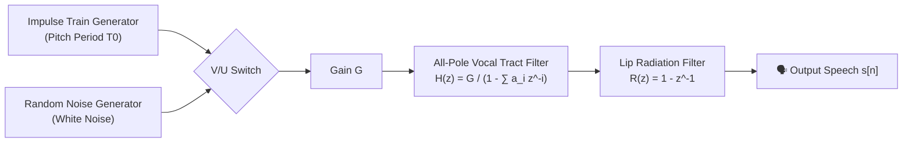
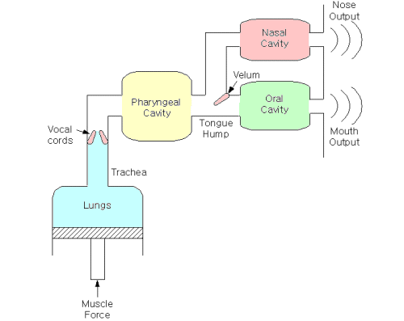
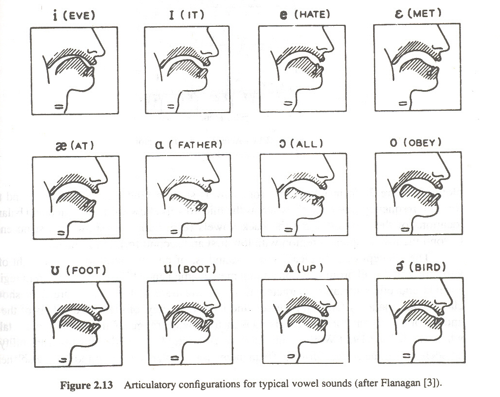
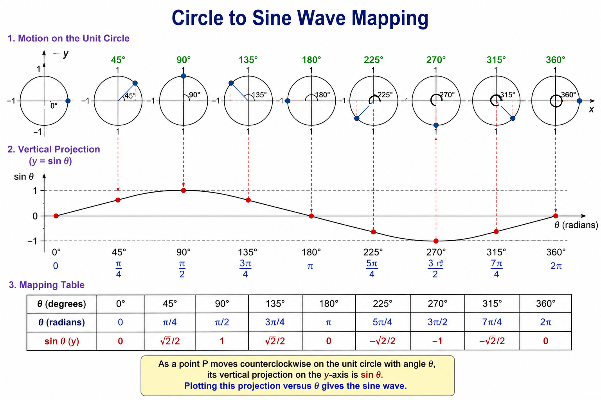
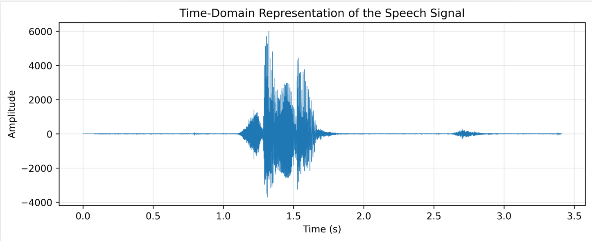
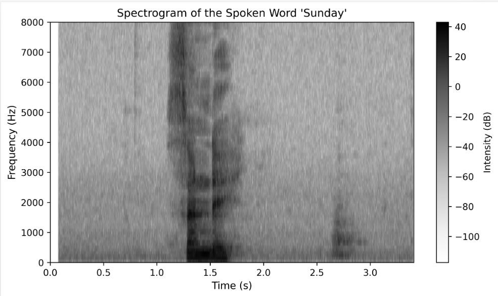
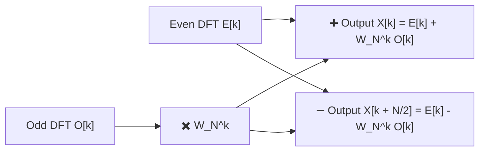
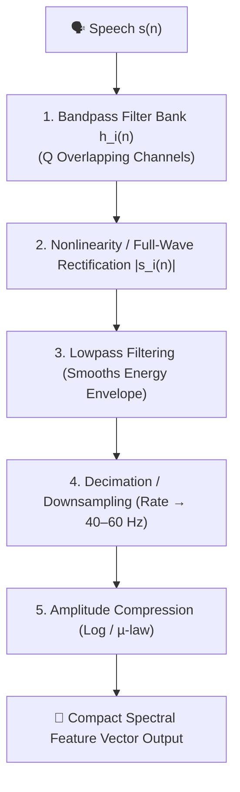
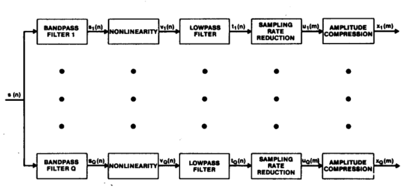
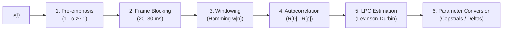

# Module 1: Speech Processing Concepts — Official Master Question Bank Solutions

> **Academic Course**: Speech and Video Processing (CS30033)  
> **Source Material**: Official Module-1 Question Bank by Dr. Kunal Anand (SCE, KIIT DU)  
> **Grading Structure**:  
> - **Part I: Short Answer Questions (SAQ 1 – SAQ 80)** $\to$ **2 Marks Each** (Crisp definitions, formulas, and key significance).  
> - **Part II: Long Answer Questions & Problems (LAQ 1 – LAQ 45)** $\to$ **5 Marks Each** (Detailed derivations, embedded diagrams, comparison matrices, and step-by-step numericals).

---

# Table of Contents
1. [Part I: Short Answer Questions (SAQ 1 – SAQ 80) — 2 Marks Each](#part-i-short-answer-questions-saq-1--saq-80)
2. [Part II: Long Answer Questions & Solved Problems (LAQ 1 – LAQ 45) — 5 Marks Each](#part-ii-long-answer-questions--solved-problems-laq-1--laq-45)

---

# Part I: Short Answer Questions (SAQ 1 – SAQ 80)

### SAQ 1: Define speech processing. Write the necessity of speech processing in modern world applications. (2 Marks)
**Answer:**
- **Definition (1 Mark)**: Speech processing is an interdisciplinary branch of Digital Signal Processing (DSP) and computational linguistics that studies speech acoustic signals and develops digital algorithms for their acquisition, analysis, synthesis, compression, enhancement, and recognition.
- **Necessity (1 Mark)**:
  - Enables natural hands-free Human-Computer Interaction (e.g., smart voice assistants like Alexa, Siri).
  - Achieves high-efficiency digital voice compression for 4G/5G cellular networks.
  - Essential for assistive technologies (screen readers for the blind, digital hearing aids).

---

### SAQ 2: Distinguish between speech transmission and speech processing. (2 Marks)
**Answer:**

| Parameter | Speech Transmission | Speech Processing |
| :--- | :--- | :--- |
| **Primary Objective** | Conveying audio signals from point A to B over physical channels without distortion. | Extracting information, modifying, analyzing, or synthesizing speech sounds. |
| **Information Extraction** | None (treats speech merely as a raw waveform). | High (extracts pitch, formants, phonemes, speaker identity, or text). |
| **Core Operations** | Modulation, channel equalization, error correction coding. | Linear prediction (LPC), MFCC feature extraction, spectral estimation. |

---

### SAQ 3: List out some application areas of digital speech processing. (2 Marks)
**Answer:**
1. **Automatic Speech Recognition (ASR)**: Voice typing, smart home control, and interactive voice response (IVR) systems.
2. **Speaker Identification & Verification**: Voice biometrics for secure financial authentication.
3. **Speech Synthesis / Text-to-Speech (TTS)**: Screen readers for the visually impaired, voice navigation.
4. **Speech Coding & Compression**: VoLTE, VoIP (Skype/Zoom), and digital mobile communications.
5. **Speech Enhancement**: Acoustic noise cancellation, hearing aids, and reverberation suppression.

---

### SAQ 4: Identify the elements of speech communication. (2 Marks)
**Answer:**
The speech communication chain consists of three main domains:
1. **Linguistic/Articulatory Domain**: Brain formulates message $\to$ motor nerves excite vocal tract organs (lungs, vocal folds, tongue, lips).
2. **Acoustic Domain**: Sound wave propagates through the air as continuous longitudinal pressure variations.
3. **Auditory/Perceptual Domain**: Acoustic wave enters listener's ear canal $\to$ eardrum/cochlea converts vibration to neural impulses $\to$ listener's brain decodes linguistic message.

---

### SAQ 5: Write the importance of velum in speech production system. (2 Marks)
**Answer:**
The **velum (soft palate)** acts as a physical acoustic valve that opens or closes the nasal cavity:
- **Nasal Sounds (/m/, /n/, /ŋ/)**: The velum lowers, allowing acoustic air flow to pass through the nasal cavity, introducing acoustic anti-resonances (zeros) into the spectrum.
- **Oral Sounds (Vowels, Stops, Fricatives)**: The velum raises against the pharyngeal wall, sealing off the nasal tract so air escapes exclusively through the oral cavity.

---

### SAQ 6: Identify different types of excitation source. (2 Marks)
**Answer:**
1. **Voiced Excitation**: Quasi-periodic glottal air pulses produced by the vibrating vocal cords (vocal folds) in the larynx (e.g., vowels `/a/`, `/i/`, `/u/`).
2. **Unvoiced Excitation**: Turbulent noise produced by forcing air through a narrow constriction in the vocal tract without vocal cord vibration (e.g., fricatives `/s/`, `/f/`, `/ʃ/`).
3. **Transient / Plosive Excitation**: Sudden release of built-up air pressure behind a complete vocal tract closure (e.g., stop consonants `/p/`, `/t/`, `/k/`).

---

### SAQ 7: Define phoneme. Identify different types of phonemes. (2 Marks)
**Answer:**
- **Definition (1 Mark)**: A phoneme is the smallest basic structural unit of speech sound in a language that can distinguish one word from another (e.g., `/p/` vs `/b/` in "pat" vs "bat").
- **Types of Phonemes (1 Mark)**:
  1. **Vowels** (Monophthongs, Diphthongs)
  2. **Semi-vowels / Glides** (`/w/`, `/j/`, `/l/`, `/r/`)
  3. **Consonants** (Stops/Plosives, Fricatives, Affricates, Nasals)

---

### SAQ 8: Define vowels. Write down different types of vowels. (2 Marks)
**Answer:**
- **Definition (1 Mark)**: Vowels are voiced speech sounds produced with an open, unobstructed vocal tract configuration, allowing air to flow freely without creating turbulent friction.
- **Types of Vowels (1 Mark)**:
  1. **Front Vowels**: Tongue hump positioned forward (e.g., `/i/` in "beet", `/e/` in "bait").
  2. **Central Vowels**: Tongue in central neutral position (e.g., `/ə/` in "about", `/ʌ/` in "but").
  3. **Back Vowels**: Tongue hump drawn backward (e.g., `/u/` in "boot", `/o/` in "boat").

---

### SAQ 9: Write the significance of F1 and F2 formant positions for vowels. (2 Marks)
**Answer:**
- **Formant $F_1$ (First Formant)**: Inversely related to **tongue height** (vowel openness). High vowels (`/i/`, `/u/`) have a low $F_1$ ($200–400\text{ Hz}$); low open vowels (`/a/`) have a high $F_1$ ($700–900\text{ Hz}$).
- **Formant $F_2$ (Second Formant)**: Directly related to **tongue advancement** (frontness/backness). Front vowels (`/i/`) have a high $F_2$ ($2000–2500\text{ Hz}$); back vowels (`/u/`) have a low $F_2$ ($800–1200\text{ Hz}$).
- *Significance*: The $(F_1, F_2)$ plane forms the acoustic vowel quadrilateral that uniquely identifies and categorizes all vowel sounds.

---

### SAQ 10: Define F1-F2 Centroid. What purpose it serves in the acoustic representation of speech sounds. (2 Marks)
**Answer:**
- **Definition (1 Mark)**: The $F_1$-$F_2$ Centroid is the geometric center of gravity $(\bar{F}_1, \bar{F}_2)$ of a cluster of formant data points measured across multiple repetitions of a specific vowel by a speaker or group.
- **Purpose (1 Mark)**: It reduces scatter variance, providing a robust, single-point reference coordinate per vowel for speaker normalization, vowel space area calculation, and automatic vowel classification.

---

### SAQ 11: Define F1-F2 Cluster. What purpose it serves in the acoustic representation of speech sound. (2 Marks)
**Answer:**
- **Definition (1 Mark)**: An $F_1$-$F_2$ Cluster is the two-dimensional spatial distribution of formant pair measurements $(F_1, F_2)$ plotted on a scatter diagram for a particular vowel class across different context environments and speakers.
- **Purpose (1 Mark)**: It defines the acoustic boundaries and degree of overlap between different vowel categories, aiding acoustic model training in speech recognizers and analyzing speaker variability.

---

### SAQ 12: Define diphthongs. How semivowels are different from diphthongs. (2 Marks)
**Answer:**
- **Diphthongs**: Complex vowel sounds produced by smoothly gliding from an initial vowel posture to a secondary vowel posture within a single syllable (e.g., `/aɪ/` in "buy", `/aʊ/` in "cow").
- **Difference from Semi-vowels**: Diphthongs act as full syllabic vowel nuclei with slow transition speeds. Semi-vowels (glides `/w/`, `/j/`) have faster transition rates, lower energy, and function as consonant margins surrounding a vowel nucleus rather than as syllabic centers.

---

### SAQ 13: Define consonants. List out different types of consonants. (2 Marks)
**Answer:**
- **Definition (1 Mark)**: Consonants are speech sounds produced by completely or partially obstructing, constricting, or diverting the airflow through the vocal tract.
- **Types of Consonants (1 Mark)**:
  1. **Stops / Plosives**: `/p/`, `/b/`, `/t/`, `/d/`, `/k/`, `/g/`
  2. **Fricatives**: `/f/`, `/v/`, `/s/`, `/z/`, `/ʃ/`, `/ʒ/`, `/θ/`, `/ð/`, `/h/`
  3. **Affricates**: `/tʃ/`, `/dʒ/`
  4. **Nasals**: `/m/`, `/n/`, `/ŋ/`
  5. **Approximants / Liquids / Glides**: `/w/`, `/j/`, `/l/`, `/r/`

---

### SAQ 14: How is the syllable different from phoneme? (2 Marks)
**Answer:**
- **Phoneme**: The smallest minimal acoustic sound unit without inherent meaning or independent pronunciation structure (e.g., `/k/`, `/æ/`, `/t/`).
- **Syllable**: A higher-level unit of pronunciation organization typically containing a central vowel nucleus (with optional onset and coda consonants) produced during a single chest pulse of air (e.g., "cat" `/kæt/` is one syllable made of 3 phonemes).

---

### SAQ 15: Identify the number of syllables in the word “spectrum”. (2 Marks)
**Answer:**
The word **"spectrum"** (`spec-trum`) contains **2 syllables**:
1. First syllable: `spec` (`/spɛk/`)
2. Second syllable: `trum` (`/trəm/`)

---

### SAQ 16: Define amplitude, frequency, and phase for a sinusoidal signal. (2 Marks)
**Answer:**
For a sinusoidal signal $x(t) = A \sin(2\pi f t + \phi)$:
- **Amplitude ($A$)**: The maximum peak excursion or displacement of the wave from its zero baseline (determines sound loudness).
- **Frequency ($f$)**: The number of complete oscillatory cycles performed per second, measured in Hertz ($\text{Hz}$) (determines pitch).
- **Phase ($\phi$)**: The fractional angle offset of the sinusoid relative to the time origin at $t=0$, measured in radians or degrees.

---

### SAQ 17: Differentiate between continuous time and discrete time signal. (2 Marks)
**Answer:**
- **Continuous-Time Signal $x(t)$**: Defined continuously for every real time instant $t \in (-\infty, +\infty)$ (e.g., raw acoustic pressure in air).
- **Discrete-Time Signal $x[n]$**: Defined only at discrete uniform sampling time instants $t = n T_s$, indexed by integer sample numbers $n \in \mathbb{Z}$ (e.g., sampled audio samples).

---

### SAQ 18: Differentiate between continuous-valued and discrete-valued signal. (2 Marks)
**Answer:**
- **Continuous-Valued Signal**: Signal amplitude can assume any infinitely precise real value within a continuous range (e.g., analog voltage from a microphone).
- **Discrete-Valued Signal**: Signal amplitude is restricted to a finite, quantized set of predefined discrete levels (e.g., 8-bit quantized values from $0$ to $255$).

---

### SAQ 19: “A speech signal considered as non-stationary and quasi-periodic in nature.” Write the significance of the above statement. (2 Marks)
**Answer:**
- **Non-Stationary**: Speech spectral parameters change dynamically over time as different phonemes are spoken. Consequently, speech cannot be analyzed globally; it must be processed in **short-time quasi-stationary frames ($20–30\text{ ms}$)**.
- **Quasi-Periodic**: Voiced speech exhibits repeating glottal cycles that are nearly periodic but vary slightly in pitch period ($T_0$) and amplitude from cycle to cycle.

---

### SAQ 20: Define digitization. Write the purpose of analog-to-digital converter in digitization. (2 Marks)
**Answer:**
- **Digitization (1 Mark)**: The overall process of converting a continuous analog physical wave into a discrete-time, discrete-amplitude binary sequence.
- **Purpose of ADC (1 Mark)**: Performs sampling (discretizing time), quantization (discretizing amplitude), and binary coding to produce a digital bitstream that microprocessors and computers can store, filter, and analyze.

---

### SAQ 21: Define sampling frequency. How is it related to sampling interval. (2 Marks)
**Answer:**
- **Sampling Frequency ($F_s$)**: The number of discrete sample measurements taken per second from a continuous signal, expressed in Hertz ($\text{Hz}$).
- **Sampling Interval ($T_s$)**: The uniform elapsed time between two consecutive discrete samples.
- **Relationship**: They are inversely proportional:
  $$T_s = \frac{1}{F_s} \iff F_s = \frac{1}{T_s}$$

---

### SAQ 22: For a given signal, if sampling frequency is 16KHz then determine the sampling interval. (2 Marks)
**Answer:**
Given $F_s = 16\text{ kHz} = 16,000\text{ Hz}$:

$$T_s = \frac{1}{F_s} = \frac{1}{16,000} = 0.0000625\text{ s} = \mathbf{62.5\,\mu\text{s} \quad (0.0625\text{ ms})}$$

---

### SAQ 23: Write Nyquist shannon Sampling theorem. (2 Marks)
**Answer:**
> *"To completely and accurately reconstruct a continuous band-limited signal from its discrete samples without distortion, the sampling rate ($F_s$) must be at least twice the highest frequency component ($f_{max}$) present in the signal."*

$$F_s \ge 2 f_{max}$$

---

### SAQ 24: Why sampling rate must not be below twice the highest frequency present in the signal. (2 Marks)
**Answer:**
If $F_s < 2 f_{max}$, the periodic spectral copies created by sampling overlap each other in the frequency domain. This spectral overlap causes high-frequency components to fold over into the lower frequency band (**aliasing**), permanently distorting the signal and making exact signal reconstruction impossible.

---

### SAQ 25: How nyquist rate is related to nyquist frequency? (2 Marks)
**Answer:**
- **Nyquist Rate ($F_{Nyq\_rate} = 2 f_{max}$)**: The *minimum sampling frequency* required to prevent aliasing for a signal with maximum frequency $f_{max}$.
- **Nyquist Frequency ($F_{Nyq\_freq} = F_s / 2$)**: The *highest frequency component* that can be unambiguously represented for a given sampling rate $F_s$.
- **Relationship**: $F_{Nyq\_rate} = 2 \times F_{Nyq\_freq}$.

---

### SAQ 26: Define aliasing. Write the effect of aliasing in signal processing. (2 Marks)
**Answer:**
- **Definition (1 Mark)**: Aliasing is a distortion phenomenon occurring when a signal is under-sampled ($F_s < 2 f_{max}$), causing high-frequency components to masquerade as lower frequencies.
- **Effect (1 Mark)**: High-frequency noise or harmonics fold back into the audible baseband, creating false tones, harsh distortion, and loss of original signal integrity.

---

### SAQ 27: List out the ways to avoid aliasing in signal processing. (2 Marks)
**Answer:**
1. **Sample at or above the Nyquist Rate**: Ensure $F_s \ge 2 f_{max}$.
2. **Apply an Anti-Aliasing Filter**: Pass the analog signal through an analog low-pass filter prior to sampling to attenuate all frequencies above $F_s / 2$.

---

### SAQ 28: Define quantization. Why is it a significant step in signal processing. (2 Marks)
**Answer:**
- **Definition (1 Mark)**: Quantization is the process of mapping a continuous-amplitude sample value to the nearest discrete level from a finite set of $L = 2^N$ allowed levels.
- **Significance (1 Mark)**: It converts infinite-precision real numbers into finite-length binary words ($N$ bits), making audio digital storage, transmission, and digital computer processing possible.

---

### SAQ 29: Define quantization step size. (2 Marks)
**Answer:**
Quantization step size ($\Delta$) is the constant amplitude difference between two adjacent discrete quantization voltage levels:

$$\Delta = \frac{V_{max} - V_{min}}{L} = \frac{V_{max} - V_{min}}{2^N}$$

where $V_{max} - V_{min}$ is the full input voltage range, and $N$ is the number of bits per sample.

---

### SAQ 30: A speech signal is uniformly quantized using 6 bits per sample over a range of ±3 V. Find the quantization step size (Δ). (2 Marks)
**Answer:**
- Bit resolution $N = 6 \implies L = 2^6 = 64\text{ levels}$.
- Voltage range $= +3\text{ V} - (-3\text{ V}) = 6\text{ V}$.

$$\Delta = \frac{6\text{ V}}{64} = \mathbf{0.09375\text{ V} \quad (93.75\text{ mV})}$$

---

### SAQ 31: Define quantization error. How quantization step size affects mean squared quantization error. (2 Marks)
**Answer:**
- **Quantization Error ($e[n]$)**: The difference between the unquantized sample amplitude $x[n]$ and its quantized level $x_q[n]$: $e[n] = x[n] - x_q[n]$.
- **Effect of Step Size**: The mean squared quantization error (noise power $\sigma_e^2$) is directly proportional to the square of the step size:
  $$\sigma_e^2 = \frac{\Delta^2}{12}$$
  Reducing step size $\Delta$ (by increasing bits $N$) quadratically reduces quantization noise power.

---

### SAQ 32: Discuss the time-domain representation of a speech signal. (2 Marks)
**Answer:**
A time-domain representation plots instantaneous speech amplitude (sound pressure or voltage) on the Y-axis against time (seconds or milliseconds) on the X-axis. It displays raw continuous or discrete speech waveforms directly as captured by a microphone.

---

### SAQ 33: What information can be gathered from the time-domain representation of a speech signal? (2 Marks)
**Answer:**
1. Overall signal duration and timing of speech events.
2. Word onsets, inter-syllabic pauses, and silence intervals.
3. Signal loudness / energy variations (envelope).
4. Pitch periods ($T_0$) during voiced speech segments.

---

### SAQ 34: Discuss the frequency-domain representation of a speech signal. (2 Marks)
**Answer:**
A frequency-domain representation (spectrum) plots signal energy magnitude (in dB or linear power) on the Y-axis against frequency (in Hz) on the X-axis. It is obtained by taking the Fourier Transform (FT/FFT) of the time-domain signal.

---

### SAQ 35: What information can be gathered from the frequency-domain representation of a speech signal? (2 Marks)
**Answer:**
1. Fundamental frequency ($F_0$ / pitch).
2. Harmonic structure and frequency energy distribution.
3. Vocal tract formant locations ($F_1, F_2, F_3$) and spectral envelope peaks.
4. Relative energy in voiced vs. unvoiced fricative frequency bands.

---

### SAQ 36: Write the significance of spectrogram in speech processing. (2 Marks)
**Answer:**
A **spectrogram** is a 2D time-frequency representation that combines time, frequency, and log energy (color intensity). Its significance lies in enabling simultaneous observation of *when* speech events occur and *which* formant frequencies are active, making it the primary diagnostic visual tool for speech research.

---

### SAQ 37: List out the application areas where spectrogram can be useful. (2 Marks)
**Answer:**
1. Phonetic segmentation and speech labeling.
2. Formant trajectory tracking in Automatic Speech Recognition (ASR).
3. Speaker identification and forensic voice analysis.
4. Speech pathology diagnosis and voice therapy.
5. Audio noise reduction and audio editing.

---

### SAQ 38: Define linear time invariant system along with its mathematical representation. (2 Marks)
**Answer:**
- **Definition**: An LTI system is a discrete-time operator $y[n] = T\{x[n]\}$ that obeys both **Linearity** (superposition) and **Time-Invariance**.
- **Mathematical Form**:
  $$y[n] = x[n] * h[n] = \sum_{k=-\infty}^{\infty} x[k] \, h[n - k]$$
  where $h[n] = T\{\delta[n]\}$ is the system impulse response.

---

### SAQ 39: Explain the major properties that are necessary for a discrete-time system to be LTI system. (2 Marks)
**Answer:**
1. **Linearity**: Satisfies superposition: $T\{a x_1[n] + b x_2[n]\} = a T\{x_1[n]\} + b T\{x_2[n]\}$.
2. **Time-Invariance**: Delaying input by $k$ delays output by $k$: If $x[n] \to y[n]$, then $x[n-k] \to y[n-k]$.

---

### SAQ 40: Write the principle of superposition with reference to an LTI system. (2 Marks)
**Answer:**
The principle of superposition states that the system response to a weighted linear combination of inputs equals the identical weighted linear combination of the individual system responses:

$$T\{a x_1[n] + b x_2[n]\} = a T\{x_1[n]\} + b T\{x_2[n]\} = a y_1[n] + b y_2[n]$$

comprising **Homogeneity (Scalability)**: $T\{a x[n]\} = a y[n]$ and **Additivity**: $T\{x_1[n] + x_2[n]\} = y_1[n] + y_2[n]$.

---

### SAQ 41: Define convolution. What role does impulse response play in convolution? (2 Marks)
**Answer:**
- **Convolution**: A mathematical operation combining an input sequence $x[n]$ and impulse response $h[n]$ to yield output $y[n] = \sum x[k] h[n-k]$.
- **Role of Impulse Response $h[n]$**: $h[n]$ completely characterizes the LTI system. Knowing $h[n]$ allows determining output $y[n]$ for *any* arbitrary input $x[n]$.

---

### SAQ 42: List out atleast three properties of convolution. (2 Marks)
**Answer:**
1. **Commutative**: $x[n] * h[n] = h[n] * x[n]$
2. **Associative**: $(x[n] * h_1[n]) * h_2[n] = x[n] * (h_1[n] * h_2[n])$
3. **Distributive**: $x[n] * (h_1[n] + h_2[n]) = (x[n] * h_1[n]) + (x[n] * h_2[n])$

---

### SAQ 43: Briefly describe the finite duration property of convolution. (2 Marks)
**Answer:**
If input sequence $x[n]$ has a finite length of $L_x$ samples and impulse response $h[n]$ has a finite length of $L_h$ samples, the convolved output sequence $y[n] = x[n] * h[n]$ has a finite length $L_y$ given by:

$$L_y = L_x + L_h - 1$$

---

### SAQ 44: Write the shortcomings of time-domain convolution. (2 Marks)
**Answer:**
1. **High Computational Complexity**: Direct convolution requires $O(N \cdot M)$ operations per frame.
2. **No Direct Frequency Insight**: Does not explicitly reveal filter frequency response, bandwidths, or formant peaks.
3. **Obscured System Characteristics**: Internal vocal tract poles (formants) and zeros (anti-resonances) cannot be directly estimated from time-domain convolution.

---

### SAQ 45: Define pole-zero modeling. (2 Marks)
**Answer:**
Pole-zero modeling is a mathematical technique that represents the vocal tract linear system using a $Z$-domain rational transfer function $H(z) = \frac{B(z)}{A(z)}$, characterizing the system by its complex poles (resonances) and zeros (anti-resonances).

---

### SAQ 46: Why pole-zero modeling is considered as one of the important process in speech processing. (2 Marks)
**Answer:**
Because it directly mirrors the physical speech production mechanism: **poles** model vocal tract formant resonances (vowels), while **zeros** model nasal coupling anti-resonances (nasals/fricatives). It allows compact parameterization of speech for LPC coding and ASR.

---

### SAQ 47: Describe vocal tract in terms of a transfer function in pole zero modeling. (2 Marks)
**Answer:**
$$H(z) = \frac{Y(z)}{X(z)} = G \frac{1 + \sum_{k=1}^{M} b_k z^{-k}}{1 - \sum_{k=1}^{N} a_k z^{-k}}$$

where $X(z)$ is glottal excitation, $Y(z)$ is output speech, $a_k$ are pole coefficients, and $b_k$ are zero coefficients.

---

### SAQ 48: What poles and zeros represent in the pole-zero modeling? (2 Marks)
**Answer:**
- **Poles ($A(z) = 0$)**: Represent **vocal tract formants** (resonant frequency peaks that amplify sound).
- **Zeros ($B(z) = 0$)**: Represent **acoustic anti-resonances** (spectral dips/notches that attenuate sound, e.g., nasal coupling).

---

### SAQ 49: What will be the impact on a linear system if the poles are set to zero? (2 Marks)
**Answer:**
If all poles are set to zero (excluding origin poles), $A(z) = 1$, converting the system into an **All-Zero / Finite Impulse Response (FIR) Filter**. The system loses its sharp resonant formant peaks and becomes unconditionally stable.

---

### SAQ 50: What will be the impact on a linear system if the zeros are set to zero? (2 Marks)
**Answer:**
If all zeros are set to zero (excluding origin zeros), $B(z) = G$, converting the system into an **All-Pole / Infinite Impulse Response (IIR) Filter**. This forms the basis of Linear Predictive Coding (LPC), efficiently modeling vocal tract vowel formants.

---

### SAQ 51: What role does Fourier transform play in speech processing? (2 Marks)
**Answer:**
The Fourier Transform converts time-domain speech waveforms into frequency spectra, enabling short-time spectral analysis, formant estimation, pitch extraction, sub-band filtering, and noise suppression.

---

### SAQ 52: How can a sinusoidal signal be represented in complex exponential? (2 Marks)
**Answer:**
Using Euler's identity $\cos(\theta) = \frac{1}{2}(e^{j\theta} + e^{-j\theta})$:

$$A \cos(2\pi f_0 t + \phi) = \frac{A}{2} e^{j\phi} e^{j 2\pi f_0 t} + \frac{A}{2} e^{-j\phi} e^{-j 2\pi f_0 t}$$

---

### SAQ 53: Write about the importance of dirac delta function in Fourier transform. (2 Marks)
**Answer:**
The Dirac delta function $\delta(f - f_0)$ represents an idealized spectral line carrying concentrated energy exclusively at frequency $f_0$. It allows pure sinusoids and periodic signals to be represented in the continuous Fourier Transform domain as discrete spectral spikes.

---

### SAQ 54: List out the properties of fourier transform. (2 Marks)
**Answer:**
1. **Linearity**: $\mathcal{F}\{a x_1 + b x_2\} = a X_1(f) + b X_2(f)$
2. **Time Shift**: $\mathcal{F}\{x(t-t_0)\} = X(f) e^{-j 2\pi f t_0}$
3. **Frequency Shift**: $\mathcal{F}\{x(t) e^{j 2\pi f_0 t}\} = X(f-f_0)$
4. **Convolution Property**: $\mathcal{F}\{x(t)*h(t)\} = X(f) \cdot H(f)$

---

### SAQ 55: Define inverse fourier transform. (2 Marks)
**Answer:**
The Inverse Fourier Transform reconstructs a continuous time-domain signal $x(t)$ from its continuous frequency-domain spectrum $X(f)$:

$$x(t) = \int_{-\infty}^{\infty} X(f) \, e^{j 2\pi f t} \, df$$

---

### SAQ 56: Explain discrete time fourier transform with its mathematical representation. (2 Marks)
**Answer:**
The DTFT transforms a discrete-time sequence $x[n]$ into a continuous, $2\pi$-periodic frequency spectrum $X(e^{j\omega})$:

$$X(e^{j\omega}) = \sum_{n=-\infty}^{\infty} x[n] \, e^{-j\omega n}, \quad \omega \in [-\pi, \pi]$$

---

### SAQ 57: Define inverse DTFT. (2 Marks)
**Answer:**
The Inverse DTFT reconstructs discrete sequence $x[n]$ from continuous periodic spectrum $X(e^{j\omega})$:

$$x[n] = \frac{1}{2\pi} \int_{-\pi}^{\pi} X(e^{j\omega}) \, e^{j\omega n} \, d\omega$$

---

### SAQ 58: Define discrete fourier transform along with its mathematical representation. (2 Marks)
**Answer:**
The DFT converts an $N$-point finite discrete sequence $x[n]$ into $N$ discrete frequency bin samples $X[k]$:

$$X[k] = \sum_{n=0}^{N-1} x[n] \, e^{-j \frac{2\pi}{N} k n}, \quad k = 0, 1, \dots, N-1$$

---

### SAQ 59: What is basis function in DFT? (2 Marks)
**Answer:**
The complex exponential sequences $\phi_k[n] = e^{-j \frac{2\pi}{N} k n}$ for $k = 0, 1, \dots, N-1$ are the **DFT basis functions**. They represent discrete complex harmonically-related sinusoids used to decompose the signal.

---

### SAQ 60: Write the orthogonality principle of DFT basis function. (2 Marks)
**Answer:**
$$\sum_{n=0}^{N-1} e^{j \frac{2\pi}{N} k n} e^{-j \frac{2\pi}{N} m n} = \begin{cases} N, & k = m \\ 0, & k \neq m \end{cases}$$

---

### SAQ 61: Explain spectral leakage. (2 Marks)
**Answer:**
Spectral leakage occurs when signal frequency components do not align exactly with discrete DFT bin frequencies ($k \frac{F_s}{N}$). Frame edge truncation discontinuities cause spectral energy to leak from the true frequency into adjacent bins.

---

### SAQ 62: Discuss the significance of even odd decomposition in fast fourier transform. (2 Marks)
**Answer:**
Even-odd decomposition splits an $N$-point DFT into two $\frac{N}{2}$-point DFTs (even-indexed samples $x[2m]$ and odd-indexed samples $x[2m+1]$). This divide-and-conquer strategy reduces computational complexity from $O(N^2)$ to $O(N \log_2 N)$.

---

### SAQ 63: Define twiddle factor in FFT. (2 Marks)
**Answer:**
The **Twiddle Factor** $W_N^k$ is a complex exponential phase factor defined as:

$$W_N^k = e^{-j \frac{2\pi}{N} k}$$

It satisfies symmetry ($W_N^{k+N/2} = -W_N^k$) and periodicity ($W_N^{k+N} = W_N^k$).

---

### SAQ 64: Explain butterfly network in FFT. (2 Marks)
**Answer:**
A **Butterfly Unit** is the elementary computational block of an FFT. It takes two inputs $A$ and $B$, multiplies $B$ by twiddle factor $W_N^k$, and computes $X = A + W_N^k B$ and $Y = A - W_N^k B$.

---

### SAQ 65: What information does spectral envelope carry? (2 Marks)
**Answer:**
The **spectral envelope** represents the smooth curve connecting spectral formant peaks. It carries **linguistic phoneme information** (vowel identity) and **vocal tract system characteristics**, independent of pitch excitation.

---

### SAQ 66: List out different types of filters in signal processing. (2 Marks)
**Answer:**
1. Low-pass Filter (LPF)
2. High-pass Filter (HPF)
3. Band-pass Filter (BPF)
4. Band-stop / Notch Filter
5. All-pass Filter

---

### SAQ 67: Distinguish between uniform and non-uniform digital filters. (2 Marks)
**Answer:**
- **Uniform Filter Banks**: Filters are spaced at equal frequency intervals across the spectrum, all having identical bandwidths.
- **Non-Uniform Filter Banks**: Filters have varying bandwidths (narrower at low frequencies, wider at high frequencies) matching human auditory perception (e.g., Mel/Bark scale).

---

### SAQ 68: How full wave rectifier is different from half wave rectifier? (2 Marks)
**Answer:**
- **Full-Wave Rectifier**: Converts negative signal halves into positive values ($y[n] = |x[n]|$), preserving $100\%$ of signal energy.
- **Half-Wave Rectifier**: Sets negative signal values to zero ($y[n] = \max(0, x[n])$), discarding half the signal energy.

---

### SAQ 69: Write the significance of Mel-Scale in speech processing. (2 Marks)
**Answer:**
The Mel scale mimics human pitch perception (linear below $1000\text{ Hz}$, logarithmic above $1000\text{ Hz}$). Using Mel-spaced filter banks produces features (MFCCs) that closely match human auditory discrimination for ASR.

---

### SAQ 70: List out some application areas of filter bank model. (2 Marks)
**Answer:**
1. Feature extraction for Automatic Speech Recognition (MFCCs).
2. Sub-band speech coding (MP3, AAC).
3. Hearing aid frequency compensation.
4. Speaker identification.

---

### SAQ 71: What are the shortcomings of filter bank model. (2 Marks)
**Answer:**
1. Limited frequency resolution within individual filter channels.
2. Fixed filter bandwidths do not adapt to dynamic speech pitch.
3. Does not explicitly model underlying vocal tract physical acoustics (no all-pole model).

---

### SAQ 72: Define linear prediction along with its mathematical representation. (2 Marks)
**Answer:**
Linear prediction estimates the present speech sample $\hat{s}[n]$ as a linear weighted sum of $p$ past speech samples:

$$\hat{s}[n] = \sum_{i=1}^{p} a_i s[n-i]$$

where $p$ is prediction order and $\{a_i\}$ are LPC predictor coefficients.

---

### SAQ 73: What is prediction error in linear prediction? (2 Marks)
**Answer:**
Prediction error $e[n]$ is the residual difference between the actual speech sample $s[n]$ and the predicted sample $\hat{s}[n]$:

$$e[n] = s[n] - \hat{s}[n] = s[n] - \sum_{i=1}^{p} a_i s[n-i]$$

---

### SAQ 74: How does the prediction order impact an LPC model? (2 Marks)
**Answer:**
- **Too Low ($p < 8$)**: Model cannot capture all vocal tract formant resonances.
- **Optimal ($p \approx 10–16$)**: Accurately models $4–5$ formants plus spectral tilt.
- **Too High ($p > 24$)**: Fits glottal noise/pitch harmonics, increasing computation and over-fitting.

---

### SAQ 75: What role does an all-pole filter play in LPC model? (2 Marks)
**Answer:**
The all-pole filter $H(z) = \frac{G}{1 - \sum a_i z^{-i}}$ models the **vocal tract transfer function**. Its complex poles represent vocal tract formant resonances ($F_1, F_2, F_3$).

---

### SAQ 76: Define the term excitation gain in LPC. (2 Marks)
**Answer:**
Excitation gain ($G$) is a scaling factor in the LPC model that controls the amplitude/energy strength of the input excitation source $u[n]$ to match the total energy of the input speech frame.

---

### SAQ 77: List out typical model parameters in LPC. (2 Marks)
**Answer:**
1. Voiced / Unvoiced classification decision.
2. Pitch period ($T_0$) for voiced speech.
3. Excitation gain ($G$).
4. LPC predictor coefficients ($a_1, a_2, \dots, a_p$).

---

### SAQ 78: Explain autocorrelation along with its mathematical representation. (2 Marks)
**Answer:**
Autocorrelation measures the self-similarity of a signal sequence $s[n]$ with its time-lagged version $s[n-k]$:

$$R[k] = \sum_{n=-\infty}^{\infty} s[n] \, s[n-k]$$

---

### SAQ 79: How does the covariance method differ from autocorrelation method? (2 Marks)
**Answer:**
- **Autocorrelation Method**: Tapers frame edges with a window (Hamming), yields a symmetric **Toeplitz matrix**, and guarantees filter stability.
- **Covariance Method**: Uses unwindowed samples within the analysis interval, yields a symmetric **non-Toeplitz matrix**, and stability is not guaranteed.

---

### SAQ 80: Write the whitening behavior of LPC model. (2 Marks)
**Answer:**
Filtering speech $s[n]$ through the inverse LPC filter $A(z) = 1 - \sum a_i z^{-i}$ removes vocal tract formant peaks, producing an error residual $e[n]$ with a flat, white noise-like spectrum (**Spectral Whitening**).

---

# Part II: Long Answer Questions & Solved Problems (LAQ 1 – LAQ 45)

### LAQ 1: Explain the speech processing model with suitable diagram. (5 Marks)

#### Answer:
**1. System Architecture Block Diagram (2 Marks)**

**2. Functional Descriptions of Components (3 Marks)**
- **Glottal Excitation Generator (1 Mark)**: Produces periodic impulse train for voiced speech or flat Gaussian white noise for unvoiced speech.
- **Excitation Gain ($G$) (0.5 Mark)**: Scales source amplitude to match the target frame energy.
- **Vocal Tract Filter $H(z)$ (1 Mark)**: A digital all-pole filter modeling oral-pharyngeal cavity resonances (formants).
- **Lip Radiation Filter $R(z)$ (0.5 Mark)**: First-order differentiator $R(z) = 1 - z^{-1}$ providing $+6\text{ dB/octave}$ high-frequency boosting.

---

### LAQ 2: Describe the speech production system with a schematic diagram. (5 Marks)

#### Answer:
**1. Anatomical Schematic (2 Marks)**

*Figure LAQ 2.1: Anatomical Schematic of Human Speech Production Organs*

**2. Three Primary Subsystems (3 Marks)**
1. **Lungs & Trachea (Subglottal System)**: Acts as an aerodynamic air compressor providing airflow.
2. **Larynx & Vocal Folds**: Generates voiced periodic pitch vibrations ($F_0$) or unvoiced turbulence.
3. **Vocal Tract Cavities (Pharyngeal, Oral, Nasal)**: Shape acoustic sound waves through moving articulators (tongue, velum, lips).

---

### LAQ 3: Define vowels. Explain different types of vowels with suitable examples for each of them. (5 Marks)

#### Answer:
**1. Definition & Formation (1.5 Marks)**
Vowels are voiced acoustic sounds produced without vocal tract constriction, allowing air to escape freely without friction noise.

**2. Vowel Classification Tree & Formant Mappings (3.5 Marks)**

*Figure LAQ 3.1: Tongue Position Profiles for American English Vowels*

---

### LAQ 4: How are the diphthongs and semi vowels different from each other? List out atleast two examples for diphthongs and semi vowels. (5 Marks)

#### Answer:

| Comparison Attribute | Diphthongs | Semi-Vowels (Glides) | Marks |
| :--- | :--- | :--- | :---: |
| **Syllabic Function** | Functions as **syllabic nucleus** (core vowel of syllable). | Functions as **consonantal margin** (onset/coda). | **1.5 Marks** |
| **Transition Rate** | Slower transition rate ($150–250\text{ ms}$), high acoustic power. | Rapid transition rate ($40–100\text{ ms}$), lower power. | **1.5 Marks** |
| **Formant Dynamics** | Sustained trajectory between two distinct vowel targets. | Gliding trajectory moving immediately into next vowel. | **1 Mark** |
| **Standard Examples** | 1. `/aɪ/` as in *"buy"*, *"eye"* 2. `/aʊ/` as in *"cow"*, *"now"* | 1. `/w/` as in *"wet"*, *"win"* 2. `/j/` as in *"yes"*, *"you"* | **1 Mark** |

---

### LAQ 5: Explain consonants. Discuss different types of consonants with suitable examples. (5 Marks)

#### Answer:
**1. Definition of Consonants (1 Mark)**
Consonants are speech sounds produced by completely closing, severely constricting, or diverting airflow in the vocal tract.

**2. Five Main Consonant Categories with Examples (4 Marks)**
1. **Stops / Plosives (1 Mark)**: Complete closure $\to$ pressure buildup $\to$ sudden burst release (`/p/`, `/b/`, `/t/`, `/d/`, `/k/`, `/g/`).
2. **Fricatives (1 Mark)**: Turbulent noise forced through a narrow constriction (`/f/`, `/v/`, `/s/`, `/z/`, `/ʃ/`, `/ʒ/`, `/θ/`, `/ð/`, `/h/`).
3. **Affricates (0.5 Mark)**: A stop occlusion released into a fricative (`/tʃ/` in *"church"*, `/dʒ/` in *"judge"*).
4. **Nasals (1 Mark)**: Oral closure with open velum, routing air through nasal cavity (`/m/`, `/n/`, `/ŋ/`).
5. **Approximants / Liquids / Glides (0.5 Mark)**: Smooth constriction-free gliding (`/w/`, `/j/`, `/l/`, `/r/`).

---

### LAQ 6: Compare and contrast the continuous-time and discrete-time signals. How is the continuous-valued signal different from the discrete-valued signal? (5 Marks)

#### Answer:
**1. Continuous-Time vs. Discrete-Time Signals (2.5 Marks)**

| Parameter | Continuous-Time Signal $x(t)$ | Discrete-Time Signal $x[n]$ |
| :--- | :--- | :--- |
| **Time Variable** | Continuous real variable $t \in (-\infty, +\infty)$ | Integer sample index $n \in \mathbb{Z}$ |
| **Domain Definition** | Defined at every continuous time instant | Defined exclusively at uniform sampling instants $t = nT_s$ |
| **Sinusoidal Formula** | $x(t) = A \sin(\Omega t + \phi)$, $\Omega = 2\pi f\text{ (rad/s)}$ | $x[n] = A \sin(\omega n + \phi)$, $\omega = 2\pi f / F_s\text{ (rad/sample)}$ |

*Figure LAQ 6.1: Comparison of Continuous-Time and Discrete-Time Signals*

**2. Continuous-Valued vs. Discrete-Valued Signals (2.5 Marks)**
- **Continuous-Valued**: Amplitude can assume any infinite-precision real number.
- **Discrete-Valued**: Amplitude is restricted to a finite set of $L = 2^N$ allowed levels.
- **Digital Signal Definition**: A signal that is **both discrete-time and discrete-valued**, encoded as binary words.

---

### LAQ 7: Discuss the architecture of a digital signal processing system with a neat diagram. (5 Marks)

#### Answer:
**1. Complete System Architecture Block Diagram (2 Marks)**

**2. Detailed Descriptions of Stages (3 Marks)**
1. **Transducer & Pre-Amp (0.5 Mark)**: Converts acoustic pressure into continuous analog voltage $x_a(t)$.
2. **Anti-Aliasing Filter (0.5 Mark)**: Low-pass filter removing all analog frequencies above $F_s/2$.
3. **Sampler (C/D) (0.5 Mark)**: Discretizes time at uniform intervals $T_s = 1/F_s$, generating $x[n] = x_a(n T_s)$.
4. **Quantizer & ADC (0.5 Mark)**: Converts continuous sample amplitudes into $N$-bit binary digital words.
5. **DSP Processor (0.5 Mark)**: Executes filtering, FFT, LPC, or pattern recognition algorithms.
6. **DAC & Reconstruction Filter (0.5 Mark)**: Converts processed digital samples back into continuous analog sound.

---

### LAQ 8: Define sampling. How does sampling interval and sampling frequency relate to each other? Write the significance of bandwidth in sampling. (5 Marks)

#### Answer:
**1. Definition of Sampling (1.5 Marks)**
Sampling is the process of measuring the amplitude of a continuous-time analog signal $x_a(t)$ at uniform discrete time instants $t = n T_s$ to obtain a discrete sequence $x[n] = x_a(n T_s)$.

**2. Mathematical Relation (1.5 Marks)**
$$T_s = \frac{1}{F_s} \iff F_s = \frac{1}{T_s}$$

**3. Significance of Bandwidth in Sampling (2 Marks)**
- **Nyquist Rate Requirement**: Bandwidth $B = f_{max}$ determines the minimum sampling rate ($F_{s,\min} = 2B = 2f_{max}$).
- **Telephony Standard**: Telephone speech bandwidth is restricted to $300–3400\text{ Hz}$ ($f_{max} \approx 4\text{ kHz}$), requiring $F_s = 8\text{ kHz}$.
- **High-Fidelity Audio**: Human hearing spans up to $20\text{ kHz}$, requiring $F_s = 44.1\text{ kHz}$ (CD audio) to capture all audible harmonics.

---

### LAQ 9: Explain Nyquist-Shannon sampling theorem. Discuss the issue of aliasing with respect to sampling. How can the aliasing can be overcome? (5 Marks)

#### Answer:
**1. Nyquist-Shannon Theorem Statement (1.5 Marks)**
> *"A continuous band-limited signal containing frequencies no higher than $f_{max}$ can be uniquely and completely reconstructed from its samples if the sampling rate $F_s$ satisfies:"*
$$F_s \ge 2 f_{max}$$

**2. The Aliasing Problem (2 Marks)**
When $F_s < 2 f_{max}$ (under-sampling), periodic repetitions of the spectrum centered at multiples of $F_s$ overlap in frequency. High frequencies fold back into the lower baseband, permanently corrupting the signal.

**3. Countermeasures to Overcome Aliasing (1.5 Marks)**
1. **Maintain Proper Sampling Rate**: Ensure $F_s \ge 2 f_{max}$.
2. **Anti-Aliasing Low-Pass Filter**: Pre-filter the analog signal with an analog low-pass filter ($f_c \le F_s / 2$) prior to sampling.

---

### LAQ 10: Define quantization step size along with its mathematical representation. How does the bits per sample affect the quantization step size? (5 Marks)

#### Answer:
**1. Definition & Mathematical Formula (2 Marks)**
Quantization step size ($\Delta$) is the uniform amplitude interval between adjacent discrete quantization levels:

$$\Delta = \frac{V_{max} - V_{min}}{L} = \frac{V_{max} - V_{min}}{2^N}$$

where $V_{max} - V_{min}$ is full-scale voltage range and $N$ is bits/sample.

**2. Effect of Bits Per Sample ($N$) (3 Marks)**
- **Exponential Reduction**: Each additional bit doubles $L$ and **halves step size $\Delta$** ($\Delta_{N+1} = \Delta_N / 2$).
- **Noise Power Reduction**: Mean squared quantization noise power $\sigma_e^2 = \frac{\Delta^2}{12}$ drops by a factor of 4 ($75\%$).
- **6 dB Rule**: Signal-to-Quantization-Noise Ratio increases by approximately $6.02\text{ dB}$ per bit added:
  $$\text{SQNR} \approx 6.02 N + 1.76\text{ dB}$$

---

### LAQ 11 (Solved Problem): A speech signal is uniformly quantized using 8 bits per sample over a range of ±2 V. If the sampling frequency is 16 kHz, determine the quantization step size (Δ). Also, find out the size of the file for a 5-second recording. (5 Marks)

#### Solution:

**1. Given Data (1 Mark):**
- $N = 8\text{ bits/sample} \implies L = 2^8 = 256\text{ levels}$
- Voltage range: $V_{min} = -2\text{ V}$, $V_{max} = +2\text{ V} \implies \Delta V = 2 - (-2) = 4\text{ V}$
- Sampling frequency: $F_s = 16\text{ kHz} = 16,000\text{ Hz}$
- Duration: $T = 5\text{ seconds}$

**2. Quantization Step Size ($\Delta$) Calculation (2 Marks):**
$$\Delta = \frac{V_{max} - V_{min}}{L} = \frac{4\text{ V}}{256} = \mathbf{0.015625\text{ V} \quad (15.625\text{ mV})}$$

**3. Digital File Size Calculation (2 Marks):**
- Total samples = $F_s \times T = 16,000 \times 5 = 80,000\text{ samples}$
- Total bits = $80,000 \times 8 = 640,000\text{ bits}$
- Total bytes = $\frac{640,000}{8} = 80,000\text{ bytes}$

$$\text{File Size (Decimal KB)} = \frac{80,000}{1000} = \mathbf{80\text{ KB}}$$
$$\text{File Size (Binary KiB)} = \frac{80,000}{1024} = \mathbf{78.125\text{ KiB}}$$

---

### LAQ 12 (Solved Problem): A speech signal has an amplitude range of −1.5 V to +1.5 V and is quantized using 10 bits per sample. The sampling frequency is 16 kHz. For a recording duration of 20 seconds, determine: (1) Quantization step size, (2) Total number of samples, (3) Total number of bits required, (4) Approximate file size in KB. (5 Marks)

#### Solution:

**1. Quantization Step Size ($\Delta$) (1.5 Marks):**
- Voltage range $\Delta V = +1.5 - (-1.5) = 3.0\text{ V}$
- $N = 10\text{ bits} \implies L = 2^{10} = 1024\text{ levels}$
$$\Delta = \frac{3.0\text{ V}}{1024} = \mathbf{0.0029296875\text{ V} \quad (2.93\text{ mV})}$$

**2. Total Number of Samples (1 Mark):**
$$N_{samples} = F_s \times T = 16,000\text{ Hz} \times 20\text{ s} = \mathbf{320,000\text{ samples}}$$

**3. Total Number of Bits Required (1 Mark):**
$$N_{bits} = N_{samples} \times N = 320,000 \times 10 = \mathbf{3,200,000\text{ bits}}$$

**4. File Size in KB (1.5 Marks):**
$$\text{Total Bytes} = \frac{3,200,000\text{ bits}}{8} = 400,000\text{ bytes}$$
$$\text{File Size (Decimal KB)} = \frac{400,000}{1000} = \mathbf{400\text{ KB}}$$
$$\text{File Size (Binary KiB)} = \frac{400,000}{1024} = \mathbf{390.625\text{ KiB}}$$

---

### LAQ 13 (Solved Problem): A 10-bit ADC converts analog signals in the range −5 V to +5 V. Determine Quantization step size, maximum quantization error, and mean squared quantization error. (5 Marks)

#### Solution:

**1. Given Data (1 Mark):**
- Range $\Delta V = +5 - (-5) = 10\text{ V}$, $N = 10\text{ bits} \implies L = 2^{10} = 1024\text{ levels}$.

**2. Quantization Step Size ($\Delta$) (1.5 Marks):**
$$\Delta = \frac{10\text{ V}}{1024} = \mathbf{0.009765625\text{ V} \quad (9.7656\text{ mV})}$$

**3. Maximum Quantization Error ($e_{max}$) (1 Mark):**
$$e_{max} = \frac{\Delta}{2} = \frac{0.009765625\text{ V}}{2} = \mathbf{0.0048828125\text{ V} \quad (4.8828\text{ mV})}$$

**4. Mean Squared Quantization Error ($\sigma_e^2$) (1.5 Marks):**
$$\sigma_e^2 = \frac{\Delta^2}{12} = \frac{(0.009765625)^2}{12} = \frac{9.536743 \times 10^{-5}}{12} = \mathbf{7.94728 \times 10^{-6}\text{ V}^2}$$

---

### LAQ 14: Suppose the ADC is modified to operate with a 12-bit resolution instead of 10-bit resolution. Discuss how this change affects the ADC's operation. (5 Marks)

#### Answer:
**1. Quantitative Comparison (2.5 Marks)**
For $10\text{ V}$ full-scale range:
- **10-bit ADC**: $L_{10} = 1024 \implies \Delta_{10} = 0.009766\text{ V}$, $\sigma_{e,10}^2 = 7.947 \times 10^{-6}\text{ V}^2$.
- **12-bit ADC**: $L_{12} = 4096 \implies \Delta_{12} = 0.002441\text{ V}$, $\sigma_{e,12}^2 = 4.967 \times 10^{-7}\text{ V}^2$.

**2. Operational & Performance Impacts (2.5 Marks)**
1. **Resolution & Error**: Step size $\Delta$ and maximum error $e_{max}$ decrease by **$75\%$ (factor of 4)**.
2. **Noise Power**: Quantization noise drops by a factor of $16$ ($4^2$), boosting **SQNR by $+12.04\text{ dB}$**.
3. **Data Bitrate & Storage**: Data storage increases by **$20\%$** ($12\text{ bits}$ vs. $10\text{ bits}$).

---

### LAQ 15 (Solved Problem): A speech acquisition system samples a signal at 16 kHz using a 10-bit ADC over the input range −1.5 V to +1.5 V. Calculate Quantization step size, maximum quantization error, and mean squared quantization error. (5 Marks)

#### Solution:

**Given:**
- $F_s = 16,000\text{ Hz}$, $N = 10\text{ bits} \implies L = 1024$, Range $\Delta V = 3.0\text{ V}$.

1. **Quantization Step Size ($\Delta$) (1.5 Marks):**
   $$\Delta = \frac{3.0\text{ V}}{1024} = \mathbf{0.0029296875\text{ V} \quad (2.93\text{ mV})}$$

2. **Maximum Quantization Error ($e_{max}$) (1.5 Marks):**
   $$e_{max} = \frac{\Delta}{2} = \frac{0.0029296875}{2} = \mathbf{0.00146484375\text{ V} \quad (1.46\text{ mV})}$$

3. **Mean Squared Quantization Error ($\sigma_e^2$) (2 Marks):**
   $$\sigma_e^2 = \frac{\Delta^2}{12} = \frac{(0.0029296875)^2}{12} = \frac{8.583069 \times 10^{-6}}{12} = \mathbf{7.152557 \times 10^{-7}\text{ V}^2}$$

---

### LAQ 16: Discuss the time-domain and frequency-domain representations of a speech signal. Write the significance of the axes used in both the representations. (5 Marks)

#### Answer:
**1. Visual Representations & Axes Significance (3 Marks)**
- **Time-Domain (X: Time in s, Y: Amplitude in V/Pa)**: Shows physical pressure oscillations over time. Captures speech onset, pauses, and pitch periods.
- **Frequency-Domain (X: Frequency in Hz, Y: Magnitude in dB)**: Shows spectral energy distribution across frequencies ($0\text{ Hz}$ to $F_s/2$). Captures formants ($F_1, F_2$) and harmonics.

*Figure LAQ 16.1: Time-Domain Waveform (Top) vs. Frequency Spectrum (Bottom)*

**2. Complementary Roles (2 Marks)**
Time-domain shows *when* acoustic events occur, while frequency-domain reveals *what* specific resonances and harmonic frequencies are active.

---

### LAQ 17: Differentiate between time-domain and frequency domain representations of a speech signal. (5 Marks)

#### Answer:

| Comparison Criterion | Time-Domain Representation | Frequency-Domain Representation | Marks |
| :--- | :--- | :--- | :---: |
| **Independent & Dependent Axes** | X-axis: Time ($\text{s}$ or $\text{ms}$) Y-axis: Instantaneous Amplitude ($\text{V}$ or $\text{Pa}$) | X-axis: Frequency ($\text{Hz}$) Y-axis: Magnitude Power ($\text{dB}$) | **1.5 Marks** |
| **Physical Information** | Onsets, pauses, duration, pitch period ($T_0$), short-time energy envelope. | Fundamental frequency ($F_0$), vocal tract formants ($F_1, F_2, F_3$), harmonic spacing, spectral tilt. | **1.5 Marks** |
| **Transformation Method** | Direct sampling via ADC hardware. | Computed via Discrete Fourier Transform (DFT / FFT). | **1 Mark** |
| **Speech Processing Application** | Voice Activity Detection (VAD), silence removal, frame blocking. | Speech recognition (ASR), pitch tracking, formant analysis, noise filtering. | **1 Mark** |

---

### LAQ 18: Define spectrogram. How can be a spectrogram can be created for a given speech signal? Why is the spectrogram needed in the speech signal processing? (5 Marks)

#### Answer:
**1. Definition of Spectrogram (1 Mark)**  
A spectrogram is a 2D time-frequency representation displaying how spectral energy evolves over time.

*Figure LAQ 18.1: Time-Frequency Spectrogram of Spoken Utterance "Sunday"*

**2. Generation via Short-Time Fourier Transform (STFT) (2 Marks)**
1. Speech $s[n]$ is segmented into short overlapping frames ($20–30\text{ ms}$).
2. Each frame is windowed with a Hamming window $w[n]$ to prevent spectral leakage.
3. The DFT/FFT is computed per frame:
   $$\text{STFT}\{s[n]\}(m, \omega) = \sum_{n=-\infty}^{\infty} s[n] w[n - m] e^{-j\omega n}$$
4. Log power $|\text{STFT}|^2$ is plotted as color/dark intensity vs. time and frequency.

**3. Need in Speech Processing (2 Marks)**
- Visualizes dynamic formant trajectories ($F_1, F_2, F_3$) as articulators move.
- Distinguishes voiced vertical glottal striations from unvoiced diffuse noise.
- Provides visual phonetic segmentation for Automatic Speech Recognition (ASR).

---

### LAQ 19: Define Linear Time Invariant (LTI) system. Discuss the necessary properties for a discrete system to be an LTI system. (5 Marks)

#### Answer:
**1. Definition of LTI System (1 Mark)**  
A discrete-time system $y[n] = T\{x[n]\}$ is an LTI system if it satisfies both **Linearity** and **Time-Invariance**.

**2. Necessary Properties & Mathematical Conditions (4 Marks)**
1. **Linearity (Superposition Principle) (2 Marks)**:
   - *Scalability (Homogeneity)*: $T\{a \cdot x[n]\} = a \cdot T\{x[n]\}$
   - *Additivity*: $T\{x_1[n] + x_2[n]\} = T\{x_1[n]\} + T\{x_2[n]\}$
   - *Superposition Equation*:
     $$T\{a x_1[n] + b x_2[n]\} = a T\{x_1[n]\} + b T\{x_2[n]\} = a y_1[n] + b y_2[n]$$
2. **Time-Invariance (2 Marks)**:
   - Delaying the input sequence by $k$ samples causes an identical delay of $k$ samples in the output:
     $$\text{If } x[n] \xrightarrow{T} y[n], \quad \text{then } x[n - k] \xrightarrow{T} y[n - k]$$

---

### LAQ 20 (Solved Problem): Consider the following transformation: $y[n] = x[n] + 2x[n−2]$ For the input sequence $x[n] = \{2, 4, 6\}$, Check whether the given system is time-invariant or time-varying. (5 Marks)

#### Solution:

**1. Response to Original Input $x[n] = \{2, 4, 6\}$ at $n = 0, 1, 2$ (2 Marks):**
Given rule: $y[n] = x[n] + 2x[n-2]$
- $y[0] = x[0] + 2x[-2] = 2 + 2(0) = \mathbf{2}$
- $y[1] = x[1] + 2x[-1] = 4 + 2(0) = \mathbf{4}$
- $y[2] = x[2] + 2x[0] = 6 + 2(2) = 6 + 4 = \mathbf{10}$
- $y[3] = x[3] + 2x[1] = 0 + 2(4) = \mathbf{8}$
- $y[4] = x[4] + 2x[2] = 0 + 2(6) = \mathbf{12}$
- Output sequence: $y[n] = \{\mathbf{2}, \mathbf{4}, \mathbf{10}, \mathbf{8}, \mathbf{12}\}$ for $n = 0, 1, 2, 3, 4$.

**2. Response to Delayed Input $x_1[n] = x[n - k]$ (2 Marks):**
Let input be delayed by $k$ steps: $x_1[n] = x[n-k]$.  
The system response to this delayed input is:
$$y_1[n] = T\{x_1[n]\} = x_1[n] + 2x_1[n-2] = x[n-k] + 2x[n-k-2]$$

**3. Delayed Original Output Comparison (1 Mark):**
Shifting the original output $y[n]$ by $k$ steps gives:
$$y[n - k] = x[n - k] + 2x[(n - k) - 2] = x[n - k] + 2x[n - k - 2]$$

Since $y_1[n] = y[n - k]$ for all $k$ and $n$, the system is **Time-Invariant**.

---

### LAQ 21 (Solved Problem): A discrete-time LTI system has the input signal $x[n] = \{2, 1, 2, 4, 3\}$, $n=0,1,2,3,4$; and the impulse response $h[n] = \{1, -1, 2\}$, $n=0,1,2$. Using the convolution operation, determine the output sequence $y[n]$. (5 Marks)

#### Solution:

**1. Output Length Calculation (1 Mark):**
- $L_x = 5$, $L_h = 3 \implies L_y = L_x + L_h - 1 = 5 + 3 - 1 = \mathbf{7\text{ samples}}$ ($n = 0, 1, 2, 3, 4, 5, 6$).

**2. Step-by-Step Convolution Sum $y[n] = \sum_k x[k] h[n-k]$ (3 Marks):**
- **$y[0]$**: $x[0]h[0] = 2 \times 1 = \mathbf{2}$
- **$y[1]$**: $x[0]h[1] + x[1]h[0] = (2 \times -1) + (1 \times 1) = -2 + 1 = \mathbf{-1}$
- **$y[2]$**: $x[0]h[2] + x[1]h[1] + x[2]h[0] = (2 \times 2) + (1 \times -1) + (2 \times 1) = 4 - 1 + 2 = \mathbf{5}$
- **$y[3]$**: $x[1]h[2] + x[2]h[1] + x[3]h[0] = (1 \times 2) + (2 \times -1) + (4 \times 1) = 2 - 2 + 4 = \mathbf{4}$
- **$y[4]$**: $x[2]h[2] + x[3]h[1] + x[4]h[0] = (2 \times 2) + (4 \times -1) + (3 \times 1) = 4 - 4 + 3 = \mathbf{3}$
- **$y[5]$**: $x[3]h[2] + x[4]h[1] = (4 \times 2) + (3 \times -1) = 8 - 3 = \mathbf{5}$
- **$y[6]$**: $x[4]h[2] = 3 \times 2 = \mathbf{6}$

**3. Final Output Sequence (1 Mark):**
$$\mathbf{y[n] = \{2, -1, 5, 4, 3, 5, 6\} \quad \text{for } n = 0, 1, 2, 3, 4, 5, 6}$$

---

### LAQ 22 (Solved Problem): A discrete-time LTI system has the input signal $x[n] = \{1, 3, 2, 1\}$, $n=0,1,2,3$ and the impulse response $h[n] = \{2, -1\}$, $n=0,1$. Using the convolution operation determine the output sequence $y[n]$. (5 Marks)

#### Solution:

**1. Output Length (1 Mark):**
- $L_y = L_x + L_h - 1 = 4 + 2 - 1 = \mathbf{5\text{ samples}}$ ($n = 0, 1, 2, 3, 4$).

**2. Convolution Computations (3 Marks):**
- $y[0] = x[0]h[0] = 1 \times 2 = \mathbf{2}$
- $y[1] = x[0]h[1] + x[1]h[0] = (1 \times -1) + (3 \times 2) = -1 + 6 = \mathbf{5}$
- $y[2] = x[1]h[1] + x[2]h[0] = (3 \times -1) + (2 \times 2) = -3 + 4 = \mathbf{1}$
- $y[3] = x[2]h[1] + x[3]h[0] = (2 \times -1) + (1 \times 2) = -2 + 2 = \mathbf{0}$
- $y[4] = x[3]h[1] = 1 \times -1 = \mathbf{-1}$

**3. Final Sequence (1 Mark):**
$$\mathbf{y[n] = \{2, 5, 1, 0, -1\} \quad \text{for } n = 0, 1, 2, 3, 4}$$

---

### LAQ 23 (Solved Problem): A discrete-time LTI system has the input signal $x[n] = \{1, 2, 1, 3\}, n=0,1,2,3$ and the impulse response $h[n] = \{1, 0, -1\}, n=0,1,2$. Using the convolution operation, determine the output sequence $y[n]$. (5 Marks)

#### Solution:

**1. Output Range and Length Determination (1 Mark):**
- Length of input sequence: $L_x = 4$ ($n = 0, 1, 2, 3$).
- Length of impulse response: $L_h = 3$ ($n = 0, 1, 2$).
- Total length of output sequence:
  $$L_y = L_x + L_h - 1 = 4 + 3 - 1 = \mathbf{6\text{ samples}}$$
- The output indices span $n = 0, 1, 2, 3, 4, 5$.

**2. Step-by-Step Convolution Computations (3 Marks):**
Using the convolution sum formula $y[n] = \sum_{k=0}^{3} x[k] h[n - k]$:
- **For $n = 0$**:
  $$y[0] = x[0]h[0] = 1 \times 1 = \mathbf{1}$$
- **For $n = 1$**:
  $$y[1] = x[0]h[1] + x[1]h[0] = (1 \times 0) + (2 \times 1) = 0 + 2 = \mathbf{2}$$
- **For $n = 2$**:
  $$y[2] = x[0]h[2] + x[1]h[1] + x[2]h[0] = (1 \times -1) + (2 \times 0) + (1 \times 1) = -1 + 0 + 1 = \mathbf{0}$$
- **For $n = 3$**:
  $$y[3] = x[1]h[2] + x[2]h[1] + x[3]h[0] = (2 \times -1) + (1 \times 0) + (3 \times 1) = -2 + 0 + 3 = \mathbf{1}$$
- **For $n = 4$**:
  $$y[4] = x[2]h[2] + x[3]h[1] = (1 \times -1) + (3 \times 0) = -1 + 0 = \mathbf{-1}$$
- **For $n = 5$**:
  $$y[5] = x[3]h[2] = 3 \times -1 = \mathbf{-3}$$

**3. Tabular Verification & Final Sequence (1 Mark):**

| $n$ | $k=0: x[0]h[n]$ | $k=1: x[1]h[n-1]$ | $k=2: x[2]h[n-2]$ | $k=3: x[3]h[n-3]$ | $y[n]$ |
| :---: | :---: | :---: | :---: | :---: | :---: |
| **0** | $1 \times 1 = 1$ | - | - | - | **1** |
| **1** | $1 \times 0 = 0$ | $2 \times 1 = 2$ | - | - | **2** |
| **2** | $1 \times -1 = -1$ | $2 \times 0 = 0$ | $1 \times 1 = 1$ | - | **0** |
| **3** | - | $2 \times -1 = -2$ | $1 \times 0 = 0$ | $3 \times 1 = 3$ | **1** |
| **4** | - | - | $1 \times -1 = -1$ | $3 \times 0 = 0$ | **-1** |
| **5** | - | - | - | $3 \times -1 = -3$ | **-3** |

$$\mathbf{y[n] = \{1, 2, 0, 1, -1, -3\} \quad \text{for } n = 0, 1, 2, 3, 4, 5}$$

---

### LAQ 24 (Solved Problem): Express $x[n] = \{3, 4, 5\}$ as a sum of impulses and use convolution with $h[n] = \{1, 2\}$ to find $y[n]$. (5 Marks)

#### Solution:

**1. Impulse Decomposition of $x[n]$ (1.5 Marks):**
For $x[n] = \{3, 4, 5\}$ at $n = 0, 1, 2$:
$$x[n] = 3\delta[n] + 4\delta[n-1] + 5\delta[n-2]$$

**2. Convolution via Linearity & Shift Properties (2.5 Marks):**
$$y[n] = x[n] * h[n] = [3\delta[n] + 4\delta[n-1] + 5\delta[n-2]] * h[n] = 3h[n] + 4h[n-1] + 5h[n-2]$$

Given $h[n] = \{1, 2\}$ at $n=0, 1$:
- $3h[n] = \{\mathbf{3}, \mathbf{6}, 0, 0\}$ at $n = 0, 1, 2, 3$
- $4h[n-1] = \{0, \mathbf{4}, \mathbf{8}, 0\}$ at $n = 0, 1, 2, 3$
- $5h[n-2] = \{0, 0, \mathbf{5}, \mathbf{10}\}$ at $n = 0, 1, 2, 3$

**3. Sample-by-Sample Summation (1 Mark):**
- $n = 0$: $3 + 0 + 0 = \mathbf{3}$
- $n = 1$: $6 + 4 + 0 = \mathbf{10}$
- $n = 2$: $0 + 8 + 5 = \mathbf{13}$
- $n = 3$: $0 + 0 + 10 = \mathbf{10}$

$$\mathbf{y[n] = \{3, 10, 13, 10\} \quad \text{for } n = 0, 1, 2, 3}$$

---

### LAQ 25 (Solved Problem): For $x[n] = \{2, -1, 3\}$ and $h[n] = \{1, -2, 1\}$, compute $y[n]$ and verify the commutative property of convolution. (5 Marks)

#### Solution:

**1. Direct Convolution $y_1[n] = x[n] * h[n]$ (2.5 Marks):**
- $y_1[0] = 2 \times 1 = \mathbf{2}$
- $y_1[1] = (2 \times -2) + (-1 \times 1) = -4 - 1 = \mathbf{-5}$
- $y_1[2] = (2 \times 1) + (-1 \times -2) + (3 \times 1) = 2 + 2 + 3 = \mathbf{7}$
- $y_1[3] = (-1 \times 1) + (3 \times -2) = -1 - 6 = \mathbf{-7}$
- $y_1[4] = 3 \times 1 = \mathbf{3}$
$$y_1[n] = \{2, -5, 7, -7, 3\}$$

**2. Commutative Convolution $y_2[n] = h[n] * x[n]$ (2 Marks):**
- $y_2[0] = 1 \times 2 = \mathbf{2}$
- $y_2[1] = (1 \times -1) + (-2 \times 2) = -1 - 4 = \mathbf{-5}$
- $y_2[2] = (1 \times 3) + (-2 \times -1) + (1 \times 2) = 3 + 2 + 2 = \mathbf{7}$
- $y_2[3] = (-2 \times 3) + (1 \times -1) = -6 - 1 = \mathbf{-7}$
- $y_2[4] = 1 \times 3 = \mathbf{3}$
$$y_2[n] = \{2, -5, 7, -7, 3\}$$

**3. Verification Statement (0.5 Mark):**
Since $y_1[n] = y_2[n] = \{2, -5, 7, -7, 3\}$, the **Commutative Property ($x*h = h*x$) is verified**.

---

### LAQ 26 (Solved Problem): For the discrete sequences $x[n] = \{1, 2, 1, 3\}$ and $h[n] = \{1, 0, -1\}$:
(a) Determine the output sequence length and index range.
(b) Compute all values of the output sequence $y[n]$ using the discrete convolution sum. (5 Marks)

#### Solution:

#### **Part (a): Output Sequence Length & Index Range Determination (2 Marks)**
1. **Input Sequence Parameters**:
   - Input signal $x[n] = \{1, 2, 1, 3\}$ for $n = 0, 1, 2, 3$:
     $$\text{Length } L_x = 4, \quad n_{x,\min} = 0, \quad n_{x,\max} = 3$$
2. **Impulse Response Parameters**:
   - System impulse response $h[n] = \{1, 0, -1\}$ for $n = 0, 1, 2$:
     $$\text{Length } L_h = 3, \quad n_{h,\min} = 0, \quad n_{h,\max} = 2$$
3. **Index Boundaries Calculation**:
   - Starting sample index:
     $$n_{y,\min} = n_{x,\min} + n_{h,\min} = 0 + 0 = \mathbf{0}$$
   - Ending sample index:
     $$n_{y,\max} = n_{x,\max} + n_{h,\max} = 3 + 2 = \mathbf{5}$$
4. **Total Output Length ($L_y$)**:
   $$L_y = L_x + L_h - 1 = 4 + 3 - 1 = \mathbf{6\text{ samples}}$$
   *(The convolved output $y[n]$ contains exactly 6 samples, spanning index range $n \in [0, 5]$).*

---

#### **Part (b): Computation of All Output Samples $y[n]$ (3 Marks)**

The discrete-time linear convolution sum is given by:
$$y[n] = x[n] * h[n] = \sum_{k=-\infty}^{\infty} x[k] \, h[n - k] = \sum_{k=0}^{3} x[k] \, h[n - k]$$

**1. Step-by-Step Sample Calculations:**

- **Sample $y[0]$ (for $n = 0$):**
  $$y[0] = x[0]h[0] = (1)(1) = \mathbf{1}$$

- **Sample $y[1]$ (for $n = 1$):**
  $$y[1] = x[0]h[1] + x[1]h[0] = (1)(0) + (2)(1) = 0 + 2 = \mathbf{2}$$

- **Sample $y[2]$ (for $n = 2$):**
  $$y[2] = x[0]h[2] + x[1]h[1] + x[2]h[0] = (1)(-1) + (2)(0) + (1)(1) = -1 + 0 + 1 = \mathbf{0}$$

- **Sample $y[3]$ (for $n = 3$):**
  $$y[3] = x[1]h[2] + x[2]h[1] + x[3]h[0] = (2)(-1) + (1)(0) + (3)(1) = -2 + 0 + 3 = \mathbf{1}$$

- **Sample $y[4]$ (for $n = 4$):**
  $$y[4] = x[2]h[2] + x[3]h[1] = (1)(-1) + (3)(0) = -1 + 0 = \mathbf{-1}$$

- **Sample $y[5]$ (for $n = 5$):**
  $$y[5] = x[3]h[2] = (3)(-1) = \mathbf{-3}$$

**2. Tabular Array / Grid Method (Diagonal Summation):**

Constructing the product grid matrix between $h[n]$ (rows) and $x[n]$ (columns):

$$\begin{array}{c|cccc}
\mathbf{\times} & \mathbf{x[0]=1} & \mathbf{x[1]=2} & \mathbf{x[2]=1} & \mathbf{x[3]=3} \\
\hline
\mathbf{h[0]=1} & \mathbf{1} & \mathbf{2} & \mathbf{1} & \mathbf{3} \\
\mathbf{h[1]=0} & \mathbf{0} & \mathbf{0} & \mathbf{0} & \mathbf{0} \\
\mathbf{h[2]=-1} & \mathbf{-1} & \mathbf{-2} & \mathbf{-1} & \mathbf{-3} \\
\end{array}$$

Summing along the anti-diagonals (from top-left to bottom-right):
- **$y[0]$** = $1 = \mathbf{1}$
- **$y[1]$** = $0 + 2 = \mathbf{2}$
- **$y[2]$** = $-1 + 0 + 1 = \mathbf{0}$
- **$y[3]$** = $-2 + 0 + 3 = \mathbf{1}$
- **$y[4]$** = $-1 + 0 = \mathbf{-1}$
- **$y[5]$** = $-3 = \mathbf{-3}$

**3. Matrix-Vector Convolution Formulation ($\mathbf{y} = \mathbf{H} \mathbf{x}$):**

Setting up the $(L_y \times L_x) = (6 \times 4)$ convolution matrix $\mathbf{H}$ formed by time-shifted columns of $h[n]$:

$$\begin{bmatrix}
y[0] \\ y[1] \\ y[2] \\ y[3] \\ y[4] \\ y[5]
\end{bmatrix} =
\begin{bmatrix}
h[0] & 0 & 0 & 0 \\
h[1] & h[0] & 0 & 0 \\
h[2] & h[1] & h[0] & 0 \\
0 & h[2] & h[1] & h[0] \\
0 & 0 & h[2] & h[1] \\
0 & 0 & 0 & h[2]
\end{bmatrix}
\begin{bmatrix}
x[0] \\ x[1] \\ x[2] \\ x[3]
\end{bmatrix} =
\begin{bmatrix}
1 & 0 & 0 & 0 \\
0 & 1 & 0 & 0 \\
-1 & 0 & 1 & 0 \\
0 & -1 & 0 & 1 \\
0 & 0 & -1 & 0 \\
0 & 0 & 0 & -1
\end{bmatrix}
\begin{bmatrix}
1 \\ 2 \\ 1 \\ 3
\end{bmatrix}$$

**Row-by-Row Dot Product Evaluation:**
- **Row 0 ($n = 0$)**: $y[0] = (1)(1) + (0)(2) + (0)(1) + (0)(3) = 1 + 0 + 0 + 0 = \mathbf{1}$
- **Row 1 ($n = 1$)**: $y[1] = (0)(1) + (1)(2) + (0)(1) + (0)(3) = 0 + 2 + 0 + 0 = \mathbf{2}$
- **Row 2 ($n = 2$)**: $y[2] = (-1)(1) + (0)(2) + (1)(1) + (0)(3) = -1 + 0 + 1 + 0 = \mathbf{0}$
- **Row 3 ($n = 3$)**: $y[3] = (0)(1) + (-1)(2) + (0)(1) + (1)(3) = 0 - 2 + 0 + 3 = \mathbf{1}$
- **Row 4 ($n = 4$)**: $y[4] = (0)(1) + (0)(2) + (-1)(1) + (0)(3) = 0 + 0 - 1 + 0 = \mathbf{-1}$
- **Row 5 ($n = 5$)**: $y[5] = (0)(1) + (0)(2) + (0)(1) + (-1)(3) = 0 + 0 + 0 - 3 = \mathbf{-3}$

**Matrix Vector Output:**
$$\begin{bmatrix}
y[0] \\ y[1] \\ y[2] \\ y[3] \\ y[4] \\ y[5]
\end{bmatrix} =
\begin{bmatrix}
\mathbf{1} \\
\mathbf{2} \\
\mathbf{0} \\
\mathbf{1} \\
\mathbf{-1} \\
\mathbf{-3}
\end{bmatrix}$$

**4. Final Output Sequence:**
$$\mathbf{y[n] = \{1, 2, 0, 1, -1, -3\} \quad \text{for } n = 0, 1, 2, 3, 4, 5}$$

---

### LAQ 27: Discuss the limitations of time-domain convolution. (5 Marks)

#### Answer:
**1. Five Major Limitations in Speech Signal Processing (5 Marks, 1 Mark each):**
1. **Excessive Computational Burden**: Direct convolution requires $O(L_x \cdot L_h)$ operations, making real-time speech frame processing slow without FFT acceleration.
2. **Lack of Direct Frequency Visibility**: Time-domain samples $y[n]$ do not display resonant formant peaks ($F_1, F_2$) or bandwidths.
3. **Obscured Vocal Tract Modeling**: Resonance poles (formants) and anti-resonance zeros (nasal coupling) cannot be directly estimated from convolution.
4. **Difficult Filter Synthesis**: Adjusting individual filter cutoff frequencies or designing notch filters is mathematically cumbersome in time.
5. **Phase & Delay Distortion Analysis**: Evaluating frequency-dependent group delay and phase distortion is not intuitive in the time domain.

---

### LAQ 28: Explain the concept of pole-zero modeling in speech processing. What is the significance of poles and zeros in representing the characteristics of the vocal tract? (5 Marks)

#### Answer:
**1. Concept of Pole-Zero System Transfer Function (2 Marks)**  
The vocal tract is modeled as a discrete-time linear filter $H(z) = B(z)/A(z)$:

$$H(z) = G \frac{1 + \sum_{k=1}^{M} b_k z^{-k}}{1 - \sum_{k=1}^{N} a_k z^{-k}}$$

**2. Acoustic Significance of Poles and Zeros (3 Marks)**
- **Poles ($A(z) = 0$)**: Complex conjugate pole pairs $p_k = r_k e^{\pm j\theta_k}$ amplify frequencies, modeling **vocal tract formants ($F_1, F_2, F_3$)**. The angular position $\theta_k = 2\pi F_k / F_s$ determines formant frequency, and radius $r_k \to 1$ determines resonance sharpness.
- **Zeros ($B(z) = 0$)**: Roots $z_k$ suppress frequencies, modeling **anti-resonances** from nasal cavity side-branches in nasals (`/m/`, `/n/`) and vocal tract constrictions.

---

### LAQ 29 (Solved Problem): Find the poles and zeros of $H(z) = \frac{z^2(z+1)}{(z-0.8)(z+0.5)}$ and analyze system stability. (5 Marks)

#### Solution:

**1. Calculation of Zeros (2 Marks):**
Set numerator $N(z) = z^2(z + 1) = 0$:
- $z^2 = 0 \implies \mathbf{z_1 = 0, z_2 = 0}$ (Double zero at the origin).
- $z + 1 = 0 \implies \mathbf{z_3 = -1}$ (Zero on the unit circle at $\omega = \pi$).

**2. Calculation of Poles (2 Marks):**
Set denominator $D(z) = (z - 0.8)(z + 0.5) = 0$:
- $z - 0.8 = 0 \implies \mathbf{p_1 = 0.8}$ (Real pole in right-half plane).
- $z + 0.5 = 0 \implies \mathbf{p_2 = -0.5}$ (Real pole in left-half plane).

**3. BIBO Stability Analysis (1 Mark):**
- Pole magnitudes: $|p_1| = |0.8| = \mathbf{0.8 < 1}$ and $|p_2| = |-0.5| = \mathbf{0.5 < 1}$.
- Since all poles lie strictly inside the unit circle in the $Z$-plane ($|p_k| < 1$), the system is **Bounded-Input Bounded-Output (BIBO) Stable**.

---

### LAQ 30 (Solved Problem): Determine poles and zeros for $H(z) = \frac{(z+0.5+j0.5)(z+0.5-j0.5)}{(z-0.6+j0.3)(z-0.6-j0.3)}$ and plot their locations in the $Z$-plane. (5 Marks)

#### Solution:

**1. Calculation of Zeros (2 Marks):**
Set numerator $(z + 0.5 + j0.5)(z + 0.5 - j0.5) = 0$:
- $z_1 = -0.5 - j0.5 \implies |z_1| = \sqrt{(-0.5)^2 + (-0.5)^2} = \sqrt{0.25 + 0.25} = \sqrt{0.5} \approx \mathbf{0.7071}$, $\angle z_1 = -135^\circ$.
- $z_2 = -0.5 + j0.5 \implies |z_2| = \sqrt{(-0.5)^2 + (0.5)^2} = \sqrt{0.5} \approx \mathbf{0.7071}$, $\angle z_2 = +135^\circ$.

**2. Calculation of Poles (2 Marks):**
Set denominator $(z - 0.6 + j0.3)(z - 0.6 - j0.3) = 0$:
- $p_1 = 0.6 - j0.3 \implies |p_1| = \sqrt{(0.6)^2 + (-0.3)^2} = \sqrt{0.36 + 0.09} = \sqrt{0.45} \approx \mathbf{0.6708}$, $\angle p_1 = \arctan(-0.3/0.6) \approx \mathbf{-26.57^\circ}$.
- $p_2 = 0.6 + j0.3 \implies |p_2| = \sqrt{(0.6)^2 + (0.3)^2} = \sqrt{0.45} \approx \mathbf{0.6708}$, $\angle p_2 = \arctan(0.3/0.6) \approx \mathbf{+26.57^\circ}$.

**3. Stability & Formant Resonance Analysis (1 Mark):**
- Since $|p_{1,2}| \approx 0.6708 < 1$, both poles lie strictly inside the unit circle $\implies$ **BIBO Stable**.
- The complex conjugate pole pair creates a resonant formant at digital frequency $\theta = 26.57^\circ = 0.4636\text{ rad}$.

---

### LAQ 31 (Solved Problem): For the given signals, find the frequency of each cosine, exponential representation, and Fourier Transform: (1) $x_1(t) = 6\cos(120\pi t) + 4\cos(40\pi t)$, (2) $x_2(t) = 4\cos(2\pi 20t) + 2\cos(2\pi 60t)$, (3) $x_3(t) = 3\cos(2\pi 15t) + 5\cos(2\pi 50t)$, (4) $x_4(t) = 8\cos(2\pi 10t) + 4\cos(2\pi 25t) + 6\cos(2\pi 40t)$. (5 Marks)

#### Solution:

**1. Signal 1: $x_1(t) = 6\cos(120\pi t) + 4\cos(40\pi t)$ (1.25 Marks)**
- Frequencies: $f_1 = \frac{120\pi}{2\pi} = \mathbf{60\text{ Hz}}$, $f_2 = \frac{40\pi}{2\pi} = \mathbf{20\text{ Hz}}$.
- Complex Exponential Form: $x_1(t) = 3 e^{j 2\pi 60 t} + 3 e^{-j 2\pi 60 t} + 2 e^{j 2\pi 20 t} + 2 e^{-j 2\pi 20 t}$.
- Fourier Transform: $X_1(f) = 3\delta(f - 60) + 3\delta(f + 60) + 2\delta(f - 20) + 2\delta(f + 20)$.

**2. Signal 2: $x_2(t) = 4\cos(2\pi 20t) + 2\cos(2\pi 60t)$ (1.25 Marks)**
- Frequencies: $f_1 = \mathbf{20\text{ Hz}}$, $f_2 = \mathbf{60\text{ Hz}}$.
- Complex Exponential Form: $x_2(t) = 2 e^{j 2\pi 20 t} + 2 e^{-j 2\pi 20 t} + 1 e^{j 2\pi 60 t} + 1 e^{-j 2\pi 60 t}$.
- Fourier Transform: $X_2(f) = 2\delta(f - 20) + 2\delta(f + 20) + 1\delta(f - 60) + 1\delta(f + 60)$.

**3. Signal 3: $x_3(t) = 3\cos(2\pi 15t) + 5\cos(2\pi 50t)$ (1.25 Marks)**
- Frequencies: $f_1 = \mathbf{15\text{ Hz}}$, $f_2 = \mathbf{50\text{ Hz}}$.
- Complex Exponential Form: $x_3(t) = 1.5 e^{j 2\pi 15 t} + 1.5 e^{-j 2\pi 15 t} + 2.5 e^{j 2\pi 50 t} + 2.5 e^{-j 2\pi 50 t}$.
- Fourier Transform: $X_3(f) = 1.5\delta(f - 15) + 1.5\delta(f + 15) + 2.5\delta(f - 50) + 2.5\delta(f + 50)$.

**4. Signal 4: $x_4(t) = 8\cos(2\pi 10t) + 4\cos(2\pi 25t) + 6\cos(2\pi 40t)$ (1.25 Marks)**
- Frequencies: $f_1 = \mathbf{10\text{ Hz}}$, $f_2 = \mathbf{25\text{ Hz}}$, $f_3 = \mathbf{40\text{ Hz}}$.
- Complex Exponential Form: $x_4(t) = 4(e^{j 2\pi 10 t} + e^{-j 2\pi 10 t}) + 2(e^{j 2\pi 25 t} + e^{-j 2\pi 25 t}) + 3(e^{j 2\pi 40 t} + e^{-j 2\pi 40 t})$.
- Fourier Transform: $X_4(f) = 4\delta(f \pm 10) + 2\delta(f \pm 25) + 3\delta(f \pm 40)$.

---

### LAQ 32 (Solved Problem): Suppose a sine wave $x(t) = 2\sin(2\pi f t)$ with $1\text{ Hz}$ frequency, amplitude 2, sampling frequency: $8\text{ Hz}$. Apply 8-point DFT. (5 Marks)

#### Solution:

**1. Sampling & Sequences (1.5 Marks):**
- $F_s = 8\text{ Hz} \implies T_s = 1/8\text{ s}$. For $n = 0..7$, $x[n] = 2\sin(2\pi \cdot 1 \cdot \frac{n}{8}) = 2\sin(\frac{\pi n}{4})$.
- Using Euler's formula: $x[n] = 2 \left( \frac{e^{j \frac{2\pi}{8} n} - e^{-j \frac{2\pi}{8} n}}{2j} \right) = -j e^{j \frac{2\pi}{8} n} + j e^{-j \frac{2\pi}{8} n}$.

**2. DFT Bin Frequencies & Orthogonality Evaluation (2.5 Marks):**
- Bin spacing $\Delta f = \frac{8}{8} = 1\text{ Hz/bin}$. Signal matches bin $k=1$ ($+1\text{ Hz}$) and bin $k=7$ ($-1\text{ Hz} \equiv 7\text{ Hz}$).
- **For $k = 1$**:
  $$X[1] = \sum_{n=0}^{7} x[n] e^{-j \frac{2\pi}{8} n} = -j (8) = \mathbf{-j 8} \implies |X[1]| = \mathbf{8}, \quad \angle X[1] = \mathbf{-90^\circ}$$
- **For $k = 7$**:
  $$X[7] = \sum_{n=0}^{7} x[n] e^{-j \frac{2\pi}{8} 7 n} = +j (8) = \mathbf{+j 8} \implies |X[7]| = \mathbf{8}, \quad \angle X[7] = \mathbf{+90^\circ}$$
- **For all other bins ($k = 0, 2, 3, 4, 5, 6$)**: $X[k] = \mathbf{0}$.

**3. Summary (1 Mark):**
The 8-point DFT produces non-zero impulses strictly at bin 1 and bin 7 of magnitude 8 ($N \cdot A/2 = 8 \cdot 2/2 = 8$).

---

### LAQ 33 (Solved Problem): Suppose a sine wave $x(t) = 3\sin(2\pi f t)$ with $1\text{ Hz}$ frequency, amplitude 3, sampling frequency: $16\text{ Hz}$. Apply 8-point DFT. (5 Marks)

#### Solution:

**1. Signal Analysis & DFT Resolution (2 Marks):**
- $N = 8$, $F_s = 16\text{ Hz} \implies \text{Bin Spacing } \Delta f = \frac{16}{8} = 2\text{ Hz/bin}$.
- DFT bin center frequencies: $0\text{ Hz} (k=0)$, $2\text{ Hz} (k=1)$, $4\text{ Hz} (k=2)$, $6\text{ Hz} (k=3)$, $8\text{ Hz} (k=4)$.

**2. Spectral Leakage Analysis (3 Marks):**
- The input frequency $f_0 = 1\text{ Hz}$ lies exactly midway between bin 0 ($0\text{ Hz}$) and bin 1 ($2\text{ Hz}$).
- Because $f_0$ is a non-integer multiple of bin spacing $\Delta f$, the finite 8-sample observation contains only half a cycle ($0.5$ cycles).
- **Result**: Severe **Spectral Leakage** occurs. Energy is not concentrated in one bin but leaks across all 8 DFT bins ($X[k] \neq 0$ for all $k$).

---

### LAQ 34 (Solved Problem): A sine wave has: Frequency: $f_0 = 2\text{ Hz}$, Amplitude: $A = 1$, Sampling frequency: $F_s = 16\text{ Hz}$. Apply an 8-point DFT to the sampled signal. (5 Marks)

#### Solution:

**1. Parameter Alignment (1.5 Marks):**
- $N = 8$, $F_s = 16\text{ Hz} \implies \Delta f = 2\text{ Hz/bin}$.
- Signal frequency $f_0 = 2\text{ Hz}$ matches **bin $k=1$** ($2\text{ Hz}$) and negative symmetric **bin $k=7$** ($14\text{ Hz} \equiv -2\text{ Hz}$).

**2. DFT Computations via Orthogonality (2.5 Marks):**
$$x[n] = 1\sin\left(2\pi \cdot 2 \cdot \frac{n}{16}\right) = \sin\left(\frac{2\pi}{8} n\right) = -\frac{j}{2} e^{j \frac{2\pi}{8} n} + \frac{j}{2} e^{-j \frac{2\pi}{8} n}$$
- $X[1] = -\frac{j}{2} \times 8 = \mathbf{-j 4} \implies |X[1]| = \mathbf{4}$
- $X[7] = +\frac{j}{2} \times 8 = \mathbf{+j 4} \implies |X[7]| = \mathbf{4}$
- $X[k] = \mathbf{0} \quad \forall k \notin \{1, 7\}$

**3. Conclusion (1 Mark):**
Clear isolated spikes of magnitude 4 ($N \cdot A / 2 = 8 \cdot 1 / 2 = 4$) at bins 1 and 7 with zero spectral leakage.

---

### LAQ 35: Explain the Fast Fourier Transform (FFT) algorithm used for efficient computation of the Discrete Fourier Transform (DFT). Describe the principle of divide-and-conquer and explain how the computational complexity of FFT is reduced compared to direct DFT computation. (5 Marks)

#### Answer:
**1. Divide-and-Conquer Principle in Cooley-Tukey FFT (2 Marks)**  
The Radix-2 Decimation-in-Time FFT splits an $N$-point DFT into two $\frac{N}{2}$-point DFTs (even-indexed samples $x[2m]$ and odd-indexed samples $x[2m+1]$):

$$X[k] = \sum_{m=0}^{\frac{N}{2}-1} x[2m] W_{N/2}^{km} + W_N^k \sum_{m=0}^{\frac{N}{2}-1} x[2m+1] W_{N/2}^{km} = E[k] + W_N^k O[k]$$

Using twiddle symmetry $W_N^{k + N/2} = -W_N^k$:

$$X\left[k + \frac{N}{2}\right] = E[k] - W_N^k O[k]$$

**2. Butterfly Unit & Arithmetic Complexity Reduction (3 Marks)**

| Parameter | Direct DFT | Fast Fourier Transform (FFT) |
| :--- | :--- | :--- |
| **Complex Multiplications** | $N^2$ | $\frac{N}{2} \log_2 N$ |
| **Complex Additions** | $N(N-1)$ | $N \log_2 N$ |
| **Operations for $N = 1024$** | $1,048,576$ multiplications | $5,120$ multiplications (**$200\times$ faster**) |

---

### LAQ 36: Explain the complete filter bank model structure used for spectral estimation of speech signals with a suitable block diagram. (5 Marks)

#### Answer:
**1. Five-Stage Bank-of-Filters (BOF) Front-End Diagram (2.5 Marks)**

*Figure LAQ 36.1: Canonical Front-End Filter Bank Analyzer Structure*

**2. Functional Operations (2.5 Marks)**
1. **Bandpass Filtering**: Splits wideband speech into $Q$ sub-bands covering the acoustic spectrum.
2. **Rectification**: Applies $|s_i[n]|$ to shift energy from high frequencies down to DC baseband.
3. **Low-Pass Filtering**: Smooths high glottal harmonics, extracting the continuous energy envelope.
4. **Decimation**: Downsamples the slowly varying envelope from $16\text{ kHz}$ to $50\text{ Hz}$.
5. **Logarithmic Compression**: Models the human ear's non-linear loudness response.

---

### LAQ 37: Describe the basic structure of a filter bank and explain how a bank of bandpass filters helps in representing the spectral characteristics of a speech signal. (5 Marks)

#### Answer:
**1. Structure of a Parallel Bandpass Filter Bank (2.5 Marks)**
A digital filter bank consists of an array of $Q$ bandpass filters $H_1(z), H_2(z), \dots, H_Q(z)$ operating in parallel. Each filter is centered at a distinct resonant frequency $f_c(i)$ with specified bandwidth $B_i$, covering the entire audible speech frequency range.

**2. How BPF Bank Captures Spectral Characteristics (2.5 Marks)**
- **Sub-Band Energy Separation**: Isolates individual formant energy concentrations ($F_1, F_2, F_3$) without needing full complex Fourier transforms.
- **Biomimetic Auditory Modeling**: Emulates the frequency-to-place tonotopic organization of the human basilar membrane in the cochlea.
- **Temporal Tracking of Resonance Transitions**: Continuously tracks time-varying formant trajectories as articulators move.

---

### LAQ 38 (Solved Problem): A speech processing system uses a Mel-scale filter bank with 20 filters. The frequency range is from 300 Hz to 8000 Hz. Calculate the mel-scale spacing between adjacent filters. Also, determine the corresponding Mel-scale frequencies for the filters. (5 Marks)

#### Solution:

**1. Mel Scale Conversion Formula (1 Mark):**
$$m = 2595 \log_{10}\left(1 + \frac{f}{700}\right)$$

**2. Boundary Mel Frequency Calculation (1.5 Marks):**
- Low Cutoff: $m_{low} = 2595 \log_{10}\left(1 + \frac{300}{700}\right) = 2595 \log_{10}(1.42857) = \mathbf{401.25\text{ Mel}}$
- High Cutoff: $m_{high} = 2595 \log_{10}\left(1 + \frac{8000}{700}\right) = 2595 \log_{10}(12.42857) = \mathbf{2834.99\text{ Mel}}$

**3. Mel Spacing Calculation (1.5 Marks):**
- Total Mel Range $= 2834.99 - 401.25 = 2433.74\text{ Mel}$
- For $M = 20$ filters, number of intervals $= M + 1 = 21$:
  $$\Delta m = \frac{2433.74\text{ Mel}}{21} = \mathbf{115.89\text{ Mel/filter}}$$

**4. Center Frequencies Determination (1 Mark):**
- Center Mel frequencies: $m_c(i) = 401.25 + i \times 115.89$ for $i = 1, 2, \dots, 20$.
- Center Hertz frequencies: $f_c(i) = 700 \left( 10^{\frac{m_c(i)}{2595}} - 1 \right)\text{ Hz}$.

---

### LAQ 39: Discuss the limitations of filter bank model. (5 Marks)

#### Answer:
**1. Four Key Limitations of Filter Bank Modeling (5 Marks, 1.25 Marks each):**
1. **Limited Sub-Band Frequency Resolution**: Energy is integrated across broad filter channels, losing fine spectral harmonic details within each band.
2. **Fixed Static Bandwidths**: Predefined filter boundaries do not dynamically adapt to varying speaker pitch ($F_0$) or speaking rates.
3. **No Direct Physical Speech Production Model**: Unlike LPC, filter banks measure spectral energy without modeling underlying vocal tract pole-zero acoustics.
4. **Higher Parameter Dimensionality**: Requires many filter channels ($20–40$ filters) to adequately resolve formant peaks compared to compact $10–12$ LPC coefficients.

---

### LAQ 40: Explain the principle of Linear Predictive Coding (LPC) in speech processing. Describe how the current speech sample is predicted from previous samples and explain the significance of LPC coefficients, prediction error, and prediction order in representing the speech signal. (5 Marks)

#### Answer:
**1. Linear Prediction Formulation (2 Marks)**  
LPC exploits high inter-sample correlation in speech, modeling current sample $s[n]$ as:

$$\hat{s}[n] = \sum_{i=1}^{p} a_i s[n-i]$$

Prediction error residual is $e[n] = s[n] - \hat{s}[n] = s[n] - \sum_{i=1}^{p} a_i s[n-i]$.

**2. All-Pole Vocal Tract Transfer Function Derivation (1.5 Marks)**
Taking the Z-transform:
$$E(z) = S(z) \left( 1 - \sum_{i=1}^{p} a_i z^{-i} \right) \implies H(z) = \frac{S(z)}{U(z)} = \frac{G}{1 - \sum_{i=1}^{p} a_i z^{-i}}$$

**3. Parameter Significance (1.5 Marks)**
- **LPC Coefficients $\{a_i\}$**: Parametrize the vocal tract formant resonances ($F_1, F_2, F_3$).
- **Prediction Error $e[n]$**: Encapsulates raw glottal excitation (pitch pulses or white noise).
- **Prediction Order $p$**: Dictates the maximum number of complex formant pole pairs modeled ($p \approx 10–16$).

---

### LAQ 41: Explain the major steps involved in LPC analysis of a speech signal. Describe the role of pre-emphasis, framing and windowing, autocorrelation, LPC coefficient estimation, and parameter conversion. (5 Marks)

#### Answer:

**1. Pre-emphasis (1 Mark)**: Boosts high frequencies ($+6\text{ dB/octave}$) via filter $H_{pre}(z) = 1 - \alpha z^{-1}$ ($\alpha \approx 0.95–0.98$) to flatten the natural $-6\text{ dB/octave}$ glottal spectral tilt.  
**2. Frame Blocking & Windowing (1 Mark)**: Segments speech into $20–30\text{ ms}$ quasi-stationary frames; applies Hamming window $w[n]$ to eliminate edge discontinuities.  
**3. Autocorrelation Analysis (1 Mark)**: Computes $R[k] = \sum_{n=0}^{N-1-k} x[n] x[n+k]$ for lags $k = 0, 1, \dots, p$.  
**4. LPC Estimation (1 Mark)**: Solves Yule-Walker equations via Levinson-Durbin recursion ($O(p^2)$).  
**5. Parameter Conversion (1 Mark)**: Converts LPC $\{a_i\}$ into robust LPCC (LPC Cepstral) and dynamic Delta ($\Delta, \Delta\Delta$) features for ASR.

---

### LAQ 42: Explain the autocorrelation method for estimating LPC coefficients. How is the autocorrelation sequence used to formulate the LPC normal equations? Mention one advantage of the autocorrelation method. (5 Marks)

#### Answer:
**1. Error Energy Minimization (2 Marks)**  
Total frame prediction error energy $E$ is:

$$E = \sum_{n=-\infty}^{\infty} e^2[n] = \sum_{n=-\infty}^{\infty} \left( s[n] - \sum_{i=1}^{p} a_i s[n-i] \right)^2$$

To minimize $E$, set partial derivatives $\frac{\partial E}{\partial a_k} = 0$ for $k = 1, 2, \dots, p$:

$$\frac{\partial E}{\partial a_k} = -2 \sum_{n} \left( s[n] - \sum_{i=1}^{p} a_i s[n-i] \right) s[n-k] = 0$$

$$\sum_{n} s[n] s[n-k] = \sum_{i=1}^{p} a_i \left( \sum_{n} s[n-i] s[n-k] \right)$$

**2. Yule-Walker Normal Matrix Equation (2 Marks)**  
Substituting autocorrelation $R[|k-i|] = \sum s[n-i]s[n-k]$:

$$\begin{bmatrix}
R[0] & R[1] & R[2] & \dots & R[p-1] \\
R[1] & R[0] & R[1] & \dots & R[p-2] \\
\vdots & \vdots & \vdots & \ddots & \vdots \\
R[p-1] & R[p-2] & R[p-3] & \dots & R[0]
\end{bmatrix}
\begin{bmatrix} a_1 \\ a_2 \\ \vdots \\ a_p \end{bmatrix} =
\begin{bmatrix} R[1] \\ R[2] \\ \vdots \\ R[p] \end{bmatrix}$$

**3. Primary Advantage (1 Mark)**  
The autocorrelation matrix is a symmetric **Toeplitz matrix**, which guarantees **unconditional all-pole filter stability** and can be solved in $O(p^2)$ operations via **Levinson-Durbin recursion**.

---

### LAQ 43: Differentiate between the autocorrelation method and covariance method of LPC analysis with respect to the analysis interval, treatment of boundary samples, and prediction-error minimization. (5 Marks)

#### Answer:

| Comparison Attribute | Autocorrelation Method | Covariance Method | Marks |
| :--- | :--- | :--- | :---: |
| **1. Analysis Interval** | Error is evaluated over an infinite time interval $[-\infty, +\infty]$, with speech assumed to be zero outside frame $[0, N-1]$. | Error is evaluated strictly over the finite observation window $[0, N-1]$ without assuming zero outside. | **1.5 Marks** |
| **2. Treatment of Boundary Samples** | **Requires Windowing**: Must apply a Hamming/Hanning window to taper frame edges smoothly to zero, preventing sharp truncation artifacts. | **No Windowing Required**: Uses actual unwindowed samples, extending the summation limits to include $p$ previous samples from the preceding frame. | **1.5 Marks** |
| **3. Prediction-Error Minimization** | Minimizes $E = \sum_{n=-\infty}^{+\infty} e^2[n]$; normal equations reduce to an autocorrelation Toeplitz matrix $\mathbf{R}\mathbf{a} = \mathbf{r}$. | Minimizes $E = \sum_{n=0}^{N-1} e^2[n]$; normal equations form a covariance matrix $\mathbf{\Phi}\mathbf{a} = \mathbf{\psi}$ (non-Toeplitz). | **1 Mark** |
| **4. Filter Stability & Complexity** | **Guaranteed Stable** (all poles inside unit circle); solved in $O(p^2)$ via Levinson-Durbin. | **Stability NOT Guaranteed** (poles may fall outside unit circle); solved in $O(p^3)$ via Cholesky decomposition. | **1 Mark** |

---

### LAQ 44: The prediction order $p$ is an important parameter in LPC analysis. Explain what may happen if the prediction order is chosen too low or too high. How would you select a suitable prediction order for speech signals? (5 Marks)

#### Answer:
**1. Effect of Choosing Prediction Order $p$ (2.5 Marks)**
- **If $p$ is Chosen Too Low ($p < 8$)**:
  - The model provides insufficient complex conjugate pole pairs to represent all physical vocal tract formant resonances ($F_1, F_2, F_3, F_4$).
  - Result: Spectral envelope becomes overly smoothed, merging distinct adjacent formants, underestimating resonance peaks, and losing phonetic discriminability.
- **If $p$ is Chosen Too High ($p > 24$)**:
  - The model over-fits individual pitch harmonics, glottal excitation pulses, and background noise instead of capturing the smooth vocal tract envelope.
  - Result: Introduces spurious spectral peaks, increases computational overhead, and raises the risk of ill-conditioned matrix inversion.

**2. Systematic Selection Rule of Thumb (2.5 Marks)**
- **Acoustic Rule**: In an acoustic tube of length $L \approx 17.5\text{ cm}$, there is approximately **1 formant resonance (1 complex pole pair = 2 poles) per kHz of bandwidth**, plus $2\text{ to }4\text{ poles}$ to account for glottal source spectral tilt and lip radiation:
  $$p \approx 2 \times \left( \frac{F_s / 2}{1\text{ kHz}} \right) + (2 \text{ to } 4) = \frac{F_s (\text{in kHz})}{1\text{ kHz}} + (2 \text{ to } 4)$$
- **Standard Industry Configurations**:
  - Narrowband Speech ($F_s = 8\text{ kHz}$, Bandwidth $= 4\text{ kHz}$): $p = 8 + (2 \text{ to } 4) = \mathbf{10 \text{ to } 12}$.
  - Wideband Speech ($F_s = 16\text{ kHz}$, Bandwidth $= 8\text{ kHz}$): $p = 16 + (2 \text{ to } 4) = \mathbf{14 \text{ to } 18}$.

---

### LAQ 45: What is prediction error in Linear Predictive Coding? Explain how minimizing the prediction error helps in estimating the LPC coefficients and how the resulting error signal is related to the excitation of the speech production system. (5 Marks)

#### Answer:
**1. Prediction Error Definition & Minimization (2 Marks)**
- **Definition**: Prediction error $e[n]$ is the residual difference between the true speech sample $s[n]$ and its linear estimate $\hat{s}[n] = \sum_{i=1}^{p} a_i s[n-i]$:
  $$e[n] = s[n] - \hat{s}[n] = s[n] - \sum_{i=1}^{p} a_i s[n-i]$$
- **Minimization Principle**: Minimizing total squared error $E = \sum e^2[n]$ by setting $\frac{\partial E}{\partial a_k} = 0$ enforces the **Principle of Orthogonality** ($\sum e[n] s[n-k] = 0$). This aligns the all-pole filter poles precisely with the dominant resonance peaks (formants) of the vocal tract, maximizing modeled energy.

**2. Relationship to the Vocal Tract Excitation Source (2 Marks)**
- **Spectral Whitening**: Filtering speech through the inverse prediction filter $A(z) = 1 - \sum a_i z^{-i}$ cancels out all vocal tract formant resonances, leaving a flat-spectrum error signal:
  $$E(z) = S(z) \cdot A(z) = \left( U(z) \frac{G}{A(z)} \right) A(z) = G \cdot U(z)$$
- **Excitation Correspondence**:
  - *Voiced Speech*: $e[n]$ consists of a train of sharp impulses corresponding to the **Glottal Closure Instants (GCIs)** of vocal fold vibration.
  - *Unvoiced Speech*: $e[n]$ represents uncorrelated **Gaussian white noise**.

**3. Application in Low-Bitrate Speech Coding (1 Mark)**
In LPC vocoders (such as Federal Standard 1015 LPC-10), transmitting only the excitation parameters (pitch period $T_0$, gain $G$, V/U decision) along with $\{a_i\}$ enables high-intelligibility speech synthesis at an extremely compressed rate of **$2.4\text{ kbps}$**.
