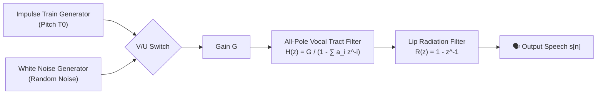
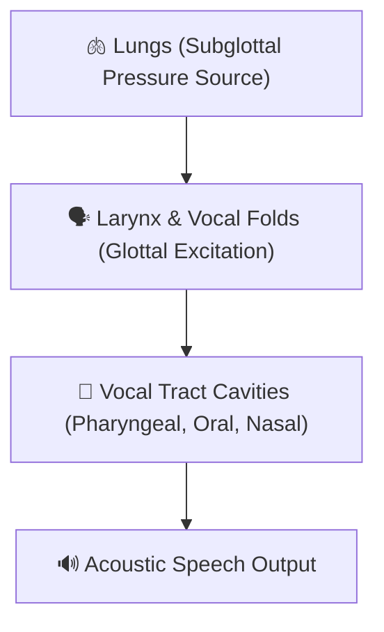

# Module 1: Speech Processing Concepts — Official Question Bank Solutions
> **Course**: Speech and Video Processing (CS30033)  
> **Source**: Official Question Bank by Dr. Kunal Anand, Asst. Professor, SCE, KIIT DU  

---

## Part I: Short Answer Questions (SAQ 1 – SAQ 80)

### SAQ 1: Define speech processing. Write the necessity of speech processing in modern world applications.
**Answer:**
- **Definition**: Speech processing is the study of speech signals and the digital processing methods used to analyze, synthesize, encode, enhance, and recognize human speech using digital computers and algorithms.
- **Necessity**: Human-computer interaction (HCI) is increasingly voice-driven. Speech processing is essential for enabling hands-free voice control (virtual assistants like Alexa, Siri), automated telecom customer support, high-efficiency digital voice compression for cellular networks, hearing aids, and real-time multi-language voice translation.

---

### SAQ 2: Distinguish between speech transmission and speech processing.
**Answer:**
- **Speech Transmission**: Focuses on conveying raw acoustic/digital audio signals from a sender to a receiver over a physical communication channel (copper wire, optical fiber, wireless RF) with minimal noise and distortion, without analyzing or altering the linguistic content.
- **Speech Processing**: Focuses on extracting information, transforming, or synthesizing the speech signal itself—such as parameter estimation (pitch, formants), feature extraction (MFCCs, LPC), pattern matching for speech/speaker recognition, and noise suppression.

---

### SAQ 3: List out some application areas of digital speech processing.
**Answer:**
1. **Automatic Speech Recognition (ASR)**: Voice typing, smart home control, and interactive voice response (IVR) systems.
2. **Speaker Identification & Verification**: Voice biometrics for secure banking authentication.
3. **Speech Synthesis / Text-to-Speech (TTS)**: Screen readers for the visually impaired, voice navigation.
4. **Speech Coding & Compression**: VoLTE, VoIP (Skype/Zoom), and digital mobile communications.
5. **Speech Enhancement**: Acoustic noise cancellation, hearing aids, and reverberation suppression.

---

### SAQ 4: Identify the elements of speech communication.
**Answer:**
The speech communication chain consists of three main domains:
1. **Linguistic/Articulatory Domain**: Brain formulates message $\to$ motor nerves excite vocal tract organs (lungs, vocal folds, tongue, lips).
2. **Acoustic Domain**: Sound wave propagates through the air as continuous longitudinal pressure variations.
3. **Auditory/Perceptual Domain**: Acoustic wave enters listener's ear canal $\to$ eardrum/cochlea converts vibration to neural impulses $\to$ listener's brain decodes linguistic message.

---

### SAQ 5: Write the importance of velum in speech production system.
**Answer:**
The **velum (soft palate)** acts as a physical acoustic valve that opens or closes the nasal cavity:
- **Nasal Sounds (/m/, /n/, /ŋ/)**: The velum lowers, allowing acoustic air flow to pass through the nasal cavity, introducing acoustic anti-resonances (zeros) into the spectrum.
- **Oral Sounds (Vowels, Stops, Fricatives)**: The velum raises against the pharyngeal wall, sealing off the nasal tract so air escapes exclusively through the oral cavity.

---

### SAQ 6: Identify different types of excitation source.
**Answer:**
1. **Voiced Excitation**: Quasi-periodic glottal air pulses produced by the vibrating vocal cords (vocal folds) in the larynx (e.g., vowels `/a/`, `/i/`, `/u/`).
2. **Unvoiced Excitation**: Turbulent noise produced by forcing air through a narrow constriction in the vocal tract without vocal cord vibration (e.g., fricatives `/s/`, `/f/`, `/ʃ/`).
3. **Transient / Plosive Excitation**: Sudden release of built-up air pressure behind a complete vocal tract closure (e.g., stop consonants `/p/`, `/t/`, `/k/`).

---

### SAQ 7: Define phoneme. Identify different types of phonemes.
**Answer:**
- **Definition**: A phoneme is the smallest basic structural unit of speech sound in a language that can distinguish one word from another (e.g., `/p/` vs `/b/` in "pat" vs "bat").
- **Types of Phonemes**:
  1. **Vowels** (Monophthongs, Diphthongs)
  2. **Semi-vowels / Glides** (`/w/`, `/j/`, `/l/`, `/r/`)
  3. **Consonants** (Stops/Plosives, Fricatives, Affricates, Nasals)

---

### SAQ 8: Define vowels. Write down different types of vowels.
**Answer:**
- **Definition**: Vowels are voiced speech sounds produced with an open, unobstructed vocal tract configuration, allowing air to flow freely without creating turbulent friction.
- **Types of Vowels**:
  1. **Front Vowels**: Produced with tongue hump positioned forward (e.g., `/i/` as in "beet", `/e/` as in "bait").
  2. **Central Vowels**: Produced with tongue in central neutral position (e.g., `/ə/` as in "about", `/ʌ/` as in "but").
  3. **Back Vowels**: Produced with tongue hump drawn backward (e.g., `/u/` as in "boot", `/o/` as in "boat").

---

### SAQ 9: Write the significance of F1 and F2 formant positions for vowels.
**Answer:**
- **Formant $F_1$ (First Formant)**: Inversely related to **tongue height** (vowel openness). High vowels (`/i/`, `/u/`) have a low $F_1$ ($200–400\text{ Hz}$); low open vowels (`/a/`) have a high $F_1$ ($700–900\text{ Hz}$).
- **Formant $F_2$ (Second Formant)**: Directly related to **tongue advancement** (frontness/backness). Front vowels (`/i/`) have a high $F_2$ ($2000–2500\text{ Hz}$); back vowels (`/u/`) have a low $F_2$ ($800–1200\text{ Hz}$).
- *Significance*: The two-dimensional $(F_1, F_2)$ plot uniquely identifies and categorizes all vowel sounds.

---

### SAQ 10: Define F1-F2 Centroid. What purpose it serves in the acoustic representation of speech sounds.
**Answer:**
- **Definition**: The $F_1$-$F_2$ Centroid is the geometric center of gravity $(\bar{F}_1, \bar{F}_2)$ of a cluster of formant data points measured across multiple repetitions of a specific vowel by a speaker or group.
- **Purpose**: It reduces scatter variance, providing a robust, single-point reference coordinate per vowel for speaker normalization, vowel space area calculation, and automatic vowel classification.

---

### SAQ 11: Define F1-F2 Cluster. What purpose it serves in the acoustic representation of speech sound.
**Answer:**
- **Definition**: An $F_1$-$F_2$ Cluster is the two-dimensional spatial distribution of formant pair measurements $(F_1, F_2)$ plotted on a scatter diagram for a particular vowel class across different context environments and speakers.
- **Purpose**: It defines the acoustic boundaries and degree of overlap between different vowel categories, aiding acoustic model training in speech recognizers and analyzing speaker variability.

---

### SAQ 12: Define diphthongs. How semivowels are different from diphthongs.
**Answer:**
- **Diphthongs**: Complex vowel sounds produced by smoothly gliding from an initial vowel posture to a secondary vowel posture within a single syllable (e.g., `/aɪ/` in "buy", `/aʊ/` in "cow").
- **Difference from Semi-vowels**: Diphthongs act as full syllabic vowel nuclei with slow transition speeds. Semi-vowels (glides `/w/`, `/j/`) have faster transition rates, lower energy, and function as consonant margins surrounding a vowel nucleus rather than as syllabic centers.

---

### SAQ 13: Define consonants. List out different types of consonants.
**Answer:**
- **Definition**: Consonants are speech sounds produced by completely or partially obstructing, constricting, or diverting the airflow through the vocal tract.
- **Types of Consonants**:
  1. **Stops / Plosives**: `/p/`, `/b/`, `/t/`, `/d/`, `/k/`, `/g/`
  2. **Fricatives**: `/f/`, `/v/`, `/s/`, `/z/`, `/ʃ/`, `/ʒ/`, `/θ/`, `/ð/`, `/h/`
  3. **Affricates**: `/tʃ/`, `/dʒ/`
  4. **Nasals**: `/m/`, `/n/`, `/ŋ/`
  5. **Approximants / Liquids / Glides**: `/w/`, `/j/`, `/l/`, `/r/`

---

### SAQ 14: How is the syllable different from phoneme?
**Answer:**
- **Phoneme**: The smallest minimal acoustic sound unit without inherent meaning or independent pronunciation structure (e.g., `/k/`, `/æ/`, `/t/`).
- **Syllable**: A higher-level unit of pronunciation organization typically containing a central vowel nucleus (with optional onset and coda consonants) produced during a single chest pulse of air (e.g., "cat" `/kæt/` is one syllable made of 3 phonemes).

---

### SAQ 15: Identify the number of syllables in the word “spectrum”.
**Answer:**
The word **"spectrum"** (`spec-trum`) contains **2 syllables**:
1. First syllable: `spec` (`/spɛk/`)
2. Second syllable: `trum` (`/trəm/`)

---

### SAQ 16: Define amplitude, frequency, and phase for a sinusoidal signal.
**Answer:**
For a sinusoidal signal $x(t) = A \sin(2\pi f t + \phi)$:
- **Amplitude ($A$)**: The maximum peak excursion or displacement of the wave from its zero baseline (determines sound loudness).
- **Frequency ($f$)**: The number of complete oscillatory cycles performed per second, measured in Hertz ($\text{Hz}$) (determines pitch).
- **Phase ($\phi$)**: The fractional angle offset of the sinusoid relative to the time origin at $t=0$, measured in radians or degrees.

---

### SAQ 17: Differentiate between continuous time and discrete time signal.
**Answer:**
- **Continuous-Time Signal $x(t)$**: Defined continuously for every real time instant $t \in (-\infty, +\infty)$ (e.g., raw acoustic pressure in air).
- **Discrete-Time Signal $x[n]$**: Defined only at discrete uniform sampling time instants $t = n T_s$, indexed by integer sample numbers $n \in \mathbb{Z}$ (e.g., sampled audio samples).

---

### SAQ 18: Differentiate between continuous-valued and discrete-valued signal.
**Answer:**
- **Continuous-Valued Signal**: Signal amplitude can assume any infinitely precise real value within a continuous range (e.g., analog voltage from a microphone).
- **Discrete-Valued Signal**: Signal amplitude is restricted to a finite, quantized set of predefined discrete levels (e.g., 8-bit quantized values from $0$ to $255$).

---

### SAQ 19: “A speech signal considered as non-stationary and quasi-periodic in nature.” Write the significance of the above statement.
**Answer:**
- **Non-Stationary**: Speech spectral parameters change dynamically over time as different phonemes are spoken. Consequently, speech cannot be analyzed globally; it must be processed in **short-time quasi-stationary frames ($20–30\text{ ms}$)**.
- **Quasi-Periodic**: Voiced speech exhibits repeating glottal cycles that are nearly periodic but vary slightly in pitch period ($T_0$) and amplitude from cycle to cycle.

---

### SAQ 20: Define digitization. Write the purpose of analog-to-digital converter in digitization.
**Answer:**
- **Digitization**: The overall process of converting a continuous analog physical wave into a discrete-time, discrete-amplitude binary sequence.
- **Purpose of ADC**: An Analog-to-Digital Converter performs sampling (discretizing time), quantization (discretizing amplitude), and binary coding to produce a digital bitstream that microprocessors and computers can store, filter, and analyze.

---

### SAQ 21: Define sampling frequency. How is it related to sampling interval.
**Answer:**
- **Sampling Frequency ($F_s$)**: The number of discrete sample measurements taken per second from a continuous signal, expressed in Hertz ($\text{Hz}$).
- **Sampling Interval ($T_s$)**: The uniform elapsed time between two consecutive discrete samples.
- **Relationship**: They are inversely proportional:
  $$T_s = \frac{1}{F_s}$$

---

### SAQ 22: For a given signal, if sampling frequency is 16KHz then determine the sampling interval.
**Answer:**
Given $F_s = 16\text{ kHz} = 16,000\text{ Hz}$:

$$T_s = \frac{1}{F_s} = \frac{1}{16,000} = 0.0000625\text{ s} = \mathbf{62.5\,\mu\text{s} \quad (0.0625\text{ ms})}$$

---

### SAQ 23: Write Nyquist shannon Sampling theorem.
**Answer:**
> *"To completely and accurately reconstruct a continuous band-limited signal from its discrete samples without distortion, the sampling rate ($F_s$) must be at least twice the highest frequency component ($f_{max}$) present in the signal."*

$$F_s \ge 2 f_{max}$$

---

### SAQ 24: Why sampling rate must not be below twice the highest frequency present in the signal.
**Answer:**
If $F_s < 2 f_{max}$, the periodic spectral copies created by sampling overlap each other in the frequency domain. This spectral overlap causes high-frequency components to fold over into the lower frequency band (**aliasing**), permanently distorting the signal and making exact signal reconstruction impossible.

---

### SAQ 25: How nyquist rate is related to nyquist frequency?
**Answer:**
- **Nyquist Rate ($F_{Nyq\_rate} = 2 f_{max}$)**: The *minimum sampling frequency* required to prevent aliasing for a signal with maximum frequency $f_{max}$.
- **Nyquist Frequency ($F_{Nyq\_freq} = F_s / 2$)**: The *highest frequency component* that can be unambiguously represented for a given sampling rate $F_s$.
- **Relationship**: $F_{Nyq\_rate} = 2 \times F_{Nyq\_freq}$.

---

### SAQ 26: Define aliasing. Write the effect of aliasing in signal processing.
**Answer:**
- **Definition**: Aliasing is a distortion phenomenon occurring when a signal is under-sampled ($F_s < 2 f_{max}$), causing high-frequency components to masquerade as lower frequencies.
- **Effect**: High-frequency noise or harmonics fold back into the audible baseband, creating false tones, harsh distortion, and loss of original signal integrity.

---

### SAQ 27: List out the ways to avoid aliasing in signal processing.
**Answer:**
1. **Sample at or above the Nyquist Rate**: Ensure $F_s \ge 2 f_{max}$.
2. **Apply an Anti-Aliasing Filter**: Pass the analog signal through an analog low-pass filter prior to sampling to attenuate all frequencies above $F_s / 2$.

---

### SAQ 28: Define quantization. Why is it a significant step in signal processing.
**Answer:**
- **Definition**: Quantization is the process of mapping a continuous-amplitude sample value to the nearest discrete level from a finite set of $L = 2^N$ allowed levels.
- **Significance**: It converts infinite-precision real numbers into finite-length binary words ($N$ bits), making audio digital storage, transmission, and digital computer processing possible.

---

### SAQ 29: Define quantization step size.
**Answer:**
Quantization step size ($\Delta$) is the constant amplitude difference between two adjacent discrete quantization voltage levels:

$$\Delta = \frac{V_{max} - V_{min}}{L} = \frac{V_{max} - V_{min}}{2^N}$$

where $V_{max} - V_{min}$ is the full input voltage range, and $N$ is the number of bits per sample.

---

### SAQ 30: A speech signal is uniformly quantized using 6 bits per sample over a range of ±3 V. Find the quantization step size (Δ).
**Answer:**
- Bit resolution $N = 6 \implies L = 2^6 = 64\text{ levels}$.
- Voltage range $= +3\text{ V} - (-3\text{ V}) = 6\text{ V}$.

$$\Delta = \frac{6\text{ V}}{64} = \mathbf{0.09375\text{ V} \quad (93.75\text{ mV})}$$

---

### SAQ 31: Define quantization error. How quantization step size affects mean squared quantization error.
**Answer:**
- **Quantization Error ($e[n]$)**: The difference between the unquantized sample amplitude $x[n]$ and its quantized level $x_q[n]$: $e[n] = x[n] - x_q[n]$.
- **Effect of Step Size**: The mean squared quantization error (noise power $\sigma_e^2$) is directly proportional to the square of the step size:
  $$\sigma_e^2 = \frac{\Delta^2}{12}$$
  Reducing step size $\Delta$ (by increasing bits $N$) quadratically reduces quantization noise power.

---

### SAQ 32: Discuss the time-domain representation of a speech signal.
**Answer:**
A time-domain representation plots instantaneous speech amplitude (sound pressure or voltage) on the Y-axis against time (seconds or milliseconds) on the X-axis. It displays raw continuous or discrete speech waveforms directly as captured by a microphone.

---

### SAQ 33: What information can be gathered from the time-domain representation of a speech signal?
**Answer:**
1. Overall signal duration and timing of speech events.
2. Word onsets, inter-syllabic pauses, and silence intervals.
3. Signal loudness / energy variations (envelope).
4. Pitch periods ($T_0$) during voiced speech segments.

---

### SAQ 34: Discuss the frequency-domain representation of a speech signal.
**Answer:**
A frequency-domain representation (spectrum) plots signal energy magnitude (in dB or linear power) on the Y-axis against frequency (in Hz) on the X-axis. It is obtained by taking the Fourier Transform (FT/FFT) of the time-domain signal.

---

### SAQ 35: What information can be gathered from the frequency-domain representation of a speech signal?
**Answer:**
1. Fundamental frequency ($F_0$ / pitch).
2. Harmonic structure and frequency energy distribution.
3. Vocal tract formant locations ($F_1, F_2, F_3$) and spectral envelope peaks.
4. Relative energy in voiced vs. unvoiced fricative frequency bands.

---

### SAQ 36: Write the significance of spectrogram in speech processing.
**Answer:**
A **spectrogram** is a 2D time-frequency representation that combines time, frequency, and log energy (color intensity). Its significance lies in enabling simultaneous observation of *when* speech events occur and *which* formant frequencies are active, making it the primary diagnostic visual tool for speech research.

---

### SAQ 37: List out the application areas where spectrogram can be useful.
**Answer:**
1. Phonetic segmentation and speech labeling.
2. Formant trajectory tracking in Automatic Speech Recognition (ASR).
3. Speaker identification and forensic voice analysis.
4. Speech pathology diagnosis and voice therapy.
5. Audio noise reduction and audio editing.

---

### SAQ 38: Define linear time invariant system along with its mathematical representation.
**Answer:**
- **Definition**: An LTI system is a discrete-time operator $y[n] = T\{x[n]\}$ that obeys both **Linearity** (superposition) and **Time-Invariance**.
- **Mathematical Form**:
  $$y[n] = x[n] * h[n] = \sum_{k=-\infty}^{\infty} x[k] \, h[n - k]$$
  where $h[n] = T\{\delta[n]\}$ is the system impulse response.

---

### SAQ 39: Explain the major properties that are necessary for a discrete-time system to be LTI system.
**Answer:**
1. **Linearity**: Satisfies superposition: $T\{a x_1[n] + b x_2[n]\} = a T\{x_1[n]\} + b T\{x_2[n]\}$.
2. **Time-Invariance**: Delaying input by $k$ delays output by $k$: If $x[n] \to y[n]$, then $x[n-k] \to y[n-k]$.

---

### SAQ 40: Write the principle of superposition with reference to an LTI system.
**Answer:**
The principle of superposition states that the system response to a weighted linear combination of inputs equals the identical weighted linear combination of the individual system responses:

$$T\{a x_1[n] + b x_2[n]\} = a y_1[n] + b y_2[n]$$

---

### SAQ 41: Define convolution. What role does impulse response play in convolution?
**Answer:**
- **Convolution**: A mathematical operation combining an input sequence $x[n]$ and system impulse response $h[n]$ to yield output $y[n] = \sum x[k] h[n-k]$.
- **Role of Impulse Response $h[n]$**: $h[n]$ completely characterizes the LTI system. Knowing $h[n]$ allows determining output $y[n]$ for *any* arbitrary input $x[n]$.

---

### SAQ 42: List out atleast three properties of convolution.
**Answer:**
1. **Commutative**: $x[n] * h[n] = h[n] * x[n]$
2. **Associative**: $(x[n] * h_1[n]) * h_2[n] = x[n] * (h_1[n] * h_2[n])$
3. **Distributive**: $x[n] * (h_1[n] + h_2[n]) = (x[n] * h_1[n]) + (x[n] * h_2[n])$

---

### SAQ 43: Briefly describe the finite duration property of convolution.
**Answer:**
If input sequence $x[n]$ has a finite length of $L_x$ samples and impulse response $h[n]$ has a finite length of $L_h$ samples, the convolved output sequence $y[n] = x[n] * h[n]$ has a finite length $L_y$ given by:

$$L_y = L_x + L_h - 1$$

---

### SAQ 44: Write the shortcomings of time-domain convolution.
**Answer:**
1. **High Computational Complexity**: Direct convolution requires $O(N \cdot M)$ operations per frame.
2. **No Direct Frequency Insight**: Does not explicitly reveal filter frequency response, bandwidths, or formant peaks.
3. **Obscured System Characteristics**: Internal vocal tract poles (formants) and zeros (anti-resonances) cannot be directly estimated from time-domain convolution.

---

### SAQ 45: Define pole-zero modeling.
**Answer:**
Pole-zero modeling is a mathematical technique that represents the vocal tract linear system using a $Z$-domain rational transfer function $H(z) = \frac{B(z)}{A(z)}$, characterizing the system by its complex poles (resonances) and zeros (anti-resonances).

---

### SAQ 46: Why pole-zero modeling is considered as one of the important process in speech processing.
**Answer:**
Because it directly mirrors the physical speech production mechanism: **poles** model vocal tract formant resonances (vowels), while **zeros** model nasal coupling anti-resonances (nasals/fricatives). It allows compact parameterization of speech for LPC coding and ASR.

---

### SAQ 47: Describe vocal tract in terms of a transfer function in pole zero modeling.
**Answer:**
$$H(z) = \frac{Y(z)}{X(z)} = G \frac{1 + \sum_{k=1}^{M} b_k z^{-k}}{1 - \sum_{k=1}^{N} a_k z^{-k}}$$

where $X(z)$ is glottal excitation, $Y(z)$ is output speech, $a_k$ are pole coefficients, and $b_k$ are zero coefficients.

---

### SAQ 48: What poles and zeros represent in the pole-zero modeling?
**Answer:**
- **Poles ($A(z) = 0$)**: Represent **vocal tract formants** (resonant frequency peaks that amplify sound).
- **Zeros ($B(z) = 0$)**: Represent **acoustic anti-resonances** (spectral dips/notches that attenuate sound, e.g., nasal coupling).

---

### SAQ 49: What will be the impact on a linear system if the poles are set to zero?
**Answer:**
If all poles are set to zero (excluding origin poles), $A(z) = 1$, converting the system into an **All-Zero / Finite Impulse Response (FIR) Filter**. The system loses its sharp resonant formant peaks and becomes unconditionally stable.

---

### SAQ 50: What will be the impact on a linear system if the zeros are set to zero?
**Answer:**
If all zeros are set to zero (excluding origin zeros), $B(z) = G$, converting the system into an **All-Pole / Infinite Impulse Response (IIR) Filter**. This forms the basis of Linear Predictive Coding (LPC), efficiently modeling vocal tract vowel formants.

---

### SAQ 51: What role does Fourier transform play in the speech processing?
**Answer:**
The Fourier Transform converts time-domain speech waveforms into frequency spectra, enabling short-time spectral analysis, formant estimation, pitch extraction, sub-band filtering, and noise suppression.

---

### SAQ 52: How can a sinusoidal signal be represented in complex exponential?
**Answer:**
Using Euler's identity $\cos(\theta) = \frac{1}{2}(e^{j\theta} + e^{-j\theta})$:

$$A \cos(2\pi f_0 t + \phi) = \frac{A}{2} e^{j\phi} e^{j 2\pi f_0 t} + \frac{A}{2} e^{-j\phi} e^{-j 2\pi f_0 t}$$

---

### SAQ 53: Write about the importance of dirac delta function in Fourier transform.
**Answer:**
The Dirac delta function $\delta(f - f_0)$ represents an idealized spectral line carrying concentrated energy exclusively at frequency $f_0$. It allows pure sinusoids and periodic signals to be represented in the continuous Fourier Transform domain as discrete spectral spikes.

---

### SAQ 54: List out the properties of fourier transform.
**Answer:**
1. **Linearity**: $\mathcal{F}\{a x_1 + b x_2\} = a X_1(f) + b X_2(f)$
2. **Time Shift**: $\mathcal{F}\{x(t-t_0)\} = X(f) e^{-j 2\pi f t_0}$
3. **Frequency Shift**: $\mathcal{F}\{x(t) e^{j 2\pi f_0 t}\} = X(f-f_0)$
4. **Convolution Property**: $\mathcal{F}\{x(t)*h(t)\} = X(f) \cdot H(f)$

---

### SAQ 55: Define inverse fourier transform.
**Answer:**
The Inverse Fourier Transform reconstructs a continuous time-domain signal $x(t)$ from its continuous frequency-domain spectrum $X(f)$:

$$x(t) = \int_{-\infty}^{\infty} X(f) \, e^{j 2\pi f t} \, df$$

---

### SAQ 56: Explain discrete time fourier transform with its mathematical representation.
**Answer:**
- **Definition**: The DTFT transforms a discrete-time sequence $x[n]$ into a continuous, $2\pi$-periodic frequency spectrum $X(e^{j\omega})$:
  $$X(e^{j\omega}) = \sum_{n=-\infty}^{\infty} x[n] \, e^{-j\omega n}$$
  where $\omega$ is continuous digital angular frequency in radians/sample ($\omega \in [-\pi, \pi]$).

---

### SAQ 57: Define inverse DTFT.
**Answer:**
The Inverse DTFT reconstructs discrete sequence $x[n]$ from continuous periodic spectrum $X(e^{j\omega})$:

$$x[n] = \frac{1}{2\pi} \int_{-\pi}^{\pi} X(e^{j\omega}) \, e^{j\omega n} \, d\omega$$

---

### SAQ 58: Define discrete fourier transform along with its mathematical representation.
**Answer:**
- **Definition**: The DFT converts an $N$-point finite discrete sequence $x[n]$ into $N$ discrete frequency bin samples $X[k]$:
  $$X[k] = \sum_{n=0}^{N-1} x[n] \, e^{-j \frac{2\pi}{N} k n}, \quad k = 0, 1, \dots, N-1$$

---

### SAQ 59: What is basis function in DFT?
**Answer:**
The complex exponential sequences $\phi_k[n] = e^{-j \frac{2\pi}{N} k n}$ for $k = 0, 1, \dots, N-1$ are the **DFT basis functions**. They represent discrete complex harmonically-related sinusoids used to decompose the signal.

---

### SAQ 60: Write the orthogonality principle of DFT basis function.
**Answer:**
$$\sum_{n=0}^{N-1} e^{j \frac{2\pi}{N} k n} e^{-j \frac{2\pi}{N} m n} = \begin{cases} N, & k = m \\ 0, & k \neq m \end{cases}$$

When matching bin $k=m$, basis functions align to produce $N$; for $k \neq m$, positive and negative terms cancel to zero.

---

### SAQ 61: Explain the spectral leakage.
**Answer:**
Spectral leakage occurs when signal frequency components do not align exactly with discrete DFT bin frequencies ($k \frac{F_s}{N}$). Frame edge truncation discontinuities cause spectral energy to leak from the true frequency into adjacent bins.

---

### SAQ 62: Discuss the significance of even odd decomposition in fast fourier transform.
**Answer:**
Even-odd decomposition splits an $N$-point DFT into two $\frac{N}{2}$-point DFTs (even-indexed samples $x[2m]$ and odd-indexed samples $x[2m+1]$). This divide-and-conquer strategy reduces computational complexity from $O(N^2)$ to $O(N \log_2 N)$.

---

### SAQ 63: Define twiddle factor in FFT.
**Answer:**
The **Twiddle Factor** $W_N^k$ is a complex exponential phase factor defined as:

$$W_N^k = e^{-j \frac{2\pi}{N} k}$$

It satisfies symmetry ($W_N^{k+N/2} = -W_N^k$) and periodicity ($W_N^{k+N} = W_N^k$).

---

### SAQ 64: Explain butterfly network in FFT.
**Answer:**
A **Butterfly Unit** is the elementary computational block of an FFT. It takes two inputs $A$ and $B$, multiplies $B$ by twiddle factor $W_N^k$, and computes $X = A + W_N^k B$ and $Y = A - W_N^k B$.

---

### SAQ 65: What information does spectral envelope carry?
**Answer:**
The **spectral envelope** represents the smooth curve connecting spectral formant peaks. It carries **linguistic phoneme information** (vowel identity) and **vocal tract system characteristics**, independent of pitch excitation.

---

### SAQ 66: List out the different types of filters in signal processing.
**Answer:**
1. Low-pass Filter (LPF)
2. High-pass Filter (HPF)
3. Band-pass Filter (BPF)
4. Band-stop / Notch Filter
5. All-pass Filter

---

### SAQ 67: Distinguish between uniform and non-uniform digital filters.
**Answer:**
- **Uniform Filter Banks**: Filters are spaced at equal frequency intervals across the spectrum, all having identical bandwidths.
- **Non-Uniform Filter Banks**: Filters have varying bandwidths (narrower at low frequencies, wider at high frequencies) matching human auditory perception (e.g., Mel/Bark scale).

---

### SAQ 68: How full wave rectifier is different from half wave rectifier?
**Answer:**
- **Full-Wave Rectifier**: Converts negative signal halves into positive values ($y[n] = |x[n]|$), preserving all signal energy.
- **Half-Wave Rectifier**: Sets negative signal values to zero ($y[n] = \max(0, x[n])$), discarding half the signal energy.

---

### SAQ 69: Write the significance of Mel-Scale in speech processing.
**Answer:**
The Mel scale mimics human pitch perception (linear below $1000\text{ Hz}$, logarithmic above $1000\text{ Hz}$). Using Mel-spaced filter banks produces features (MFCCs) that closely match human auditory discrimination for ASR.

---

### SAQ 70: List out some application areas of filter bank model.
**Answer:**
1. Feature extraction for Automatic Speech Recognition (MFCCs).
2. Sub-band speech coding (MP3, AAC).
3. Hearing aid frequency compensation.
4. Speaker identification.

---

### SAQ 71: What are the shortcomings of filter bank model.
**Answer:**
1. Limited frequency resolution within individual filter channels.
2. Fixed filter bandwidths do not adapt to dynamic speech pitch.
3. Does not explicitly model underlying vocal tract physical physics (no all-pole model).

---

### SAQ 72: Define linear prediction along with its mathematical representation.
**Answer:**
- **Definition**: Linear prediction estimates the present speech sample $\hat{s}[n]$ as a linear weighted sum of $p$ past speech samples:
  $$\hat{s}[n] = \sum_{i=1}^{p} a_i s[n-i]$$

---

### SAQ 73: What is prediction error in linear prediction?
**Answer:**
Prediction error $e[n]$ is the residual difference between the actual speech sample $s[n]$ and the predicted sample $\hat{s}[n]$:

$$e[n] = s[n] - \hat{s}[n] = s[n] - \sum_{i=1}^{p} a_i s[n-i]$$

---

### SAQ 74: How does the prediction order impact a LPC model?
**Answer:**
- **Too Low ($p < 8$)**: Model cannot capture all vocal tract formant resonances.
- **Optimal ($p \approx 10–16$)**: Accurately models $4–5$ formants plus spectral tilt.
- **Too High ($p > 24$)**: Fits glottal noise/pitch harmonics, increasing computation and over-fitting.

---

### SAQ 75: What role does a all-pole filter play in LPC model?
**Answer:**
The all-pole filter $H(z) = \frac{G}{1 - \sum a_i z^{-i}}$ models the **vocal tract transfer function**. Its complex poles represent vocal tract formant resonances ($F_1, F_2, F_3$).

---

### SAQ 76: Define the term excitation gain in LPC.
**Answer:**
Excitation gain ($G$) is a scaling factor in the LPC model that controls the amplitude/energy strength of the input excitation source $u[n]$ before it passes into the all-pole filter.

---

### SAQ 77: List out the typical model parameters in LPC.
**Answer:**
1. Voiced / Unvoiced classification decision.
2. Pitch period ($T_0$) for voiced speech.
3. Excitation gain ($G$).
4. LPC predictor coefficients ($a_1, a_2, \dots, a_p$).

---

### SAQ 78: Explain autocorrelation along with its mathematical representation.
**Answer:**
Autocorrelation measures the self-similarity of a signal sequence $s[n]$ with its time-lagged version $s[n-k]$:

$$R[k] = \sum_{n} s[n] \, s[n-k]$$

---

### SAQ 79: How does the covariance method differ from autocorrelation method?
**Answer:**
- **Autocorrelation Method**: Tapers frame edges with a window (Hamming), yields a symmetric **Toeplitz matrix**, and guarantees filter stability.
- **Covariance Method**: Uses unwindowed samples within the analysis interval, yields a symmetric **non-Toeplitz matrix**, and stability is not guaranteed.

---

### SAQ 80: Write the whitening behavior of LPC model.
**Answer:**
Filtering speech $s[n]$ through the inverse LPC filter $A(z) = 1 - \sum a_i z^{-i}$ removes vocal tract formant peaks, producing an error residual $e[n]$ with a flat, white noise-like spectrum (**Spectral Whitening**).

---

## Part II: Long Answer Questions & Solved Numerical Problems (LAQ 1 – LAQ 41)

### LAQ 1: Explain the speech processing model with suitable diagram.
**Answer:**
The digital speech processing model separates speech into two distinct stages: **Source Excitation** and **Vocal Tract System Filtering**.

1. **Source Excitation**: Voiced speech is generated by a periodic impulse train with period $T_0$; unvoiced speech is generated by zero-mean white noise.
2. **Gain $G$**: Adjusts overall speech segment energy.
3. **Vocal Tract Filter $H(z)$**: All-pole filter representing resonances (formants).
4. **Lip Radiation $R(z)$**: High-pass characteristic ($1 - z^{-1}$) representing lip pressure conversion.

---

### LAQ 2: Describe the speech production system with a schematic diagram.
**Answer:**
The human speech production system consists of three main sub-systems:

1. **Subglottal System (Lungs & Trachea)**: Acts as an air compressor providing airflow.
2. **Larynx (Vocal Cords/Folds)**: Vibrates to produce periodic glottal pulses for voiced sounds, or stays open for unvoiced sounds.
3. **Vocal Tract Cavities**: Pharynx, oral cavity (tongue, teeth, lips), and nasal cavity (controlled by velum) shape sound via resonances.

---

### LAQ 3: Define vowels. Explain different types of vowels with suitable examples for each of them.
**Answer:**
- **Definition**: Vowels are voiced speech sounds produced without any vocal tract obstruction.
- **Classification by Tongue Position**:
  1. **Front Vowels**: Tongue hump forward. High front: `/i/` ("beet"), Low front: `/æ/` ("cat").
  2. **Central Vowels**: Tongue in central position. Neutral: `/ə/` ("about"), `/ʌ/` ("cup").
  3. **Back Vowels**: Tongue hump back. High back: `/u/` ("boot"), Low back: `/ɑ/` ("father").

---

### LAQ 4: How are the diphthongs and semi vowels different from each other? List out atleast two examples for diphthongs and semi vowels.
**Answer:**
- **Diphthongs**: Vowels that smoothly glide from one vowel target to another within one syllable nucleus (slow transition). Examples: `/aɪ/` ("buy"), `/aʊ/` ("cow").
- **Semi-vowels (Glides)**: Consonantal sounds produced with rapid vocal tract movement toward a vowel posture. They act as syllable margins. Examples: `/w/` ("wet"), `/j/` ("yes").

---

### LAQ 5: Explain consonants. Discuss different types of consonants with suitable examples.
**Answer:**
Consonants involve vocal tract constriction:
1. **Stops / Plosives**: Complete closure followed by sudden release (`/p/`, `/b/`, `/t/`, `/d/`, `/k/`, `/g/`).
2. **Fricatives**: Turbulent airflow through a narrow gap (`/f/`, `/v/`, `/s/`, `/z/`, `/ʃ/`).
3. **Affricates**: Stop followed by fricative (`/tʃ/` as in "church", `/dʒ/` as in "judge").
4. **Nasals**: Oral closure with open velum (`/m/`, `/n/`, `/ŋ/`).
5. **Approximants / Liquids**: Gliding articulation (`/l/`, `/r/`).

---

### LAQ 6: Compare and contrast the continuous-time and discrete-time signals. How is the continuous-valued signal different from the discrete-valued signal?
**Answer:**
- **Continuous-Time $x(t)$ vs Discrete-Time $x[n]$**: $x(t)$ is defined for all real $t$; $x[n]$ is defined only at integer sample index $n = t/T_s$.
- **Continuous-Valued vs Discrete-Valued**: Continuous-valued amplitudes take any real number; discrete-valued amplitudes are quantized into $L = 2^N$ levels.

---

### LAQ 7: Discuss the architecture of a digital signal processing system with a neat diagram.
**Answer:**

---

### LAQ 8: Define sampling. How does sampling interval and sampling frequency relate to each other? Write the significance of bandwidth in sampling.
**Answer:**
- **Sampling**: Discretizing continuous time $x(t) \to x[n] = x(n T_s)$.
- **Relationship**: $F_s = 1 / T_s$.
- **Bandwidth Significance**: Bandwidth $B = f_{max}$ determines the Nyquist rate $F_s \ge 2 B$. Higher bandwidth requires higher sampling rates.

---

### LAQ 9: Explain Nyquist-Shannon sampling theorem. Discuss the issue of aliasing with respect to sampling. How can the aliasing can be overcome?
**Answer:**
- **Theorem**: $F_s \ge 2 f_{max}$.
- **Aliasing**: Overlapping of periodic spectra when $F_s < 2 f_{max}$, causing high frequencies to fold into low frequencies.
- **Prevention**: (1) Sample at $F_s \ge 2 f_{max}$, (2) Use an analog anti-aliasing low-pass filter before sampling.

---

### LAQ 10: Define quantization step size along with its mathematical representation. How does the bits per sample affect the quantization step size?
**Answer:**
$$\Delta = \frac{V_{max} - V_{min}}{2^N}$$
Increasing bits per sample $N$ exponentially increases levels $L = 2^N$, halving step size $\Delta$ for every additional bit added.

---

### LAQ 11 (Solved Problem): A speech signal is uniformly quantized using 8 bits per sample over a range of ±2 V. If the sampling frequency is 16 kHz, determine the quantization step size (Δ). Also, find out the size of the file for a 5-second recording.
**Solution:**
1. **Quantization Step Size ($\Delta$)**:
   - $N = 8 \implies L = 2^8 = 256\text{ levels}$. Range $= +2 - (-2) = 4\text{ V}$.
   $$\Delta = \frac{4\text{ V}}{256} = \mathbf{0.015625\text{ V} \quad (15.625\text{ mV})}$$
2. **File Size Calculation**:
   - $F_s = 16,000\text{ Hz}$, $N = 8\text{ bits} = 1\text{ byte}$, Duration $T = 5\text{ s}$.
   $$\text{Total Bytes} = 16,000 \times 1 \times 5 = 80,000\text{ bytes}$$
   $$\text{File Size} = \frac{80,000}{1000} = \mathbf{80\text{ KB}} \quad \left(\text{or } \frac{80,000}{1024} = \mathbf{78.125\text{ KiB}}\right)$$

---

### LAQ 12 (Solved Problem): A speech signal has an amplitude range of −1.5 V to +1.5 V and is quantized using 10 bits per sample. The sampling frequency is 16 kHz. For a recording duration of 20 seconds, determine: (1) Quantization step size, (2) Total samples, (3) Total bits, (4) File size in KB.
**Solution:**
- Given: Range $= 3.0\text{ V}$, $N = 10\text{ bits}$, $F_s = 16,000\text{ Hz}$, $T = 20\text{ s}$.
1. **Quantization Step Size ($\Delta$)**:
   $$\Delta = \frac{3.0\text{ V}}{2^{10}} = \frac{3.0}{1024} = \mathbf{0.0029296875\text{ V} \quad (2.93\text{ mV})}$$
2. **Total Number of Samples**:
   $$N_{samples} = F_s \times T = 16,000 \times 20 = \mathbf{320,000\text{ samples}}$$
3. **Total Number of Bits**:
   $$N_{bits} = 320,000 \times 10 = \mathbf{3,200,000\text{ bits}}$$
4. **Approximate File Size in KB**:
   $$\text{Total Bytes} = \frac{3,200,000}{8} = 400,000\text{ bytes}$$
   $$\text{File Size} = \frac{400,000}{1000} = \mathbf{400\text{ KB}} \quad \left(\text{or } \frac{400,000}{1024} = \mathbf{390.625\text{ KiB}}\right)$$

---

### LAQ 13 (Solved Problem): A 10-bit ADC converts analog signals in the range −5 V to +5 V. Determine Quantization step size, maximum quantization error, and mean squared quantization error.
**Solution:**
- Range $= 10\text{ V}$, $N = 10\text{ bits} \implies L = 1024$.
1. $\Delta = \frac{10\text{ V}}{1024} = \mathbf{0.009765625\text{ V}}$
2. $e_{max} = \frac{\Delta}{2} = \mathbf{0.0048828125\text{ V}}$
3. $\sigma_e^2 = \frac{\Delta^2}{12} = \frac{(0.009765625)^2}{12} = \mathbf{7.947 \times 10^{-6}\text{ V}^2}$

---

### LAQ 14: Suppose the ADC is modified to operate with a 12-bit resolution instead of 10-bit resolution. Discuss how this change affects the ADC's operation.
**Answer:**
For $N = 12\text{ bits}$, $L = 4096$:
- Step size $\Delta_{12} = \frac{10}{4096} = 0.0024414\text{ V}$ ($75\%$ reduction).
- Noise power $\sigma_e^2$ drops by factor of $16$ ($+12\text{ dB}$ SQNR gain).
- File size increases by $20\%$ ($12$ bits vs $10$ bits per sample).

---

### LAQ 15 (Solved Problem): A speech acquisition system samples a signal at 16 kHz using a 10-bit ADC over the input range −1.5 V to +1.5 V. Calculate step size, max error, and MSE error.
**Solution:**
- Range $= 3\text{ V}$, $N = 10 \implies L = 1024$.
1. $\Delta = \frac{3}{1024} = \mathbf{0.0029296875\text{ V}}$
2. $e_{max} = \frac{\Delta}{2} = \mathbf{0.00146484375\text{ V}}$
3. $\sigma_e^2 = \frac{\Delta^2}{12} = \mathbf{7.1525 \times 10^{-7}\text{ V}^2}$

---

### LAQ 16 & 17: Discuss time-domain vs frequency-domain representations & comparative table.
**Answer:**
- **Time-Domain**: Plots amplitude vs time. Captures signal onset, duration, silence, loudness.
- **Frequency-Domain**: Plots magnitude (dB) vs frequency (Hz). Captures pitch $F_0$, formants $F_1, F_2$, spectral tilt.

---

### LAQ 18: Define spectrogram. How can a spectrogram be created for a speech signal? Why is it needed?
**Answer:**
- **Definition**: 2D time-frequency plot.
- **Creation**: Divided into short overlapping frames $\to$ windowed $\to$ STFT computed $\to$ squared magnitude plotted over time.
- **Need**: Shows simultaneous time and frequency details, tracking formant movements ($F_1, F_2, F_3$) over time.

---

### LAQ 19: Define Linear Time Invariant (LTI) system. Discuss necessary properties.
**Answer:**
Discrete-time system satisfying Linearity (scalability + additivity) and Time-Invariance ($x[n-k] \to y[n-k]$).

---

### LAQ 20 (Solved Problem): Transformation $y[n] = x[n] + 2x[n-2]$ for input $x[n] = \{2, 4, 6\}$ ($n=0,1,2$). Check whether time-invariant.
**Solution:**
1. System output for original input $x[n]$:
   - $y[0] = x[0] + 2x[-2] = 2 + 0 = 2$
   - $y[1] = x[1] + 2x[-1] = 4 + 0 = 4$
   - $y[2] = x[2] + 2x[0] = 6 + 2(2) = 10$
   - $y[3] = x[3] + 2x[1] = 0 + 2(4) = 8$
   - $y[4] = x[4] + 2x[2] = 0 + 2(6) = 12$
   - $y[n] = \{2, 4, 10, 8, 12\}$.
2. Shift input by $k=1 \implies x_1[n] = x[n-1]$:
   - Response $y_1[n] = x_1[n] + 2x_1[n-2] = x[n-1] + 2x[n-3] = y[n-1]$.
   - Since $y_1[n] = y[n-1]$, system is **Time-Invariant**.

---

### LAQ 21 (Solved Problem): $x[n] = \{2, 1, 2, 4, 3\}$ ($n=0..4$), $h[n] = \{1, -1, 2\}$ ($n=0..2$). Find $y[n]$.
**Solution:**
$L_y = 5 + 3 - 1 = 7$.
- $y[0] = 2 \times 1 = 2$
- $y[1] = (2 \times -1) + (1 \times 1) = -1$
- $y[2] = (2 \times 2) + (1 \times -1) + (2 \times 1) = 5$
- $y[3] = (1 \times 2) + (2 \times -1) + (4 \times 1) = 4$
- $y[4] = (2 \times 2) + (4 \times -1) + (3 \times 1) = 3$
- $y[5] = (4 \times 2) + (3 \times -1) = 5$
- $y[6] = 3 \times 2 = 6$
$$\mathbf{y[n] = \{2, -1, 5, 4, 3, 5, 6\} \quad \text{for } n = 0..6}$$

---

### LAQ 22 (Solved Problem): $x[n] = \{1, 3, 2, 1\}$, $h[n] = \{2, -1\}$. Find $y[n]$.
**Solution:**
$L_y = 4 + 2 - 1 = 5$.
$$\mathbf{y[n] = \{2, 5, 1, 0, -1\} \quad \text{for } n = 0..4}$$

---

### LAQ 23 (Solved Problem): Express $x[n] = \{3, 4, 5\}$ as sum of impulses and convolve with $h[n] = \{1, 2\}$.
**Solution:**
1. Impulse form: $x[n] = 3\delta[n] + 4\delta[n-1] + 5\delta[n-2]$.
2. $y[n] = 3h[n] + 4h[n-1] + 5h[n-2]$:
   - $3h[n] = \{3, 6, 0, 0\}$
   - $4h[n-1] = \{0, 4, 8, 0\}$
   - $5h[n-2] = \{0, 0, 5, 10\}$
3. Summing: $y[0] = 3$, $y[1] = 10$, $y[2] = 13$, $y[3] = 10$.
$$\mathbf{y[n] = \{3, 10, 13, 10\} \quad \text{for } n = 0..3}$$

---

### LAQ 24 (Solved Problem): $x[n] = \{2, -1, 3\}$, $h[n] = \{1, -2, 1\}$. Compute $y[n]$ and verify commutative property.
**Solution:**
1. $y[0] = 2 \times 1 = 2$
2. $y[1] = (2 \times -2) + (-1 \times 1) = -5$
3. $y[2] = (2 \times 1) + (-1 \times -2) + (3 \times 1) = 7$
4. $y[3] = (-1 \times 1) + (3 \times -2) = -7$
5. $y[4] = 3 \times 1 = 3$
$$\mathbf{y[n] = \{2, -5, 7, -7, 3\}}$$
Computing $h[n] * x[n]$ yields identical sequence $\implies$ **Commutative Property Verified**.

---

### LAQ 25 (Solved Problem): $x[n] = \{1, 2, 1, 3\}$, $h[n] = \{1, 0, -1\}$. Output length and sequence.
**Solution:**
- Length $L_y = 4 + 3 - 1 = \mathbf{6}$.
- $y[0] = 1 \times 1 = 1$
- $y[1] = (1 \times 0) + (2 \times 1) = 2$
- $y[2] = (1 \times -1) + (2 \times 0) + (1 \times 1) = 0$
- $y[3] = (2 \times -1) + (1 \times 0) + (3 \times 1) = 1$
- $y[4] = (1 \times -1) + (3 \times 0) = -1$
- $y[5] = 3 \times -1 = -3$
$$\mathbf{y[n] = \{1, 2, 0, 1, -1, -3\} \quad \text{for } n = 0..5}$$

---

### LAQ 26 & 27: Shortcomings of time-domain convolution & Pole-Zero modeling concept.
**Answer:**
See SAQ 44, SAQ 45, SAQ 48, and Chapter 3 README Section 9.

---

### LAQ 28 (Solved Fourier Transform Problems):
1. $x(t) = 6\cos(120\pi t) + 4\cos(40\pi t) \implies f_1 = 60\text{ Hz}, f_2 = 20\text{ Hz}$.
   $$X(f) = 3\delta(f-60) + 3\delta(f+60) + 2\delta(f-20) + 2\delta(f+20)$$
2. $x(t) = 4\cos(2\pi 20 t) + 2\cos(2\pi 60 t) \implies X(f) = 2\delta(f-20) + 2\delta(f+20) + \delta(f-60) + \delta(f+60)$.
3. $x(t) = 3\cos(2\pi 15 t) + 5\cos(2\pi 50 t) \implies X(f) = 1.5\delta(f-15) + 1.5\delta(f+15) + 2.5\delta(f-50) + 2.5\delta(f+50)$.

---

### LAQ 29 (Solved DFT Problem): 8-point DFT of sine wave $x(t) = 2\sin(2\pi \cdot 1 \cdot t)$ at $F_s = 8\text{ Hz}$.
**Solution:**
Bin spacing $\Delta f = 8/8 = 1\text{ Hz}$. Sine matches bin $k=1$ ($1\text{ Hz}$) and bin $k=7$ ($-1\text{ Hz}$).
- $X[1] = -j 8$ (Magnitude $8$, Phase $-90^\circ$).
- $X[7] = +j 8$ (Magnitude $8$, Phase $+90^\circ$).
- All other bins $X[k] = 0$.

---

### LAQ 30 (Solved DFT Problem): 8-point DFT of sine wave $x(t) = 3\sin(2\pi \cdot 1 \cdot t)$ at $F_s = 16\text{ Hz}$.
**Solution:**
Bin spacing $\Delta f = 16/8 = 2\text{ Hz/bin}$. Signal frequency $f_0 = 1\text{ Hz}$ falls between bin 0 ($0\text{ Hz}$) and bin 1 ($2\text{ Hz}$).
- **Result**: Severe **Spectral Leakage**. Energy spreads across all 8 frequency bins.

---

### LAQ 31 (Solved DFT Problem): 8-point DFT of $f_0 = 2\text{ Hz}$ sine wave, $A=1$, $F_s = 16\text{ Hz}$.
**Solution:**
Bin resolution $\Delta f = 2\text{ Hz/bin}$. Signal matches bin $k=1$ ($2\text{ Hz}$) and bin $k=7$ ($14\text{ Hz} \equiv -2\text{ Hz}$).
- $X[1] = -j 4 \implies |X[1]| = 4$.
- $X[7] = +j 4 \implies |X[7]| = 4$.
- All other bins $X[k] = 0$.

---

### LAQ 32 – LAQ 33: FFT Algorithm & Filter Bank Model Structure.
**Answer:**
See Chapter 4 README Sections 3 & 4.

---

### LAQ 34 (Solved Mel Scale Numerical): Mel-scale filter bank with 20 filters from $300\text{ Hz}$ to $8000\text{ Hz}$. Calculate Mel-scale spacing and center frequencies.
**Solution:**
1. $m_{low} = 2595 \log_{10}(1 + 300/700) = 401.25\text{ Mel}$
2. $m_{high} = 2595 \log_{10}(1 + 8000/700) = 2834.99\text{ Mel}$
3. Total Mel range $= 2834.99 - 401.25 = 2433.74\text{ Mel}$
4. For 20 filters ($M=20$), number of intervals $= 21$:
   $$\Delta m = \frac{2433.74}{21} = \mathbf{115.89\text{ Mel/filter}}$$
5. Filter center Mels: $m_c(i) = 401.25 + i \times 115.89$ for $i = 1, 2, \dots, 20$.
   - $f_c(i) = 700 \left( 10^{\frac{m_c(i)}{2595}} - 1 \right)\text{ Hz}$.

---

### LAQ 35 – LAQ 41: LPC Principles, Yule-Walker Equations & Order Selection.
**Answer:**
See Chapter 4 README Section 6 and SAQ 72–80.
