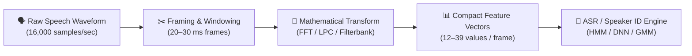
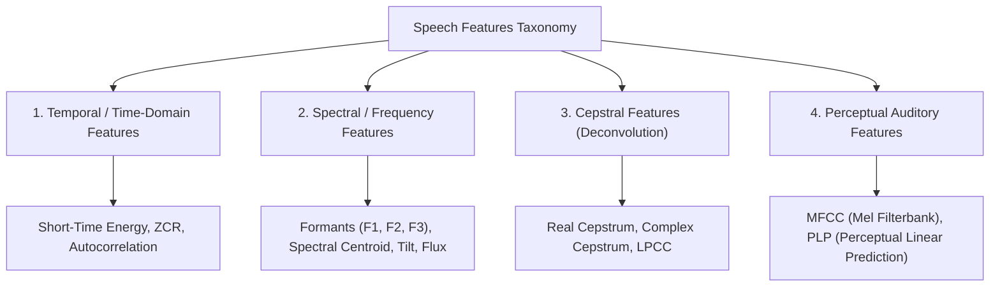
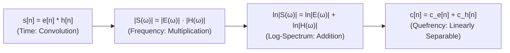
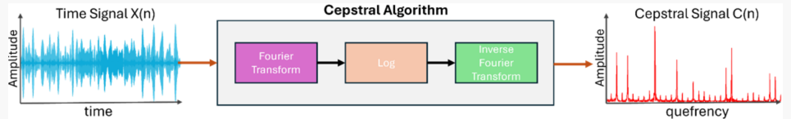
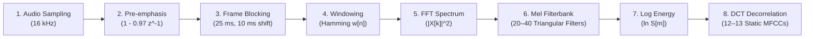
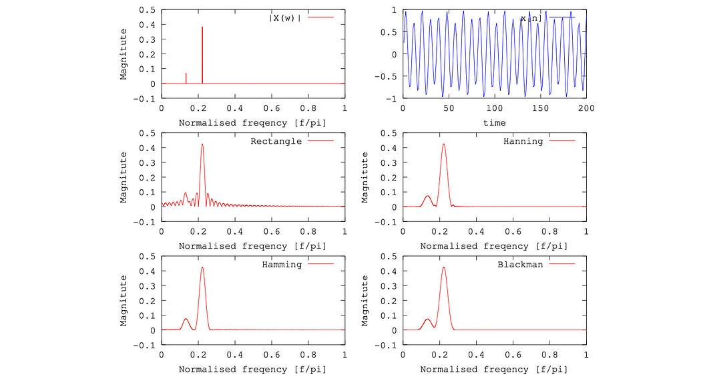
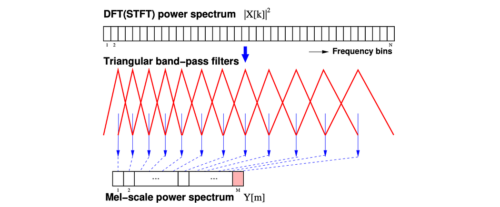
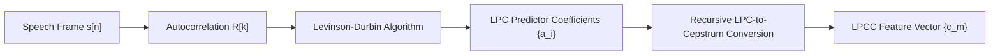

# Chapter 5: Feature Extraction Overview, Real Cepstrum, Cepstral Analysis, MFCC and LPCC

> **Module 2**: Feature Extraction and Speech Recognition  
> **Course**: Speech and Video Processing (CS30033)  
> **Faculty Resource**: Dr. Kunal Anand (SCE, KIIT DU)

---

# Table of Contents
1. [Introduction to Speech Feature Extraction](#1-introduction-to-speech-feature-extraction)
2. [Speech Feature Taxonomy](#2-speech-feature-taxonomy)
3. [The Speech Production Source-Filter Model](#3-the-speech-production-source-filter-model)
4. [Homomorphic Deconvolution and Cepstral Analysis](#4-homomorphic-deconvolution-and-cepstral-analysis)
5. [Real Cepstrum vs. Complex Cepstrum](#5-real-cepstrum-vs-complex-cepstrum)
6. [Mel-Frequency Cepstral Coefficients (MFCC)](#6-mel-frequency-cepstral-coefficients-mfcc)
7. [Linear Prediction Cepstral Coefficients (LPCC)](#7-linear-prediction-cepstral-coefficients-lpcc)
8. [Comprehensive Comparison: MFCC vs. LPCC](#8-comprehensive-comparison-mfcc-vs-lpcc)
9. [Summary & Key Formulas](#9-summary--key-formulas)

---

## 1. Introduction to Speech Feature Extraction

Speech feature extraction is the fundamental front-end digital signal processing stage in automatic speech systems. It transforms high-dimensional, raw acoustic waveform samples $s[n]$ into a compact, low-dimensional sequence of parametric feature vectors $\mathbf{X} = \{\mathbf{x}_1, \mathbf{x}_2, \dots, \mathbf{x}_T\}$ that preserve linguistic and phonetic identity while discarding irrelevant acoustic variations (such as background noise, channel distortion, and speaker volume).



### 1.1 Why Raw Speech Audio Cannot Be Directly Fed into ASR
1. **Extremely High Dimensionality**: At a sampling rate of $16\text{ kHz}$, a 3-second spoken sentence contains $48,000$ individual amplitude numbers, leading to the curse of dimensionality.
2. **Temporal Non-Stationarity**: Speech characteristics change continuously as articulators move from one phoneme to another.
3. **Phase Sensitivity & Waveform Variance**: Two recordings of the exact same vowel spoken by the same speaker will never produce identical time-domain sample amplitudes due to slight phase shifts and timing differences.
4. **Channel & Amplitude Sensitivity**: Variations in recording microphone distance, room reverberation, and voice loudness drastically alter raw waveform amplitudes without altering linguistic phonetic content.

### 1.2 Characteristics of a "Good" Speech Feature
- **High Phonetic Discriminability**: Must clearly separate different phonemes (e.g., distinguishing `/i/` from `/u/`).
- **Low Intra-Speaker & Environmental Sensitivity**: Must remain invariant to microphone distance, background noise, and vocal effort.
- **Low Dimensionality & Compactness**: Must compress information efficiently ($12–39$ coefficients per frame).
- **Decorrelation**: Individual feature dimensions should be statistically uncorrelated to simplify subsequent acoustic pattern modeling.

---

## 2. Speech Feature Taxonomy



| Category | Primary Parameters | Key Physical Meaning | Standard Application |
| :--- | :--- | :--- | :--- |
| **Temporal Features** | Zero-Crossing Rate (ZCR), Short-Time Energy ($E_n$), Duration | Rate of sign changes and signal power in time domain. | Voiced/Unvoiced classification, Silence removal, Voice Activity Detection (VAD). |
| **Spectral Features** | Formant Frequencies ($F_1, F_2, F_3$), Spectral Centroid, Bandwidth | Resonant acoustic frequencies of the vocal tract cavities. | Vowel classification, timbre analysis, speaker characterization. |
| **Cepstral Features** | Real Cepstrum, Complex Cepstrum, LPCC | Inverse transform of log-spectrum; separates glottal excitation from vocal tract. | Pitch tracking, vocal tract envelope estimation, dereverberation. |
| **Perceptual Features**| MFCC, Bark/Mel sub-band energies, PLP | Non-linear psychoacoustic cochlear frequency representation. | Modern Automatic Speech Recognition (ASR), Voice Biometrics. |

---

## 3. The Speech Production Source-Filter Model

In acoustic phonetics, human speech production is modeled as the linear convolution of an **excitation source** $e[n]$ with a time-varying **vocal tract filter** $h[n]$:

$$s[n] = e[n] * h[n]$$


1. **Excitation Source $e[n]$**:
   - **Voiced Sounds** (Vowels `/a/`, `/i/`): Periodic glottal pulses produced by vocal cord vibrations at fundamental frequency $F_0$ ($T_0 = 1/F_0$).
   - **Unvoiced Sounds** (Fricatives `/s/`, `/f/`): Aperiodic turbulent noise produced by forcing air through narrow constrictions.
2. **Vocal Tract Filter $h[n]$**:
   - The acoustic resonator formed by the pharynx, mouth, and nasal cavities.
   - Characterized by resonant peaks (**Formants** $F_1, F_2, F_3$) that define phonetic vowel identity.

---

## 4. Homomorphic Deconvolution and Cepstral Analysis

### 4.1 The Fundamental Problem of Deconvolution
In the time domain, speech is a **convolution** $s[n] = e[n] * h[n]$. Standard linear filters cannot separate two signals that are convolved together.

### 4.2 The Four-Step Homomorphic Transformation

$$\begin{matrix}
\text{Time Domain} & \xrightarrow{\text{FT / DFT}} & \text{Frequency Domain} & \xrightarrow{\ln(\cdot)} & \text{Log-Spectral Domain} & \xrightarrow{\text{IDFT / DCT}} & \text{Quefrency Domain} \\
s[n] = e[n] * h[n] & & S(\omega) = E(\omega) \cdot H(\omega) & & \ln |S(\omega)| = \ln |E(\omega)| + \ln |H(\omega)| & & c[n] = c_e[n] + c_h[n]
\end{matrix}$$



### 4.3 Separation in the Quefrency Domain (Liftering)
- **Low-Quefrency Region ($n < n_{cutoff} \approx 2–4\text{ ms}$)**: Contains $c_h[n]$ (the smooth vocal tract spectral envelope / formants).
- **High-Quefrency Region ($n \ge n_{cutoff}$)**: Contains $c_e[n]$ (sharp periodic spikes representing the glottal pitch period $T_0$).
- **Liftering**: Linear filtering applied in the cepstral quefrency domain:
  - **Low-Time Lifter**: Multiplies $c[n]$ by a rectangular/Hamming window covering low quefrencies $\to$ isolates vocal tract envelope.
  - **High-Time Lifter**: Multiplies $c[n]$ by a high-pass window $\to$ isolates pitch excitation and glottal harmonics.


*Figure 5.1: Speech Waveform, Log-Magnitude Spectrum, and Real Cepstrum showing Pitch Peak at Quefrency $T_0$*

---

## 5. Real Cepstrum vs. Complex Cepstrum

```mermaid
flowchart TD
    subgraph Real Cepstrum c_r(n)
        R1["x[n]"] --> R2["DFT"] --> R3["Magnitude |X(k)|"] --> R4["ln |X(k)|"] --> R5["IDFT"] --> R6["c_r[n] (Irreversible)"]
    end

    subgraph Complex Cepstrum c_c(n)
        C1["x[n]"] --> C2["DFT"] --> C3["Polar Form |X(k)| e^{jθ(k)}"] --> C4["ln|X(k)| + j unwrapped(θ(k))"] --> C5["IDFT"] --> C6["c_c[n] (Fully Invertible)"]
    end
```

| Parameter | Real Cepstrum $c_r[n]$ | Complex Cepstrum $c_c[n]$ |
| :--- | :--- | :--- |
| **Mathematical Definition** | $c_r[n] = \frac{1}{2\pi} \int_{-\pi}^{\pi} \ln |X(e^{j\omega})| e^{j\omega n} d\omega$ | $c_c[n] = \frac{1}{2\pi} \int_{-\pi}^{\pi} \ln X(e^{j\omega}) e^{j\omega n} d\omega$ |
| **Phase Utilization** | **Discards phase data** (uses only magnitude $|X(e^{j\omega})|$). | **Preserves phase data** (requires phase unwrapping $\arg X$). |
| **Signal Reversibility** | **Irreversible** (cannot perfectly reconstruct original time signal). | **Fully Invertible** (can be transformed back to clean time signal). |
| **Primary Applications** | Pitch extraction, Formant tracking, MFCC computation in ASR. | Echo removal / dereverberation, Text-to-Speech (TTS) synthesis, channel deconvolution. |

---

## 6. Mel-Frequency Cepstral Coefficients (MFCC)

MFCCs are the most widely utilized parametric acoustic features in digital speech and audio processing. They represent the short-time power spectrum of speech based on the human ear's non-linear frequency perception.

### 6.1 Step-by-Step MFCC Extraction Pipeline




*Figure 5.2: Complete Architecture of the Mel-Frequency Cepstral Coefficient (MFCC) Front-End*

#### Step 1: Pre-emphasis Filtering
- **Formula**: $y[n] = x[n] - \alpha x[n-1]$ with $\alpha \in [0.95, 0.98]$.
- **Purpose**: Flattens the $-6\text{ dB/octave}$ glottal spectral tilt, boosting high-frequency formant resonances and improving acoustic model SNR.

#### Step 2: Frame Blocking & Windowing
- Slices speech into $20–30\text{ ms}$ quasi-stationary frames with $10\text{ ms}$ frame shift ($50\%$ overlap).
- Applies a **Hamming window** $w[n] = 0.54 - 0.46 \cos\left( \frac{2\pi n}{N-1} \right)$ to taper frame edges to zero, suppressing sidelobe leakage to $-41\text{ dB}$.

#### Step 3: Fast Fourier Transform (FFT)
- Computes $N$-point FFT ($N=512$ or $1024$) to obtain short-time power spectrum $P[k] = \frac{1}{N}|X[k]|^2$.

#### Step 4: Mel-Scale Filterbank Integration
- Maps Hertz to Mel scale:
  $$m = 2595 \log_{10}\left(1 + \frac{f}{700}\right) \iff f = 700 \left(10^{m / 2595} - 1\right)$$
- Passes power spectrum through $M$ ($20–40$) triangular bandpass filters:
  $$S[m] = \sum_{k=0}^{N/2} P[k] H_m[k], \quad m = 1, 2, \dots, M$$


*Figure 5.3: Triangular Mel Filterbank spanning 0 to 8000 Hz showing linear spacing < 1000 Hz and logarithmic spacing > 1000 Hz*

#### Step 5: Logarithmic Energy Compression
- Computes log-energy per channel: $E[m] = \ln(S[m])$. Mimics human auditory non-linear perceived loudness.

#### Step 6: Discrete Cosine Transform (DCT-II)
- Decorrelates the overlapping log filterbank energies into orthogonal cepstral coefficients:
  $$c_n = \sum_{m=1}^{M} \ln(S[m]) \cos\left( \frac{\pi n (m - 0.5)}{M} \right), \quad n = 0, 1, \dots, C-1$$
- Typically, the first $12–13$ coefficients ($c_0$ to $c_{12}$) are retained as the static MFCC vector.

---

## 7. Linear Prediction Cepstral Coefficients (LPCC)

LPCCs are cepstral coefficients derived directly from Linear Predictive Coding (LPC) all-pole vocal tract filter parameters $\{a_i\}_{i=1}^p$.



### 7.1 Recursive LPC-to-Cepstrum Transformation Formula
Given LPC prediction order $p$ and coefficients $a_1, a_2, \dots, a_p$:

$$\begin{aligned}
c_0 &= \ln(G^2) \\
c_1 &= a_1 \\
c_m &= a_m + \sum_{k=1}^{m-1} \left( \frac{k}{m} \right) c_k a_{m-k}, \quad \text{for } 1 < m \le p \\
c_m &= \sum_{k=1}^{p} \left( \frac{k}{m} \right) c_k a_{m-k}, \quad \text{for } m > p
\end{aligned}$$

---

## 8. Comprehensive Comparison: MFCC vs. LPCC

| Attribute | Mel-Frequency Cepstral Coefficients (MFCC) | Linear Prediction Cepstral Coefficients (LPCC) |
| :--- | :--- | :--- |
| **Underlying Model** | **Perceptual Auditory Model** (human cochlea & Mel scale). | **Acoustic Production Model** (vocal tract all-pole tube). |
| **Spectral Assumption** | Non-parametric (makes no all-pole assumptions). | Parametric (assumes all-pole vocal tract transfer function). |
| **Vocal Sound Modeling** | Excellent for both voiced and unvoiced/fricative sounds. | Highly effective for vowels; poor for nasals and unvoiced fricatives. |
| **Noise Robustness** | High (filterbank averaging smooths out background noise). | Low (background noise corrupts LPC pole estimations). |
| **Computational Basis** | FFT $\to$ Mel Filterbank $\to$ Log $\to$ DCT. | Autocorrelation $\to$ Levinson-Durbin $\to$ Recursive recursion. |
| **Standard Usage** | Modern ASR (Kaldi, Whisper, DeepSpeech), Speaker ID. | Clinical voice pathology, acoustic tube vocal tract imaging. |

---

## 9. Summary & Key Formulas

1. **Pre-emphasis Filter**: $y[n] = x[n] - \alpha x[n-1]$ ($0.95 \le \alpha \le 0.98$)
2. **Homomorphic Deconvolution**: $\ln |S(\omega)| = \ln |E(\omega)| + \ln |H(\omega)| \implies c[n] = c_e[n] + c_h[n]$
3. **Mel-to-Hertz Conversion**: $m = 2595 \log_{10}\left(1 + \frac{f}{700}\right)$
4. **Hertz-to-Mel Conversion**: $f = 700 \left(10^{m / 2595} - 1\right)$
5. **Discrete Cosine Transform (DCT)**: $c_n = \sum_{m=1}^{M} \ln(S[m]) \cos\left( \frac{\pi n (m - 0.5)}{M} \right)$
6. **LPCC Recursion**: $c_m = a_m + \sum_{k=1}^{m-1} \left( \frac{k}{m} \right) c_k a_{m-k}$ ($1 < m \le p$)
