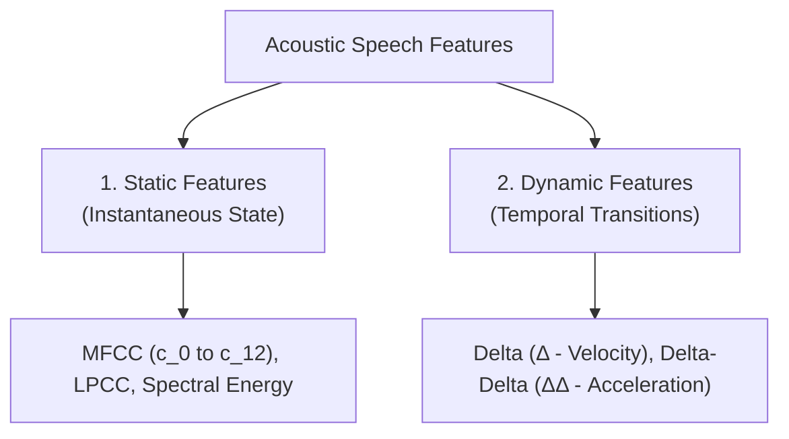
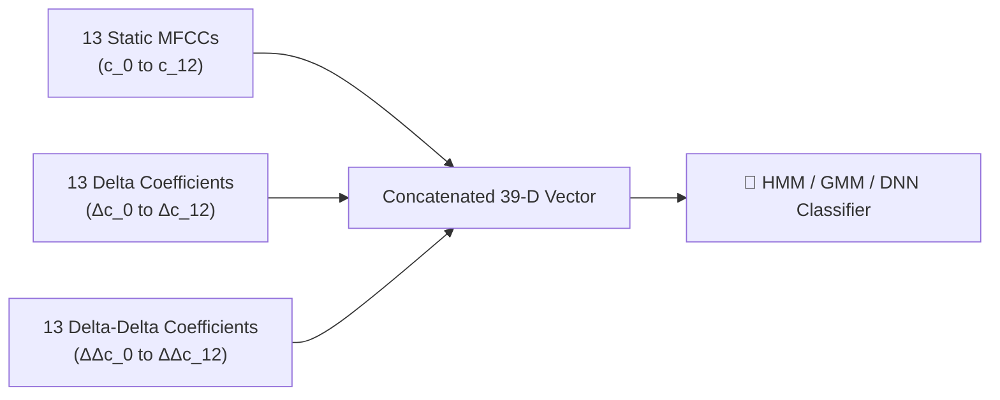
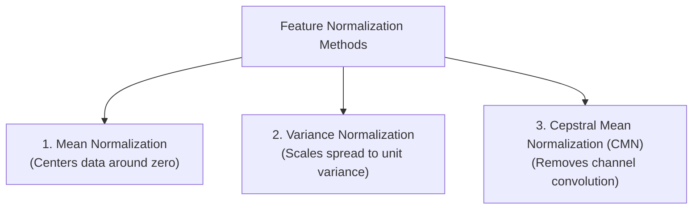
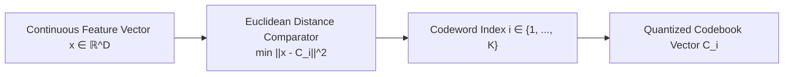
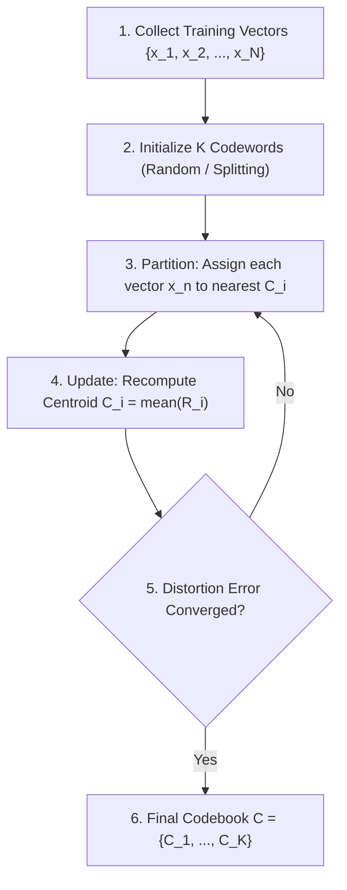

# Chapter 6: Dynamic Features, Normalization, and Vector Quantization

> **Module 2**: Feature Extraction and Speech Recognition  
> **Course**: Speech and Video Processing (CS30033)  
> **Faculty Resource**: Dr. Kunal Anand (SCE, KIIT DU)

---

# Table of Contents
1. [Static vs. Dynamic Speech Features](#1-static-vs-dynamic-speech-features)
2. [Mathematical Formulations of Delta and Delta-Delta](#2-mathematical-formulations-of-delta-and-delta-delta)
3. [The Standard 39-Dimensional ASR Feature Vector](#3-the-standard-39-dimensional-asr-feature-vector)
4. [Feature Normalization Techniques](#4-feature-normalization-techniques)
5. [Vector Quantization (VQ) Fundamentals](#5-vector-quantization-vq-fundamentals)
6. [Codebook Generation: The LBG Algorithm](#6-codebook-generation-the-lbg-algorithm)
7. [Applications of VQ in Speech Systems](#7-applications-of-vq-in-speech-systems)
8. [Summary & Key Mathematical Formulas](#8-summary--key-mathematical-formulas)

---

## 1. Static vs. Dynamic Speech Features

In digital speech processing, short-time acoustic features extracted from isolated speech frames are categorized into **Static** and **Dynamic** features:

| Parameter | Static Features | Dynamic Features (Delta & Delta-Delta) |
| :--- | :--- | :--- |
| **Physical Definition** | Describes instantaneous spectral/phonetic properties of a single isolated frame. | Describes the rate of change (velocity) and acceleration of spectral features over time. |
| **Temporal Span** | Localized to short-time frame ($20–30\text{ ms}$). | Spans context across multiple adjacent frames ($50–100\text{ ms}$). |
| **Articulatory Meaning**| Fixed vocal tract posture (e.g., stationary tongue position for a vowel). | Physical movement and transition of articulators (tongue, lips, jaw) during coarticulation. |
| **Standard Examples** | 13 static MFCCs ($c_0, c_1, \dots, c_{12}$). | 13 Delta ($\Delta c_t$) + 13 Delta-Delta ($\Delta\Delta c_t$) coefficients. |

### 1.1 Why Dynamic Features Are Necessary
1. **Speech Non-Stationarity**: Speech is inherently continuous; articulators move smoothly from one sound to the next.
2. **Coarticulation Information**: Phonetic boundaries and transition paths between adjacent consonants and vowels carry critical phonetic information not present in static frames alone.
3. **Temporal Trajectory Modeling**: Standard statistical models (like Hidden Markov Models with continuous density Gaussian emissions) assume frames are conditionally independent. Appending dynamic coefficients directly into the feature vector provides the model with crucial temporal trajectory context.

---

## 2. Mathematical Formulations of Delta and Delta-Delta

### 2.1 Delta ($\Delta$) Coefficients (Velocity / 1st Derivative)
A Delta coefficient $\Delta c_t$ represents the first-order time derivative (velocity) of a feature trajectory.

For a 3-point symmetric window:

$$\Delta c_t = \frac{c_{t+1} - c_{t-1}}{2}$$

where:
- $c_t$ is the feature value at current frame $t$.
- $c_{t+1}$ is the feature value at the next frame $t+1$.
- $c_{t-1}$ is the feature value at the previous frame $t-1$.

*Generalized Regression Formula over window size $K$:*
$$\Delta c_t = \frac{\sum_{k=1}^K k (c_{t+k} - c_{t-k})}{2 \sum_{k=1}^K k^2}$$

### 2.2 Delta-Delta ($\Delta\Delta$) Coefficients (Acceleration / 2nd Derivative)
A Delta-Delta coefficient $\Delta\Delta c_t$ represents the second-order time derivative (acceleration) of the feature trajectory:

$$\Delta\Delta c_t = \frac{\Delta c_{t+1} - \Delta c_{t-1}}{2}$$

where $\Delta c_{t+1}$ and $\Delta c_{t-1}$ are the delta coefficients of the next and previous frames respectively.

---

## 3. The Standard 39-Dimensional ASR Feature Vector

In industry and research ASR systems (such as Kaldi, HTK, CMU Sphinx), each frame is represented by a concatenated **39-dimensional acoustic feature vector**:

$$\mathbf{x}_t = \begin{bmatrix}
\mathbf{c}_t \\
\Delta \mathbf{c}_t \\
\Delta\Delta \mathbf{c}_t
\end{bmatrix}_{39 \times 1}$$

---

## 4. Feature Normalization Techniques

Speech features exhibit substantial numerical variations caused by speaker loudness, microphone variations, recording channels, and room reverberation. **Feature normalization** rescales feature distributions into a consistent scale.

### 4.1 Mean Normalization
Subtracts the utterance mean $\mu$ from every frame sample:

$$\mu = \frac{1}{N} \sum_{t=1}^{N} c_t \implies \tilde{c}_t = c_t - \mu$$

- **Result**: The normalized feature sequence has a mean of exactly zero ($\bar{\tilde{c}} = 0$).

### 4.2 Variance Normalization
Divides the mean-normalized values by the feature standard deviation $\sigma$:

$$\sigma^2 = \frac{1}{N} \sum_{t=1}^{N} (c_t - \mu)^2 \implies \hat{c}_t = \frac{c_t - \mu}{\sigma}$$

- **Result**: Standardizes the feature sequence to zero mean and unit variance ($\sigma^2 = 1$). Prevents high-energy feature dimensions from dominating distance calculations.

### 4.3 Cepstral Mean Normalization (CMN)
CMN applies mean subtraction specifically to cepstral features across an entire audio recording:

$$\hat{c}_t(k) = c_t(k) - \frac{1}{T}\sum_{\tau=1}^{T} c_\tau(k)$$

- **Acoustic Rationale**: A linear transmission channel (e.g., telephone line or room reverberation $h_{chan}[n]$) acts as a convolution $s[n] = x[n] * h_{chan}[n]$. In the cepstral domain, this becomes an additive constant offset:
  $$c_{observed}[n] = c_{speech}[n] + c_{channel}[n]$$
  Subtracting the long-term temporal average removes the stationary channel bias $c_{channel}[n]$ (**Blind Channel Equalization**).

---

## 5. Vector Quantization (VQ) Fundamentals

Vector Quantization (VQ) is a lossy signal compression technique that maps continuous, high-dimensional multi-variable feature vectors into a finite set of discrete representative vectors called **codewords**.

### 5.1 Key VQ Terminologies
- **Feature Vector ($\mathbf{x}$)**: A $D$-dimensional continuous numerical vector representing a speech frame (e.g., $13$-dimensional MFCC).
- **Codeword ($\mathbf{C}_i$)**: A prototype representative vector.
- **Codebook ($\mathcal{C}$)**: The complete set of $K = 2^B$ codewords: $\mathcal{C} = \{\mathbf{C}_1, \mathbf{C}_2, \dots, \mathbf{C}_K\}$.
- **Voronoi Region / Cell ($R_i$)**: The geometric spatial partition in $\mathbb{R}^D$ where all vectors lie closer to $\mathbf{C}_i$ than to any other codeword.

### 5.2 Nearest-Neighbor Encoding Rule
An input vector $\mathbf{x}$ is assigned to the codeword $\mathbf{C}_i$ that yields the **smallest Euclidean distance**:

$$\text{Index } i^* = \arg\min_{1 \le i \le K} d(\mathbf{x}, \mathbf{C}_i) = \arg\min_{1 \le i \le K} \sqrt{\sum_{j=1}^{D} (x_j - C_{ij})^2}$$

---

## 6. Codebook Generation: The LBG Algorithm

The **Linde-Buzo-Gray (LBG)** algorithm (a generalized $K$-means clustering procedure) designs an optimal codebook from a large training dataset:

### 6.1 Centroid Update Equation
For each cluster $R_i$, the new codeword is computed as the geometric mean:

$$\mathbf{C}_i = \frac{1}{|R_i|} \sum_{\mathbf{x} \in R_i} \mathbf{x}$$

---

## 7. Applications of VQ in Speech Systems

1. **Speaker Recognition (VQ Codebook Profiling)**: Each registered speaker is modeled by a dedicated codebook. Test utterances are scored against each speaker's codebook; the lowest quantization distortion identifies the speaker.
2. **Discrete Hidden Markov Models (HMMs)**: VQ discretizes continuous feature vectors into discrete observation symbols ($v_1, v_2, \dots, v_K$), enabling discrete probability tables.
3. **Speech Compression & Voice Coding**: Storing or transmitting only the discrete codeword index ($B = \log_2 K$ bits) drastically reduces transmission bandwidth.

---

## 8. Summary & Key Mathematical Formulas

1. **Delta Formulation**: $\Delta c_t = \frac{c_{t+1} - c_{t-1}}{2}$
2. **Delta-Delta Formulation**: $\Delta\Delta c_t = \frac{\Delta c_{t+1} - \Delta c_{t-1}}{2}$
3. **Mean Normalization**: $\tilde{c}_t = c_t - \mu, \quad \mu = \frac{1}{N}\sum c_t$
4. **Variance Normalization**: $\hat{c}_t = \frac{c_t - \mu}{\sigma}, \quad \sigma = \sqrt{\frac{1}{N}\sum(c_t - \mu)^2}$
5. **Cepstral Mean Normalization (CMN)**: $\hat{c}_t = c_t - \frac{1}{T}\sum_{\tau=1}^T c_\tau$
6. **Euclidean Distance in VQ**: $d(\mathbf{x}, \mathbf{C}_i) = \sqrt{\sum_{j=1}^D (x_j - C_{ij})^2}$
