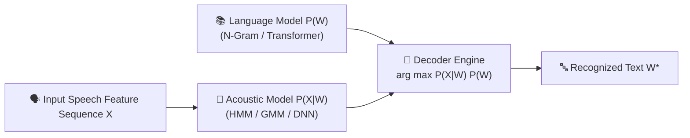
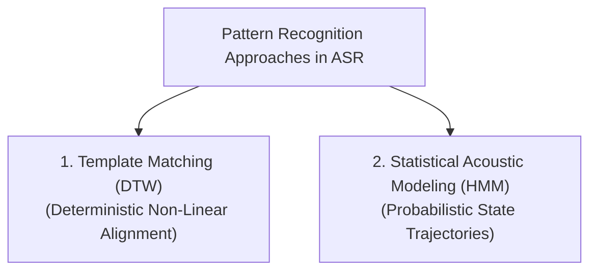
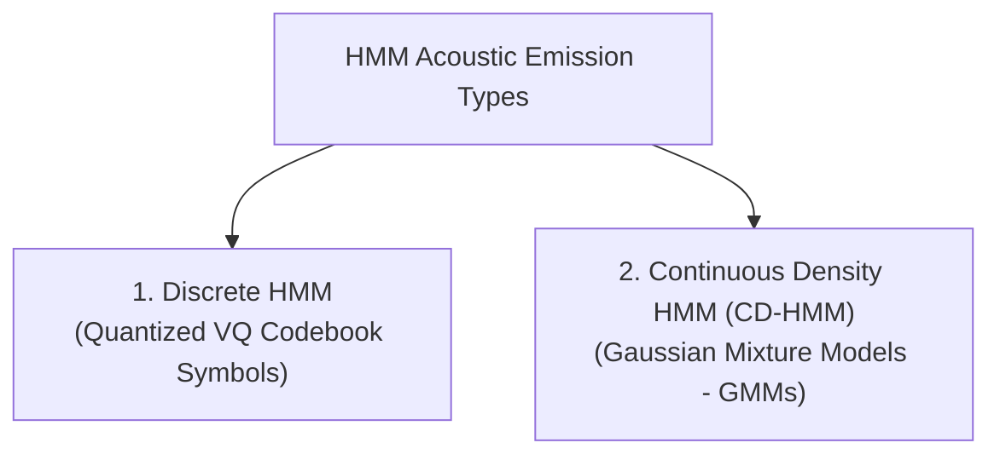

# Chapter 7: Pattern Matching and HMM-based Speech Recognition

> **Module 2**: Feature Extraction and Speech Recognition  
> **Course**: Speech and Video Processing (CS30033)  
> **Faculty Resource**: Dr. Kunal Anand (SCE, KIIT DU)

---

# Table of Contents
1. [Pattern Matching Paradigms in ASR](#1-pattern-matching-paradigms-in-asr)
2. [Template Matching vs. Statistical Modeling](#2-template-matching-vs-statistical-modeling)
3. [Hidden Markov Model (HMM) Formalism](#3-hidden-markov-model-hmm-formalism)
4. [The Three Fundamental Problems of HMMs](#4-the-three-fundamental-problems-of-hmms)
5. [Problem 1: Evaluation & The Forward Algorithm](#5-problem-1-evaluation--the-forward-algorithm)
6. [Problem 2: Decoding & The Viterbi Algorithm](#6-problem-2-decoding--the-viterbi-algorithm)
7. [Problem 3: Learning & The Baum-Welch Algorithm](#7-problem-3-learning--the-baum-welch-algorithm)
8. [Discrete vs. Continuous Density HMMs](#8-discrete-vs-continuous-density-hmms)
9. [Summary & Key Mathematical Formulas](#9-summary--key-mathematical-formulas)

---

## 1. Pattern Matching Paradigms in ASR

Speech recognition is essentially a pattern classification problem: given an acoustic feature sequence $\mathbf{X} = (\mathbf{x}_1, \mathbf{x}_2, \dots, \mathbf{x}_T)$, determine the word sequence $W^* = (w_1, w_2, \dots, w_M)$ that has the highest conditional probability:

$$W^* = \arg\max_W P(W|\mathbf{X}) = \arg\max_W \frac{P(\mathbf{X}|W) P(W)}{P(\mathbf{X})} = \arg\max_W P(\mathbf{X}|W) P(W)$$



### 1.1 Sources of Speech Variability
- **Temporal Variability**: Speaking rate varies dynamically within and across words.
- **Inter-Speaker Variability**: Pitch, vocal tract length, regional accents, and gender.
- **Intra-Speaker Variability**: Vocal effort, emotion, health, and fatigue.
- **Environmental & Channel Variability**: Background acoustic noise and microphone frequency responses.

---

## 2. Template Matching vs. Statistical Modeling



| Criterion | Template Matching (Dynamic Time Warping - DTW) | Hidden Markov Models (HMM) |
| :--- | :--- | :--- |
| **Model Type** | Deterministic exemplar matching. | Doubly stochastic parametric statistical modeling. |
| **Time Alignment** | Warps time axis non-linearly via dynamic programming. | Handled inherently through self-transitions ($a_{ii}$). |
| **Generalization** | Stores individual reference templates; poor generalization to new speakers. | Learns mean and variance distributions across large populations. |
| **Computational Scalability** | Compares input against all templates; fails for large vocabulary. | Efficient network composition (phonetic lexicons & language models). |

---

## 3. Hidden Markov Model (HMM) Formalism

An HMM is a **doubly stochastic finite state automaton**:
1. **Underlying State Sequence (Hidden)**: An unobservable discrete Markov chain $Q = (q_1, q_2, \dots, q_T)$ governed by state transition matrix $A$.
2. **Observation Sequence (Visible)**: A sequence of acoustic feature vectors $O = (O_1, O_2, \dots, O_T)$ generated probabilistically from the current state according to emission probability distribution $B$.

```mermaid
flowchart LR
    subgraph Hidden Markov Layer
        S1["State q_1 = S_1"] -->|a_11| S1
        S1 -->|a_12| S2["State q_2 = S_2"]
        S2 -->|a_22| S2
        S2 -->|a_23| S3["State q_3 = S_3"]
    end

    subgraph Observable Acoustic Layer
        S1 -->|b_1(O_1)| O1["Observation O_1"]
        S2 -->|b_2(O_2)| O2["Observation O_2"]
        S3 -->|b_3(O_3)| O3["Observation O_3"]
    end
```

### 3.1 The Model Parameter Triplet $\lambda = (A, B, \pi)$
1. **State Set**: $S = \{S_1, S_2, \dots, S_N\}$ ($N$ states).
2. **Initial State Probabilities ($\pi$)**:
   $$\pi_i = P(q_1 = S_i), \quad 1 \le i \le N, \quad \text{with } \sum_{i=1}^N \pi_i = 1$$
3. **State Transition Probability Matrix ($A$)**:
   $$a_{ij} = P(q_{t+1} = S_j \mid q_t = S_i), \quad 1 \le i, j \le N, \quad \text{with } \sum_{j=1}^N a_{ij} = 1$$
4. **Observation Emission Probability Distribution ($B$)**:
   - *Discrete HMM*: $b_j(k) = P(O_t = v_k \mid q_t = S_j)$ for discrete symbol $v_k$.
   - *Continuous Density HMM*: $b_j(\mathbf{x}) = \mathcal{N}(\mathbf{x}; \boldsymbol{\mu}_j, \boldsymbol{\Sigma}_j)$.

### 3.2 HMM Topologies
- **Left-to-Right (Bakis Model)**: States proceed sequentially with self-loops ($a_{ij} = 0$ for $j < i$). Perfectly captures the forward flow of time in speech phonemes.
- **Ergodic Model**: Fully connected; any state can transition to any other state.

---

## 4. The Three Fundamental Problems of HMMs

| Problem | Goal | Core Question | Standard Algorithm |
| :--- | :--- | :--- | :--- |
| **1. Evaluation** | Compute $P(O \mid \lambda)$ | *"How likely is model $\lambda$ to have produced acoustic sequence $O$?"* | **Forward-Backward Algorithm** |
| **2. Decoding** | Find optimal state sequence $Q^*$ | *"What was the most likely hidden phonetic state sequence?"* | **Viterbi Algorithm** |
| **3. Learning (Training)** | Optimize $\lambda^* = \arg\max_\lambda P(O \mid \lambda)$ | *"How do we adjust $A, B, \pi$ to fit the training speech data?"* | **Baum-Welch (EM) Algorithm** |

---

## 5. Problem 1: Evaluation & The Forward Algorithm

### 5.1 Forward Variable Definition
The **forward variable** $\alpha_t(i)$ is defined as the joint probability of observing the partial sequence $(O_1, O_2, \dots, O_t)$ and being in state $S_i$ at time $t$:

$$\alpha_t(i) = P(O_1, O_2, \dots, O_t, \, q_t = S_i \mid \lambda)$$

### 5.2 Three Steps of the Forward Algorithm
1. **Initialization ($t = 1$)**:
   $$\alpha_1(i) = \pi_i \, b_i(O_1), \quad 1 \le i \le N$$
2. **Induction / Recursion ($t = 1, 2, \dots, T-1$)**:
   $$\alpha_{t+1}(j) = \left[ \sum_{i=1}^{N} \alpha_t(i) \, a_{ij} \right] b_j(O_{t+1}), \quad 1 \le j \le N$$
3. **Termination ($t = T$)**:
   $$P(O \mid \lambda) = \sum_{i=1}^{N} \alpha_T(i)$$

*Computational Complexity*: Reduced from exhaustive $O(N^T \cdot T)$ to dynamic programming $O(N^2 T)$.

---

## 6. Problem 2: Decoding & The Viterbi Algorithm

The Viterbi algorithm finds the single best state sequence $Q^* = (q_1^*, q_2^*, \dots, q_T^*)$ that maximizes $P(Q, O \mid \lambda)$.

### 6.1 Viterbi Variable Definition
$$v_t(i) = \max_{q_1, \dots, q_{t-1}} P(q_1, \dots, q_t = S_i, O_1, \dots, O_t \mid \lambda)$$

### 6.2 Steps of the Viterbi Algorithm
1. **Initialization**:
   $$v_1(i) = \pi_i \, b_i(O_1), \quad \psi_1(i) = 0, \quad 1 \le i \le N$$
2. **Recursion ($t = 2, 3, \dots, T$)**:
   $$v_t(j) = \max_{1 \le i \le N} \left[ v_{t-1}(i) \, a_{ij} \right] \cdot b_j(O_t), \quad 1 \le j \le N$$
   $$\psi_t(j) = \arg\max_{1 \le i \le N} \left[ v_{t-1}(i) \, a_{ij} \right]$$
3. **Termination**:
   $$P^* = \max_{1 \le i \le N} [v_T(i)], \quad q_T^* = \arg\max_{1 \le i \le N} [v_T(i)]$$
4. **Path Backtracking**:
   $$q_t^* = \psi_{t+1}(q_{t+1}^*), \quad t = T-1, T-2, \dots, 1$$

---

## 7. Problem 3: Learning & The Baum-Welch Algorithm

The Baum-Welch algorithm is an **Expectation-Maximization (EM)** method that iteratively maximizes $P(O \mid \lambda)$:

1. **E-Step (Expectation)**:
   - Computes state posterior probability:
     $$\gamma_t(i) = P(q_t = S_i \mid O, \lambda) = \frac{\alpha_t(i) \beta_t(i)}{\sum_{j=1}^N \alpha_t(j) \beta_t(j)}$$
   - Computes transition posterior probability:
     $$\xi_t(i, j) = P(q_t = S_i, q_{t+1} = S_j \mid O, \lambda) = \frac{\alpha_t(i) a_{ij} b_j(O_{t+1}) \beta_{t+1}(j)}{P(O \mid \lambda)}$$
2. **M-Step (Maximization / Parameter Update)**:
   $$\bar{\pi}_i = \gamma_1(i)$$
   $$\bar{a}_{ij} = \frac{\sum_{t=1}^{T-1} \xi_t(i, j)}{\sum_{t=1}^{T-1} \gamma_t(i)}$$
   $$\bar{b}_j(k) = \frac{\sum_{t=1, O_t = v_k}^{T} \gamma_t(j)}{\sum_{t=1}^{T} \gamma_t(j)}$$

---

## 8. Discrete vs. Continuous Density HMMs



| Criterion | Discrete HMM | Continuous Density HMM (GMM-HMM) |
| :--- | :--- | :--- |
| **Observation Representation** | Discrete codebook index $O_t = v_k \in \{v_1, \dots, v_K\}$. | Continuous feature vector $\mathbf{x}_t \in \mathbb{R}^D$ (e.g., 39-D MFCC). |
| **Pre-Processing Requirement** | Requires Vector Quantization (VQ) front-end. | Directly takes continuous feature vectors. |
| **Emission Modeling** | Discrete probability table $B = \{b_j(k)\}$. | Continuous GMM: $b_j(\mathbf{x}) = \sum_{m=1}^M c_{jm} \mathcal{N}(\mathbf{x}; \boldsymbol{\mu}_{jm}, \boldsymbol{\Sigma}_{jm})$. |
| **Information Loss** | Quantization error degrades fine spectral details. | Preserves full continuous variance and covariance. |
| **ASR Performance** | Lower accuracy; historical standard. | High accuracy; foundational architecture for modern ASR. |

---

## 9. Summary & Key Mathematical Formulas

1. **Forward Induction**: $\alpha_{t+1}(j) = \left[ \sum_{i=1}^N \alpha_t(i) a_{ij} \right] b_j(O_{t+1})$
2. **Forward Likelihood**: $P(O \mid \lambda) = \sum_{i=1}^N \alpha_T(i)$
3. **Viterbi Induction**: $v_t(j) = \max_i [v_{t-1}(i) a_{ij}] \cdot b_j(O_t)$
4. **Viterbi Backpointer**: $\psi_t(j) = \arg\max_i [v_{t-1}(i) a_{ij}]$
5. **GMM State Emission**: $b_j(\mathbf{x}) = \sum_{m=1}^M c_{jm} \frac{1}{(2\pi)^{D/2} |\boldsymbol{\Sigma}_{jm}|^{1/2}} \exp\left( -\frac{1}{2}(\mathbf{x} - \boldsymbol{\mu}_{jm})^T \boldsymbol{\Sigma}_{jm}^{-1} (\mathbf{x} - \boldsymbol{\mu}_{jm}) \right)$
