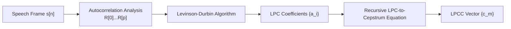

# Module 2: Feature Extraction and Speech Recognition — Official Master Question Bank Solutions

> **Academic Course**: Speech and Video Processing (CS30033)  
> **Source Material**: Official Module-2 Question Bank by Dr. Kunal Anand (SCE, KIIT DU)  
> **Grading Structure**:  
> - **Part I: Short Answer Questions (SAQ 1 – SAQ 53)** $\to$ **2 Marks Each** (Crisp definitions, formulas, and key significance).  
> - **Part II: Long Answer Questions & Problems (LAQ 1 – LAQ 28)** $\to$ **5 Marks Each** (Detailed derivations, embedded diagrams, comparison matrices, and step-by-step numericals).

---

# Table of Contents
1. [Part I: Short Answer Questions (SAQ 1 – SAQ 53) — 2 Marks Each](#part-i-short-answer-questions-saq-1--saq-53)
2. [Part II: Long Answer Questions & Solved Problems (LAQ 1 – LAQ 28) — 5 Marks Each](#part-ii-long-answer-questions--solved-problems-laq-1--laq-28)

---

# Part I: Short Answer Questions (SAQ 1 – SAQ 53)

### SAQ 1: Define speech feature. Write the significance of feature extraction in speech processing. (2 Marks)
**Answer:**
- **Definition (1 Mark)**: A speech feature is a compact, informative mathematical representation or parameter (such as MFCC, LPCC, or pitch) extracted from a short-time speech segment that characterizes its acoustic, phonetic, or speaker identity.
- **Significance (1 Mark)**: It drastically reduces raw audio data dimensionality while discarding irrelevant variations (such as microphone distance, background noise, and amplitude fluctuations), providing clean, robust inputs for speech recognition and speaker identification models.

---

### SAQ 2: List out different types of speech features. (2 Marks)
**Answer:**
1. **Temporal Features**: Short-Time Energy ($E_n$), Zero-Crossing Rate (ZCR), Autocorrelation.
2. **Spectral Features**: Formant Frequencies ($F_1, F_2, F_3$), Spectral Centroid, Spectral Flux, Spectral Tilt.
3. **Cepstral Features**: Real Cepstrum, Complex Cepstrum, Linear Prediction Cepstral Coefficients (LPCC).
4. **Perceptual Auditory Features**: Mel-Frequency Cepstral Coefficients (MFCC), Perceptual Linear Prediction (PLP).
5. **Dynamic Features**: Delta ($\Delta$) and Delta-Delta ($\Delta\Delta$) velocity and acceleration coefficients.

---

### SAQ 3: Write the necessity of feature extraction in speech processing. (2 Marks)
**Answer:**
1. **Dimensionality Reduction**: Compresses $16,000$ raw samples per second into $12–39$ meaningful parameters per frame.
2. **Phonetic Invariance**: Retains linguistic vowel/consonant vocal tract shapes while removing speaker loudness and recording channel biases.
3. **Pattern Classification Feasibility**: Converts infinite-length, time-varying signals into fixed-size feature vectors suitable for statistical acoustic modeling (HMMs, DNNs).

---

### SAQ 4: Why is raw speech audio data not directly fed into a speech recognition system? (2 Marks)
**Answer:**
1. **Excessive Dimensionality**: Raw sample counts are computationally intractable for pattern classifiers.
2. **Phase & Timing Sensitivity**: Minor phase shifts alter raw waveform numbers without changing the spoken word.
3. **High Acoustic Redundancy**: Raw waveforms contain massive non-linguistic noise (speaker volume, pitch fluctuations, channel effects) that confuses acoustic classifiers.

---

### SAQ 5: List three physical characteristics of a speech signal that can be captured during feature extraction. (2 Marks)
**Answer:**
1. **Vocal Tract Formants / Resonances**: Reflected in the spectral envelope ($F_1, F_2, F_3$) corresponding to tongue and jaw position.
2. **Glottal Pitch / Fundamental Frequency ($F_0$)**: Harmonic spacing and periodic excitation of vocal fold vibrations.
3. **Temporal Articulatory Dynamics**: Velocity and acceleration of moving articulators (tongue, lips) captured by dynamic delta features.

---

### SAQ 6: State any two properties of a "good" speech feature. (2 Marks)
**Answer:**
1. **High Phonetic Discrimination**: Clearly differentiates between distinct phonemes and word classes.
2. **Robustness & Noise Invariance**: Remains stable and invariant under varying background noise, microphone channels, and speaker loudness.

---

### SAQ 7: Define static feature. List out some static features of a speech signal. (2 Marks)
**Answer:**
- **Definition (1 Mark)**: A static feature describes the instantaneous spectral or phonetic characteristics of speech measured over a single isolated short-time frame ($20–30\text{ ms}$).
- **Examples (1 Mark)**: Static MFCCs ($c_0$ to $c_{12}$), LPCCs, Formants ($F_1, F_2$), Short-Time Energy ($E$).

---

### SAQ 8: Define dynamic feature. Give some examples of dynamic features of a speech signal. (2 Marks)
**Answer:**
- **Definition (1 Mark)**: A dynamic feature captures the time derivative (rate of change or acceleration) of static features across consecutive speech frames.
- **Examples (1 Mark)**: Delta coefficients ($\Delta c_t$ - velocity) and Delta-Delta coefficients ($\Delta\Delta c_t$ - acceleration).

---

### SAQ 9: Differentiate between static and dynamic speech features. (2 Marks)
**Answer:**

| Parameter | Static Features | Dynamic Features |
| :--- | :--- | :--- |
| **Physical Scope** | Instantaneous acoustic properties of a single frame ($20–30\text{ ms}$). | Temporal rate of change and transition across adjacent frames ($50–100\text{ ms}$). |
| **Articulatory State** | Stationary vocal tract posture. | Moving articulators (coarticulation dynamics). |
| **Examples** | MFCCs ($c_0$–$c_{12}$), LPCCs, Energy. | Delta ($\Delta c_t$), Delta-Delta ($\Delta\Delta c_t$). |

---

### SAQ 10: What is the function of the Zero-Crossing Rate (ZCR) in temporal feature extraction? (2 Marks)
**Answer:**
- **Function**: Measures the number of times the speech signal waveform changes sign (crosses zero amplitude) per second.
- **Application**: Differentiates **voiced speech** (low ZCR due to low-frequency pitch harmonics) from **unvoiced speech** and background noise (high ZCR due to high-frequency turbulent friction).

---

### SAQ 11: Name two clinical glottal features and state what application they are typically used for. (2 Marks)
**Answer:**
- **Features**: **Jitter** (cycle-to-cycle pitch period variation) and **Shimmer** (cycle-to-cycle peak amplitude variation).
- **Application**: Used in clinical voice pathology to detect vocal fold diseases (dysphonia, vocal cord nodules, Parkinson's disease) and assess voice quality.

---

### SAQ 12: Define the term "Cepstrum" and explain the origin of its name. (2 Marks)
**Answer:**
- **Definition (1 Mark)**: The cepstrum is the inverse Fourier transform of the logarithm of the estimated Fourier magnitude spectrum of a signal.
- **Origin (1 Mark)**: The word *"Cepstrum"* is an anagram of **"SPECTRUM"**, coined by Bogert, Healy, and Tukey (1963) to emphasize that it represents a spectrum of a spectrum.

---

### SAQ 13: How does the unit of the horizontal axis in the cepstral domain differ from the frequency domain? What is it called? (2 Marks)
**Answer:**
- **Axis Name**: The horizontal axis in the cepstral domain is called **Quefrency** (an anagram of *"frequency"*).
- **Unit Difference**: While the frequency domain has units of Hertz ($\text{Hz}$ or $1/\text{s}$), quefrency has the dimension of **Time (seconds or sample indices)**.

---

### SAQ 14: Explain how the mathematical process in the cepstral domain helps separate convolved signals. (2 Marks)
**Answer:**
Speech is a convolution $s[n] = e[n] * h[n]$. The Fourier Transform converts this into multiplication: $|S(\omega)| = |E(\omega)| \cdot |H(\omega)|$. Taking the natural logarithm converts multiplication into **linear addition**:

$$\ln |S(\omega)| = \ln |E(\omega)| + \ln |H(\omega)|$$

The inverse transform maps them into distinct quefrency regions ($c_h[n]$ at low quefrencies, $c_e[n]$ at high quefrencies), allowing them to be separated by linear filtering (**Liftering**).

---

### SAQ 15: Differentiate between the Real Cepstrum and the Complex Cepstrum in terms of phase data utilization. (2 Marks)
**Answer:**
- **Real Cepstrum**: Uses only the magnitude spectrum ($\ln |X(e^{j\omega})|$) and **completely discards phase data**, making it an **irreversible** transformation.
- **Complex Cepstrum**: Uses both magnitude and unwrapped phase ($\ln |X| + j \arg X$), preserving full phase data and making it a **fully reversible/invertible** transformation.

---

### SAQ 16: State one practical application where the Complex Cepstrum is preferred over the Real Cepstrum, and explain why. (2 Marks)
**Answer:**
- **Application**: **Echo Removal & Audio Dereverberation** (or Text-to-Speech synthesis).
- **Reason**: The complex cepstrum preserves phase data, allowing the modified cepstrum (with echo peaks liftered out) to be inverted back into a clean, audible time-domain signal.

---

### SAQ 17: What is the primary purpose of the Pre-emphasis step in speech processing pipelines? (2 Marks)
**Answer:**
Pre-emphasis filters speech with a first-order FIR high-pass filter $y[n] = x[n] - \alpha x[n-1]$ ($\alpha \approx 0.95–0.98$) to **flatten the $-6\text{ dB/octave}$ glottal spectral tilt**, boosting high-frequency formant energies ($F_2, F_3$) and improving acoustic model SNR.

---

### SAQ 18: Why is windowing necessary when slicing a continuous audio signal into frames? (2 Marks)
**Answer:**
Rectangular slicing causes sharp amplitude discontinuities at frame boundaries. Windowing (using a Hamming/Hanning window) smoothly tapers the signal amplitudes to zero at both ends, eliminating boundary discontinuities and **suppressing spectral leakage**.

---

### SAQ 19: Why should the frame length be always kept bigger than frame shift while windowing the speech signal? (2 Marks)
**Answer:**
Keeping frame length ($25\text{ ms}$) larger than frame shift ($10\text{ ms}$) creates a **$50–60\%$ frame overlap**. This ensures temporal continuity, prevents loss of acoustic information occurring near frame boundaries, and captures smooth phonetic transitions.

---

### SAQ 20: Compare the rectangle window and the Hamming window in terms of spectral leakage. (2 Marks)
**Answer:**
- **Rectangular Window**: High sidelobe level ($-13\text{ dB}$ attenuation), causing severe spectral leakage into adjacent frequency bins.
- **Hamming Window**: High sidelobe attenuation ($-41\text{ dB}$ suppression), virtually eliminating spectral leakage while maintaining adequate mainlobe frequency resolution.

---

### SAQ 21: What is the purpose of the Mel Filterbank step in MFCC extraction? (2 Marks)
**Answer:**
The Mel filterbank integrates spectral power into overlapping triangular bandpass channels spaced linearly below $1000\text{ Hz}$ and logarithmically above $1000\text{ Hz}$, **mimicking the non-linear human cochlear pitch resolution**.

---

### SAQ 22: Which algorithm is typically used in LPC analysis to recursively calculate predictor coefficients from autocorrelation values? (2 Marks)
**Answer:**
The **Levinson-Durbin Recursion Algorithm**, which efficiently solves the Toeplitz Yule-Walker normal matrix equations in $O(p^2)$ computational complexity.

---

### SAQ 23: How does the underlying biological/psychological model of LPCC differ from that of MFCC? (2 Marks)
**Answer:**
- **LPCC**: Based on the **human speech production system** (modeling the acoustic vocal tract as an all-pole resonant acoustic tube).
- **MFCC**: Based on the **human auditory perceptual system** (modeling the non-linear critical band filtering of the human cochlea and basilar membrane).

---

### SAQ 24: Why is MFCC more widely used in Automatic Speech Recognition (ASR) environments compared to LPCC? (2 Marks)
**Answer:**
1. **Noise Robustness**: MFCC's filterbank integration averages out background noise, whereas LPCC's pole estimation is highly sensitive to noise.
2. **Unvoiced & Nasal Modeling**: MFCC captures both voiced and unvoiced spectral shapes without making an all-pole filter assumption.

---

### SAQ 25: Give one example application where LPCC outperforms MFCC, and specify which speech characteristic it relies on. (2 Marks)
**Answer:**
- **Application**: **Clinical Vocal Tract Pathology & Articulatory Tube Reconstruction** (or clean-speech speaker verification).
- **Speech Characteristic**: Precise mathematical modeling of vocal tract all-pole resonant formant poles and vocal tract cross-sectional area functions.

---

### SAQ 26: List out the static features in speech processing. (2 Marks)
**Answer:**
1. Static Mel-Frequency Cepstral Coefficients ($c_0$ to $c_{12}$).
2. Linear Prediction Cepstral Coefficients (LPCC).
3. Formant Frequencies ($F_1, F_2, F_3$).
4. Short-Time Log Frame Energy ($E$).

---

### SAQ 27: Why are dynamic features needed in speech processing? (2 Marks)
**Answer:**
Static features only capture a snapshot of a single frame. Dynamic features capture the velocity and acceleration of moving articulators (tongue, lips) across phoneme transitions, carrying critical coarticulation information.

---

### SAQ 28: Name the two commonly used dynamic coefficients in speech processing. (2 Marks)
**Answer:**
1. **Delta ($\Delta$) Coefficients** (Differential / Velocity coefficients).
2. **Delta-Delta ($\Delta\Delta$) Coefficients** (Acceleration / Acceleration coefficients).

---

### SAQ 29: What does a Delta (Δ) and Delta-Delta (ΔΔ) coefficient represent? (2 Marks)
**Answer:**
- **Delta ($\Delta$)**: Represents the **first-order time derivative (velocity)** of feature trajectories (rate of spectral change).
- **Delta-Delta ($\Delta\Delta$)**: Represents the **second-order time derivative (acceleration)** of feature trajectories (rate of change of the rate).

---

### SAQ 30: If the previous, current, and next feature values are 14, 18 and 20 respectively, calculate the Delta coefficient. (2 Marks)
**Answer:**
Given $c_{t-1} = 14, c_t = 18, c_{t+1} = 20$:

$$\Delta c_t = \frac{c_{t+1} - c_{t-1}}{2} = \frac{20 - 14}{2} = \frac{6}{2} = \mathbf{3.0}$$

---

### SAQ 31: If the Delta values of the previous, current, and next frames are 4, 6, and 10 respectively, calculate the Delta-Delta coefficient. (2 Marks)
**Answer:**
Given $\Delta c_{t-1} = 4, \Delta c_t = 6, \Delta c_{t+1} = 10$:

$$\Delta\Delta c_t = \frac{\Delta c_{t+1} - \Delta c_{t-1}}{2} = \frac{10 - 4}{2} = \frac{6}{2} = \mathbf{3.0}$$

---

### SAQ 32: Define feature normalization. (2 Marks)
**Answer:**
Feature normalization is a mathematical pre-processing transformation that adjusts speech feature values across frames to a consistent scale and distribution (typically zero mean and unit variance), eliminating speaker and recording condition biases.

---

### SAQ 33: State any two reasons why normalization is required in speech processing. (2 Marks)
**Answer:**
1. **Eliminates Channel / Microphone Biases**: Compresses amplitude variations caused by speaker distance and recording hardware.
2. **Equalizes Feature Weighting**: Prevents high-magnitude feature dimensions (like energy) from dominating distance calculations in classifiers over lower-magnitude cepstral features.

---

### SAQ 34: Define mean normalization. (2 Marks)
**Answer:**
Mean normalization subtracts the global utterance mean $\mu$ from each feature vector sample, centering the entire feature distribution around zero:

$$\mu = \frac{1}{N} \sum_{t=1}^N c_t \implies \tilde{c}_t = c_t - \mu$$

---

### SAQ 35: Discuss the significance of variance normalization. (2 Marks)
**Answer:**
Variance normalization divides mean-centered features by their standard deviation $\sigma$, scaling the variance of all feature dimensions to $\sigma^2 = 1$. This ensures all feature dimensions contribute equally during classification.

---

### SAQ 36: Calculate the mean of the feature values: 10, 13, 16, 19. (2 Marks)
**Answer:**
$$\mu = \frac{10 + 13 + 16 + 19}{4} = \frac{58}{4} = \mathbf{14.5}$$

---

### SAQ 37: Define Cepstral Mean Normalization (CMN) along with its mathematical representation. (2 Marks)
**Answer:**
- **Definition (1 Mark)**: CMN subtracts the average cepstral vector across an utterance from every individual frame vector to remove stationary convolutional channel distortion.
- **Mathematical Form (1 Mark)**:
  $$\hat{c}_t(k) = c_t(k) - \frac{1}{T}\sum_{\tau=1}^T c_\tau(k)$$

---

### SAQ 38: How is CMN different from general mean normalization? (2 Marks)
**Answer:**
General mean normalization is an arbitrary data-scaling tool applied across any numeric feature. CMN is specifically applied in the **cepstral domain**, where multiplicative convolutional channel filters ($s = x * h$) become linear additive constants ($c_s = c_x + c_h$), enabling exact channel cancellation.

---

### SAQ 39: Define Vector Quantization (VQ). (2 Marks)
**Answer:**
Vector Quantization (VQ) is a lossy signal compression technique that maps continuous, high-dimensional feature vectors into a discrete set of prototype vectors called **codewords**.

---

### SAQ 40: Write the difference between codeword and codebook. (2 Marks)
**Answer:**
- **Codeword**: A single representative $D$-dimensional prototype vector $\mathbf{C}_i$.
- **Codebook**: The complete set of $K$ codewords $\mathcal{C} = \{\mathbf{C}_1, \mathbf{C}_2, \dots, \mathbf{C}_K\}$ spanning the feature space.

---

### SAQ 41: A vector is assigned to the codeword having the smallest or largest Euclidean distance? (2 Marks)
**Answer:**
A vector is assigned to the codeword having the **smallest Euclidean distance** ($\min d(\mathbf{x}, \mathbf{C}_i)$), adhering to the nearest-neighbor quantization rule.

---

### SAQ 42: Define pattern matching in speech recognition. (2 Marks)
**Answer:**
Pattern matching is the core classification process of comparing an unknown input speech feature vector sequence against stored acoustic reference templates or statistical models to determine the most likely spoken word.

---

### SAQ 43: Why is pattern matching important in speech recognition? (2 Marks)
**Answer:**
Because human speech exhibits non-linear duration variations, pitch differences, and accents. Pattern matching provides a principled mathematical framework (DTW or HMM) to align and classify acoustic utterances despite these variations.

---

### SAQ 44: Name any two pattern matching approaches used in speech recognition. (2 Marks)
**Answer:**
1. **Dynamic Time Warping (DTW) / Template Matching** (Deterministic alignment).
2. **Hidden Markov Models (HMM)** (Statistical probabilistic modeling).

---

### SAQ 45: Discuss template matching. (2 Marks)
**Answer:**
Template matching directly compares an input feature sequence against stored reference templates of speech using dynamic programming (DTW) to non-linearly warp the time axis and compute the minimum cumulative distance.

---

### SAQ 46: Which distance is commonly used to compare two feature vectors? (2 Marks)
**Answer:**
**Euclidean Distance**:

$$d(\mathbf{x}, \mathbf{y}) = \sqrt{\sum_{i=1}^D (x_i - y_i)^2}$$

*(Mahalanobis distance and Cosine distance are also widely used).*

---

### SAQ 47: Why does simple template matching fail for speech recognition? (2 Marks)
**Answer:**
1. Cannot handle non-linear speaking rate variations and intra-speaker variability.
2. Poor scalability: Requires storing multiple exemplar templates per word, making large-vocabulary ASR computationally prohibitive.

---

### SAQ 48: Define Hidden Markov Model (HMM). (2 Marks)
**Answer:**
An HMM is a doubly stochastic statistical model where the underlying state sequence $Q$ is hidden (unobservable) and governed by a Markov chain, while the visible acoustic observations $O$ are generated probabilistically from the states according to emission probability distributions.

---

### SAQ 49: What do the hidden states represent in an HMM? (2 Marks)
**Answer:**
In speech recognition, hidden states represent **sub-phonetic acoustic segments** (e.g., onset, middle steady-state, and offset of a phoneme) or specific physical articulatory postures of the vocal tract.

---

### SAQ 50: What is meant by transition probability in an HMM? (2 Marks)
**Answer:**
The transition probability $a_{ij}$ is the conditional probability of transitioning from hidden state $S_i$ at time $t$ to hidden state $S_j$ at time $t+1$:

$$a_{ij} = P(q_{t+1} = S_j \mid q_t = S_i)$$

---

### SAQ 51: What is emission probability in an HMM? (2 Marks)
**Answer:**
The emission probability $b_j(O_t)$ is the probability (or likelihood density) that state $S_j$ generates the observed acoustic feature vector $O_t$:

$$b_j(O_t) = P(O_t \mid q_t = S_j)$$

---

### SAQ 52: Name the three main problems of an HMM. (2 Marks)
**Answer:**
1. **Problem 1 (Evaluation)**: Compute $P(O \mid \lambda)$ given model $\lambda$ and observation sequence $O$.
2. **Problem 2 (Decoding)**: Find the optimal hidden state sequence $Q^*$ that produced $O$.
3. **Problem 3 (Learning / Training)**: Adjust model parameters $\lambda = (A, B, \pi)$ to maximize $P(O \mid \lambda)$.

---

### SAQ 53: Which algorithms are used for HMM evaluation and to find the most likely state sequence? (2 Marks)
**Answer:**
- **Evaluation**: **Forward-Backward Algorithm**.
- **Most Likely State Sequence (Decoding)**: **Viterbi Algorithm**.

---

# Part II: Long Answer Questions & Solved Problems (LAQ 1 – LAQ 28)

### LAQ 1: Explain the need for feature extraction in speech processing. Discuss the limitations of directly processing raw speech samples and explain the characteristics of a good speech feature. (5 Marks)

#### Answer:
**1. Need for Feature Extraction (1.5 Marks)**
- Raw speech waveforms contain massive data redundancy ($16,000\text{ samples/sec}$), speaker-specific idiosyncratic variations, and background channel noise.
- Feature extraction extracts low-dimensional, linguistically relevant parametric vectors ($12–39$ features/frame) that retain phonetic information while removing pitch, loudness, and microphone dependencies.

**2. Limitations of Directly Processing Raw Speech (1.5 Marks)**
1. **High Dimensionality**: Massive sample volume leads to computational intractability in pattern matchers.
2. **Phase Variance**: Slight time shifts alter raw waveform numbers without altering the spoken phoneme.
3. **Temporal Non-Stationarity**: Speech characteristics change continuously across phonemes.

**3. Four Characteristics of a "Good" Speech Feature (2 Marks)**
1. **High Phonetic Discrimination**: Effectively separates distinct phonemes (e.g., vowels `/a/` vs `/i/`).
2. **Robustness**: Invariant to background acoustic noise, room reverberation, and speaker volume.
3. **Low Dimensionality**: Compact representation for efficient real-time classification.
4. **Statistical Decorrelation**: Orthogonal feature dimensions that facilitate diagonal covariance modeling in HMMs/GMMs.

---

### LAQ 2: Compare and contrast static and dynamic speech features. Write some examples of each of them. (5 Marks)

#### Answer:

| Comparison Attribute | Static Features | Dynamic Features | Marks |
| :--- | :--- | :--- | :---: |
| **1. Physical Scope** | Describes the instantaneous acoustic spectral properties of a single isolated frame ($20–30\text{ ms}$). | Describes the rate of change (velocity) and acceleration of spectral features across multiple adjacent frames ($50–100\text{ ms}$). | **1.5 Marks** |
| **2. Articulatory Meaning** | Corresponds to stationary vocal tract shape (e.g., fixed tongue posture). | Corresponds to physical movement of articulators during coarticulation transitions. | **1.5 Marks** |
| **3. Mathematical Form** | Direct transform coefficients: $c_t(n)$. | 1st and 2nd derivatives: $\Delta c_t = \frac{c_{t+1} - c_{t-1}}{2}$, $\Delta\Delta c_t = \frac{\Delta c_{t+1} - \Delta c_{t-1}}{2}$. | **1 Mark** |
| **4. Standard Examples** | Static MFCCs ($c_0$ to $c_{12}$), LPCCs, Short-Time Log Energy. | 13 Delta ($\Delta c_t$) and 13 Delta-Delta ($\Delta\Delta c_t$) coefficients. | **1 Mark** |

---

### LAQ 3: Write down the mathematical expression for a first-order FIR pre-emphasis filter. Explain how the parameter $\alpha$ (typically $0.95 \le \alpha \le 0.98$) counters the phenomenon of "spectral tilt" in human voice production. (5 Marks)

#### Answer:
**1. Mathematical Formulation of Pre-emphasis Filter (2 Marks)**
In the discrete-time domain:

$$y[n] = x[n] - \alpha x[n-1]$$

Taking the $Z$-transform yields the system transfer function:

$$H(z) = 1 - \alpha z^{-1}$$

In the frequency domain ($z = e^{j\omega}$):

$$|H(e^{j\omega})| = \sqrt{(1 - \alpha \cos\omega)^2 + (\alpha \sin\omega)^2} = \sqrt{1 + \alpha^2 - 2\alpha \cos\omega}$$

**2. Countering the Spectral Tilt Phenomenon (3 Marks)**
- **Origin of Spectral Tilt (1.5 Marks)**: Natural human speech exhibits a $-6\text{ dB/octave}$ drop in energy towards higher frequencies due to the glottal volume velocity pulse waveform. Consequently, high-frequency formants ($F_2, F_3$) have much lower energy than $F_1$.
- **Pre-emphasis Compensation (1.5 Marks)**: The filter acts as a first-order high-pass differentiator, introducing a $+6\text{ dB/octave}$ boost. When $\alpha \approx 0.97$, the high-pass filter precisely cancels the $-6\text{ dB/octave}$ roll-off, yielding a spectrally flat signal where all formant peaks are equally prominent for acoustic modeling.

---

### LAQ 4: Explain the mathematical framework $s[n] = e[n] * h[n]$. Define what the excitation source $e[n]$ and the vocal tract filter $h[n]$ physically represent in the human body. (5 Marks)

#### Answer:
**1. Mathematical Framework (2 Marks)**
Human speech production is modeled as a linear convolution of an excitation source $e[n]$ and a vocal tract filter $h[n]$:

$$s[n] = e[n] * h[n] = \sum_{k=-\infty}^{\infty} e[k] h[n - k]$$

In the frequency domain:
$$S(\omega) = E(\omega) \cdot H(\omega)$$

**2. Physical Representation in the Human Body (3 Marks)**
- **Excitation Source $e[n]$ (1.5 Marks)**:
  - *Voiced Speech*: Periodic glottal air pulses produced by vocal fold vibrations in the larynx at fundamental pitch frequency $F_0$.
  - *Unvoiced Speech*: Aperiodic turbulent noise produced by forcing air through narrow vocal tract constrictions.
- **Vocal Tract Filter $h[n]$ (1.5 Marks)**:
  - The acoustic resonator formed by the pharyngeal, oral, and nasal cavities.
  - Its geometry is dynamically adjusted by articulators (tongue, jaw, velum, lips) to create resonant frequency peaks (**Formants** $F_1, F_2, F_3$) that define vowel identity.

---

### LAQ 5: Using the concepts of main lobe width and side lobe suppression, explain why a Hanning or Hamming window is structurally preferred over a simple rectangular window when blocking speech frames. (5 Marks)

#### Answer:
**1. Spectral Properties of Windows (2.5 Marks)**
- **Rectangular Window**:
  - Mainlobe width: $\Delta\omega = \frac{4\pi}{N}$.
  - First sidelobe level: **$-13\text{ dB}$** (very poor attenuation).
- **Hamming Window**:
  - Mainlobe width: $\Delta\omega = \frac{8\pi}{N}$.
  - First sidelobe level: **$-41\text{ dB}$** (excellent attenuation).
- **Hanning Window**:
  - First sidelobe level: **$-31\text{ dB}$** (with fast $-18\text{ dB/octave}$ decay).

**2. Why Hamming/Hanning Is Preferred in Speech Processing (2.5 Marks)**
1. **Suppression of Spectral Leakage**: The $-13\text{ dB}$ sidelobes of the rectangular window allow strong low-frequency formant energy ($F_1$) to leak across the entire spectrum, masking weaker high-frequency formants ($F_2, F_3$).
2. **Smooth Frame Edge Tapering**: Hamming/Hanning windows taper frame boundaries smoothly to zero, preventing artificial high-frequency jump discontinuities.

---

### LAQ 6: Define the terms Quefrency, Liftering, and Rahmonics. How do these terms correspond to their traditional counterparts in the frequency domain? (5 Marks)

#### Answer:
**1. Definitions & Physical Concepts (3 Marks)**
- **Quefrency (1 Mark)**: The independent variable of the cepstral domain. It represents the rate of change across the log-frequency spectrum and has units of **Time (seconds or sample counts)**.
- **Liftering (1 Mark)**: The linear filtering operation performed in the cepstral (quefrency) domain to separate or smooth cepstral components.
- **Rahmonics (1 Mark)**: Periodic spikes occurring at integer multiples of the fundamental pitch period in the quefrency domain ($T_0, 2T_0, 3T_0$).

**2. Anagram Correspondence Matrix (2 Marks)**

| Cepstral Domain Term | Frequency Domain Counterpart | Physical Dimension |
| :--- | :--- | :--- |
| **Cepstrum** | Spectrum | Log-magnitude energy |
| **Quefrency** | Frequency | Time ($\text{s}$ or samples) |
| **Liftering** | Filtering | Windowing in quefrency |
| **Rahmonics** | Harmonics | Periodic pitch spikes |
| **Galanas** | Signal | Acoustic sequence |

---

### LAQ 7: Explain how Delta and Delta-Delta features are derived from static feature matrices. Why are they necessary for mapping the movement of physical speech articulators like the tongue and lips? (5 Marks)

#### Answer:
**1. Mathematical Derivation of Dynamic Features (2.5 Marks)**
Let the static feature matrix across $T$ frames be $\mathbf{C} = [\mathbf{c}_1, \mathbf{c}_2, \dots, \mathbf{c}_T]$ where each $\mathbf{c}_t \in \mathbb{R}^D$:
- **Delta ($\Delta$) Feature (Velocity)**:
  $$\Delta \mathbf{c}_t = \frac{\mathbf{c}_{t+1} - \mathbf{c}_{t-1}}{2}$$
- **Delta-Delta ($\Delta\Delta$) Feature (Acceleration)**:
  $$\Delta\Delta \mathbf{c}_t = \frac{\Delta \mathbf{c}_{t+1} - \Delta \mathbf{c}_{t-1}}{2}$$

**2. Articulatory Physical Necessity (2.5 Marks)**
- Human speech production organs (tongue body, jaw, lips) are physical physical masses with inertia; they cannot transition instantaneously between phonetic postures.
- The velocity ($\Delta$) and acceleration ($\Delta\Delta$) of feature trajectories directly mirror the physical kinematic velocities and accelerations of these articulators, capturing coarticulation dynamics critical for recognizing continuous speech.

---

### LAQ 8: Develop the mathematical framework of the Real Cepstrum and Complex Cepstrum. Explain how magnitude and phase information are handled in each method and compare their reversibility and applications. (5 Marks)

#### Answer:
**1. Mathematical Frameworks (2 Marks)**
- **Real Cepstrum**:
  $$c_r[n] = \frac{1}{2\pi} \int_{-\pi}^{\pi} \ln |X(e^{j\omega})| \, e^{j\omega n} \, d\omega$$
- **Complex Cepstrum**:
  $$c_c[n] = \frac{1}{2\pi} \int_{-\pi}^{\pi} \left[ \ln |X(e^{j\omega})| + j \arg X(e^{j\omega}) \right] e^{j\omega n} \, d\omega$$

**2. Magnitude, Phase, and Reversibility Comparison (3 Marks)**

| Parameter | Real Cepstrum | Complex Cepstrum |
| :--- | :--- | :--- |
| **Phase Utilization** | Phase is discarded ($\text{Phase} = 0$). | Full continuous unwrapped phase is retained. |
| **Reversibility** | **Irreversible** (cannot recover original signal). | **Fully Invertible** (exact time reconstruction). |
| **Applications** | Pitch detection, MFCC extraction in ASR. | Echo removal, speech dereverberation, Text-to-Speech (TTS). |

---

### LAQ 9: Explain how cepstral analysis can separate the excitation source from the vocal-tract filter in speech. Discuss how convolution in the time domain becomes multiplication in the frequency domain and addition in the cepstral domain. (5 Marks)

#### Answer:
**1. The Four-Stage Homomorphic Transformation (3 Marks)**
1. **Time Domain (Convolution)**:
   $$s[n] = e[n] * h[n]$$
2. **Frequency Domain (Multiplication)**:
   $$S(\omega) = E(\omega) \cdot H(\omega) \implies |S(\omega)| = |E(\omega)| \cdot |H(\omega)|$$
3. **Log-Spectral Domain (Addition)**:
   $$\ln |S(\omega)| = \ln |E(\omega)| + \ln |H(\omega)|$$
4. **Cepstral Quefrency Domain (Linear Superposition)**:
   $$c[n] = c_e[n] + c_h[n]$$

**2. Quefrency Separation & Liftering (2 Marks)**
- **Vocal Tract ($c_h[n]$)**: Slowly varying smooth spectral envelope $\to$ concentrates at **low quefrencies ($n < 3\text{ ms}$)**.
- **Glottal Excitation ($c_e[n]$)**: Rapid periodic harmonic ripples $\to$ produces a sharp spike at the **pitch period $T_0$ ($n \ge 3\text{ ms}$)**.
- Applying a **low-time lifter** isolates the clean vocal tract formants; a **high-time lifter** isolates the pitch excitation.

---

### LAQ 10: Discuss the major applications of cepstral features in speech processing. (5 Marks)

#### Answer:
**1. Five Key Applications (5 Marks, 1 Mark each):**
1. **Automatic Speech Recognition (ASR)**: MFCCs serve as the universal front-end acoustic representation for phoneme and word recognition.
2. **Pitch ($F_0$) Estimation**: The location of the prominent peak in the high-quefrency region of the real cepstrum directly yields the fundamental pitch period ($T_0 = 1/F_0$).
3. **Echo Removal & Audio Dereverberation**: Complex cepstrum isolates discrete multipath echoes into isolated spikes that can be excised before inverse transformation.
4. **Speaker Verification & Identification**: Cepstral features capture individual vocal tract anatomical shape differences.
5. **Clinical Voice Pathology**: Cepstral Peak Prominence (CPP) quantifies voice breathiness, dysphonia, and vocal fold disorders.

---

### LAQ 11: Explain the complete MFCC feature extraction process with a neat sketch. (5 Marks)

#### Answer:
**1. Block Diagram (1.5 Marks)**

**2. Six Functional Stages (3.5 Marks)**
1. **Pre-emphasis (0.5 Mark)**: High-pass filter $H(z) = 1 - 0.97 z^{-1}$ boosts high frequencies by $+6\text{ dB/octave}$ to offset glottal spectral tilt.
2. **Frame Blocking & Windowing (0.5 Mark)**: Divides speech into $25\text{ ms}$ frames with $10\text{ ms}$ shift; applies Hamming window to eliminate boundary spectral leakage.
3. **FFT (0.5 Mark)**: Converts windowed frames into short-time power spectra $|X[k]|^2$.
4. **Mel Filterbank Integration (1 Mark)**: Passes power spectrum through $M$ overlapping triangular filters spaced on the Mel scale ($m = 2595 \log_{10}(1 + f/700)$).
5. **Logarithmic Energy Compression (0.5 Mark)**: Applies natural logarithm to match human non-linear loudness perception.
6. **Discrete Cosine Transform (DCT) (0.5 Mark)**: Decorrelates filterbank energies into orthogonal, compact static MFCCs ($c_0$ to $c_{12}$).

---

### LAQ 12: Explain the Mel scale and Mel filterbank used in MFCC extraction. Why is frequency mapped non-linearly to the Mel scale, and how do triangular filters help model the frequency perception of the human ear? (5 Marks)

#### Answer:
**1. The Mel Scale Formula (1.5 Marks)**
The Mel scale relates physical acoustic frequency $f$ (in Hz) to perceived subjective pitch $m$ (in Mels):

$$m = 2595 \log_{10}\left(1 + \frac{f}{700}\right) \iff f = 700 \left(10^{m/2595} - 1\right)$$

**2. Why Non-Linear Mapping Is Needed (1.5 Marks)**
Human auditory pitch perception is non-linear:
- Below $1000\text{ Hz}$, frequency resolution is **linear** (humans easily discriminate $100\text{ Hz}$ vs $200\text{ Hz}$).
- Above $1000\text{ Hz}$, frequency resolution becomes **logarithmic** (humans struggle to discriminate $5000\text{ Hz}$ vs $5100\text{ Hz}$).

**3. Role of Triangular Filterbanks (2 Marks)**
- The filterbank consists of $20–40$ overlapping triangular bandpass filters.
- Filters are narrow and closely spaced at low frequencies, becoming progressively wider at higher frequencies to emulate the **critical bandwidths of the human cochlea**.
- Integrating spectral energy under each triangle yields a perceptually weighted energy vector.

---

### LAQ 13: Describe the major steps involved in obtaining LPCC features from a speech signal using a suitable diagram. (5 Marks)

#### Answer:
**1. LPCC Feature Extraction Flowchart (1.5 Marks)**

**2. Mathematical Steps (3.5 Marks)**
1. **Autocorrelation (1 Mark)**: Compute $R[k] = \sum s[n] s[n-k]$ for lags $k = 0, \dots, p$.
2. **Levinson-Durbin Recursion (1 Mark)**: Solve Toeplitz normal equations for prediction order $p$ coefficients $\{a_1, a_2, \dots, a_p\}$ and gain $G$.
3. **Recursive Cepstral Transformation (1.5 Marks)**:
   $$\begin{aligned}
   c_0 &= \ln(G^2) \\
   c_1 &= a_1 \\
   c_m &= a_m + \sum_{k=1}^{m-1} \left( \frac{k}{m} \right) c_k a_{m-k}, \quad \text{for } 1 < m \le p \\
   c_m &= \sum_{k=1}^{p} \left( \frac{k}{m} \right) c_k a_{m-k}, \quad \text{for } m > p
   \end{aligned}$$

---

### LAQ 14: Differentiate between MFCC and LPCC as speech features. (5 Marks)

#### Answer:

| Comparison Attribute | MFCC (Mel-Frequency Cepstral Coefficients) | LPCC (Linear Prediction Cepstral Coefficients) | Marks |
| :--- | :--- | :--- | :---: |
| **1. Underlying Biological Model** | **Perceptual Auditory Model**: Models human cochlear frequency resolution (Mel scale). | **Production Acoustic Model**: Models human vocal tract all-pole resonant tube. | **1.25 Marks** |
| **2. Spectral Assumption** | Non-parametric; makes no assumptions about all-pole filtering. | Parametric; assumes purely all-pole vocal tract transfer function. | **1.25 Marks** |
| **3. Sound Class Performance** | Excellent for both voiced vowels and unvoiced/nasal fricatives. | Accurate for vowels; degraded for nasals/fricatives (due to zeros). | **1.25 Marks** |
| **4. Noise Robustness & ASR Usage** | High noise robustness; standard feature in modern ASR engines. | Sensitive to noise; used primarily in clinical voice pathology. | **1.25 Marks** |

---

### LAQ 15: Explain static and dynamic features in speech processing. Discuss the need for dynamic features and explain how Delta and Delta-Delta coefficients capture temporal information. (5 Marks)

#### Answer:
**1. Static vs Dynamic Feature Definitions (2 Marks)**
- **Static Features**: Parametric vectors (e.g., 13 MFCCs) characterizing the vocal tract spectral envelope at a single frame ($20–30\text{ ms}$).
- **Dynamic Features**: First-order ($\Delta$) and second-order ($\Delta\Delta$) time derivatives characterizing the velocity and acceleration of spectral changes over time.

**2. Need for Dynamic Features (1.5 Marks)**
1. Continuous moving articulators create dynamic coarticulation across phonemes.
2. Standard statistical classifiers (HMMs) assume conditional independence across frames; dynamic features provide critical temporal trajectory slopes and curvatures.

**3. Mathematical Representation of Temporal Information (1.5 Marks)**
- **Velocity ($\Delta$)**: $\Delta c_t = \frac{c_{t+1} - c_{t-1}}{2}$ (Rate of spectral change).
- **Acceleration ($\Delta\Delta$)**: $\Delta\Delta c_t = \frac{\Delta c_{t+1} - \Delta c_{t-1}}{2}$ (Curvature / Acceleration of spectral change).

---

### LAQ 16 (Solved Problem): Explain Delta ($\Delta$) and Delta-Delta ($\Delta\Delta$) coefficients with their mathematical expressions. Given three consecutive feature values 15, 18, and 21, calculate the Delta coefficient and interpret the result. (5 Marks)

#### Solution:

**1. Mathematical Formulations (2 Marks):**
- **Delta ($\Delta$) Coefficient**:
  $$\Delta c_t = \frac{c_{t+1} - c_{t-1}}{2}$$
- **Delta-Delta ($\Delta\Delta$) Coefficient**:
  $$\Delta\Delta c_t = \frac{\Delta c_{t+1} - \Delta c_{t-1}}{2}$$

**2. Step-by-Step Calculation (2 Marks):**
Given consecutive feature values:
- $c_{t-1} = 15$
- $c_t = 18$
- $c_{t+1} = 21$

$$\Delta c_t = \frac{21 - 15}{2} = \frac{6}{2} = \mathbf{3.0}$$

**3. Physical Interpretation (1 Mark):**
The positive value ($\Delta c_t = +3.0$) indicates that the acoustic feature is **increasing at a constant linear rate of 3.0 units per frame**, reflecting a steady upward articulatory transition.

---

### LAQ 17 (Solved Problem): Consider five consecutive frames of one MFCC coefficient: 5, 9, 14, 20, 25. Determine the delta and delta-delta coefficients. (5 Marks)

#### Solution:

**1. Given Data (1 Mark):**
Let $c_1 = 5, c_2 = 9, c_3 = 14, c_4 = 20, c_5 = 25$.

**2. Delta ($\Delta$) Calculations (2 Marks):**
Using $\Delta c_t = \frac{c_{t+1} - c_{t-1}}{2}$:
- **For Frame $t = 2$**:
  $$\Delta c_2 = \frac{c_3 - c_1}{2} = \frac{14 - 5}{2} = \frac{9}{2} = \mathbf{4.5}$$
- **For Frame $t = 3$**:
  $$\Delta c_3 = \frac{c_4 - c_2}{2} = \frac{20 - 9}{2} = \frac{11}{2} = \mathbf{5.5}$$
- **For Frame $t = 4$**:
  $$\Delta c_4 = \frac{c_5 - c_3}{2} = \frac{25 - 14}{2} = \frac{11}{2} = \mathbf{5.5}$$

**3. Delta-Delta ($\Delta\Delta$) Calculation (2 Marks):**
Using $\Delta\Delta c_t = \frac{\Delta c_{t+1} - \Delta c_{t-1}}{2}$:
- **For Frame $t = 3$**:
  $$\Delta\Delta c_3 = \frac{\Delta c_4 - \Delta c_2}{2} = \frac{5.5 - 4.5}{2} = \frac{1.0}{2} = \mathbf{0.5}$$

**Final Summary:**
- Delta coefficients: $\Delta c_2 = \mathbf{4.5}, \quad \Delta c_3 = \mathbf{5.5}, \quad \Delta c_4 = \mathbf{5.5}$
- Delta-Delta coefficient: $\Delta\Delta c_3 = \mathbf{0.5}$

---

### LAQ 18: Define feature normalization. Write the significance of mean normalization and variance normalization. Why is feature normalization required in speech processing? (5 Marks)

#### Answer:
**1. Definition of Feature Normalization (1.5 Marks)**
Feature normalization is a pre-processing transformation that rescales the numerical range and statistical distribution of speech feature vectors across frames.

**2. Significance of Mean & Variance Normalization (2 Marks)**
- **Mean Normalization ($\tilde{c}_t = c_t - \mu$)**: Centers the feature distribution at zero mean, removing stationary linear channel/microphone biases.
- **Variance Normalization ($\hat{c}_t = \frac{c_t - \mu}{\sigma}$)**: Scales features to unit variance ($\sigma^2 = 1$), ensuring all feature dimensions are weighted equally in distance computations.

**3. Why Normalization Is Required in Speech Processing (1.5 Marks)**
1. Reduces acoustic variability across different speakers and recording environments.
2. Prevents high-energy feature dimensions from disproportionately dominating distance metrics in ASR classifiers.

---

### LAQ 19 (Solved Problem): Suppose the values of one MFCC coefficient from four consecutive speech frames are 6, 10, 14, and 18. Apply mean normalization and variance normalization to these values and determine the normalized feature values. (5 Marks)

#### Solution:

**1. Mean Normalization (2 Marks):**
- Sample values: $c = \{6, 10, 14, 18\}$ ($N = 4$).
- Mean $\mu$:
  $$\mu = \frac{6 + 10 + 14 + 18}{4} = \frac{48}{4} = \mathbf{12.0}$$
- Mean-centered features $\tilde{c}_t = c_t - \mu$:
  - $\tilde{c}_1 = 6 - 12 = \mathbf{-6}$
  - $\tilde{c}_2 = 10 - 12 = \mathbf{-2}$
  - $\tilde{c}_3 = 14 - 12 = \mathbf{+2}$
  - $\tilde{c}_4 = 18 - 12 = \mathbf{+6}$
  $$\mathbf{\tilde{c} = \{-6, -2, +2, +6\}}$$

**2. Variance Normalization (3 Marks):**
- Variance $\sigma^2$:
  $$\sigma^2 = \frac{1}{N} \sum_{t=1}^4 (c_t - \mu)^2 = \frac{(-6)^2 + (-2)^2 + (+2)^2 + (+6)^2}{4} = \frac{36 + 4 + 4 + 36}{4} = \frac{80}{4} = \mathbf{20.0}$$
- Standard Deviation $\sigma$:
  $$\sigma = \sqrt{20} \approx \mathbf{4.4721}$$
- Standardized values $\hat{c}_t = \frac{\tilde{c}_t}{\sigma}$:
  - $\hat{c}_1 = \frac{-6}{\sqrt{20}} = \frac{-6}{4.4721} \approx \mathbf{-1.3416}$
  - $\hat{c}_2 = \frac{-2}{\sqrt{20}} = \frac{-2}{4.4721} \approx \mathbf{-0.4472}$
  - $\hat{c}_3 = \frac{+2}{\sqrt{20}} = \frac{+2}{4.4721} \approx \mathbf{+0.4472}$
  - $\hat{c}_4 = \frac{+6}{\sqrt{20}} = \frac{+6}{4.4721} \approx \mathbf{+1.3416}$

**Final Normalized Feature Vector:**
$$\mathbf{\hat{c} = \{-1.3416, -0.4472, +0.4472, +1.3416\}}$$

---

### LAQ 20 (Solved Problem): Suppose the MFCC coefficient values are 5, 9, 13, and 17. Perform mean and variance normalization and determine the normalized features. (5 Marks)

#### Solution:

**1. Mean Normalization (2 Marks):**
- Values: $c = \{5, 9, 13, 17\}$ ($N = 4$).
- Mean $\mu = \frac{5 + 9 + 13 + 17}{4} = \frac{44}{4} = \mathbf{11.0}$.
- Mean-centered features $\tilde{c}_t = c_t - 11$:
  - $\tilde{c}_1 = 5 - 11 = \mathbf{-6}$
  - $\tilde{c}_2 = 9 - 11 = \mathbf{-2}$
  - $\tilde{c}_3 = 13 - 11 = \mathbf{+2}$
  - $\tilde{c}_4 = 17 - 11 = \mathbf{+6}$
  $$\mathbf{\tilde{c} = \{-6, -2, +2, +6\}}$$

**2. Variance Normalization (3 Marks):**
- Variance $\sigma^2 = \frac{(-6)^2 + (-2)^2 + 2^2 + 6^2}{4} = \frac{36 + 4 + 4 + 36}{4} = \frac{80}{4} = \mathbf{20.0}$.
- Standard deviation $\sigma = \sqrt{20} \approx \mathbf{4.4721}$.
- Final normalized features $\hat{c}_t = \frac{\tilde{c}_t}{\sigma}$:
  $$\mathbf{\hat{c} = \{-1.3416, -0.4472, +0.4472, +1.3416\}}$$

---

### LAQ 21 (Solved Problem): Given four MFCC coefficient values 7, 11, 15, and 19, apply mean normalization followed by variance normalization. Determine the final normalized values. (5 Marks)

#### Solution:

**1. Mean Normalization (2 Marks):**
- Values: $c = \{7, 11, 15, 19\}$ ($N = 4$).
- Mean $\mu = \frac{7 + 11 + 15 + 19}{4} = \frac{52}{4} = \mathbf{13.0}$.
- Mean-centered values $\tilde{c}_t = c_t - 13$:
  - $\tilde{c}_1 = 7 - 13 = \mathbf{-6}$
  - $\tilde{c}_2 = 11 - 13 = \mathbf{-2}$
  - $\tilde{c}_3 = 15 - 13 = \mathbf{+2}$
  - $\tilde{c}_4 = 19 - 13 = \mathbf{+6}$
  $$\mathbf{\tilde{c} = \{-6, -2, +2, +6\}}$$

**2. Variance Normalization (3 Marks):**
- Variance $\sigma^2 = \frac{(-6)^2 + (-2)^2 + 2^2 + 6^2}{4} = \frac{80}{4} = \mathbf{20.0} \implies \sigma = \sqrt{20} \approx \mathbf{4.4721}$.
- Final normalized features:
  $$\mathbf{\hat{c} = \{-1.3416, -0.4472, +0.4472, +1.3416\}}$$

---

### LAQ 22: Explain Vector Quantization (VQ) in speech processing. Discuss the terms vector, codeword, and codebook, and explain the advantages of VQ in speech processing. (5 Marks)

#### Answer:
**1. Vector Quantization Concept & Terminologies (2.5 Marks)**
- **Vector Quantization (VQ)**: A lossy data compression technique that maps continuous multi-dimensional feature vectors into a discrete codebook.
- **Feature Vector ($\mathbf{x}$)**: A $D$-dimensional continuous acoustic frame parameter vector.
- **Codeword ($\mathbf{C}_i$)**: A prototype representative vector.
- **Codebook ($\mathcal{C}$)**: The collection of $K = 2^B$ codewords: $\mathcal{C} = \{\mathbf{C}_1, \dots, \mathbf{C}_K\}$.

**2. Advantages of VQ in Speech Processing (2.5 Marks)**
1. **Massive Bitrate Compression**: Transmitting only the codeword index ($B = \log_2 K$ bits) drastically reduces transmission bandwidth.
2. **Discrete HMM Front-End**: Converts continuous acoustic vectors into discrete observation symbols ($v_1, \dots, v_K$).
3. **Speaker Profiling**: Provides a compact, speaker-specific codebook representation for speaker identification.

---

### LAQ 23 (Solved Problem): Briefly explain the VQ encoding process. Suppose an input MFCC vector is $\mathbf{x} = [3, 2]$ and two codewords are $\mathbf{C}_1 = [1, 1]$ and $\mathbf{C}_2 = [6, 5]$. Using the Euclidean distance, determine which codeword the input vector $\mathbf{x}$ belongs to. (5 Marks)

#### Solution:

**1. VQ Encoding Explanation (2 Marks):**
The VQ encoder computes the Euclidean distance between input vector $\mathbf{x}$ and each codebook vector $\mathbf{C}_i$, assigning $\mathbf{x}$ to the codeword yielding the minimum distance.

**2. Step-by-Step Distance Computations (2 Marks):**
- **Distance to $\mathbf{C}_1 = [1, 1]$**:
  $$d(\mathbf{x}, \mathbf{C}_1) = \sqrt{(3 - 1)^2 + (2 - 1)^2} = \sqrt{2^2 + 1^2} = \sqrt{4 + 1} = \sqrt{5} \approx \mathbf{2.2361}$$
- **Distance to $\mathbf{C}_2 = [6, 5]$**:
  $$d(\mathbf{x}, \mathbf{C}_2) = \sqrt{(3 - 6)^2 + (2 - 5)^2} = \sqrt{(-3)^2 + (-3)^2} = \sqrt{9 + 9} = \sqrt{18} \approx \mathbf{4.2426}$$

**3. Decision & Conclusion (1 Mark):**
Since $d(\mathbf{x}, \mathbf{C}_1) = 2.2361 < d(\mathbf{x}, \mathbf{C}_2) = 4.2426$, the input vector $\mathbf{x} = [3, 2]$ is **assigned to Codeword $\mathbf{C}_1 = [1, 1]$**.

---

### LAQ 24: Explain pattern matching in speech recognition. Discuss its importance and the different sources of variation in speech that make pattern matching necessary. (5 Marks)

#### Answer:
**1. Pattern Matching Concept & Importance (2 Marks)**
- Pattern matching compares an unknown input acoustic feature sequence against stored acoustic models or templates to identify the spoken words.
- It is essential because human speech exhibits non-linear temporal speaking rates, varying pronunciations, and acoustic noise.

**2. Four Major Sources of Speech Variation (3 Marks)**
1. **Temporal Speaking Rate Variability (0.75 Mark)**: Duration of phonemes varies dynamically within words.
2. **Inter-Speaker Variability (0.75 Mark)**: Vocal tract length, pitch, gender, and regional accents.
3. **Intra-Speaker Variability (0.75 Mark)**: Speaking volume, emotional state, and vocal fatigue.
4. **Environmental & Channel Distortion (0.75 Mark)**: Background acoustic noise, room reverberation, and microphone frequency response.

---

### LAQ 25: Explain the Hidden Markov Model (HMM) and its basic components. Describe the significance of hidden states, observations, initial probabilities, transition probabilities, and emission probabilities. (5 Marks)

#### Answer:
**1. Hidden Markov Model Architecture (2 Marks)**
An HMM is a doubly stochastic process comprising an unobservable Markov chain of hidden states $Q$ and an observable sequence of acoustic vectors $O$.

**2. Significance of HMM Components (3 Marks)**
- **Hidden States ($S_i$) (0.5 Mark)**: Represent underlying acoustic sub-phonetic segments (onset, steady-state, offset).
- **Observations ($O_t$) (0.5 Mark)**: The visible acoustic feature vectors (e.g., MFCCs) extracted from speech frames.
- **Initial Probabilities ($\pi_i$) (0.5 Mark)**: $\pi_i = P(q_1 = S_i)$, the probability that the speech utterance begins in state $S_i$.
- **Transition Probabilities ($a_{ij}$) (0.75 Mark)**: $a_{ij} = P(q_{t+1} = S_j \mid q_t = S_i)$, modeling the temporal duration and progression between phonemes.
- **Emission Probabilities ($b_j(O_t)$) (0.75 Mark)**: $b_j(O_t) = P(O_t \mid q_t = S_j)$, modeling the acoustic feature variation of state $S_j$ via GMMs or discrete tables.

---

### LAQ 26: Explain the three fundamental problems of HMMs and the algorithms used to solve them: Evaluation, Decoding, and Learning. (5 Marks)

#### Answer:
**1. Problem 1: Evaluation — Forward-Backward Algorithm (1.5 Marks)**
- **Problem**: Given model $\lambda = (A, B, \pi)$ and observation sequence $O$, compute total observation likelihood $P(O \mid \lambda)$.
- **Solution**: The **Forward Algorithm** recursively computes forward variable $\alpha_t(i)$ in $O(N^2 T)$ operations instead of $O(N^T)$.

**2. Problem 2: Decoding — Viterbi Algorithm (1.5 Marks)**
- **Problem**: Given $\lambda$ and $O$, determine the single most likely hidden state sequence $Q^* = (q_1^*, \dots, q_T^*)$.
- **Solution**: The **Viterbi Algorithm** uses max-product dynamic programming and path backtracking.

**3. Problem 3: Learning / Training — Baum-Welch Algorithm (2 Marks)**
- **Problem**: Adjust model parameters $\lambda = (A, B, \pi)$ to maximize $P(O \mid \lambda)$ for training speech data.
- **Solution**: The **Baum-Welch (EM) Algorithm** iteratively calculates expected state occupancies ($\gamma_t, \xi_t$) and updates $\bar{\pi}, \bar{A}, \bar{B}$ until convergence.

---

### LAQ 27: Explain the Forward Algorithm with its three steps: initialization, recursion, and termination. (5 Marks)

#### Answer:
**1. Definition of Forward Variable (1 Mark)**
$$\alpha_t(i) = P(O_1, O_2, \dots, O_t, \, q_t = S_i \mid \lambda)$$

**2. Three Algorithmic Steps (4 Marks)**
1. **Initialization ($t = 1$) (1 Mark)**:
   $$\alpha_1(i) = \pi_i \, b_i(O_1), \quad 1 \le i \le N$$
2. **Induction / Recursion ($t = 1, 2, \dots, T-1$) (2 Marks)**:
   $$\alpha_{t+1}(j) = \left[ \sum_{i=1}^{N} \alpha_t(i) \, a_{ij} \right] b_j(O_{t+1}), \quad 1 \le j \le N$$
3. **Termination ($t = T$) (1 Mark)**:
   $$P(O \mid \lambda) = \sum_{i=1}^{N} \alpha_T(i)$$

---

### LAQ 28 (Solved Problem): Given a two-state HMM with hidden states $S_1$ and $S_2$, an initial state probability vector $\pi = [0.7, 0.3]$, and a state transition probability matrix $A = \begin{bmatrix} 0.6 & 0.4 \\ 0.2 & 0.8 \end{bmatrix}$, calculate the total probability $P(X \mid \lambda)$ of generating observation sequence $X = (x_1, x_2)$ using the Forward Algorithm, where emission probabilities are $b_1(x_1) = 0.4, b_2(x_1) = 0.3$, and $b_1(x_2) = 0.5, b_2(x_2) = 0.7$. (5 Marks)

#### Solution:

**1. Given Data (1 Mark):**
- $\pi = [0.7, 0.3] \implies \pi_1 = 0.7, \pi_2 = 0.3$
- $a_{11} = 0.6, a_{12} = 0.4, a_{21} = 0.2, a_{22} = 0.8$
- $b_1(x_1) = 0.4, b_2(x_1) = 0.3$
- $b_1(x_2) = 0.5, b_2(x_2) = 0.7$

**2. Step 1: Initialization at $t = 1$ (1.5 Marks):**
- $\alpha_1(1) = \pi_1 b_1(x_1) = 0.7 \times 0.4 = \mathbf{0.28}$
- $\alpha_1(2) = \pi_2 b_2(x_1) = 0.3 \times 0.3 = \mathbf{0.09}$

**3. Step 2: Recursion at $t = 2$ (1.5 Marks):**
- **For State $S_1$ ($j = 1$):**
  $$\alpha_2(1) = [\alpha_1(1) a_{11} + \alpha_1(2) a_{21}] \cdot b_1(x_2) = [(0.28 \times 0.6) + (0.09 \times 0.2)] \times 0.5$$
  $$\alpha_2(1) = [0.168 + 0.018] \times 0.5 = 0.186 \times 0.5 = \mathbf{0.093}$$
- **For State $S_2$ ($j = 2$):**
  $$\alpha_2(2) = [\alpha_1(1) a_{12} + \alpha_1(2) a_{22}] \cdot b_2(x_2) = [(0.28 \times 0.4) + (0.09 \times 0.8)] \times 0.7$$
  $$\alpha_2(2) = [0.112 + 0.072] \times 0.7 = 0.184 \times 0.7 = \mathbf{0.1288}$$

**4. Step 3: Termination & Total Likelihood (1 Mark):**
$$P(X \mid \lambda) = \alpha_2(1) + \alpha_2(2) = 0.093 + 0.1288 = \mathbf{0.2218}$$

$$\mathbf{P(X \mid \lambda) = 0.2218 \quad (22.18\%)}$$

---

### LAQ 29 (Solved Problem): Given a two-state HMM with hidden states $S_1$ and $S_2$, an initial state probability vector $\pi = [0.7, 0.3]$, and a state transition probability matrix $A = \begin{bmatrix} 0.6 & 0.4 \\ 0.2 & 0.8 \end{bmatrix}$, use the Viterbi Algorithm to determine the single optimal path of generating the sequence of two observations $X = (x_1, x_2)$, where emission probabilities are $b_1(x_1) = 0.4, b_2(x_1) = 0.3$, and $b_1(x_2) = 0.5, b_2(x_2) = 0.7$. (5 Marks)

#### Solution:

**1. Given Data (1 Mark):**
- $\pi_1 = 0.7, \quad \pi_2 = 0.3$
- $a_{11} = 0.6, \quad a_{12} = 0.4, \quad a_{21} = 0.2, \quad a_{22} = 0.8$
- $b_1(x_1) = 0.4, \quad b_2(x_1) = 0.3$
- $b_1(x_2) = 0.5, \quad b_2(x_2) = 0.7$

**2. Step 1: Initialization at $t = 1$ (1.5 Marks):**
$$v_1(i) = \pi_i \cdot b_i(x_1), \quad \psi_1(i) = 0$$
- $v_1(1) = \pi_1 \cdot b_1(x_1) = 0.7 \times 0.4 = \mathbf{0.28}, \quad \psi_1(1) = 0$
- $v_1(2) = \pi_2 \cdot b_2(x_1) = 0.3 \times 0.3 = \mathbf{0.09}, \quad \psi_1(2) = 0$

**3. Step 2: Recursion at $t = 2$ (1.5 Marks):**
$$v_2(j) = \max_{i \in \{1, 2\}} [v_1(i) a_{ij}] \cdot b_j(x_2), \quad \psi_2(j) = \arg\max_{i \in \{1, 2\}} [v_1(i) a_{ij}]$$

- **For State $S_1$ ($j = 1$):**
  - Path from $S_1$: $v_1(1) a_{11} = 0.28 \times 0.6 = \mathbf{0.168}$
  - Path from $S_2$: $v_1(2) a_{21} = 0.09 \times 0.2 = \mathbf{0.018}$
  - Maximum $= \max(0.168, 0.018) = 0.168$ from State $S_1 \implies \psi_2(1) = 1$ ($S_1$).
  $$v_2(1) = 0.168 \times b_1(x_2) = 0.168 \times 0.5 = \mathbf{0.084}$$

- **For State $S_2$ ($j = 2$):**
  - Path from $S_1$: $v_1(1) a_{12} = 0.28 \times 0.4 = \mathbf{0.112}$
  - Path from $S_2$: $v_1(2) a_{22} = 0.09 \times 0.8 = \mathbf{0.072}$
  - Maximum $= \max(0.112, 0.072) = 0.112$ from State $S_1 \implies \psi_2(2) = 1$ ($S_1$).
  $$v_2(2) = 0.112 \times b_2(x_2) = 0.112 \times 0.7 = \mathbf{0.0784}$$

**4. Step 3: Termination and Path Backtracking (1 Mark):**
- **Best Final Path Probability $P^*$**:
  $$P^* = \max[v_2(1), v_2(2)] = \max(0.084, 0.0784) = \mathbf{0.084}$$
- **Final Optimal State $q_2^*$**:
  $$q_2^* = \arg\max[v_2(1), v_2(2)] = \mathbf{S_1}$$
- **Backtracking $q_1^*$**:
  $$q_1^* = \psi_2(q_2^*) = \psi_2(1) = \mathbf{S_1}$$

**Final Conclusion:**
- **Optimal Hidden State Sequence**: $\mathbf{Q^* = (S_1, S_1)}$
- **Optimal State Path Probability**: $\mathbf{P^* = 0.084 \quad (8.4\%)}$

---

### LAQ 30: Explain the Baum–Welch Algorithm and its role in training HMMs. Also discuss the difference between discrete HMMs and continuous HMMs, including the role of vector quantization and Gaussian/GMM emission models. (5 Marks)

#### Answer:
**1. Baum-Welch Training Algorithm (Expectation-Maximization) (2.5 Marks)**
The Baum-Welch algorithm is an iterative Expectation-Maximization (EM) method that estimates HMM parameters $\lambda = (A, B, \pi)$ from training speech data:
1. **E-Step (Expectation)**:
   - Computes state posterior probability:
     $$\gamma_t(i) = P(q_t = S_i \mid O, \lambda) = \frac{\alpha_t(i) \beta_t(i)}{\sum_{j=1}^N \alpha_t(j) \beta_t(j)}$$
   - Computes transition posterior probability:
     $$\xi_t(i, j) = P(q_t = S_i, q_{t+1} = S_j \mid O, \lambda) = \frac{\alpha_t(i) a_{ij} b_j(O_{t+1}) \beta_{t+1}(j)}{P(O \mid \lambda)}$$
2. **M-Step (Maximization / Parameter Re-estimation)**:
   $$\bar{\pi}_i = \gamma_1(i), \quad \bar{a}_{ij} = \frac{\sum_{t=1}^{T-1} \xi_t(i, j)}{\sum_{t=1}^{T-1} \gamma_t(i)}, \quad \bar{b}_j(k) = \frac{\sum_{t=1, O_t = v_k}^{T} \gamma_t(j)}{\sum_{t=1}^{T} \gamma_t(j)}$$

**2. Discrete HMMs vs. Continuous Density HMMs (2.5 Marks)**

| Criterion | Discrete HMM | Continuous Density HMM (GMM-HMM) |
| :--- | :--- | :--- |
| **Observation Representation** | Discrete codebook index $O_t = v_k \in \{v_1, \dots, v_K\}$. | Continuous feature vector $\mathbf{x}_t \in \mathbb{R}^D$ (e.g., 39-D MFCC). |
| **Pre-Processing Requirement** | Requires Vector Quantization (VQ) front-end. | Directly takes continuous feature vectors. |
| **Emission Modeling** | Discrete probability table $B = \{b_j(k)\}$. | Continuous GMM: $b_j(\mathbf{x}) = \sum_{m=1}^M c_{jm} \mathcal{N}(\mathbf{x}; \boldsymbol{\mu}_{jm}, \boldsymbol{\Sigma}_{jm})$. |
| **Information Loss** | Quantization error degrades fine spectral details. | Preserves full continuous variance and covariance. |
| **ASR Performance** | Lower accuracy; historical standard. | High accuracy; foundational architecture for modern ASR. |

