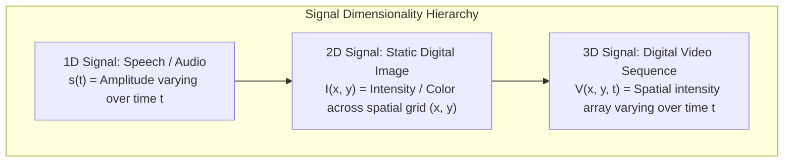
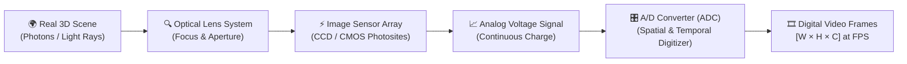
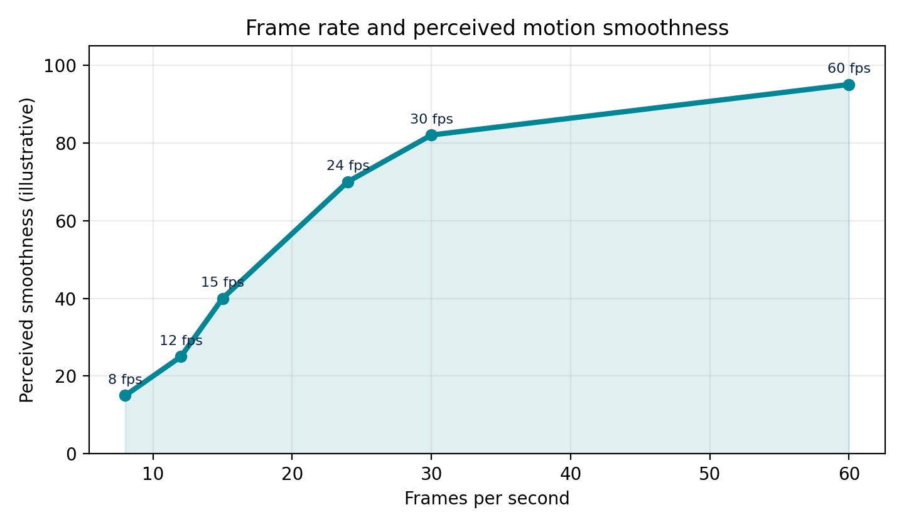
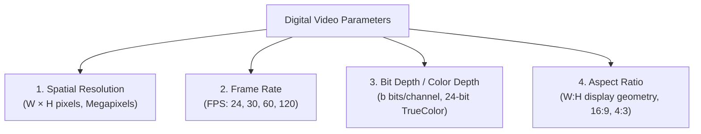
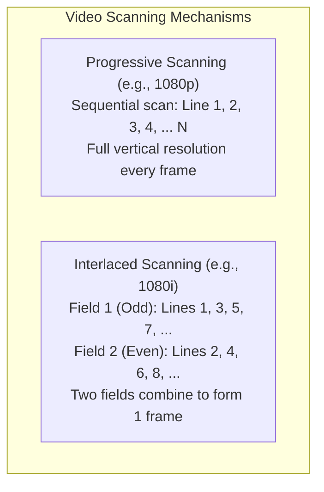
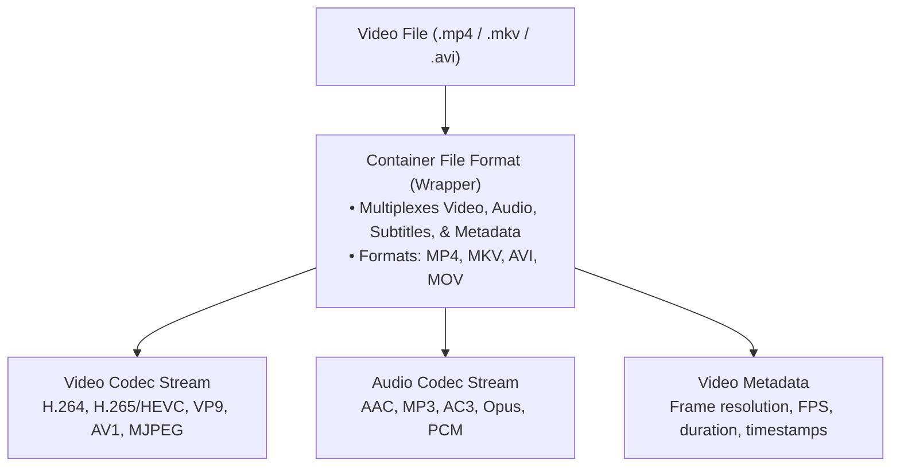
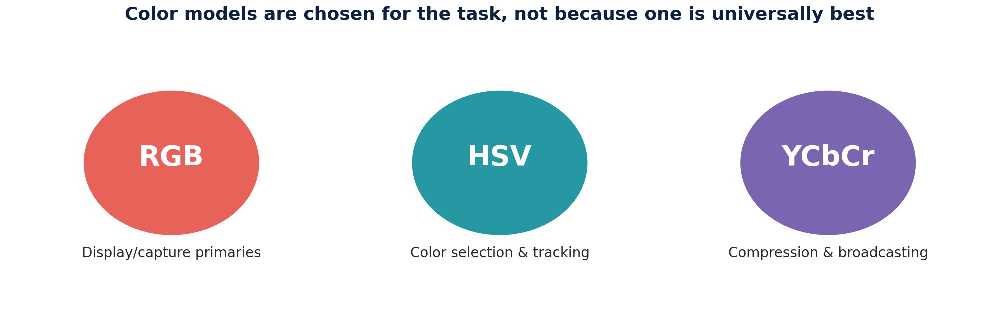
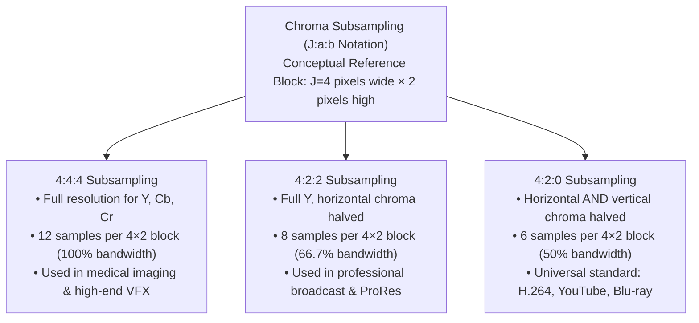
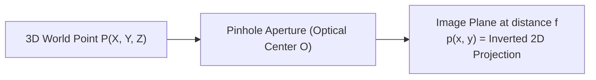

# Chapter 8: Fundamentals of Video Formation, Perception, and Representation

> **Module 3**: Basics of Video Processing  
> **Course**: Speech and Video Processing (CS30033)  
> **Faculty Resource**: Dr. Kunal Anand (SCE, KIIT DU)

---

# Table of Contents
1. [Introduction to Video Processing](#1-introduction-to-video-processing)
2. [Video Formation Pipeline](#2-video-formation-pipeline)
3. [Human Visual Perception & Apparent Motion](#3-human-visual-perception--apparent-motion)
4. [Key Video Parameters & Data Rate Computation](#4-key-video-parameters--data-rate-computation)
5. [Progressive vs. Interlaced Scanning](#5-progressive-vs-interlaced-scanning)
6. [Video Storage: Containers vs. Codecs](#6-video-storage-containers-vs-codecs)
7. [Principles of Color Video & Color Spaces](#7-principles-of-color-video--color-spaces)
8. [Chroma Subsampling & Perceptual Compression](#8-chroma-subsampling--perceptual-compression)
9. [Camera Image Sensors: Bayer CFA vs. 3-Sensor Prism](#9-camera-image-sensors-bayer-cfa-vs-3-sensor-prism)
10. [The Pinhole Camera Model & Perspective Projection](#10-the-pinhole-camera-model--perspective-projection)
11. [Real Camera Optics vs. Pinhole Model](#11-real-camera-optics-vs-pinhole-model)
12. [Summary & Key Mathematical Formulas](#12-summary--key-mathematical-formulas)

---

## 1. Introduction to Video Processing

Visual processing extends acoustic and static image processing into the dynamic spatio-temporal domain. While speech is a one-dimensional (1D) temporal acoustic waveform $s(t)$ and a digital photograph is a two-dimensional (2D) spatial intensity distribution $I(x, y)$, a digital video is a three-dimensional (3D) spatio-temporal signal $V(x, y, t)$ representing visual scene changes across space and continuous time.

### 1.1 Comparison Across Signal Modalities

| Feature / Property | Speech / Audio Signal | Still Digital Image | Digital Video Signal |
| :--- | :--- | :--- | :--- |
| **Mathematical Domain** | $1\text{D}: s(t)$ | $2\text{D}: I(x, y)$ | $3\text{D}: V(x, y, t)$ |
| **Independent Variables** | Continuous time $t$ | Spatial coordinates $(x, y)$ | Spatial grid $(x, y)$ and time $t$ |
| **Sampling Mechanism** | 1D temporal ADC (e.g., $16\text{ kHz}$) | 2D spatial sampling (CCD/CMOS grid) | 2D spatial sampling + 1D temporal frame sampling |
| **Information Conveyed** | Phonetic, prosodic, linguistic | Scene geometry, texture, reflectance | Motion dynamics, temporal events, 3D structure |
| **Data Throughput** | Low ($\approx 32\text{ kB/s}$ uncompressed) | Moderate (few Megabytes per still image) | Massive ($\approx 100\text{ MB/s}$ to $1.5\text{ GB/s}$ uncompressed) |

### 1.2 Why Video Processing is Computationally Challenging
1. **Massive Data Volume**: A standard Full HD video ($1920 \times 1080$ at $60\text{ fps}$, 24-bit TrueColor) streams over $373\text{ million bytes}$ every second ($373.2\text{ MB/s}$ uncompressed).
2. **Multi-Domain Redundancy**:
   - **Temporal Redundancy**: Consecutive frames are captured only fractions of a second apart (e.g., $1/30\text{ s}$ or $1/60\text{ s}$), meaning large scene areas remain identical or shift slightly due to motion.
   - **Spatial Redundancy**: Neighboring pixels within the same frame exhibit strong statistical correlations.
   - **Perceptual Redundancy**: The human visual system (HVS) cannot perceive minute high-frequency color variations and temporal fluctuations.
3. **Physical Perturbations**: Video streams suffer from motion blur, camera sensor noise, rolling shutter skew, shadows, and rapid illumination shifts.

### 1.3 Core Video Processing Tasks
- **Video Enhancement**: Denoising, tone mapping, edge sharpening, and digital video stabilization.
- **Video Analysis & Computer Vision**: Motion estimation (optical flow), object detection, multi-target tracking, semantic segmentation, and activity recognition.
- **Video Compression**: Exploit temporal and spatial redundancies (e.g., MPEG-4 AVC/H.264, HEVC/H.265, AV1) to enable transmission over finite-bandwidth channels.
- **Video Restoration & Synthesis**: Super-resolution, deblurring, frame rate up-conversion (temporal frame interpolation), and inpainting.

---

## 2. Video Formation Pipeline

Video formation is the multi-stage physical and electronic process of focusing electromagnetic radiation from a real-world 3D scene onto a 2D sensor array, sampling it at discrete spatial and temporal intervals, and quantizing it into numerical values stored as digital frames.

### 2.1 Step-by-Step Acquisition Breakdown
1. **World Scene**: The three-dimensional physical environment containing illuminated surfaces that reflect photons toward the camera lens.
2. **Optics / Lens**: Collects diverging light rays from the scene and refracts them through a focused aperture onto the sensor surface, governed by perspective geometry.
3. **Sensor Array (Photosites)**: A 2D grid containing millions of photodetectors (CMOS or CCD elements). Each photosite accumulates photons and converts light energy into proportional electrical charges via the photoelectric effect.
4. **Electrical Signal**: The continuous analog charge or voltage readout transferred line-by-line from the sensor photosites.
5. **Digitizer (Analog-to-Digital Converter)**:
   - **Spatial Sampling**: Discretizes continuous space into a regular grid of picture elements (**pixels**).
   - **Temporal Sampling**: Samples the continuous time domain into discrete snapshots (**frames**) at a fixed frame rate (FPS).
   - **Quantization**: Converts continuous voltage amplitudes into discrete binary numbers ($b$ bits per channel).
6. **Digital Frames Sequence**: The resulting 3D numeric array $V[x, y, t]$, where each frame is an array of size $H \times W \times C$ (Height $\times$ Width $\times$ Channels).

---

## 3. Human Visual Perception & Apparent Motion

Video display technology is engineered around the biological mechanisms and perceptual limitations of the Human Visual System (HVS). Video cameras do not record continuous time; they exploit human cognitive thresholds to generate the illusion of smooth motion from static images.

### 3.1 Physiological Mechanisms of Video Perception
1. **Persistence of Vision**:
   - The photochemical response of the human retina's photoreceptors (rods and cones) does not dissipate instantaneously when an image is removed.
   - An optical impression persists on the retina for approximately $\frac{1}{16}$ to $\frac{1}{10}$ of a second ($60–100\text{ ms}$).
2. **Temporal Integration**:
   - The visual cortex integrates visual stimuli over short temporal integration windows.
   - When still images with small incremental spatial displacements are flashed faster than this integration window, individual frames blend into a unified perception.
3. **Apparent Motion (The Beta Movement & Phi Phenomenon)**:
   - Discovered in Gestalt psychology: when two adjacent light sources flash in rapid succession, the brain perceives a single object moving continuously between the two locations.
   - In cinema and video, apparent motion transforms a succession of static frames into the subjective perception of fluid movement.
4. **Critical Flicker Fusion (CFF) Threshold**:
   - The CFF is the frequency at which an intermittent, flashing light stimulus appears completely steady and continuous to the human eye.
   - For standard human photopic (daylight) vision, CFF occurs between **$50\text{ Hz}$ and $60\text{ Hz}$**.
   - If frame/refresh rates fall below this threshold (e.g., $< 24\text{ fps}$ on older projection systems), viewers experience visual fatigue, flicker, and strobing.
   - *Cinematic Solution*: Historical film shot at $24\text{ fps}$ used a two-blade or three-blade rotary shutter to flash each frame 2 or 3 times, raising the display illumination frequency to $48\text{ Hz}$ or $72\text{ Hz}$ to eliminate perceptible flicker while keeping storage costs low.

---

## 4. Key Video Parameters & Data Rate Computation

Digital video systems are defined by four fundamental physical and digital parameters:

### 4.1 Parameter Definitions
1. **Spatial Resolution ($W \times H$)**: The total count of horizontal pixels ($W$) and vertical scan lines ($H$) per frame.
   - Total Pixel Count $= W \times H$
   - Megapixels (MP) $= \frac{W \times H}{10^6}$
   - *Full HD ($1080\text{p}$)*: $1920 \times 1080 = 2,073,600\text{ pixels} \approx 2.07\text{ MP}$
   - *Ultra HD ($4\text{K}$)*: $3840 \times 2160 = 8,294,400\text{ pixels} \approx 8.29\text{ MP}$
2. **Frame Rate (FPS)**: The frequency of consecutive complete frames captured or displayed per second.
   - Cinema standard: $24\text{ fps}$
   - Broadcast television: $25\text{ fps}$ (PAL/SECAM), $29.97 / 30\text{ fps}$ (NTSC)
   - High-motion video & gaming: $60\text{ fps}$ or $120\text{ fps}$
   - **Total Frames in Video**:
     $$\text{Total Frames} = \text{Frame Rate (FPS)} \times \text{Duration (seconds)}$$
3. **Bit Depth ($b$) & Color Depth**: The number of binary bits allocated to represent the intensity level of each color channel in a pixel.
   - Quantization Intensity Levels per channel $= 2^b$
   - For standard 8-bit color ($b = 8$): $2^8 = 256$ levels ($0$ to $255$).
   - For 10-bit HDR video ($b = 10$): $2^{10} = 1024$ levels ($0$ to $1023$).
   - **24-bit TrueColor (RGB)**: Each pixel contains 3 channels (Red, Green, Blue) at 8 bits each ($24\text{ bits/pixel}$), generating:
     $$\text{Total Available Colors} = 256 \times 256 \times 256 = 2^{24} = 16,777,216\text{ colors (}\approx 16.78\text{ million)}$$
4. **Aspect Ratio**: The proportional ratio of a frame's width to its height ($W : H$).
   - $16 : 9$ (1.78:1): Modern widescreen displays, YouTube, Full HD / 4K.
   - $4 : 3$ (1.33:1): Legacy CRT television and classic cinema.

---

### 4.2 Mathematical Formula for Uncompressed Video Data Rate

The uncompressed digital video data rate represents the raw bit throughput generated before applying any entropy coding or lossy compression.

$$\mathbf{\text{Raw Data Rate (bits/sec)} = W \times H \times C \times b \times \text{FPS}}$$

Where:
- $W$ = Frame width in pixels
- $H$ = Frame height in pixels
- $C$ = Number of color channels ($C = 1$ for grayscale, $C = 3$ for RGB/YUV)
- $b$ = Bit depth per channel in bits
- $\text{FPS}$ = Frame rate in frames per second

To convert into practical transmission and storage units:
$$\text{Bitrate (Mbit/s)} = \frac{W \times H \times C \times b \times \text{FPS}}{10^6}$$

$$\text{Storage Rate (MB/s)} = \frac{\text{Data Rate (bits/sec)}}{8 \times 10^6} = \frac{\text{Bitrate (Mbit/s)}}{8}$$

---

### 4.3 Worked Numerical Problems

#### Numerical Problem 1 (Standard HD Broadcast)
*A digital surveillance camera records video at a resolution of $1280 \times 720$ pixels, using 24-bit RGB TrueColor ($8\text{ bits/channel}$) at a frame rate of $30\text{ fps}$. Calculate:*
1. *The total pixel count per frame and sensor resolution in Megapixels.*
2. *The uncompressed data rate in $\text{Mbit/s}$.*
3. *The uncompressed storage consumption in $\text{MB/s}$ and total storage for a 1-hour recording in Gigabytes (GB).*

**Step-by-Step Solution:**
1. **Pixel Count & Megapixels**:
   $$\text{Pixel Count} = 1280 \times 720 = 921,600\text{ pixels}$$
   $$\text{Megapixels} = \frac{921,600}{10^6} = \mathbf{0.9216\text{ MP}}$$

2. **Uncompressed Bitrate (Mbit/s)**:
   - $W = 1280, H = 720, C = 3, b = 8, \text{FPS} = 30$
   $$\text{Data Rate} = 1280 \times 720 \times 3 \times 8 \times 30 = 663,552,000\text{ bits/s}$$
   $$\text{Bitrate} = \frac{663,552,000}{10^6} = \mathbf{663.552\text{ Mbit/s}} \approx \mathbf{663.6\text{ Mbit/s}}$$

3. **Storage Rate (MB/s) and 1-Hour Storage**:
   $$\text{Storage Rate} = \frac{663,552,000}{8 \times 10^6} = \mathbf{82.944\text{ MB/s}}$$
   $$\text{Duration} = 1\text{ hour} = 3600\text{ seconds}$$
   $$\text{Total Raw Size} = 82.944\text{ MB/s} \times 3600\text{ s} = 298,598.4\text{ MB} = \mathbf{298.6\text{ GB}}$$
   *(This underscores why video codecs like H.264/HEVC achieving $100:1$ compression ratios are indispensable).*

---

#### Numerical Problem 2 (Full HD Broadcast)
*Calculate the uncompressed data rate in $\text{Mbit/s}$ and $\text{MB/s}$ for a Full HD $1080\text{p}$ video stream ($1920 \times 1080$) recorded at $60\text{ fps}$ with 10-bit HDR RGB color ($b = 10, C = 3$).*

**Step-by-Step Solution:**
$$\text{Data Rate} = 1920 \times 1080 \times 3 \times 10 \times 60 = 3,732,480,000\text{ bits/s}$$
$$\text{Bitrate} = \frac{3,732,480,000}{10^6} = \mathbf{3,732.48\text{ Mbit/s}} \approx \mathbf{3.73\text{ Gbit/s}}$$
$$\text{Storage Rate} = \frac{3,732,480,000}{8 \times 10^6} = \mathbf{466.56\text{ MB/s}}$$

---

## 5. Progressive vs. Interlaced Scanning

Electronic scanning determines how 2D spatial lines of pixels are read out from camera sensors and reconstructed onto display panels.

### 5.1 Progressive Scanning ($1080\text{p}$)
- In progressive scanning, every horizontal line of pixels across the frame is scanned and displayed sequentially from top to bottom in a single pass.
- A $1080\text{p}$ stream displays all $1080$ scan lines simultaneously every frame cycle (e.g., $1/60\text{ s}$).
- **Key Advantage**: Eliminates motion-tearing artifacts; ideal for fast-motion video, computer vision algorithms, and modern flat-panel displays (OLED, LCD, MicroLED).

### 5.2 Interlaced Scanning ($1080\text{i}$)
- In interlaced scanning, each complete video frame is split into two separate **fields**:
  - **Odd Field (Top Field)**: Contains lines $1, 3, 5, 7, \dots, 1079$.
  - **Even Field (Bottom Field)**: Contains lines $2, 4, 6, 8, \dots, 1080$.
- The display alternates between odd and even fields at twice the frame rate (e.g., $60\text{ fields/s}$ for a $30\text{ fps}$ video).
- **Historical Rationale**: Developed for analog CRT television broadcasting (NTSC/PAL). It allowed broadcasters to transmit half the data per pass (cutting transmission bandwidth by $50\%$) while doubling the apparent flicker rate to $50/60\text{ Hz}$, surpassing the human Critical Flicker Fusion threshold.
- **Interlacing Artifacts ("Combing" / "Feathering")**: Because the two fields are captured at different instants in time ($1/60\text{ s}$ apart), fast-moving objects shift between field captures. When rendered together on a progressive display without deinterlacing, jagged horizontal comb-like serrations appear along moving edges.

### 5.3 Comparative Matrix: Progressive vs. Interlaced

| Evaluation Criterion | Progressive Scanning ($1080\text{p}$) | Interlaced Scanning ($1080\text{i}$) |
| :--- | :--- | :--- |
| **Line Scan Sequence** | Sequential: $1, 2, 3, 4, 5, \dots, H$ | Alternating: Odd $(1, 3, 5\dots)$ then Even $(2, 4, 6\dots)$ |
| **Temporal Composition** | Full image captured at a single instant $t$ | Two halves captured at times $t$ and $t + \Delta t$ |
| **Motion Artifacts** | None; sharp and artifact-free edges | "Combing" and jagged edge artifacts on motion |
| **Bandwidth Requirement** | Full bandwidth required | $50\%$ bandwidth savings per transmitted field |
| **Display Compatibility** | Native to modern digital screens (LCD/OLED) | Native to historical analog CRT televisions |
| **Suitability for Vision** | Preferred standard for CV and AI pipelines | Requires deinterlacing pre-processing |

---

## 6. Video Storage: Containers vs. Codecs

Students frequently confuse video file wrappers with the underlying compression algorithms. Digital video architecture strictly differentiates between the **container** and the **codec**.

### 6.1 Codec (Coder-Decoder)
- A **codec** is a mathematical algorithm or dedicated hardware chip that compresses raw video frames for storage/transmission, and decompresses them for playback.
- **Lossless Codecs**: Preserve every bit of original pixel data (e.g., FFV1, raw YUV), yielding low compression ratios ($2:1$ to $3:1$).
- **Lossy Codecs**: Discard perceptually invisible spatial and temporal redundancies (e.g., H.264/AVC, H.265/HEVC, Google VP9, AV1), achieving compression ratios from $50:1$ to $300:1$.

### 6.2 Container (File Format)
- A **container** is an overarching file envelope that packages the compressed video stream, synchronized audio tracks, subtitle files, and chapter metadata together into a single file.
- Examples include **MP4** (`.mp4`), **Matroska** (`.mkv`), and **AVI** (`.avi`).
- *Analogy*: The container is a shipping box, while the codec is the packing method used to shrink the items inside.

### 6.3 Working with Video in OpenCV
In computer vision, OpenCV provides high-level APIs to interface with underlying system codecs:
- `cv2.VideoCapture('input.mp4')`: Opens the container and decodes video frames into NumPy arrays of shape $(H, W, 3)$ formatted in **BGR** channel order.
- `cv2.VideoWriter(filename, fourcc, fps, frameSize)`: Encodes frames back into a video file using a four-character code (**FourCC**) specifying the codec (e.g., `cv2.VideoWriter_fourcc(*'XVID')` or `*'mp4v'`).

---

## 7. Principles of Color Video & Color Spaces

Human color perception is fundamentally trichromatic. Rather than recording the continuous spectrum of light, digital video systems mimic the human eye by decomposing light into three primary chromatic channels.

### 7.1 Human Photoreceptors & Trichromacy
The human retina contains two main classes of photoreceptor cells:
1. **Rods**: Highly sensitive to low illumination (scotopic vision); do not detect color; perceive grayscale intensity and motion.
2. **Cones**: Active under daylight illumination (photopic vision); responsible for high-resolution color perception. Cones exist in three distinct wavelength sensitivities:
   - **L-Cones** (Long wavelength): Peak sensitivity in the Red region ($\approx 564\text{ nm}$).
   - **M-Cones** (Medium wavelength): Peak sensitivity in the Green region ($\approx 534\text{ nm}$).
   - **S-Cones** (Short wavelength): Peak sensitivity in the Blue region ($\approx 420\text{ nm}$).

### 7.2 Additive vs. Subtractive Color Models
- **Additive Color (RGB)**: Used in light-emitting displays (monitors, projectors, smartphones). Colors are formed by adding emitted wavelengths of Red, Green, and Blue light starting from absolute black.
  $$\text{Red} + \text{Green} = \text{Yellow}, \quad \text{Green} + \text{Blue} = \text{Cyan}, \quad \text{Red} + \text{Blue} = \text{Magenta}$$
  $$\text{Red} + \text{Green} + \text{Blue} = \text{White}$$
- **Subtractive Color (CMY / CMYK)**: Used in printing and physical pigments. Cyan, Magenta, and Yellow pigments absorb (subtract) specific wavelengths from reflected white ambient light.

---

### 7.3 Decoupling Luminance from Chrominance: YUV & YCbCr
While the RGB color space is intuitive for displays, it is poorly suited for video transmission and computer vision because its three channels are heavily correlated (when scene illumination changes, R, G, and B shift simultaneously).

To optimize transmission and processing, video systems decompose color into:
1. **Luminance ($Y$)**: Represents achromatic brightness and structural contrast.
2. **Chrominance ($U/V$ or $Cb/Cr$)**: Represents color difference information.

#### Mathematical Conversion from Gamma-Corrected RGB to YCbCr (ITU-R BT.601 Standard):
$$\begin{bmatrix} Y \\ Cb \\ Cr \end{bmatrix} = \begin{bmatrix} 0.299 & 0.587 & 0.114 \\ -0.168736 & -0.331264 & 0.500 \\ 0.500 & -0.418688 & -0.081312 \end{bmatrix} \begin{bmatrix} R \\ G \\ B \end{bmatrix} + \begin{bmatrix} 0 \\ 128 \\ 128 \end{bmatrix}$$

- **Luminance Weighting**: $Y = 0.299 R + 0.587 G + 0.114 B$. Notice that Green contributes $58.7\%$ of perceived brightness, Red contributes $29.9\%$, and Blue contributes only $11.4\%$, directly matching human retinal spectral sensitivity.
- **Chrominance Signals**: $Cb \propto (B - Y)$ (blue-difference) and $Cr \propto (R - Y)$ (red-difference).

---

### 7.4 The HSV & HSL Color Spaces
For object detection and visual tracking, the **HSV** (Hue, Saturation, Value) model is widely used because it decouples chromatic identity from illumination intensity:
- **Hue ($H$)**: Represents the dominant wavelength or pure spectral color category, expressed as an angular coordinate from $0^\circ$ to $360^\circ$ (or $0$ to $179$ in OpenCV 8-bit mapping).
- **Saturation ($S$)**: Represents color purity or saturation relative to white (from $0\%$ completely desaturated gray to $100\%$ pure vibrant color).
- **Value ($V$)**: Represents the overall brightness or intensity of light.

> **Computer Vision Advantage**: When an object moves under uneven shadows or varying indoor lights, its $V$ channel fluctuates drastically while its $H$ and $S$ values remain relatively stable, allowing robust color segmentation via simple thresholding in OpenCV (`cv2.inRange`).

### 7.5 Color Space Selection Guide

| Application / Task | Recommended Color Space | Primary Justification |
| :--- | :--- | :--- |
| **Display Hardware & Rendering** | **RGB** | Native physical architecture of display subpixels and graphic framebuffers. |
| **Video Compression & Broadcasting** | **YCbCr / YUV** | Completely isolates luminance from chrominance, enabling chroma subsampling. |
| **Color-Based Object Tracking** | **HSV / HSL** | Separates pure color identity (Hue) from lighting fluctuations (Value). |
| **Grayscale Vision (Edge Detection)** | **Luminance ($Y$)** | Captures all essential structural gradients while discarding chromatic noise. |

---

## 8. Chroma Subsampling & Perceptual Compression

Chroma subsampling is a bandwidth reduction technique that stores color difference channels at lower spatial resolutions than the luminance channel.

### 8.1 Human Contrast Sensitivity Rationale
The human visual system contains far more rod cells than cone cells, and our spatial visual acuity for luminance gradients is roughly 3 to 4 times higher than for high-frequency chromatic variations. We notice sharp brightness boundaries immediately, but our eyes blend adjacent color shades together. Chroma subsampling exploits this limitation by discarding fine color detail without perceptible visual degradation.

### 8.2 Standard Subsampling Schemes Explained
Using the industry standard **$J : a : b$** notation based on a reference block $J = 4$ pixels wide and $2$ lines high:
1. **$4:4:4$ (Uncompressed Chroma)**:
   - For every $4$ luminance samples on each line, there are $4$ $Cb$ and $4$ $Cr$ samples.
   - Total samples in $4 \times 2$ block $= 8 Y + 8 Cb + 8 Cr = 24\text{ samples}$ ($100\%$ data size).
2. **$4:2:2$ (Horizontal Subsampling)**:
   - For every $4$ luminance pixels on a line, chroma is sampled only twice horizontally ($2$ $Cb$ and $2$ $Cr$). Both lines are sampled.
   - Total samples in $4 \times 2$ block $= 8 Y + 4 Cb + 4 Cr = 16\text{ samples}$ ($66.7\%$ of $4:4:4$ size).
3. **$4:2:0$ (Quarter Chroma Resolution)**:
   - For every $4$ luminance pixels on the first line, $2$ chroma samples are taken. On the second line, **zero** new chroma samples are captured (chroma values are reused or interpolated vertically).
   - Total samples in $4 \times 2$ block $= 8 Y + 2 Cb + 2 Cr = 12\text{ samples}$ ($50\%$ of $4:4:4$ size).

### 8.3 Bandwidth Savings Matrix

| Subsampling Mode | Luma ($Y$) Resolution | Chroma ($Cb, Cr$) Resolution | Bits per Pixel ($8\text{-bit}$) | Bandwidth Relative to $4:4:4$ | Common Deployment |
| :--- | :--- | :--- | :--- | :--- | :--- |
| **$4:4:4$** | $W \times H$ | $W \times H$ | $24\text{ bpp}$ | $100\%$ (Reference) | CGI, VFX, Medical Imaging |
| **$4:2:2$** | $W \times H$ | $\frac{W}{2} \times H$ | $16\text{ bpp}$ | $66.7\%$ | Studio production, ProRes, DVCPRO |
| **$4:2:0$** | $W \times H$ | $\frac{W}{2} \times \frac{H}{2}$ | $12\text{ bpp}$ | $\mathbf{50.0\%}$ | H.264/H.265, Web Streaming, DVDs |

---

## 9. Camera Image Sensors: Bayer CFA vs. 3-Sensor Prism

An image sensor's photodetectors (photosites) are inherently color-blind: they measure only the number of accumulated photons (radiant energy) without differentiating wavelength. To capture color images, cameras use either a single sensor with a mosaic filter or a complex multi-sensor prism.

### 9.1 Architecture 1: Single Sensor with Bayer CFA Mosaic
The **Bayer Color Filter Array (CFA)**, patented by Bryce Bayer at Eastman Kodak, places a microscopic mosaic of spectral filters over individual photosites on a single CMOS or CCD sensor chip:
- **Filter Composition**:
  - **$50\%$ Green filters (G)**
  - **$25\%$ Red filters (R)**
  - **$25\%$ Blue filters (B)**
- **Why Double the Green Photodiodes?**
  Human luminance perception is overwhelmingly dominated by green wavelengths ($58.7\%$ in the ITU-R BT.601 formula). Increasing green photosite sampling density significantly improves the signal-to-noise ratio and perceived image sharpness.

#### The Demosaicing (Color Filter Array Interpolation) Process
Because each photosite only records a single color component (R, G, or B), the raw camera image is a checkerboard mosaic. **Demosaicing** algorithms reconstruct the missing two color values for every pixel by interpolating from neighboring photosites:
- *Bilinear Interpolation*: Averages surrounding orthogonal and diagonal neighbors (fast, but causes chromatic blurring along sharp edges).
- *Edge-Directed Interpolation*: Evaluates spatial intensity gradients along horizontal and vertical axes to interpolate parallel to edges, preventing color fringing and "zipper" artifacts.

---

### 9.2 Architecture 2: 3-Sensor Dichroic Prism Beam Splitter
High-end professional broadcast and scientific cameras avoid demosaicing interpolation altogether by using a **3-sensor dichroic prism block**:
- Incoming light through the primary lens enters a precision glass prism.
- Dichroic optical coatings reflect specific wavelength bands while transmitting others:
  1. Red light is reflected onto a dedicated **Red CCD/CMOS sensor**.
  2. Blue light is reflected onto a dedicated **Blue CCD/CMOS sensor**.
  3. Green light passes straight through onto a dedicated **Green CCD/CMOS sensor**.
- **Advantages**: Pristine spatial resolution, true $4:4:4$ optical acquisition, zero demosaicing artifacts or false color moiré.
- **Disadvantages**: Heavy optical prism assembly, bulky form factor, high cost, and strict mechanical alignment tolerances.

---

## 10. The Pinhole Camera Model & Perspective Projection

The **pinhole camera model** is the foundational geometric framework in computer vision that describes the mathematical projection of three-dimensional world coordinates into two-dimensional image plane coordinates.

### 10.1 Pinhole Geometry & Ray Optics
- Let the pinhole aperture be positioned at the origin of the 3D camera coordinate system $\mathbf{O} = (0, 0, 0)$, termed the **Center of Projection (COP)** or **Optical Center**.
- The optical axis lies along the $+Z$ axis.
- An image plane is positioned at a distance $f$ (the **focal length**) behind the pinhole ($Z = -f$) or conceptually placed in front of the pinhole ($Z = +f$) to avoid dealing with inverted coordinates.

### 10.2 Mathematical Derivation via Similar Triangles
Consider a physical point in 3D space with coordinates $\mathbf{P} = (X, Y, Z)^T$ reflecting a light ray that passes straight through the pinhole origin to hit the image plane at 2D coordinates $(x, y)$.

From the geometric property of **similar right triangles**:

$$\frac{x}{f} = \frac{X}{Z} \implies \mathbf{x = f \frac{X}{Z}}$$

$$\frac{y}{f} = \frac{Y}{Z} \implies \mathbf{y = f \frac{Y}{Z}}$$

Similarly, for an object of real physical height $H$ situated at depth $Z$, its projected image height $h$ on the sensor is:

$$\mathbf{h = \frac{f \cdot H}{Z}}$$

### Key Geometric Takeaways:
1. **Inverse Depth Scaling**: The apparent projected size of an object is inversely proportional to its depth distance $Z$ from the camera. As an object moves twice as far away, its image dimensions halve.
2. **Loss of Depth Dimension**: Projective mapping is a many-to-one transformation: all 3D points lying along the same line of sight project onto the identical 2D pixel coordinate, losing absolute scale.

---

### 10.3 Solved Perspective Projection Numericals

#### Numerical 1 (Person Height Projection)
*A person of physical height $H = 1.8\text{ m}$ stands at a distance of $Z = 6\text{ m}$ from a security camera equipped with a pinhole lens of focal length $f = 25\text{ mm}$. Calculate the physical height $h$ of the person's projected image on the camera's sensor.*

**Step-by-Step Solution:**
1. **Normalize all measurements to identical units (millimeters)**:
   - Physical Height $H = 1.8\text{ m} = 1800\text{ mm}$
   - Depth Distance $Z = 6.0\text{ m} = 6000\text{ mm}$
   - Focal Length $f = 25\text{ mm}$
2. **Apply the perspective height formula**:
   $$h = \frac{f \cdot H}{Z} = \frac{25\text{ mm} \times 1800\text{ mm}}{6000\text{ mm}}$$
   $$h = \frac{45,000}{6000} = \mathbf{7.5\text{ mm}}$$
3. **Conclusion**: The person's body forms a projected image $7.5\text{ mm}$ high on the physical camera sensor.

---

#### Numerical 2 (Projected Pixel Coordinates)
*A 3D landmark point is located in camera coordinates at $\mathbf{P} = (X = 1.2\text{ m}, Y = -0.6\text{ m}, Z = 4.0\text{ m})$. If the camera has a calibrated focal length of $f = 800\text{ pixels}$, find the projected continuous image coordinates $(x, y)$ in pixels.*

**Step-by-Step Solution:**
$$x = f \frac{X}{Z} = 800\text{ px} \times \frac{1.2\text{ m}}{4.0\text{ m}} = 800 \times 0.3 = \mathbf{+240\text{ pixels}}$$
$$y = f \frac{Y}{Z} = 800\text{ px} \times \frac{-0.6\text{ m}}{4.0\text{ m}} = 800 \times (-0.15) = \mathbf{-120\text{ pixels}}$$

---

## 11. Real Camera Optics vs. Pinhole Model

While the pinhole model provides elegant geometric equations, real-world cameras cannot use an infinitesimal pinhole because of basic optical physics:
1. **The Pinhole Dilemma**:
   - If the pinhole is **too large**, light rays from different points overlap on the sensor, causing severe geometric blurring.
   - If the pinhole is **very small**, it admits too few photons, resulting in dark, noisy images requiring extremely long exposure times.
   - If the pinhole is **infinitesimally small**, **optical diffraction** around the aperture edges disperses the light rays, ruining image sharpness.
2. **Glass Lenses**:
   - Real cameras replace the pinhole with convex glass lens assemblies that gather light across a large aperture area and focus converging rays onto the sensor plane according to the **thin lens equation**:
     $$\frac{1}{f} = \frac{1}{d_o} + \frac{1}{d_i}$$
     *(where $d_o$ is object distance and $d_i$ is image plane distance).*

### 11.1 Real-World Optical Deviations
- **Limited Depth of Field (DoF)**: Real lenses only achieve sharp focus on a specific planar depth; objects in front of or behind this plane produce blur circles (circles of confusion).
- **Radial Lens Distortion**: Curvature in real lens elements bends rays non-linearly away from the optical center:
  - *Barrel Distortion* ($k_1 < 0$): Straight lines bow outward like a barrel (common in wide-angle and fisheye lenses).
  - *Pincushion Distortion* ($k_1 > 0$): Straight lines bend inward toward the center (common in telephoto lenses).
- **Vignetting**: Darkening of image corners relative to the center due to optical attenuation at wide aperture angles.
- **Camera Calibration**: The experimental process (often using a planar checkerboard target and Zhang's method) of estimating intrinsic parameters (focal length $f_x, f_y$, principal point $c_x, c_y$, distortion coefficients $k_1, k_2, p_1, p_2$) and extrinsic parameters (rotation $\mathbf{R}$ and translation $\mathbf{T}$).

---

## 12. Summary & Key Mathematical Formulas

### 1. Uncompressed Video Bitrate Equation
$$\mathbf{\text{Data Rate (bits/s)} = W \times H \times C \times b \times \text{FPS}}$$

### 2. Total Frames in Video
$$\mathbf{\text{Total Frames} = \text{FPS} \times \text{Duration (seconds)}}$$

### 3. Pinhole Perspective Projection Equations
$$\mathbf{x = f \frac{X}{Z}}, \quad \mathbf{y = f \frac{Y}{Z}}, \quad \mathbf{h = \frac{f \cdot H}{Z}}$$

### 4. RGB to YCbCr Conversion (BT.601)
$$\mathbf{Y = 0.299 R + 0.587 G + 0.114 B}$$
$$\mathbf{Cb = -0.1687 R - 0.3313 G + 0.500 B + 128}$$
$$\mathbf{Cr = 0.500 R - 0.4187 G - 0.0813 B + 128}$$
