# Chapter 9: Motion, Shape and Scene Modeling in Computer Vision

> **Module 3**: Basics of Video Processing  
> **Course**: Speech and Video Processing (CS30033)  
> **Faculty Resource**: Dr. Kunal Anand (SCE, KIIT DU)

---

# Table of Contents
1. [Introduction to Motion & Scene Modeling](#1-introduction-to-motion--scene-modeling)
2. [The Four Causes of Inter-Frame Change](#2-the-four-causes-of-inter-frame-change)
3. [Camera Motions: Rotation, Translation, and Zoom](#3-camera-motions-rotation-translation-and-zoom)
4. [Depth and Motion Parallax](#4-depth-and-motion-parallax)
5. [Coordinate Systems in Video Geometry](#5-coordinate-systems-in-video-geometry)
6. [Shape Models in Computer Vision](#6-shape-models-in-computer-vision)
7. [Scene Models: Static vs. Dynamic](#7-scene-models-static-vs-dynamic)
8. [The 2D Motion Model Ladder](#8-the-2d-motion-model-ladder)
9. [Homogeneous Coordinates: Unifying Transformations](#9-homogeneous-coordinates-unifying-transformations)
10. [Planar Homography & Projective Mapping](#10-planar-homography--projective-mapping)
11. [3D Rigid Motion (6 Degrees of Freedom - 6-DoF)](#11-3d-rigid-motion-6-degrees-of-freedom---6-dof)
12. [Model Selection Principles in Computer Vision](#12-model-selection-principles-in-computer-vision)
13. [Summary & Key Mathematical Formulas](#13-summary--key-mathematical-formulas)

---

## 1. Introduction to Motion & Scene Modeling

A physical world scene exists in continuous three-dimensional (3D) space: objects possess 3D geometry, spatial positions, surface textures, reflectance properties, and dynamic trajectories. When a video camera observes this scene, its optical lens projects the 3D environment onto a 2D sensor surface, generating a temporal sequence of 2D images: Frame 1, Frame 2, Frame 3, $\dots, V(x, y, t)$.

Any relative movement of the camera, motion of objects, change in scene illumination, or viewpoint adjustment causes shifts in pixel intensities across consecutive frames. **Motion, Shape, and Scene Modeling** provides the mathematical framework to reverse-engineer these 2D pixel fluctuations and infer the underlying 3D world geometry, object trajectories, and camera egomotion.

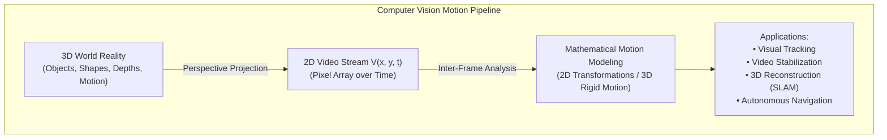

### 1.1 Core Objectives of Motion Analysis
1. **Target Tracking**: Estimating the spatial trajectory $[x(t), y(t)]$ of moving entities (pedestrians, vehicles, sports balls) across time.
2. **Video Stabilization**: Estimating unwanted high-frequency camera shake and applying inverse 2D transformations to smooth video playback.
3. **Egomotion Estimation (Visual Odometry / SLAM)**: Inferring the camera platform's exact 6-DoF 3D trajectory from visual flow.
4. **Action & Activity Recognition**: Classifying human motions (walking, running, falling) from spatial-temporal motion vector fields.

---

## 2. The Four Causes of Inter-Frame Change

A fundamental principle in video processing is that **a change in pixel values between two frames does not necessarily indicate physical motion**. Four distinct physical mechanisms induce inter-frame changes:

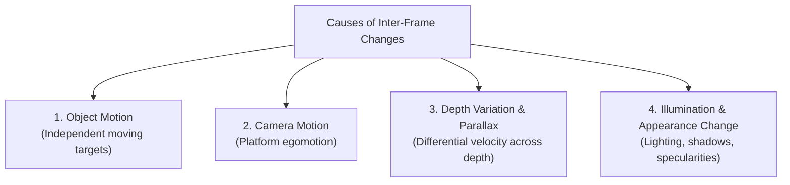

### 2.1 Breakdown of Causes

| Mechanism | Physical Description | Real-World Scenario | Computer Vision Implication |
| :--- | :--- | :--- | :--- |
| **1. Object Motion** | The camera remains stationary, but independent physical objects translate, rotate, or deform within the field of view. | A fixed traffic CCTV camera observing cars driving across an intersection. | Foreground motion detection via background subtraction models. |
| **2. Camera Motion (Egomotion)** | The environment remains static, but the camera platform translates or rotates in 3D space. | A person recording a monument while walking around it. | Global image motion; all background pixels shift coherently. |
| **3. Depth Variation & Parallax** | Objects at different distances from the camera shift by different pixel displacements during camera translation. | A dashcam moving forward: nearby roadside trees rush past, while distant mountains barely shift. | Requires depth-dependent motion models; single 2D affine model fails. |
| **4. Illumination / Appearance Changes** | Changes in ambient light, shadow casting, or specular surface reflections alter pixel intensities without physical displacement. | Sunlight emerging from behind clouds; a pedestrian stepping into a shadow. | Violates the **Brightness Constancy Assumption** of optical flow. |

---

## 3. Camera Motions: Rotation, Translation, and Zoom

Camera motions can be classified into purely rotational movements, translational movements, and optical focal variations:

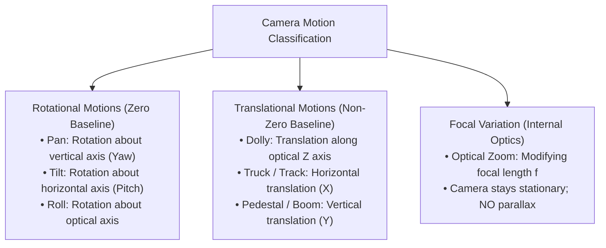

### 3.1 Rotational Camera Movements
- **Pan (Yaw)**: The camera body rotates horizontally left or right around its vertical axis from a fixed tripod position.
- **Tilt (Pitch)**: The camera body tilts vertically up or down around its transverse horizontal axis.
- **Roll**: The camera rotates around its longitudinal optical axis, causing the horizon to tilt sideways.
- *Geometric Property*: Pure camera rotation produces **zero motion parallax** because the center of projection does not translate. The transformation between frames can be modeled by a **Planar Homography**.

### 3.2 Translational Camera Movements
- **Dolly**: The camera physically rolls forward toward or backward away from the scene along its optical axis ($Z$).
- **Truck / Track**: The camera physically glides horizontally left or right ($X$) parallel to the scene plane.
- **Pedestal**: The camera moves vertically upward or downward ($Y$).
- *Geometric Property*: Physical translation shifts the camera's optical center, creating a non-zero baseline that induces **motion parallax** and depth-dependent disparities.

### 3.3 Optical Zoom vs. Camera Dolly

> [!IMPORTANT]
> **Optical Zoom and Camera Dolly are NOT physically or geometrically identical!**

- **Optical Zoom**: The camera remains stationary on its tripod while the motorized lens elements shift to alter the focal length $f$. Every pixel coordinate scales uniformly outward from the principal point ($x' = \frac{f_{\text{new}}}{f_{\text{old}}} x$). Distant and near objects expand by the exact same geometric scale factor; **no parallax is produced**.
- **Camera Dolly**: The camera physically translates forward ($T_Z$). The depth distance to near objects decreases dramatically as a percentage of total distance, causing near objects to expand much faster than distant objects. This induces intense depth parallax and perspective shifts (the basis of the famous cinematic "Vertigo effect" / Dolly Zoom).

---

## 4. Depth and Motion Parallax

**Motion Parallax** is the apparent difference in velocity and displacement of objects situated at different depth distances when the camera undergoes physical translation.

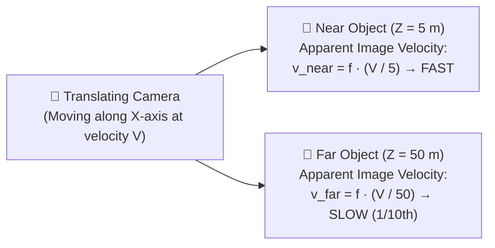

### 4.1 Mathematical Formulation of Parallax
Consider a camera translating horizontally along the $X$-axis with linear velocity $V_X = \frac{dX}{dt}$. For a static 3D world point at depth $Z$, its 2D projected coordinate on the image plane is $x = f \frac{X}{Z}$.

Differentiating with respect to time $t$:

$$\mathbf{v_x = \frac{dx}{dt} = - f \frac{V_X}{Z}}$$

Where:
- $v_x$ is the apparent horizontal optical velocity of the point in pixels per second.
- $f$ is the focal length.
- $Z$ is the physical depth distance of the object from the camera.

### Key Observation:
The apparent image velocity is **inversely proportional to depth $Z$**:
- An object at depth $Z = 5\text{ m}$ appears to move **$10$ times faster** across the camera's sensor than an object at depth $Z = 50\text{ m}$.
- This depth-dependent velocity gradient provides the fundamental visual cue used by biological vision and computer algorithms (Structure from Motion) to infer 3D scene depth from 2D video sequences.

---

## 5. Coordinate Systems in Video Geometry

Rigorous geometric computer vision requires converting between four interconnected coordinate frames:

```mermaid
flowchart LR
    W["1. World Frame
(X_W, Y_W, Z_W)
Real-world metric coordinates"] -->|Extrinsic Matrix [R | T]| C["2. Camera Frame
(X_C, Y_C, Z_C)
Origin at Optical Center"]
    C -->|Pinhole Projection (f)| I["3. Image Plane
(x, y) continuous
Physical sensor mm"]
    I -->|Digitization & Origin Shift| P["4. Pixel Coordinates
(u, v) discrete integers
Row-Column Grid"]
```

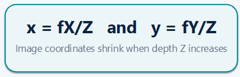

1. **World Coordinate System ($X_W, Y_W, Z_W$)**: A fixed 3D Cartesian reference frame defining the static environment (e.g., room corner, GPS map coordinates).
2. **Camera Coordinate System ($X_C, Y_C, Z_C$)**: A 3D coordinate system whose origin is fixed at the camera's optical center $\mathbf{O}$, with the $+Z$ axis pointing forward along the optical axis.
   - The conversion from World to Camera coordinates is governed by **Extrinsic Parameters**: a $3 \times 3$ Rotation Matrix $\mathbf{R}$ and a $3 \times 1$ Translation Vector $\mathbf{T}$:
     $$\mathbf{P}_C = \mathbf{R} \mathbf{P}_W + \mathbf{T}$$
3. **Continuous Image Plane Coordinates ($x, y$)**: The physical 2D plane located at distance $f$ along the optical axis, with origin at the principal point:
   $$x = f \frac{X_C}{Z_C}, \quad y = f \frac{Y_C}{Z_C}$$
4. **Discrete Pixel Array Coordinates ($u, v$)**: The 2D array of discrete pixel columns ($u$) and rows ($v$) indexed from the top-left corner $(0, 0)$ of the digital image:
   $$u = \frac{x}{p_x} + c_x = f_x \frac{X_C}{Z_C} + c_x$$
   $$v = \frac{y}{p_y} + c_y = f_y \frac{Y_C}{Z_C} + c_y$$
   *(where $p_x, p_y$ are physical pixel dimensions, $f_x, f_y$ are focal lengths in pixel units, and $(c_x, c_y)$ is the principal point in pixel coordinates).*

---

## 6. Shape Models in Computer Vision

To track and recognize objects across video frames, computer vision systems represent object geometry using abstract **Shape Models**. These models range from simple zero-dimensional points to detailed continuous contours:

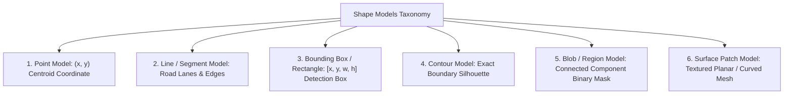

### 6.1 Detailed Comparison of Shape Models

| Shape Model | Geometric Representation | Degrees of Freedom (DOF) | Computational Cost | Robustness to Deformation | Primary Practical Application |
| :--- | :--- | :--- | :--- | :--- | :--- |
| **Point Model** | Single 2D coordinate $(x_c, y_c)$ | $2$ (Position) | Very Low | None (ignores shape) | Tracking distant targets, feature points (Harris/SIFT). |
| **Line Model** | Line equation $(\rho, \theta)$ or endpoints | $2$ to $4$ | Low | Low (rigid lines only) | Lane detection, road boundary tracking, structural line SLAM. |
| **Bounding Box** | Rectangle $[x_{\text{min}}, y_{\text{min}}, w, h]$ | $4$ (Position + Size) | Low | Moderate | Standard object detection output (YOLO, Faster R-CNN, SSD). |
| **Contour Model** | Parameterized curve / active contour (Snakes) | High ($2N$ control points) | High | Very High (handles non-rigid shapes) | Articulated human tracking, medical organ segmentation, forensic silhouette matching. |
| **Blob / Region** | Connected component mask of pixels | Variable (Area, Centroid, Moments) | Moderate | High | Foreground tracking in surveillance via background subtraction. |
| **Surface Patch** | Planar or 3D textured mesh | $6$ to $8$ | Moderate to High | Moderate (planar assumption) | Template matching, Lucas-Kanade optical flow, AR marker tracking. |

---

## 7. Scene Models: Static vs. Dynamic

A **Scene Model** describes the complete environment observed by the camera: the background geometry, dynamic foreground objects, surfaces, depth layout, and ambient illumination.

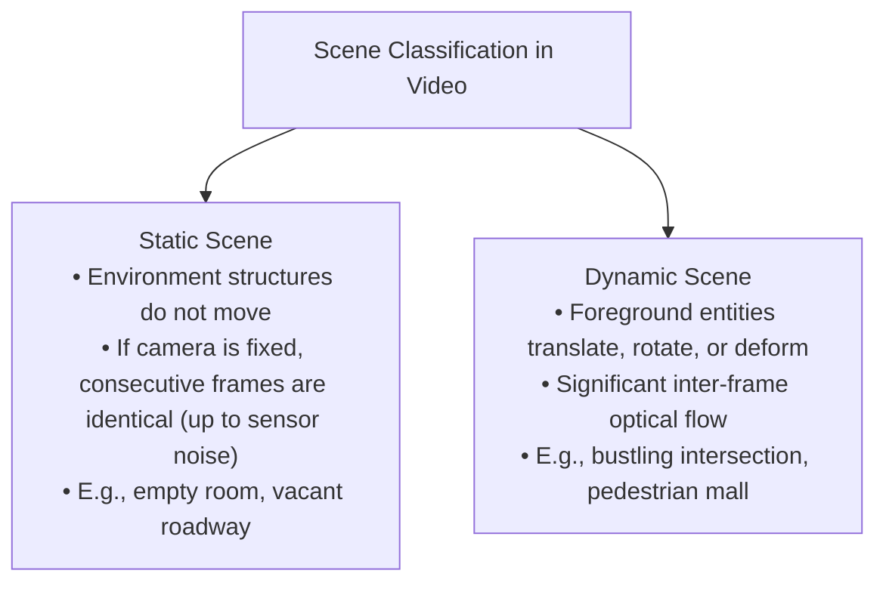

### 7.1 Scene Complexity by Platform

1. **Fixed Surveillance Camera (Static Scene / Dynamic Foreground)**:
   - Camera platform is firmly bolted to a wall or pole ($\mathbf{R} = \mathbf{I}, \mathbf{T} = \mathbf{0}$).
   - Background is stationary; moving entities are easily isolated using Background Subtraction (e.g., Gaussian Mixture Models - GMM).
2. **Handheld / Wearable Camera (Dynamic Platform & Scene)**:
   - High-frequency 3D rotations, platform translations, and erratic shakes occur concurrently with independent object motion.
   - Demands digital video stabilization and robust feature tracking (e.g., KLT tracker + RANSAC).
3. **Drone / Aerial Platform (Large-Scale Dynamic Scene)**:
   - High-altitude camera undergoes massive global translation, perspective skew, and continuous scale changes.
   - Requires global planar homography compensation to detect small ground moving targets.

---

## 8. The 2D Motion Model Ladder

When objects or cameras move, their projected appearances on the 2D image plane undergo geometric transformations. The **2D Motion Model Ladder** organizes planar transformations in a hierarchy of increasing complexity and Degrees of Freedom (DoF):

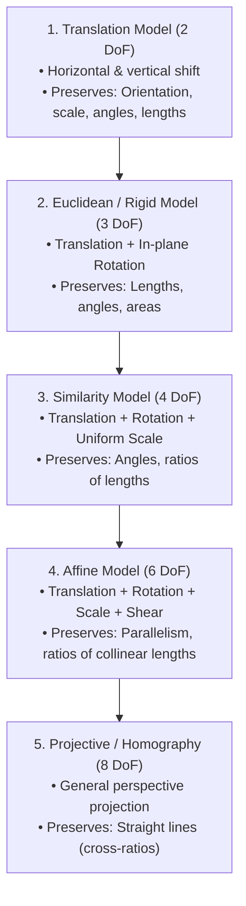

---

### 8.1 Detailed Mathematical Formulations

#### 1. Translation Model ($2\text{ DoF}$)
The simplest motion model represents pure horizontal and vertical displacement without change in orientation, size, or shape:
$$x' = x + t_x$$
$$y' = y + t_y$$
- **Parameters**: $\mathbf{p} = [t_x, t_y]^T$ ($2\text{ parameters}$).
- **Invariants**: Vector lengths, angles, areas, and orientations.

#### 2. Euclidean / Rigid Model ($3\text{ DoF}$)
Accounts for translation and in-plane rotation by angle $\theta$:
$$\begin{bmatrix} x' \\ y' \end{bmatrix} = \begin{bmatrix} \cos\theta & -\sin\theta \\ \sin\theta & \cos\theta \end{bmatrix} \begin{bmatrix} x \\ y \end{bmatrix} + \begin{bmatrix} t_x \\ t_y \end{bmatrix}$$
- **Parameters**: $\mathbf{p} = [\theta, t_x, t_y]^T$ ($3\text{ parameters}$).
- **Invariants**: Distances between points, angles, and surface area.

#### 3. Similarity Model ($4\text{ DoF}$)
Extends the Euclidean model by adding an isotropic (uniform) scale factor $s$:
$$\begin{bmatrix} x' \\ y' \end{bmatrix} = s \begin{bmatrix} \cos\theta & -\sin\theta \\ \sin\theta & \cos\theta \end{bmatrix} \begin{bmatrix} x \\ y \end{bmatrix} + \begin{bmatrix} t_x \\ t_y \end{bmatrix}$$
- Let $a = s\cos\theta$ and $b = s\sin\theta$:
  $$x' = a x - b y + t_x$$
  $$y' = b x + a y + t_y$$
- **Parameters**: $4\text{ parameters}$ ($s, \theta, t_x, t_y$).
- **Invariants**: Angles between lines and ratios of lengths.

#### 4. Affine Model ($6\text{ DoF}$)
The affine transformation represents an arbitrary non-singular linear mapping followed by translation. It models translation, rotation, independent non-uniform scaling ($s_x, s_y$), and shearing:
$$x' = a_1 x + a_2 y + a_3$$
$$y' = a_4 x + a_5 y + a_6$$
- **Parameters**: $\mathbf{p} = [a_1, a_2, a_3, a_4, a_5, a_6]^T$ ($6\text{ parameters}$).
- **Invariants**: Parallelism of lines (parallel lines remain parallel) and ratios of parallel line segments.

---

### 8.2 Comprehensive Comparison Matrix: 2D Motion Ladder

| Transformation Model | DoF | Transformation Matrix (Homogeneous) | Geometric Distortions Allowed | Invariants Preserved | Typical CV Use Case |
| :--- | :--- | :--- | :--- | :--- | :--- |
| **Translation** | $2$ | $\begin{bmatrix} 1 & 0 & t_x \\ 0 & 1 & t_y \\ 0 & 0 & 1 \end{bmatrix}$ | Pure spatial shift | Lengths, angles, areas, orientation | Block matching in video compression (MPEG). |
| **Euclidean (Rigid)** | $3$ | $\begin{bmatrix} \cos\theta & -\sin\theta & t_x \\ \sin\theta & \cos\theta & t_y \\ 0 & 0 & 1 \end{bmatrix}$ | Shift + in-plane rotation | Lengths, angles, areas | Tracking rigid planar cards rotated on a table. |
| **Similarity** | $4$ | $\begin{bmatrix} s\cos\theta & -s\sin\theta & t_x \\ s\sin\theta & s\cos\theta & t_y \\ 0 & 0 & 1 \end{bmatrix}$ | Shift + rotation + uniform zoom | Angles, shape, ratios of lengths | Drone tracking targets with altitude variations. |
| **Affine** | $6$ | $\begin{bmatrix} a_1 & a_2 & a_3 \\ a_4 & a_5 & a_6 \\ 0 & 0 & 1 \end{bmatrix}$ | Shift + rotation + scale + skew/shear | Parallelism, ratios of collinear lengths | Tracking small planar surface patches under viewpoint shifts. |
| **Projective (Homography)** | $8$ | $\begin{bmatrix} h_{11} & h_{12} & h_{13} \\ h_{21} & h_{22} & h_{23} \\ h_{31} & h_{32} & h_{33} \end{bmatrix}$ | Full perspective tilt and keystone | Straight lines, cross-ratio of 4 points | Panorama stitching, document scanning, AR markers. |

---

## 9. Homogeneous Coordinates: Unifying Transformations

In standard 2D Cartesian coordinates, translation is an additive vector operation ($[x', y']^T = \mathbf{A}[x, y]^T + \mathbf{t}$), while rotation and scaling are multiplicative matrix operations. This mathematical incompatibility prevents compounding transformations into a single matrix.

**Homogeneous Coordinates** resolve this by lifting 2D Cartesian points into a 3D projective space by appending a scale dimension:

$$\mathbf{p} = \begin{bmatrix} x \\ y \end{bmatrix} \quad \Longrightarrow \quad \mathbf{\tilde{p}} = \begin{bmatrix} x \\ y \\ 1 \end{bmatrix}$$

For any non-zero scalar $w \neq 0$, the homogeneous vector $[wx, wy, w]^T$ represents the identical physical 2D Cartesian coordinate $(x, y)$:
$$x = \frac{\tilde{x}}{w}, \quad y = \frac{\tilde{y}}{w}$$

### 9.1 Advantages of Homogeneous Coordinates
1. **Matrix Compounding**: Translation, rotation, scaling, shearing, and perspective projection are all expressed as standard $3 \times 3$ matrix multiplications.
2. **Chain Rule Concatenation**: A succession of $N$ sequential transformations $\mathbf{H}_1, \mathbf{H}_2, \dots, \mathbf{H}_N$ is pre-multiplied into a single composite matrix:
   $$\mathbf{H}_{\text{total}} = \mathbf{H}_N \mathbf{H}_{N-1} \cdots \mathbf{H}_1$$
3. **OpenCV Compatibility**: OpenCV transformation functions (`cv2.warpAffine`, `cv2.warpPerspective`) operate directly on $2 \times 3$ and $3 \times 3$ homogeneous transformation matrices.

---

## 10. Planar Homography & Projective Mapping

A **Planar Homography** (Projective Mapping) is an invertible linear mapping between 2D projective planes represented by a $3 \times 3$ matrix $\mathbf{H}$:

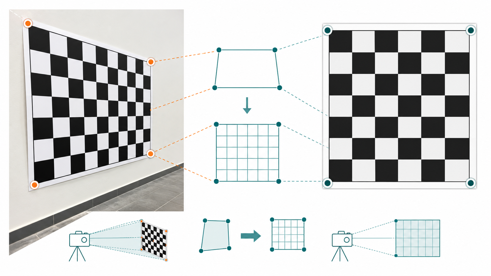

$$\begin{bmatrix} \tilde{x}' \\ \tilde{y}' \\ \tilde{w}' \end{bmatrix} = \begin{bmatrix} h_{11} & h_{12} & h_{13} \\ h_{21} & h_{22} & h_{23} \\ h_{31} & h_{32} & h_{33} \end{bmatrix} \begin{bmatrix} x \\ y \\ 1 \end{bmatrix}$$

To recover non-linear Cartesian coordinates, divide by the homogeneous scale factor $w' = h_{31} x + h_{32} y + h_{33}$:

$$\mathbf{x' = \frac{h_{11} x + h_{12} y + h_{13}}{h_{31} x + h_{32} y + h_{33}}}$$

$$\mathbf{y' = \frac{h_{21} x + h_{22} y + h_{23}}{h_{31} x + h_{32} y + h_{33}}}$$

### 10.1 Degrees of Freedom & Solving Homography
- The matrix $\mathbf{H}$ contains $9$ entries, but it is defined only up to a non-zero scale factor (multiplying $\mathbf{H}$ by constant $\lambda$ does not alter $x'$ or $y'$).
- Therefore, a homography has **$8$ independent Degrees of Freedom**.
- Each 2D point correspondence $(x_i, y_i) \leftrightarrow (x'_i, y'_i)$ generates $2$ independent linear constraint equations.
- To solve for the $8$ unknowns of $\mathbf{H}$, we need a minimum of **$4$ non-collinear point correspondences** (using the Direct Linear Transformation - DLT algorithm, as implemented in `cv2.findHomography`).

### 10.2 Major Computer Vision Applications
1. **Document Rectification (Scanning Apps)**: Transforming a photo of a tilted receipt or document into an upright front-facing scan.
2. **Image Mosaic / Panorama Stitching**: Aligning overlapping photos captured from a rotating camera tripod.
3. **Augmented Reality (AR)**: Superimposing virtual 3D models or video screens onto planar real-world surfaces.

---

## 11. 3D Rigid Motion (6 Degrees of Freedom - 6-DoF)

When a camera platform moves through a 3D scene, or a solid physical object translates through space, the movement is modeled as **3D Rigid Body Motion**.

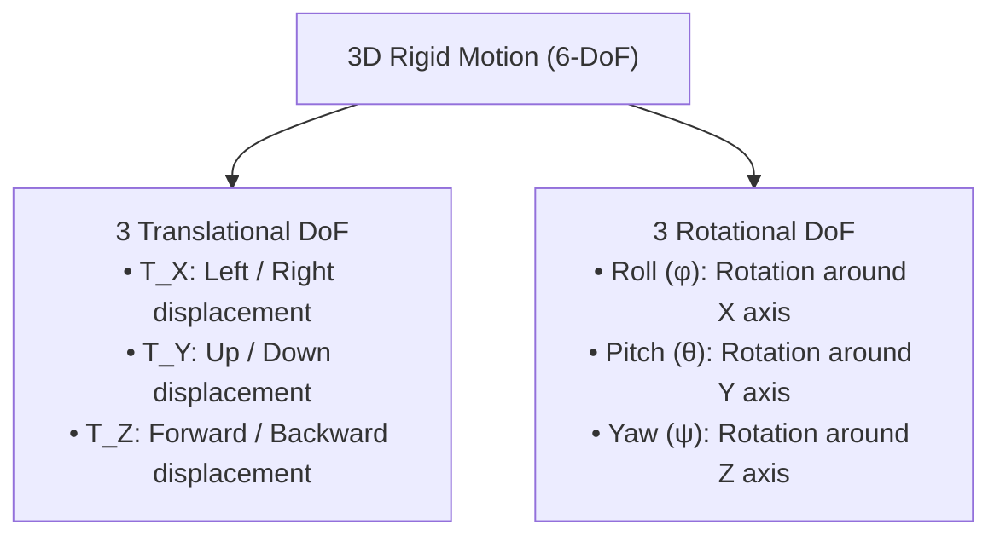

### 11.1 Mathematical Formulation
A 3D rigid transformation preserves the Euclidean distance between all pairs of points on the body. A 3D world point $\mathbf{P} = [X, Y, Z]^T$ transforms to new coordinates $\mathbf{P}' = [X', Y', Z']^T$ via:

$$\mathbf{P}' = \mathbf{R} \mathbf{P} + \mathbf{T}$$

Where:
- $\mathbf{T} = [T_X, T_Y, T_Z]^T$ is the $3 \times 1$ linear translation vector.
- $\mathbf{R}$ is a $3 \times 3$ **orthonormal rotation matrix** ($\\mathbf{R}^T \mathbf{R} = \mathbf{I}, \det(\mathbf{R}) = +1$), formed by multiplying individual elementary axis rotations:

$$\mathbf{R} = \mathbf{R}_z(\psi) \mathbf{R}_y(\theta) \mathbf{R}_x(\phi)$$

### 11.2 The 6 Degrees of Freedom (6-DoF)
1. $T_X$: Horizontal translation (left / right).
2. $T_Y$: Vertical translation (up / down).
3. $T_Z$: Depth translation (forward / backward).
4. $\phi$ (Roll): Rotation around the longitudinal axis.
5. $\theta$ (Pitch): Rotation around the transverse axis.
6. $\psi$ (Yaw): Rotation around the vertical axis.

---

## 12. Model Selection Principles in Computer Vision

Engineers must choose the simplest mathematical model capable of explaining observed video motion without overfitting or incurring excessive computational overhead (Occam's razor).

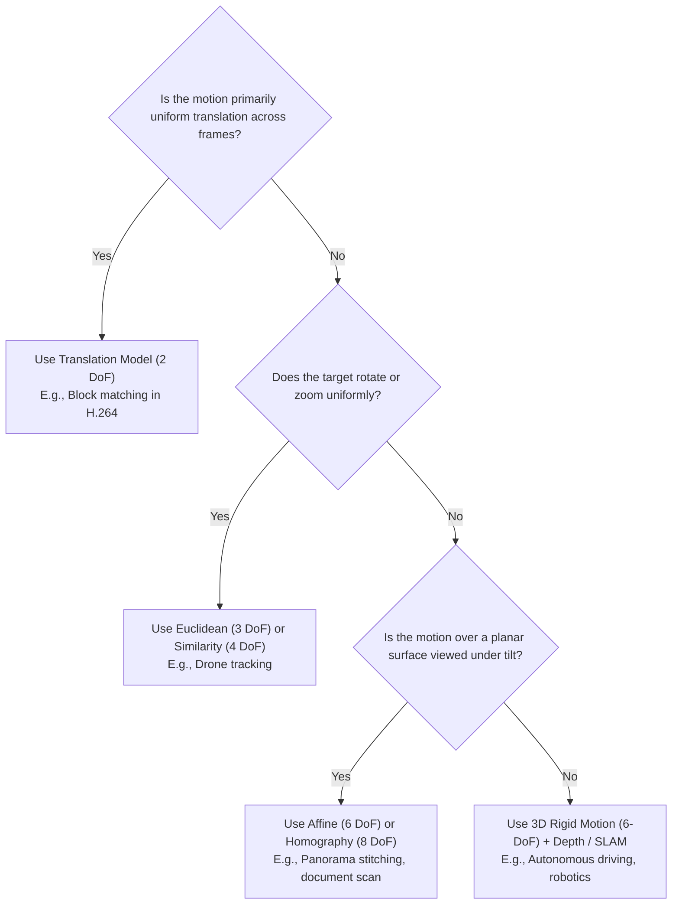

### 12.1 Practical Guidelines

| Motion Scenario | Recommended Model | Rationale |
| :--- | :--- | :--- |
| **Small block shifts between adjacent frames** | **Translation (2 DoF)** | Extremely fast; sufficient for local pixel displacements. |
| **Handheld camera translation with rotation** | **Similarity (4 DoF)** | Captures in-plane shake and scale without shearing. |
| **Small planar surface patches tracked over time** | **Affine (6 DoF)** | First-order Taylor approximation of arbitrary smooth motion. |
| **Flat surface imaged under perspective angle** | **Homography (8 DoF)** | Exact mathematical representation for planar projective geometry. |
| **General 3D scene with deep parallax** | **3D Rigid Motion (6-DoF)** | A single 2D model fails because near and far objects move differently. |

---

## 13. Summary & Key Mathematical Formulas

### 1. Affine Motion Model Equations
$$\mathbf{x' = a_1 x + a_2 y + a_3}, \quad \mathbf{y' = a_4 x + a_5 y + a_6}$$

### 2. Planar Homography Equations
$$\mathbf{x' = \frac{h_{11} x + h_{12} y + h_{13}}{h_{31} x + h_{32} y + h_{33}}}, \quad \mathbf{y' = \frac{h_{21} x + h_{22} y + h_{23}}{h_{31} x + h_{32} y + h_{33}}}$$

### 3. Apparent Parallax Velocity
$$\mathbf{v_x = - f \frac{V_X}{Z}}$$

### 4. 3D Rigid Transformation (6-DoF)
$$\mathbf{P}' = \mathbf{R} \mathbf{P} + \mathbf{T}$$
