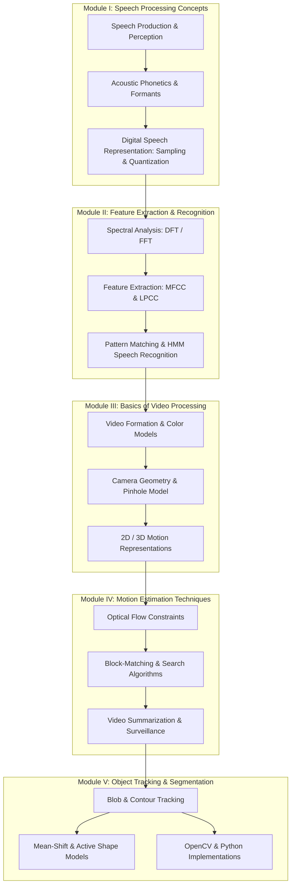
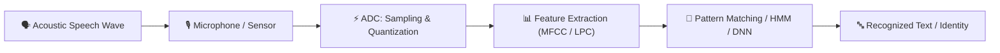
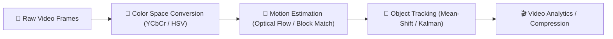

# 🎙️ Speech and Video Processing (SVP)

A comprehensive, open-access course repository and study guide for university students, researchers, and engineers studying **Digital Speech Signal Processing** and **Computer Video Processing**.

---

## 📌 Quick Badges


---

## 🗺️ Graphical Course Roadmap



---

## ⚙️ Core Signal Processing Pipelines

### 🎤 Speech Signal Processing Pipeline



### 📹 Video Processing Pipeline



---

## 📂 Interactive Repository Directory & Direct Links

Click any file link below to navigate directly to its content:

```gfm
SVP/
├── 📄 README.md                                               # Master landing page
├── 📁 Course_Handout/
│   └── 📄 SVP_Lesson_Plan_Autumn2026.md                       # [Course Syllabus & Activity Calendar](Course_Handout/SVP_Lesson_Plan_Autumn2026.md)
├── 📁 Module_1_Speech_Processing_Concepts/
│   ├── 📁 Chapter_1_Introduction_to_Speech_Processing/
│   │   ├── 📄 README.md                                       # [Chapter 1 Lecture Notes](Module_1_Speech_Processing_Concepts/Chapter_1_Introduction_to_Speech_Processing/README.md)
│   │   └── 📄 practice_questions.md                           # [Chapter 1 Exam 5-Mark Q&A (Q1–Q6)](Module_1_Speech_Processing_Concepts/Chapter_1_Introduction_to_Speech_Processing/practice_questions.md)
│   ├── 📁 Chapter_2_Digital_Representation_of_Speech_Signals/
│   │   ├── 📄 README.md                                       # [Chapter 2 Lecture Notes](Module_1_Speech_Processing_Concepts/Chapter_2_Digital_Representation_of_Speech_Signals/README.md)
│   │   └── 📄 practice_questions.md                           # [Chapter 2 Solved Practice Numericals](Module_1_Speech_Processing_Concepts/Chapter_2_Digital_Representation_of_Speech_Signals/practice_questions.md)
│   ├── 📁 Chapter_3_Convolution_and_Pole_Zero_Modeling/
│   │   ├── 📄 README.md                                       # [Chapter 3 Lecture Notes](Module_1_Speech_Processing_Concepts/Chapter_3_Convolution_and_Pole_Zero_Modeling/README.md)
│   │   └── 📄 practice_questions.md                           # [Chapter 3 Exam 5-Mark Q&A & Convolution](Module_1_Speech_Processing_Concepts/Chapter_3_Convolution_and_Pole_Zero_Modeling/practice_questions.md)
│   ├── 📁 Chapter_4_DFT_FFT_and_Spectral_Estimation/
│   │   ├── 📄 README.md                                       # [Chapter 4 Lecture Notes](Module_1_Speech_Processing_Concepts/Chapter_4_DFT_FFT_and_Spectral_Estimation/README.md)
│   │   └── 📄 practice_questions.md                           # [Chapter 4 Exam 5-Mark Q&A & LPC/FFT](Module_1_Speech_Processing_Concepts/Chapter_4_DFT_FFT_and_Spectral_Estimation/practice_questions.md)
│   ├── 📁 Chapter_5_Linear_Filter_Banks/
│   │   └── 📄 README.md                                       # [Chapter 5 Notes & Outline](Module_1_Speech_Processing_Concepts/Chapter_5_Linear_Filter_Banks/README.md)
│   ├── 📁 Chapter_6_Linear_Prediction_and_LPC/
│   │   └── 📄 README.md                                       # [Chapter 6 Notes & Outline](Module_1_Speech_Processing_Concepts/Chapter_6_Linear_Prediction_and_LPC/README.md)
│   └── 📁 Chapter_7_Python_Implementation/
│       └── 📄 README.md                                       # [Chapter 7 Lab Guides & Code](Module_1_Speech_Processing_Concepts/Chapter_7_Python_Implementation/README.md)
├── 📁 Module_2_Feature_Extraction_and_Speech_Recognition/
│   └── 📄 README.md                                           # [Module II Overview & Notes](Module_2_Feature_Extraction_and_Speech_Recognition/README.md)
├── 📁 Module_3_Basics_of_Video_Processing/
│   └── 📄 README.md                                           # [Module III Overview & Notes](Module_3_Basics_of_Video_Processing/README.md)
├── 📁 Module_4_Motion_Estimation_Techniques/
│   └── 📄 README.md                                           # [Module IV Overview & Notes](Module_4_Motion_Estimation_Techniques/README.md)
└── 📁 Module_5_Object_Tracking_and_Segmentation/
    └── 📄 README.md                                           # [Module V Overview & Notes](Module_5_Object_Tracking_and_Segmentation/README.md)
```

---

## 🚀 Interactive Quick-Access Module Matrix

Click on any course topic or resource button to jump straight to the exact study materials:

### 🎙️ Module I: Speech Processing Concepts

| Chapter / Topic | Key Learning Focus | Direct Study Links | Status |
| :--- | :--- | :---: | :---: |
| **Course Handout** | Course Outcomes, Grading Scheme & 40-Lecture Plan | 📜 [Open Syllabus](Course_Handout/SVP_Lesson_Plan_Autumn2026.md) | ✅ Complete |
| **Chapter 1** | Speech Models, Vocal Anatomy, Acoustic Phonetics, Formants | 📖 [Read Notes](Module_1_Speech_Processing_Concepts/Chapter_1_Introduction_to_Speech_Processing/README.md)<br>📝 [5-Mark Exam Q&A](Module_1_Speech_Processing_Concepts/Chapter_1_Introduction_to_Speech_Processing/practice_questions.md) | ✅ Complete |
| **Chapter 2** | Signals, ADC Process, Sampling Theorem, Aliasing, Quantization | 📖 [Read Notes](Module_1_Speech_Processing_Concepts/Chapter_2_Digital_Representation_of_Speech_Signals/README.md)<br>🧮 [Solved Numericals](Module_1_Speech_Processing_Concepts/Chapter_2_Digital_Representation_of_Speech_Signals/practice_questions.md) | ✅ Complete |
| **Chapter 3** | Time-Frequency Analysis, Spectrograms, LTI Systems, Convolution, Pole-Zero | 📖 [Read Notes](Module_1_Speech_Processing_Concepts/Chapter_3_Convolution_and_Pole_Zero_Modeling/README.md)<br>📝 [5-Mark Exam Q&A](Module_1_Speech_Processing_Concepts/Chapter_3_Convolution_and_Pole_Zero_Modeling/practice_questions.md) | ✅ Complete |
| **Chapter 4** | Discrete Fourier Transform (DFT), FFT Cooley-Tukey, Filter Banks, Mel Scale, LPC | 📖 [Read Notes](Module_1_Speech_Processing_Concepts/Chapter_4_DFT_FFT_and_Spectral_Estimation/README.md)<br>📝 [5-Mark Exam Q&A](Module_1_Speech_Processing_Concepts/Chapter_4_DFT_FFT_and_Spectral_Estimation/practice_questions.md) | ✅ Complete |
| **Chapter 5** | Linear Filter Banks, Mel-Scale Filtering, Sub-Band Analysis | 📖 [Read Notes](Module_1_Speech_Processing_Concepts/Chapter_5_Linear_Filter_Banks/README.md) | ⏳ Outline Ready |
| **Chapter 6** | Linear Predictive Coding (LPC), Levinson-Durbin Recursion | 📖 [Read Notes](Module_1_Speech_Processing_Concepts/Chapter_6_Linear_Prediction_and_LPC/README.md) | ⏳ Outline Ready |
| **Chapter 7** | Python Audio Processing (SciPy, Librosa) Lab Guide | 📖 [Read Notes](Module_1_Speech_Processing_Concepts/Chapter_7_Python_Implementation/README.md) | ⏳ Outline Ready |

---

### 🤖 Modules II – V: Advanced Speech & Video Processing

| Module | Core Topics | Direct Study Link | Status |
| :--- | :--- | :---: | :---: |
| **Module II** | Feature Extraction (MFCC, LPCC), Vector Quantization, HMM Recognition | 📖 [Open Module II](Module_2_Feature_Extraction_and_Speech_Recognition/README.md) | ⏳ Outline Ready |
| **Module III** | Video Perception, Color Spaces (YCbCr), Pinhole Camera, 3D Rigid Motion | 📖 [Open Module III](Module_3_Basics_of_Video_Processing/README.md) | ⏳ Outline Ready |
| **Module IV** | Optical Flow, Block-Matching Motion Search (EBMA), Video Summarization | 📖 [Open Module IV](Module_4_Motion_Estimation_Techniques/README.md) | ⏳ Outline Ready |
| **Module V** | Object Tracking (Mean-Shift, Active Shapes), Boundary Detection, OpenCV | 📖 [Open Module V](Module_5_Object_Tracking_and_Segmentation/README.md) | ⏳ Outline Ready |

---

## 🎯 Direct Shortcuts to Exam Question Sheets

- 📝 **[Chapter 1 5-Mark Exam Questions & Model Solutions](Module_1_Speech_Processing_Concepts/Chapter_1_Introduction_to_Speech_Processing/practice_questions.md)**:
  - *Q1: Speech Processing Definition & Need (5 Marks)*
  - *Q2: Speech Processing Model & Applications (5 Marks)*
  - *Q3: Speech Production Anatomy & Speech Perception (5 Marks)*
  - *Q4: Phonemes Definition, Importance, IPA vs. ARPAbet (5 Marks)*
  - *Q5A: Vowel Production, Formants ($F_1, F_2$) & Examples (5 Marks)*
  - *Q5B: Diphthong Gliding Production & Examples (5 Marks)*
  - *Q5C: Semi-Vowel (Glide) Production & Examples (5 Marks)*
  - *Q5D: Consonant Classes (Stops, Fricatives, Nasals) & Examples (5 Marks)*
  - *Q6: Significance of $F_1, F_2$ Cluster & Centroid (5 Marks)*

- 🧮 **[Chapter 2 Practice Questions & Solved ADC Exercises](Module_1_Speech_Processing_Concepts/Chapter_2_Digital_Representation_of_Speech_Signals/practice_questions.md)**:
  - *ADC Process & Nyquist Sampling Theorem conceptual derivations.*
  - *Problem 1: 16-Bit Quantization Step Size ($\Delta$) & 10s Recording File Size (240 Bytes).*
  - *Problem 2: 8-Bit ADC Step Size, Maximum Error ($e_{max}$), and MSE Noise Power ($\sigma_e^2$).*
  - *Problem 3 & 4: 10-Bit vs 12-Bit ADC resolution comparison & 16 kHz acquisition system parameters.*

- 📊 **[Chapter 3 5-Mark Exam Questions & Solved Convolution Numericals](Module_1_Speech_Processing_Concepts/Chapter_3_Convolution_and_Pole_Zero_Modeling/practice_questions.md)**:
  - *Q1: Time-Domain vs Frequency-Domain vs Spectrogram Comparison (5 Marks).*
  - *Q2: LTI Systems, Linearity (Superposition) & Time-Invariance (5 Marks).*
  - *Q3: Impulse Decomposition & Convolution Sum Derivation (5 Marks).*
  - *Q4 & Q5: Step-by-Step Solved Convolution Numericals ($y[n] = x[n] * h[n]$) (5 Marks).*
  - *Q6: Limitations of Time-Domain Convolution & Pole-Zero Modeling Need (5 Marks).*

- 🎛️ **[Chapter 4 5-Mark Exam Questions & Solved DFT/FFT/LPC Numericals](Module_1_Speech_Processing_Concepts/Chapter_4_DFT_FFT_and_Spectral_Estimation/practice_questions.md)**:
  - *Q1–Q3: Fourier Transform, Euler's formula & Dirac delta impulse spectra derivations.*
  - *Q4–Q7: DFT definition, Orthogonality proof, 8-Point DFT calculations & Spectral Leakage.*
  - *Q8–Q9: Cooley-Tukey FFT, Even-Odd Decomposition, Twiddle Factor & Butterfly Unit.*
  - *Q10–Q12: Bank-of-Filters (BOF) pipeline, decimation & filter bank compression ratio numericals.*
  - *Q13–Q15: Mel Scale conversion, LPC all-pole model & Yule-Walker equation derivation.*

---

## 💡 How to Navigate & Study

1. **Studying Concepts**: Click on any **[Read Notes]** button in the module matrix to open the detailed lecture notes complete with Mermaid flowcharts and presentation figures.
2. **Practicing for Exams**: Click on any **[5-Mark Exam Q&A]** or **[Solved Numericals]** link to view step-by-step model solutions.

---

## 📚 Textbooks & Academic References

- **Rabiner, L., & Juang, B. H.** (1993). *Fundamentals of Speech Recognition*. Prentice Hall Signal Processing Series.
- **Quatieri, T. F.** (2002). *Discrete-Time Speech Signal Processing: Principles and Practice*. Prentice Hall.
- **Tekalp, A. M.** (2015). *Digital Video Processing*. Prentice Hall.
- **Wang, Y., Ostermann, J., & Zhang, Q.** (2002). *Video Processing and Communications*. Pearson Education.
